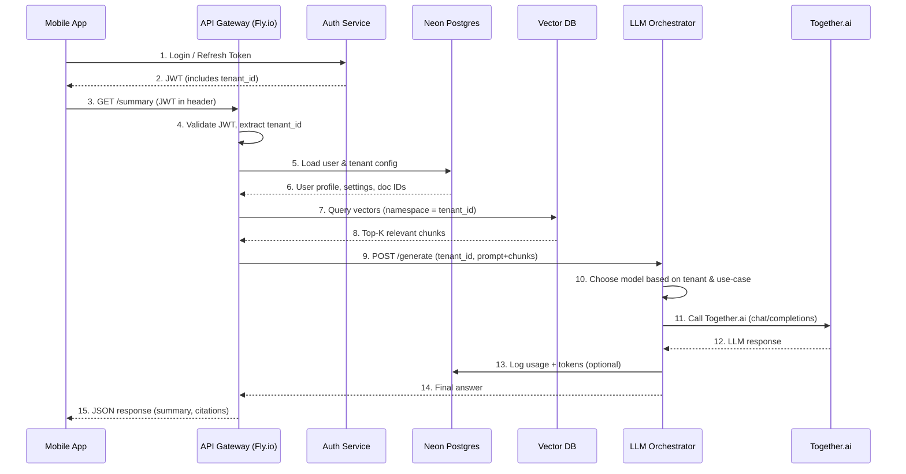
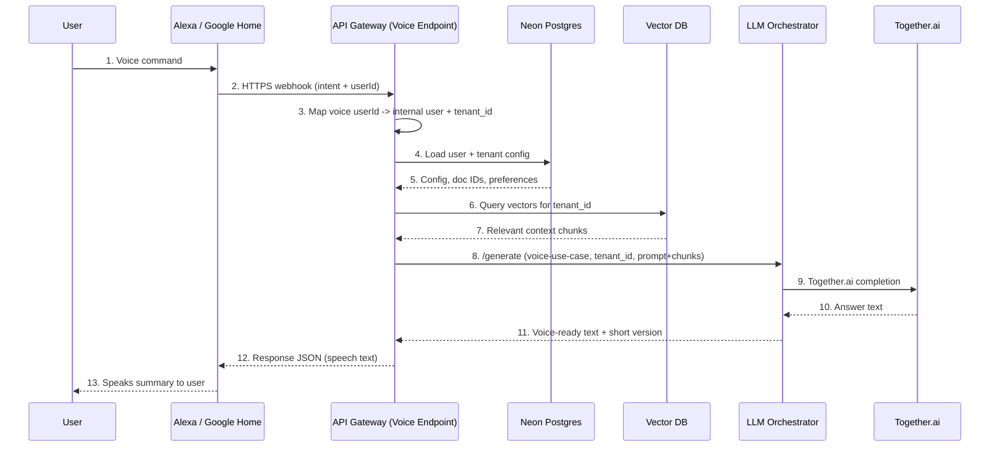
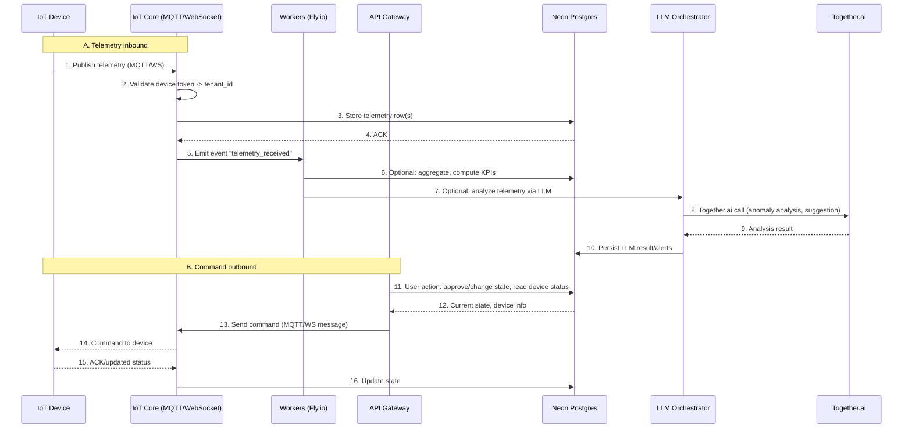

Here’s a full architecture diagram for your **multi-tenant, multi-platform 2BF stack** with:

* Web (Vercel)
* Mobile (iOS/Android)
* Voice (Alexa / Google Home)
* IoT
* Backend (Fly.io)
* DB (Neon + Vector DB)
* AI (Together.ai)

I’ll show it as a **Mermaid diagram** you can drop into docs, then break down each block.

---

## 1. High-Level Architecture (Mermaid Diagram)

```mermaid
flowchart LR
    subgraph Clients
        Web[Web Browser\n(2BF Dashboard)]
        iOS[iOS App]
        Android[Android App]
        Alexa[Alexa Skill]
        GHome[Google Home Action]
        IoT[IoT Devices\n(MQTT/WebSocket)]
    end

    subgraph Frontend Edge
        Vercel[Vercel\n(Next.js Frontend)]
    end

    subgraph Backend Edge
        API[Fly.io - API Gateway\n(REST/GraphQL/WebSockets)]
        Workers[Fly.io - Workers & Queues\n(CRON, Ingestion, ETL)]
        IoTCore[Fly.io - IoT/MQTT Service\n(WebSockets/MQTT Broker)]
        Auth[Fly.io - Auth Service\n(OAuth/JWT/Session)]
        Notif[Fly.io - Notification Service\n(APNs/FCM/Email)]
    end

    subgraph Data Layer
        Neon[(Neon Postgres\nMulti-tenant DB)]
        VectorDB[(Vector DB\nPinecone/Qdrant/Atlas Vector)]
        ObjectStore[(Object Storage\n(S3/Cloudflare R2/etc.))]
        Cache[(Redis/Key-Value Cache)]
    end

    subgraph AI Layer
        Together[ Together.ai\nInference + Fine-tuning ]
        LLMProxy[Fly.io - LLM Orchestrator\n(Routing, Cost Control)]
    end

    %% Client flows
    Web -->|HTTPS| Vercel
    iOS -->|HTTPS| API
    Android -->|HTTPS| API
    Alexa -->|Webhook| API
    GHome -->|Webhook| API
    IoT -->|MQTT/WebSocket| IoTCore

    %% Vercel to API
    Vercel -->|API calls\n(AJAX/SSR)| API

    %% Backend to Data
    API --> Neon
    API --> VectorDB
    API --> Cache
    API --> ObjectStore

    Workers --> Neon
    Workers --> VectorDB
    Workers --> ObjectStore

    %% Backend to AI
    API --> LLMProxy
    Workers --> LLMProxy
    LLMProxy --> Together

    %% Notifications
    API --> Notif
    Workers --> Notif

    %% Auth
    API --> Auth
    Vercel --> Auth
    iOS --> Auth
    Android --> Auth
```

You can paste that straight into a Mermaid viewer (or GitHub/Obsidian with Mermaid support).

---

## 2. What Each Block Does (Quick Pass)

### 🔵 Clients

* **Web (2BF Dashboard)** → main UI for tenants, admins, VAs, end-users.
* **iOS / Android** → native or cross-platform (Flutter/React Native). Talk to Fly.io APIs directly.
* **Alexa / Google Home** → call specific HTTPS endpoints on your Fly.io API (skill/intent handlers).
* **IoT Devices** → connect to your **IoTCore** service on Fly (MQTT/WebSocket).

---

### 🟦 Frontend Edge: Vercel

**Vercel** hosts:

* Marketing site (2bf.org, docs, landing pages).
* Multi-tenant AEI dashboard (Next.js).
* Server-side rendered pages that fetch data from Fly.io APIs.

**Why only frontend?**

* Keep Vercel focused on what it’s insanely good at: **Next.js UI** + edge caching.
* All heavy logic and long-running things live on Fly.

---

### 🟩 Backend Edge: Fly.io

This is the **heart** of the system.

**API Gateway (Fly.io – API)**

* Single entry point for:

  * Mobile apps (iOS/Android)
  * Voice webhooks (Alexa/Google)
  * Web (from Vercel)
  * Admin tools
* Exposes REST/GraphQL/WebSocket endpoints.

**Workers & Queues**

* Runs:

  * RAG ingestion & indexing
  * Background sync (bank feeds, app data, health data)
  * Long-running LLM workflows (summaries, digests)
  * Multi-tenant schedulers (per-tenant automations)

**IoT / MQTT / Realtime**

* IoTCore service:

  * MQTT broker or WebSocket server
  * Device registry & telemetry
  * Real-time control channels

**Auth Service**

* OAuth2/OIDC, JWT, session tokens
* Multi-tenant capability (tenant_id claims in tokens)
* Shared by Web, Mobile, Voice, IoT.

**Notifications Service**

* Sends push via:

  * APNs (Apple)
  * FCM (Android)
  * Email / SMS (via provider)
* Triggerable by API or Workers.

---

### 🟪 Data Layer

**Neon Postgres (Primary DB)**

* Multi-tenant schema (RLS or tenant_id column).
* Stores:

  * Users, organizations, tenants
  * Automations, workflows
  * Knowledge entity metadata
  * Task logs, usage metrics
* Serverless scaling + branching for dev/staging.

**Vector DB (Pinecone/Qdrant/Atlas Vector)**

* Stores embeddings per tenant (namespaces/collections).
* Used by Workers + API for RAG queries.

**Object Storage (S3 / R2 / etc.)**

* Raw documents, PDFs, media, audio, logs.
* IoT data dumps if needed.

**Cache (Redis / KV)**

* Session caches, rate limiting, hot RAG results, ephemeral state.

---

### 🟨 AI Layer

**LLM Orchestrator (Fly.io microservice)**

* Your logic for:

  * Which Together model to call per tenant / use case
  * Token limits, retry/backoff
  * Usage metering (per-tenant billing)
  * Prompt templates, guardrails
* Called by API + Workers.

**Together.ai**

* Inference: generic models (Llama, Mistral, DeepSeek, Qwen, etc.).
* Fine-tuned models: your domain-specific models (2BF Gov, Okir cacao, Haustie vet, etc.).
* Dedicated endpoints for production models.

---

## 3. Multi-Tenant View (How Tenants Flow Through This)

Every request:

1. Comes from some client → **API / Auth**
2. Gets a **tenant_id** (from token / subdomain / header)
3. API/Workers:

   * Query **Neon** with `tenant_id`
   * Retrieve relevant docs/IDs
   * Query **VectorDB** namespace for that `tenant_id`
   * Call **LLM Orchestrator** → Together.ai models
   * Store results back in Neon / ObjectStorage

The same `tenant_id` flows across:

* Neon rows
* VectorDB namespaces/collections
* Usage metering for Together.ai
* Internal metrics for billing

---


Here’s a concrete repo layout you can actually implement for this architecture. I’ll assume a **single monorepo** for all “server-side + web UI + shared logic”, and you can either keep **mobile** inside it or in separate repos later.

I’ll show:

1. Top-level monorepo layout
2. What lives in each app/service
3. How shared packages are organized
4. How env/config + infra are wired

---

## 1. Top-Level Monorepo Layout

```bash
second-brain-foundation/
├─ apps/
│  ├─ web/                # Vercel Next.js app (2BF dashboard + marketing)
│  ├─ api/                # Fly.io API gateway (REST/GraphQL/WebSockets)
│  ├─ workers/            # Fly.io workers & schedulers
│  ├─ iot-core/           # Fly.io IoT/MQTT/WebSocket service
│  ├─ auth-service/       # Auth (OAuth/OIDC/JWT, multi-tenant)
│  ├─ notif-service/      # Notifications (APNs, FCM, email)
│  └─ llm-orchestrator/   # Together.ai routing, guardrails, usage metering
│
├─ packages/
│  ├─ core-domain/        # Domain models, tenant logic, entities
│  ├─ db-client/          # Neon Postgres client & migrations
│  ├─ vector-client/      # Pinecone/Qdrant client, RAG helpers
│  ├─ ai-client/          # Together.ai client & model wrappers
│  ├─ auth-lib/           # Shared auth utils, JWT, middleware
│  ├─ config/             # Shared config loader (env, secrets)
│  ├─ logging/            # Shared logger (pino/winston)
│  ├─ types/              # Shared TypeScript types/interfaces
│  └─ utils/              # Generic helpers (dates, ids, validation)
│
├─ mobile/                # (optional mono) iOS/Android client code
│  ├─ ios/                # Swift / SwiftUI
│  └─ android/            # Kotlin / Jetpack or React Native project
│
├─ infra/
│  ├─ fly/
│  │  ├─ api.fly.toml
│  │  ├─ workers.fly.toml
│  │  ├─ iot-core.fly.toml
│  │  ├─ auth-service.fly.toml
│  │  ├─ notif-service.fly.toml
│  │  └─ llm-orchestrator.fly.toml
│  ├─ vercel/
│  │  └─ vercel.json      # or per-project config
│  ├─ neon/
│  │  ├─ schema.sql       # base schema
│  │  └─ migrations/      # if you want raw SQL here too
│  ├─ terraform/          # optional infra as code for DNS, S3, etc.
│  └─ k8s/                # (future) if you ever move parts to k8s
│
├─ docs/
│  ├─ architecture/
│  │  ├─ logical-diagram.md
│  │  ├─ services.md
│  │  └─ data-model.md
│  ├─ api/
│  ├─ mobile/
│  └─ operations/
│
├─ .github/
│  ├─ workflows/
│  │  ├─ web-ci.yml
│  │  ├─ api-ci.yml
│  │  ├─ workers-ci.yml
│  │  ├─ iot-ci.yml
│  │  ├─ auth-ci.yml
│  │  ├─ notif-ci.yml
│  │  └─ llm-orchestrator-ci.yml
│
├─ package.json           # workspace root (pnpm/npm/yarn)
├─ pnpm-workspace.yaml    # or yarn workspaces config
├─ turbo.json             # if you use Turborepo for pipelines
└─ README.md
```

---

## 2. What lives in each app

### `apps/web/` – Vercel Next.js

```bash
apps/web/
├─ src/
│  ├─ app/                # Next.js app router
│  ├─ components/
│  ├─ features/
│  │  ├─ dashboard/
│  │  ├─ automations/
│  │  ├─ tenants/
│  │  └─ settings/
│  ├─ lib/
│  │  ├─ api-client.ts    # talks to apps/api on Fly
│  │  └─ auth-client.ts   # uses auth-service endpoints
│  └─ hooks/
├─ public/
├─ next.config.mjs
└─ vercel.json
```

* All backend calls go via `api-client` to **Fly.io API**.
* Uses `@secondbrain/auth-lib`, `@secondbrain/types`, etc.

---

### `apps/api/` – Fly.io API Gateway

```bash
apps/api/
├─ src/
│  ├─ index.ts            # main server (Fastify/Express/NestJS)
│  ├─ routes/
│  │  ├─ tenants.ts
│  │  ├─ users.ts
│  │  ├─ automations.ts
│  │  ├─ rag.ts
│  │  └─ health.ts
│  ├─ middleware/
│  │  ├─ auth.ts          # uses @secondbrain/auth-lib
│  │  └─ tenant-context.ts
│  ├─ services/
│  │  ├─ tenant-service.ts
│  │  ├─ automation-service.ts
│  │  ├─ rag-service.ts   # calls vector + llm-orchestrator
│  │  └─ usage-service.ts
│  └─ adapters/
│     ├─ db.ts            # @secondbrain/db-client (Neon)
│     ├─ vector.ts        # @secondbrain/vector-client
│     └─ llm.ts           # calls apps/llm-orchestrator
├─ fly.toml
└─ Dockerfile
```

The API is the single “backend” your web/mobile/voice/IoT talk to.

---

### `apps/workers/` – background jobs

```bash
apps/workers/
├─ src/
│  ├─ index.ts            # worker entry, queue consumers
│  ├─ jobs/
│  │  ├─ ingest-documents.ts
│  │  ├─ build-embeddings.ts
│  │  ├─ nightly-summaries.ts
│  │  └─ billing-rollup.ts
│  └─ schedulers/
│     └─ cron.ts          # schedules recurring jobs
├─ fly.toml
└─ Dockerfile
```

* Uses the same shared packages as `api`:

  * `db-client`, `vector-client`, `ai-client`, `core-domain`.

---

### `apps/iot-core/` – IoT / realtime

```bash
apps/iot-core/
├─ src/
│  ├─ server.ts           # MQTT / WebSocket server
│  ├─ device-registry.ts
│  ├─ handlers/
│  │  ├─ telemetry.ts
│  │  └─ commands.ts
│  └─ adapters/
│     ├─ db.ts            # Neon
│     └─ events.ts        # publish events to API / workers
├─ fly.toml
└─ Dockerfile
```

Handles real-time connections separate from the main HTTP API.

---

### `apps/auth-service/` – Auth

```bash
apps/auth-service/
├─ src/
│  ├─ index.ts           # OIDC / OAuth provider endpoints
│  ├─ routes/
│  │  ├─ login.ts
│  │  ├─ callback.ts
│  │  └─ token.ts
│  ├─ services/
│  │  ├─ user-auth.ts
│  │  └─ tenant-auth.ts
│  └─ adapters/
│     └─ db.ts
├─ fly.toml
└─ Dockerfile
```

Issues tokens (JWT) containing `tenant_id` etc. Shared by web/mobile/voice.

---

### `apps/notif-service/` – Notifications

```bash
apps/notif-service/
├─ src/
│  ├─ index.ts            # queue listener
│  ├─ channels/
│  │  ├─ apns.ts
│  │  ├─ fcm.ts
│  │  ├─ email.ts
│  │  └─ sms.ts
│  └─ templates/
│     └─ ...
├─ fly.toml
└─ Dockerfile
```

Workers and API push notif jobs onto a queue; notif-service consumes and sends.

---

### `apps/llm-orchestrator/` – Together.ai routing

```bash
apps/llm-orchestrator/
├─ src/
│  ├─ index.ts            # API for internal use only (Fly private network)
│  ├─ router/
│  │  ├─ choose-model.ts  # per-tenant, per-use-case model selection
│  │  ├─ prompts.ts       # prompt templates
│  │  └─ guards.ts        # safety, max tokens, etc.
│  ├─ services/
│  │  ├─ inference.ts     # Together.ai chat/complete calls
│  │  ├─ embeddings.ts    # embeddings calls
│  │  └─ usage.ts         # track per-tenant usage
│  └─ adapters/
│     └─ db.ts            # usage logs into Neon
├─ fly.toml
└─ Dockerfile
```

* All external services (API, workers) call this rather than hitting Together.ai directly.
* Keeps cost control and routing in **one place**.

---

## 3. Shared packages

These are published as internal workspaces:

### `packages/core-domain/`

Entities + core business logic:

```bash
packages/core-domain/
├─ src/
│  ├─ entities/
│  │  ├─ Tenant.ts
│  │  ├─ User.ts
│  │  ├─ Automation.ts
│  │  └─ KnowledgeEntity.ts
│  ├─ value-objects/
│  ├─ services/
│  │  ├─ tenant-policy.ts
│  │  └─ billing-rules.ts
│  └─ index.ts
└─ package.json
```

Use this everywhere so the domain logic is consistent.

---

### `packages/db-client/` – Neon Postgres

```bash
packages/db-client/
├─ src/
│  ├─ client.ts        # Neon HTTP/pg client setup
│  ├─ migrations/
│  │  ├─ 001_init.sql
│  │  ├─ 002_add_tenant_tables.sql
│  │  └─ ...
│  ├─ repos/
│  │  ├─ tenant-repo.ts
│  │  ├─ user-repo.ts
│  │  └─ automation-repo.ts
│  └─ index.ts
└─ package.json
```

All DB access is via this package (no raw DB code in apps).

---

### `packages/vector-client/` – Pinecone / Qdrant

```bash
packages/vector-client/
├─ src/
│  ├─ pinecone-client.ts   # or qdrant-client.ts
│  ├─ tenant-namespaces.ts
│  ├─ upsert.ts
│  ├─ search.ts
│  └─ index.ts
└─ package.json
```

Encapsulates RAG indexing & retrieval logic.

---

### `packages/ai-client/` – Together.ai low-level client

```bash
packages/ai-client/
├─ src/
│  ├─ together-client.ts  # wraps Together SDK / fetch
│  ├─ models.ts           # model IDs & configs
│  └─ index.ts
└─ package.json
```

Used primarily inside `apps/llm-orchestrator`.

---

### `packages/auth-lib/`, `packages/config/`, etc.

* `auth-lib` → JWT helpers, token verification, multi-tenant checks.
* `config` → load env vars, central config (Together keys, Neon urls).
* `logging` → shared logger.
* `types` → common TS types/interfaces used across apps.

---

## 4. Infra + CI wiring (high level)

* **Root `package.json`**: sets up `workspaces` and scripts like:

  * `dev:web`, `dev:api`, `dev:workers`
  * `lint`, `test`, `build` using something like Turborepo.

* **`.github/workflows/*-ci.yml`**:

  * On push to main or service-specific directories:

    * Run `lint/test/build` for changed apps + packages.
    * Deploy `apps/web` to Vercel.
    * Deploy other `apps/*` to Fly.io via `fly deploy`.

* **`infra/fly/*.fly.toml`**:

  * One per service (api, workers, etc.).
  * You can keep them in each `apps/*/fly.toml` as well, but centralizing in `infra/fly` is nicer for ops.

* **`infra/neon/`**:

  * Optionally keep schema + bootstrap scripts documented.
  * Use a migration tool (Drizzle, Prisma, sqlx, whatever) inside `packages/db-client`.

---


Here’s a clear traffic flow view from **mobile / voice / IoT → API → Neon → Together.ai** (with vector DB + workers where relevant).

I’ll give you:

1. A **high-level flowchart**
2. Three **sequence-style diagrams** for:

   * Mobile app
   * Alexa/Google Home
   * IoT device

All in Mermaid so you can paste into docs.

---

## 1. High-Level Traffic Flow

```mermaid
flowchart LR
    subgraph Clients
        Mobile[iOS / Android]
        Voice[Alexa / Google Home]
        IoT[IoT Device\n(MQTT/WebSocket)]
    end

    subgraph Backend["Backend on Fly.io"]
        API[API Gateway\n(REST/GraphQL)]
        IoTCore[IoT Core\n(MQTT/WebSocket Server)]
        Workers[Workers & Queues]
        LLMOrch[LLM Orchestrator\n(Together.ai routing)]
    end

    subgraph Data["Data Layer"]
        Neon[(Neon Postgres)]
        VectorDB[(Vector DB\nPinecone/Qdrant/etc.)]
        ObjStore[(Object Storage\nS3/R2/etc.)]
    end

    subgraph AI["AI Layer"]
        Together[Together.ai\nInference & Embeddings]
    end

    %% Client to backend
    Mobile -->|HTTPS| API
    Voice -->|Webhook HTTPS| API
    IoT -->|MQTT/WebSocket| IoTCore

    %% Backend interactions
    API --> Neon
    API --> VectorDB
    API --> ObjStore
    API --> LLMOrch

    IoTCore --> Workers
    IoTCore --> Neon

    Workers --> Neon
    Workers --> VectorDB
    Workers --> ObjStore
    Workers --> LLMOrch

    %% AI layer
    LLMOrch --> Together
```

---

## 2. Mobile App Flow (iOS / Android)

**Scenario:**
User opens mobile app → requests personalized summary → API fetches tenant data, runs RAG → Together.ai → returns answer.



**Key points:**

* **tenant_id** flows end-to-end: token → Neon → Vec namespace → LLM model choice.
* Together.ai is **never called directly by the client**, only via LLM orchestrator.

---

## 3. Voice Flow (Alexa / Google Home)

**Scenario:**
User says: “Alexa, ask Second Brain to summarize my week.”
Alexa → your skill handler (API) → Neon → Vector DB → LLM → Together.ai → Alexa speaks back.



**Key points:**

* Voice platforms see only your **API endpoint**.
* Auth can be done via account linking, mapping `voice userId` → internal `user_id + tenant_id`.
* Same **RAG + LLMOrchestrator + Together.ai** path as mobile/web.

---

## 4. IoT Flow (Telemetry & Command)

**Scenario A:** device sends telemetry → IoTCore → Workers → Neon.
**Scenario B:** user or automation triggers device command → API → IoTCore → device.



**Key points:**

* IoTCore authenticates devices and binds them to **tenant_id**.
* IoT data lives in Neon; optional LLM analysis via Together.
* Control commands flow from user → API → IoTCore → device.

---

Gotcha, let’s wire *all* the channels into the architecture we just designed: mobile (APNs/FCM) + Alexa + Google Home, in a way that fits Fly.io + Vercel + Neon + Together.ai.

I’ll structure this as a **practical integration plan** you could almost turn into tickets.

---

## 0. Cross-Channel Principles (Same Brain, Different Mouths)

Before per-platform details, we set some **common rules**:

* **One identity system** → your `auth-service` on Fly issues tokens (JWT) with:

  * `sub` = internal `user_id`
  * `tenant_id`
  * `channel` (web, mobile, alexa, ghome, iot)
  * `scopes` (read_vault, run_automation, admin, etc.)

* **One device/account registry table** in Neon, e.g. `user_devices`:

  * `id`
  * `user_id`
  * `tenant_id`
  * `channel` (ios, android, alexa, ghome, iot)
  * `provider_id` (APNs token, FCM token, Alexa userId, Google home userId, etc.)
  * `metadata` (device model, locale, timezone)
  * `created_at`, `last_seen_at`, `is_active`

* **Same backend services for all channels:**

  * All channels talk to `apps/api/` (API gateway) → Neon / Vector DB → LLM orchestrator → Together.ai.
  * Channel differences are mostly: auth, payload shape, response format (JSON vs voice text vs push payload).

---

## 1. Mobile Push – iOS (APNs)

### 1.1. Prereqs

* Apple Developer account
* Create an App ID with **Push Notifications** capability.
* Generate an **APNs Auth Key** (JWT-style `.p8` key) and:

  * Store key ID, team ID, and `.p8` in your secrets (Fly.io secrets for `notif-service`).

### 1.2. App-side flow

In **iOS app**:

1. On first launch (or when user enables notifications):

   * Request notification permission (`UNUserNotificationCenter`).
2. On success:

   * Call `UIApplication.shared.registerForRemoteNotifications()`.
3. Implement delegate:

   * `didRegisterForRemoteNotificationsWithDeviceToken` → get APNs device token.
4. Call your backend:

   * `POST /devices/register` (to API gateway) with:

     * `channel = "ios"`
     * `apns_token`
     * `app_version`, `device_model`
   * Include mobile JWT (from `auth-service`) so the API knows `user_id` + `tenant_id`.

API gateway stores/updates `user_devices` row.

### 1.3. Backend sending flow (APNs)

When something happens (automation, reminder, LLM analysis, etc.):

1. Some service (API/Workers) enqueues a notification job into a queue, e.g.:

   ```json
   {
     "user_id": "...",
     "tenant_id": "...",
     "type": "DAILY_DIGEST_READY",
     "payload": { "summary_id": "..." }
   }
   ```

2. `notif-service` consumes the job:

   * Queries Neon: `SELECT * FROM user_devices WHERE user_id = ? AND channel = 'ios' AND is_active = true`.
   * For each APNs token:

     * Builds APNs request payload (title/body/custom data).
     * Signs request using APNs Auth Key.

3. Sends to APNs; handles success/failure:

   * On permanent error (410 / invalid token) → mark device inactive in DB.

---

## 2. Mobile Push – Android (FCM)

### 2.1. Prereqs

* Firebase project for your Android app.
* Add FCM SDK to your Android project.
* Obtain server key/API key and store in `notif-service` secrets.

### 2.2. App-side flow

In **Android app**:

1. Initialize Firebase SDK.
2. On startup, get FCM token (`FirebaseMessaging.getInstance().getToken()`).
3. Call `POST /devices/register` with:

   * `channel = "android"`
   * `fcm_token`
   * JWT as auth.

API gateway stores/updates `user_devices` row (similar to iOS).

### 2.3. Backend sending flow (FCM)

`notif-service`:

1. For an Android user, fetch devices `WHERE channel = 'android'`.
2. Build FCM payload:

   * `notification` (title/body) for simple notifications.
   * `data` payload for deep links or background actions.
3. POST to FCM endpoint with server key.
4. Invalidate tokens on permanent errors; update `user_devices`.

---

## 3. Unified Notification Abstraction

In `apps/notif-service/`, define a **channel-agnostic API**:

```ts
type NotificationType =
  | "DAILY_DIGEST"
  | "ALERT_ANOMALY"
  | "NEW_AUTOMATION_RESULT"
  | "SYSTEM_MESSAGE";

interface NotificationJob {
  userId: string;
  tenantId: string;
  type: NotificationType;
  payload: Record<string, unknown>;
}
```

The service:

1. Looks up all active devices for `userId` + `tenantId`.
2. Maps `NotificationType` → localized message templates.
3. Sends via:

   * APNs → iOS
   * FCM → Android
   * Email/SMS optionally (later)
4. Logs to Neon in a `notifications` table for auditing.

---

## 4. Alexa Skill Integration Plan

You’ll treat **Alexa** as another “client app” that calls your API, just via Amazon.

### 4.1. Create the Skill

In **Alexa Developer Console**:

1. Create a **Custom skill** (for “Ask Second Brain…” style dialog).

2. Define:

   * Invocation name: e.g. “Second Brain” or “2BF”.
   * Intents: `GetDailySummaryIntent`, `RunAutomationIntent`, `CheckTaskStatusIntent`, etc.
   * Sample utterances per intent.

3. Set the skill’s endpoint:

   * HTTPS endpoint → `https://api.<your-domain>/voice/alexa` (this is your Fly.io API route).

### 4.2. Account Linking (critical for tenants)

To map Alexa users → your internal **users/tenants**, enable **Account Linking**:

* In Alexa console:

  * Choose **Auth Code Grant**.
  * Set your `auth-service`:

    * Authorization URL: `https://auth.<your-domain>/oauth/authorize`
    * Token URL: `https://auth.<your-domain>/oauth/token`
    * Client ID/secret dedicated to Alexa.

Flow:

1. User enables your skill in Alexa app.
2. They’re redirected to your login/consent page (auth-service).
3. They log into your 2BF account; you issue tokens.
4. You store mapping:

   * Table `voice_accounts`:

     * `provider = 'alexa'`
     * `provider_user_id` (Alexa `userId`)
     * `user_id`
     * `tenant_id`

Now any Alexa request coming with `userId` can be resolved to `user_id`/`tenant_id`.

### 4.3. Request Handling Flow

In `apps/api/`:

1. Route: `POST /voice/alexa`
2. Steps:

   * Verify request signature (Amazon) and skill ID.
   * Parse JSON body → determine intent.
   * Lookup `voice_accounts` row: map Alexa `userId` → internal `user_id` + `tenant_id`.
   * Based on intent:

     * Query Neon for relevant data.
     * Query Vector DB if needed for RAG.
     * Call LLM orchestrator → Together.ai for natural language response.
   * Return Alexa-formatted response JSON (speech text + cards).

---

## 5. Google Home / Google Assistant Integration Plan

Conceptually identical to Alexa: **Action** → webhook → your API.

### 5.1. Create Action / Smart Home / Conversational Entry

* In Google Cloud console:

  * Create a project for “Second Brain Assistant”.
  * Configure an **Action** that supports:

    * Custom intents (“Ask Second Brain to…”), or
    * Smart home / routines style for specific device scenarios.

* Set **Fulfillment URL**:

  * `https://api.<your-domain>/voice/google`

### 5.2. Account Linking

Similar to Alexa:

* Use OAuth 2 with your `auth-service`.
* When user links their 2BF account in Google Home app, store:

  `voice_accounts` row with:

  * `provider = 'google'`
  * `provider_user_id` (Google account ID or token subject)
  * `user_id`, `tenant_id`.

### 5.3. Webhook Handler Flow

In `apps/api/`:

1. Route: `POST /voice/google`
2. Steps:

   * Validate Google’s request (auth headers, audience, etc.).
   * Parse intent & parameters.
   * Resolve Google user → internal user/tenant.
   * Same backend flow:

     * Neon → Vector DB → LLM orchestrator → Together.ai.
   * Return fulfillment response in Google’s format (spoken text, suggestion chips, etc.).

---

## 6. Putting It Together – Cross-Channel Scenarios

### Scenario A – Daily Summary

* User configures a “Daily Summary” automation in web app (Vercel UI).
* Config stored in Neon (`automations` table).
* Workers run schedule:

  * Pull tasks/data for each tenant.
  * Build RAG context and call Together.ai via LLM orchestrator.
  * Save summary to Neon.
  * Enqueue notification jobs:

    * Mobile push: iOS & Android via `notif-service`.
    * Voice: summary is also available as an intent output via Alexa/Google.

User experience:

* On phone → push: “Your daily 2BF summary is ready”.
* On Alexa → “Alexa, ask Second Brain for my daily summary” → same summary is read out.

All sharing the same Neon row + LLM output.

---

## 7. Milestone Checklist

**Phase 1 – Mobile push basics**

* [ ] Implement `user_devices` table in Neon.
* [ ] Implement `POST /devices/register` in `apps/api/`.
* [ ] Add APNs integration in `notif-service`.
* [ ] Add FCM integration in `notif-service`.
* [ ] Wire push registration in iOS & Android apps.

**Phase 2 – Alexa integration**

* [ ] Create Alexa Custom Skill in Developer Console.
* [ ] Implement intents & sample utterances.
* [ ] Configure account linking with `auth-service`.
* [ ] Implement `voice_accounts` table in Neon.
* [ ] Implement `POST /voice/alexa` handler in `apps/api/`.

**Phase 3 – Google Home integration**

* [ ] Create Google project & Action.
* [ ] Configure OAuth2 account linking.
* [ ] Reuse `voice_accounts` table (provider = 'google').
* [ ] Implement `POST /voice/google` handler.

**Phase 4 – Unified automations & notifications**

* [ ] Implement standardized notification job format.
* [ ] Make workers call `notif-service` for push.
* [ ] Make voice routes reuse automation logic (don’t duplicate).

---

Here’s how I’d wire **multi-tenant routing + token management** so everything stays consistent across web, mobile, voice, and IoT, and so your LLM orchestrator + Together.ai always know *which tenant they’re working for*.

I’ll break it into:

1. Core concepts
2. Tenant resolution (how we figure out *which tenant* per request)
3. Token strategy (types, contents, lifetimes)
4. Request pipeline (step-by-step)
5. LLM routing by tenant + use-case
6. A bit of concrete pseudo-code

---

## 1. Core concepts

Let’s define the core objects:

* **Tenant** = one logical “space”:

  * A company, a team, a personal vault, a VA workspace, etc.
* **User** = human person (can belong to 1+ tenants).
* **Channel** = how they interact:

  * `web`, `ios`, `android`, `alexa`, `google_home`, `iot`, etc.

### Key identifiers

* `tenant_id` (UUID) – internal primary key.
* `tenant_slug` – safe string for subdomains / URLs (`okir`, `haustie`, `dgp-personal`).
* `user_id` (UUID).
* `device_id` (for iOS/Android/IoT).
* `voice_account_id` (for Alexa/Google mapping).

Everything in your system should *eventually* reduce to:

> `(tenant_id, user_id, channel)`

and that tuple flows through the backend, DB, vector DB, and LLM orchestrator.

---

## 2. Multi-tenant routing: how we figure out the tenant

You’ll have multiple *sources* of tenant context depending on channel.

### 2.1. Web (Vercel → API)

Options (and you can use them together):

1. **Subdomain mapping**

   * `https://acmecorp.2bf.org` → `tenant_slug = "acmecorp"`.
   * `https://personal.2bf.org` → personal tenants.
   * API gateway sees `Host` header and resolves `tenant_slug` → `tenant_id`.

2. **Path prefix**

   * `/t/acmecorp/...` as a fallback when custom domains/subdomains are not used.

3. **Token claims**

   * JWT includes `tenant_id` (or array of tenant_ids if user belongs to multiple).
   * `active_tenant_id` can be stored in token or passed as header when user switches tenant in UI.

**Recommended**:
Use **subdomain or path** for UI routing to feel clean, but **treat the JWT `tenant_id` as the source of truth for authorization**. They should match or request should be rejected (anti-tenant-spoofing).

---

### 2.2. Mobile (iOS / Android)

* Mobile apps **don’t have subdomains**, so they rely entirely on tokens.
* Flow:

  * User logs in → auth-service returns:

    * `access_token` (short-lived JWT with `tenant_id` or `tenants`).
    * `refresh_token` (stored securely).
  * Each API call includes `Authorization: Bearer <access_token>`.
* When user can access multiple tenants:

  * Token may include `tenants: [ { tenant_id, role }, ... ]`.
  * Client passes `X-Active-Tenant` header or query param to indicate which one they’re acting on.
  * Backend checks that `X-Active-Tenant` ∈ `tenants[]` from token.

---

### 2.3. Voice (Alexa / Google Home)

Here tenant isn’t in the token directly from Amazon/Google.

* You create table `voice_accounts`:

  ```sql
  CREATE TABLE voice_accounts (
    id UUID PRIMARY KEY,
    provider TEXT NOT NULL,               -- 'alexa' | 'google'
    provider_user_id TEXT NOT NULL,       -- from Alexa/Google
    user_id UUID NOT NULL,
    tenant_id UUID NOT NULL,
    created_at TIMESTAMPTZ DEFAULT now(),
    UNIQUE (provider, provider_user_id)
  );
  ```

* During account linking:

  * User logs into your auth-service via Alexa/Google flow.
  * You store mapping `provider + provider_user_id → user_id, tenant_id`.

* Each voice webhook:

  * Contains `userId` (or equivalent).
  * API gateway looks up row in `voice_accounts` to get `tenant_id` and `user_id`.

---

### 2.4. IoT devices

* Each device has its own **device token** and a DB mapping:

  ```sql
  CREATE TABLE devices (
    id UUID PRIMARY KEY,
    tenant_id UUID NOT NULL,
    user_id UUID,                       -- optional owner
    device_identifier TEXT NOT NULL,    -- serial / MAC / etc.
    secret_hash TEXT NOT NULL,          -- hashed device secret
    created_at TIMESTAMPTZ DEFAULT now(),
    last_seen_at TIMESTAMPTZ
  );
  ```

* Device connects to `iot-core` using:

  * MQTT username/password or JWT with `device_id`.

* `iot-core`:

  * Authenticates device.
  * Resolves `tenant_id` from `devices` table.
  * Attaches `(tenant_id, device_id)` to all messages/events.

---

### 2.5. Tenant context object

In your API/Workers, everything should use a shared `TenantContext` object:

```ts
type Channel = "web" | "ios" | "android" | "alexa" | "google_home" | "iot";

interface TenantContext {
  tenantId: string;
  userId?: string;
  channel: Channel;
  roles: string[];
  scopes: string[];
}
```

* Built once per request/connection (from JWT/subdomain/voice/iot).
* Passed down to all services: DB client, vector client, LLM orchestrator.

---

## 3. Token management strategy

Let’s break down token types:

1. **User access tokens** (JWT)
2. **User refresh tokens**
3. **Device tokens** (IoT)
4. **Service tokens** (internal services)

### 3.1. Access token (JWT)

Issued by `auth-service`. Used by:

* Web
* Mobile
* (optionally) voice/IoT once mapped

Choose RS256 / ES256 (public key verification) so all services can verify tokens without sharing the private key.

**Example payload:**

```json
{
  "iss": "https://auth.2bf.org",
  "sub": "user_123e4567-e89b-12d3-a456-426614174000",
  "tenant_id": "tenant_9ac4fa9c-b785-4af1-8a90-9c2420d5a456",
  "tenants": [
    { "id": "tenant_9ac4fa9c-b785-4af1-8a90-9c2420d5a456", "role": "owner" },
    { "id": "tenant_110e8400-e29b-41d4-a716-446655440000", "role": "member" }
  ],
  "channel": "web",
  "scopes": ["read:vault", "write:automation"],
  "iat": 1710000000,
  "exp": 1710003600
}
```

* `tenant_id` = default active tenant.
* `tenants` = full list of memberships.
* `channel` = where token was issued.

**Lifetime:** 15–60 minutes.

---

### 3.2. Refresh token

* Long-lived (days/weeks).

* Not a JWT; store **hashed** in DB:

  ```sql
  CREATE TABLE refresh_tokens (
    id UUID PRIMARY KEY,
    user_id UUID NOT NULL,
    tenant_id UUID,
    token_hash TEXT NOT NULL,
    created_at TIMESTAMPTZ DEFAULT now(),
    revoked_at TIMESTAMPTZ
  );
  ```

* When client calls `/auth/refresh`:

  * Verify hash.
  * Issue new access token (and optionally rotate refresh).

---

### 3.3. Device tokens (IoT / mobile “device auth” if needed)

IoT devices:

* Use either:

  * Signed JWT with `sub = device_id`, `tenant_id`, `channel = "iot"`, or
  * Plain secret and your own DB check.

You can also implement device-specific tokens for mobile if you ever want device-specific revoke.

---

### 3.4. Service tokens (internal services)

For internal microservices like `workers`, `llm-orchestrator`, `notif-service` calling others:

* Use short-lived **service JWTs** with:

  * `sub` = service name.
  * `aud` = other service.
  * `scope` limited to what’s needed.
* These can be minted by `auth-service` or using a shared signing config.

Example:

```json
{
  "iss": "https://auth.2bf.org",
  "sub": "service:workers",
  "aud": "service:llm-orchestrator",
  "scopes": ["invoke:llm"],
  "iat": 1710000000,
  "exp": 1710000300
}
```

---

## 4. Request pipeline (end-to-end)

### 4.1. For HTTP (web / mobile / voice)

**API Gateway middleware order:**

1. **Auth middleware**

   * Parse `Authorization: Bearer ...`.
   * Verify JWT (signature, issuer, exp, audience).
   * Attach `userId`, `tenant_id`, `tenants`, `channel`, `scopes` to `req.auth`.

2. **Tenant resolution middleware**

   * From `req.auth.tenant_id` OR from:

     * `X-Active-Tenant` header
     * subdomain / path pattern
     * voice accounts lookup (Alexa/Google)
   * Ensure chosen tenant is in `req.auth.tenants` (if multiple).
   * Build `TenantContext` and attach as `req.tenantContext`.

3. **Authorization middleware**

   * Check role/scopes vs requested endpoint.
   * E.g., only tenant admins can modify tenant settings.

4. **Handler**

   * When DB is used → always filter by `tenantContext.tenantId`.
   * When vector DB is used → use namespace derived from `tenantId`.
   * When calling LLM orchestrator → pass `tenantId` & `useCase`.

---

### 4.2. For IoT (MQTT / WebSocket)

On connection:

1. Client sends token or credentials.
2. `iot-core` verifies token → gets `tenant_id`, `device_id`.
3. Attach `TenantContext` to connection/session.
4. All inbound messages are enriched with `tenant_id` and forwarded to:

   * Workers (via queue)
   * Neon (direct writes)
   * API events (if needed).

On outbound commands:

* API or Workers send command to `iot-core` including `tenant_id` & `device_id`.
* IoT-core verifies that `device_id` belongs to that `tenant_id` before sending.

---

## 5. Multi-tenant model routing (LLM orchestrator)

This is where we decide **which Together.ai model** a given tenant & use-case will hit.

### 5.1. Data structure

In Neon, something like:

```sql
CREATE TABLE tenant_model_policies (
  id UUID PRIMARY KEY,
  tenant_id UUID NOT NULL,
  use_case TEXT NOT NULL,          -- 'chat', 'summarize', 'code', 'governance', etc.
  model_id TEXT NOT NULL,          -- Together.ai model name or endpoint id
  temperature NUMERIC,
  max_tokens INT,
  system_prompt TEXT,
  created_at TIMESTAMPTZ DEFAULT now(),
  updated_at TIMESTAMPTZ DEFAULT now(),
  UNIQUE (tenant_id, use_case)
);
```

Examples:

* `tenant_id = Okir`, `use_case = "cacao_advice"` → `model_id = "meta-llama/llama-3-70B-finetuned-okir-cacao"`
* `tenant_id = Haustie`, `use_case = "vet_triage"` → your Haustie fine-tuned model

---

### 5.2. Orchestrator algorithm

In `apps/llm-orchestrator/`:

```ts
async function getModelConfig(tenantId: string, useCase: string): Promise<ModelConfig> {
  // 1. Try tenant-specific policy
  const policy = await db.tenantModelPolicies.find({ tenantId, useCase });
  if (policy) return policy;

  // 2. Fall back to global defaults
  const globalPolicy = await db.globalModelPolicies.find({ useCase });
  if (globalPolicy) return globalPolicy;

  // 3. Last resort: hard-coded default
  return {
    modelId: "meta-llama/llama-3-8b-instruct",
    temperature: 0.3,
    maxTokens: 2048,
    systemPrompt: "You are Second Brain Foundation's default assistant..."
  };
}

export async function generate(ctx: TenantContext, useCase: string, prompt: string, contextChunks: string[]) {
  const modelConfig = await getModelConfig(ctx.tenantId, useCase);

  const response = await togetherClient.chat({
    model: modelConfig.modelId,
    temperature: modelConfig.temperature,
    max_tokens: modelConfig.maxTokens,
    system_prompt: modelConfig.systemPrompt,
    messages: [
      { role: "system", content: modelConfig.systemPrompt },
      { role: "user", content: buildUserPrompt(prompt, contextChunks) }
    ],
    // Optional: metadata for logging
    metadata: {
      tenant_id: ctx.tenantId,
      use_case: useCase,
      channel: ctx.channel
    }
  });

  await logUsage(ctx, useCase, modelConfig.modelId, response);
  return response;
}
```

### 5.3. Usage tracking (for billing)

In Neon:

```sql
CREATE TABLE llm_usage (
  id UUID PRIMARY KEY,
  tenant_id UUID NOT NULL,
  user_id UUID,
  channel TEXT NOT NULL,
  use_case TEXT NOT NULL,
  model_id TEXT NOT NULL,
  input_tokens INT NOT NULL,
  output_tokens INT NOT NULL,
  created_at TIMESTAMPTZ DEFAULT now()
);
```

Every generation:

* `llm-orchestrator` logs a row.
* You can aggregate usage per:

  * Tenant
  * Channel
  * Use case
  * Model

This is your **multi-tenant billing backbone**.

---

## 6. Example middleware (TypeScript-ish)

### 6.1. Auth + TenantContext for API

```ts
// apps/api/src/middleware/auth.ts
import { verifyJwt } from "@secondbrain/auth-lib";

export async function authMiddleware(req, res, next) {
  const authHeader = req.headers["authorization"];
  if (!authHeader?.startsWith("Bearer ")) {
    return res.status(401).json({ error: "Missing token" });
  }

  const token = authHeader.substring("Bearer ".length);
  try {
    const payload = await verifyJwt(token);
    (req as any).auth = payload;
    next();
  } catch (e) {
    return res.status(401).json({ error: "Invalid token" });
  }
}
```

```ts
// apps/api/src/middleware/tenant-context.ts
import { getTenantBySlug } from "@secondbrain/db-client";

export async function tenantContextMiddleware(req, res, next) {
  const auth = (req as any).auth;

  // 1. Start from token default
  let tenantId = auth?.tenant_id;
  let channel = (auth?.channel || "web") as any;

  // 2. Override from header if present (for multi-tenant users)
  const headerTenant = req.headers["x-active-tenant"] as string | undefined;
  if (headerTenant) {
    const canAccess = auth?.tenants?.some(t => t.id === headerTenant);
    if (!canAccess) {
      return res.status(403).json({ error: "Cannot access requested tenant" });
    }
    tenantId = headerTenant;
  }

  // 3. Optionally cross-check with subdomain
  const host = req.headers["host"] || "";
  const subdomain = host.split(".")[0];
  if (subdomain && subdomain !== "app" && subdomain !== "www") {
    const tenant = await getTenantBySlug(subdomain);
    if (!tenant || tenant.id !== tenantId) {
      return res.status(403).json({ error: "Tenant mismatch" });
    }
  }

  if (!tenantId) {
    return res.status(400).json({ error: "Tenant not resolved" });
  }

  (req as any).tenantContext = {
    tenantId,
    userId: auth?.sub,
    channel,
    roles: auth?.roles || [],
    scopes: auth?.scopes || []
  };

  next();
}
```

All your route handlers then accept / derive `req.tenantContext` and pass it to DB, vector DB, LLM orchestrator, etc.

---

Here’s a concrete **security model** for your **voice (Alexa/Google)** and **IoT** surfaces, wired into the architecture we already defined (Fly.io backend, Neon, Together, etc.).

I’ll keep it structured and opinionated so you can turn it into design docs / tickets.

---

## 1. Security Goals (for voice + IoT)

1. **Strong identity binding**

   * Every voice request is tied to a known `user_id` + `tenant_id`.
   * Every IoT device is tied to a known `device_id` + `tenant_id`.

2. **Multi-tenant isolation**

   * No cross-tenant data leaks, even if:

     * Voice platform is misconfigured
     * Token is stolen
     * Device is compromised

3. **Least privilege for actions**

   * Voice and IoT can only perform whitelisted actions.
   * Sensitive operations require extra confirmation (PIN + second factor).

4. **Defense against replay + spoofing**

   * Signatures, timestamps, nonce checks, TLS everywhere.

5. **Auditable events**

   * Every security-relevant event is logged and attributable to a user/tenant/device.

---

## 2. Threat Model (specific to voice & IoT)

### Voice (Alexa / Google)

* Someone in the same room tries to:

  * Trigger actions on your account (e.g., “delete all tasks”).
  * Exfiltrate sensitive info (“read my bank report”).
* Skills are impersonated (fake endpoint) or response is modified.
* An attacker replays recorded voice commands.
* OAuth account linking is tampered (link to the wrong user).

### IoT

* Device is physically stolen and reused.
* Device firmware is modified / reverse engineered.
* Device credentials are leaked.
* Attacker opens unwanted connections to IoTCore and sends bogus telemetry or commands.
* Someone tries cross-tenant device control.

---

## 3. Core Principles You’ll Apply

1. **Mutual trust only through verified identities**

   * Alexa/Google requests are accepted only if verified with their signatures.
   * Devices are accepted only if they authenticate with **strong credentials** over TLS.

2. **Token + DB mapping for multi-tenancy**

   * Voice: `provider + provider_user_id → user_id, tenant_id`.
   * IoT: `device_id → tenant_id, user_id (owner optional)`.

3. **Capability-based permissions**

   * Each channel (web, mobile, voice, IoT) gets **scoped permissions**.
   * For voice/IoT, scopes are **strictly smaller** than web.

4. **Out-of-band confirmation for dangerous actions**

   * Voice PINs or push confirmation for destructive operations.

5. **Zero trust between services**

   * Internal services (IoTCore, workers, LLM orchestrator) authenticate to each other with service JWTs.

---

## 4. Voice Security Model

### 4.1. Identity & Account Linking

* Use OAuth2 account linking:

  * Alexa/Google → your `auth-service` for login.
  * After login, you create `voice_accounts` row:

    ```sql
    CREATE TABLE voice_accounts (
      id UUID PRIMARY KEY,
      provider TEXT NOT NULL,                  -- 'alexa' | 'google'
      provider_user_id TEXT NOT NULL,          -- userId from Alexa/Google
      user_id UUID NOT NULL,
      tenant_id UUID NOT NULL,
      created_at TIMESTAMPTZ DEFAULT now(),
      UNIQUE (provider, provider_user_id)
    );
    ```

* On **every** voice webhook:

  1. Verify **request signature** (per Alexa/Google docs).
  2. Extract `provider_user_id`.
  3. Lookup `voice_accounts` → get `user_id` + `tenant_id`.
  4. Build `TenantContext` = `{ tenantId, userId, channel: 'alexa' | 'google_home', roles, scopes }`.

> This ensures every voice request is explicitly bound to a tenant.

---

### 4.2. Scoped Capabilities & Policies

Voice should **never** be allowed to do everything a web user can.

Define a **voice policy matrix** (per tenant, or global default):

* Example `voice_capabilities` table:

  ```sql
  CREATE TABLE voice_capabilities (
    id UUID PRIMARY KEY,
    tenant_id UUID NOT NULL,
    provider TEXT NOT NULL,
    capability TEXT NOT NULL,          -- e.g. 'READ_SUMMARY', 'RUN_AUTOMATION', 'LIST_TASKS'
    requires_pin BOOLEAN NOT NULL DEFAULT false,
    is_enabled BOOLEAN NOT NULL DEFAULT true,
    UNIQUE (tenant_id, provider, capability)
  );
  ```

* Map intents → capabilities:

  | Intent                | Capability       | PIN? |
  | --------------------- | ---------------- | ---- |
  | GetDailySummaryIntent | READ_SUMMARY     | No   |
  | RunCriticalAutomation | RUN_AUTOMATION   | Yes  |
  | DeleteAllNotesIntent  | DELETE_NOTES_ALL | Yes  |

At runtime:

1. Determine intent.
2. Map to capability.
3. Check `voice_capabilities` for this tenant.
4. If `requires_pin = true`, require voice PIN or 2FA confirmation.

---

### 4.3. Voice PIN / Second Factor for Sensitive Actions

For dangerous actions (delete, transfer, run high-risk automation):

* Require a **voice PIN** per tenant or per user:

  ```sql
  CREATE TABLE voice_pins (
    user_id UUID PRIMARY KEY,
    tenant_id UUID NOT NULL,
    pin_hash TEXT NOT NULL,
    failed_attempts INT DEFAULT 0,
    locked_until TIMESTAMPTZ
  );
  ```

Flow:

1. User says: “Alexa, delete all my tasks.”
2. Skill responds: “Please say your 4-digit PIN to confirm.”
3. User speaks PIN → your API compares (after hashing).
4. On success:

   * Reset `failed_attempts`.
   * Proceed with action.
5. On repeated failures:

   * Lock the voice capability for that user temporarily.
   * Send a push/email to warn.

Optionally, **instead of voice PIN**, you can:

* Send a push to mobile app: “Approve this action?”
* Only proceed if mobile confirms.

---

### 4.4. Request Validation & Anti-Replay

**For each request from Alexa/Google:**

* Enforce:

  * **TLS** (mandatory on your endpoint).
  * Signature validation (e.g., Alexa has signing certs + timestamp).
  * Strict timestamp tolerance (reject old messages > 2–5 min).
  * **Skill ID / Client ID check** (only your skill ID allowed).
* Log:

  * `provider`, `provider_user_id`, `tenant_id`, `user_id`, `intent`, `capability`, `ip`, `request_id`.

---

## 5. IoT Security Model

### 5.1. Device Identity & Provisioning

Each IoT device must have a **unique identity** + long-term credentials.

#### Device table:

```sql
CREATE TABLE devices (
  id UUID PRIMARY KEY,
  tenant_id UUID NOT NULL,
  user_id UUID,                 -- optional owner
  device_identifier TEXT NOT NULL,  -- serial or hardware ID
  secret_hash TEXT NOT NULL,
  status TEXT NOT NULL DEFAULT 'active',  -- 'active' | 'revoked' | 'suspended'
  created_at TIMESTAMPTZ DEFAULT now(),
  last_seen_at TIMESTAMPTZ,
  UNIQUE (device_identifier)
);
```

#### Provisioning flow (secure):

* Ideally:

  1. Device comes with **factory-set unique ID** (and maybe a client cert).
  2. User enters pairing code / scans QR.
  3. Device talks to onboarding endpoint over TLS.
  4. Server validates pairing code & tenant/user; issues:

     * Long-lived device token (JWT with `sub = device_id`), or
     * Shared secret which is stored hashed in DB.

* For max security:
  Use **mutual TLS** (mTLS) with client certs, but JWT + TLS is often enough if done correctly.

---

### 5.2. Device Authentication (MQTT/WebSocket)

Whenever a device connects to `iot-core`:

1. It includes credentials:

   * JWT: `Authorization: Bearer <device_token>`, or
   * MQTT username + password (device ID + secret).
2. `iot-core`:

   * Validates token/secret.
   * Verifies `status != 'revoked'`.
   * Fetches `tenant_id`.
   * Attaches `TenantContext` = `{ tenantId, deviceId, channel: 'iot', scopes: ['send_telemetry', 'receive_commands'] }`.

**All subsequent messages** on that connection carry the `tenantId` implicitly in the context.

---

### 5.3. Topic / Channel Authorization

For MQTT:

* Use topic naming convention:
  `tenants/{tenantId}/devices/{deviceId}/telemetry`
  `tenants/{tenantId}/devices/{deviceId}/commands`

Authorization rules in `iot-core`:

* Device can only **publish** to its own telemetry topic.
* Device can only **subscribe** to its own commands topic.
* No wildcards for devices (`#`, `+` forbidden for them).
* Server-side (workers/API) can publish/subscribe to multiple tenants.

For WebSockets:

* Maintain a map `connectionId → { tenantId, deviceId }`.
* On outbound messages, always ensure `message.tenantId === connection.tenantId`.

---

### 5.4. Commands: High-risk Control

Treat IoT commands (especially anything physical) as high-risk operations.

Policies:

1. **ACL per device:**

   * Table `device_capabilities`:

     ```sql
     CREATE TABLE device_capabilities (
       id UUID PRIMARY KEY,
       device_id UUID NOT NULL,
       capability TEXT NOT NULL,          -- 'set_mode', 'restart', 'update_firmware'
       is_enabled BOOLEAN NOT NULL DEFAULT true,
       requires_user_approval BOOLEAN NOT NULL DEFAULT false,
       UNIQUE (device_id, capability)
     );
     ```
2. **Origin authorization:**

   * Only allow commands coming from:

     * Users with appropriate roles/scopes.
     * Automations that explicitly reference that device (not generic).
3. **Optional user confirmation:**

   * For critical commands (e.g., `factory_reset`, `open_door`):

     * Trigger push notification to mobile (approve/deny) before sending to device.

---

### 5.5. Rate Limiting & Replay Protection

* Rate limit per device:

  * Telemetry messages per unit time.
  * Command messages per device.
* Add message IDs / timestamps to commands:

  * Device should reject duplicate message IDs.
  * IoTCore can maintain a small cache of recently used IDs to drop replays.

---

## 6. Backend & Data Protection for Voice/IoT

### 6.1. Network & Service Isolation

* `api`, `iot-core`, `workers`, `llm-orchestrator`, `auth-service`, `notif-service`:

  * Run inside Fly.io’s private network.
  * Expose **public-facing ports** only on:

    * API (for web/mobile/voice)
    * IoTCore (if IoT is internet-facing; or use VPN/private network if possible)
* Service-to-service calls:

  * Use **service JWTs** with minimal scopes (`invoke:llm`, `write:telemetry`, etc.).

### 6.2. Data in Transit

* TLS for all external connections:

  * Web/mobile → API
  * Alexa/Google → API
  * Devices → IoTCore
* TLS for Together.ai, Neon, vector DB.

### 6.3. Data at Rest

* Use Neon with encryption at rest.
* S3/R2 with server-side encryption.
* Secrets (APNs keys, FCM keys, OAuth client secrets) in:

  * Fly secrets
  * Vercel project envs
  * Never in code or logs.

---

## 7. Monitoring, Logging & Incident Response

### 7.1. Centralized logs (per channel)

Design a log schema in Neon or your log system:

```sql
CREATE TABLE security_events (
  id UUID PRIMARY KEY,
  tenant_id UUID,
  user_id UUID,
  device_id UUID,
  provider TEXT,             -- 'alexa', 'google', 'ios', 'android', 'iot'
  event_type TEXT,           -- 'LOGIN', 'VOICE_INTENT', 'DEVICE_CONNECT', 'COMMAND_SENT', ...
  details JSONB,
  created_at TIMESTAMPTZ DEFAULT now()
);
```

Log examples:

* Voice:

  * `VOICE_INTENT` with `intent_name`, `capability`, `pin_used`, `pin_success`.
* IoT:

  * `DEVICE_CONNECT`, `DEVICE_AUTH_FAILED`, `COMMAND_SENT`.

### 7.2. Alerting

* Configure alerts on:

  * Too many failed PIN attempts.
  * A spike in IoT device errors.
  * Unexpected volume of voice commands per tenant.

---

## 8. How This Fits Your Existing Architecture

* `voice_accounts` ties voice platforms → user/tenant.
* `devices` ties IoT devices → tenant.
* `TenantContext` is built for every voice/IoT interaction, same as web/mobile.
* LLM orchestrator always sees `tenantId` + `channel` → can enforce:

  * Less sensitive responses for voice.
  * Different prompts for IoT analysis.

---

Here’s a cohesive **Postgres DDL** file you can run on Neon to define:

* `voice_accounts`
* `voice_capabilities`
* `devices`
* `device_capabilities`
* `security_events`

I’ve assumed:

* You already have `tenants(id)` and `users(id)` tables (UUID PKs).
* You’re okay enabling `pgcrypto` for `gen_random_uuid()`.

You can save this as something like:
`infra/neon/migrations/003_security_voice_iot.sql`

```sql
-- =========================================================
-- Neon Security Schema for Voice & IoT
-- Tables:
--   - voice_accounts
--   - voice_capabilities
--   - devices
--   - device_capabilities
--   - security_events
--
-- Assumptions:
--   - tenants(id UUID PRIMARY KEY)
--   - users(id UUID PRIMARY KEY)
-- =========================================================

-- Enable UUID generator if not already present
CREATE EXTENSION IF NOT EXISTS "pgcrypto";

-- =========================================================
-- 1. VOICE ACCOUNTS
--    Maps Alexa / Google Home accounts -> internal user & tenant
-- =========================================================

CREATE TABLE IF NOT EXISTS voice_accounts (
    id                UUID PRIMARY KEY DEFAULT gen_random_uuid(),

    -- 'alexa' | 'google'
    provider          TEXT NOT NULL,
    provider_user_id  TEXT NOT NULL,

    user_id           UUID NOT NULL,
    tenant_id         UUID NOT NULL,

    created_at        TIMESTAMPTZ NOT NULL DEFAULT now(),

    CONSTRAINT voice_accounts_provider_chk
        CHECK (provider IN ('alexa', 'google')),

    CONSTRAINT voice_accounts_user_fk
        FOREIGN KEY (user_id) REFERENCES users (id) ON DELETE CASCADE,

    CONSTRAINT voice_accounts_tenant_fk
        FOREIGN KEY (tenant_id) REFERENCES tenants (id) ON DELETE CASCADE,

    CONSTRAINT voice_accounts_provider_user_uniq
        UNIQUE (provider, provider_user_id)
);

CREATE INDEX IF NOT EXISTS idx_voice_accounts_tenant
    ON voice_accounts (tenant_id);

CREATE INDEX IF NOT EXISTS idx_voice_accounts_user
    ON voice_accounts (user_id);

-- =========================================================
-- 2. VOICE CAPABILITIES
--    Per-tenant capability control for voice channels
--    (what intents can do, and whether they need PIN)
-- =========================================================

CREATE TABLE IF NOT EXISTS voice_capabilities (
    id              UUID PRIMARY KEY DEFAULT gen_random_uuid(),

    tenant_id       UUID NOT NULL,

    -- 'alexa' | 'google'
    provider        TEXT NOT NULL,

    -- e.g. 'READ_SUMMARY', 'RUN_AUTOMATION', 'DELETE_NOTES_ALL'
    capability      TEXT NOT NULL,

    requires_pin    BOOLEAN NOT NULL DEFAULT FALSE,
    is_enabled      BOOLEAN NOT NULL DEFAULT TRUE,

    created_at      TIMESTAMPTZ NOT NULL DEFAULT now(),
    updated_at      TIMESTAMPTZ NOT NULL DEFAULT now(),

    CONSTRAINT voice_capabilities_provider_chk
        CHECK (provider IN ('alexa', 'google')),

    CONSTRAINT voice_capabilities_tenant_fk
        FOREIGN KEY (tenant_id) REFERENCES tenants (id) ON DELETE CASCADE,

    CONSTRAINT voice_capabilities_uniq
        UNIQUE (tenant_id, provider, capability)
);

CREATE INDEX IF NOT EXISTS idx_voice_capabilities_tenant
    ON voice_capabilities (tenant_id);

CREATE INDEX IF NOT EXISTS idx_voice_capabilities_provider
    ON voice_capabilities (provider);

-- Optional trigger to auto-update updated_at
CREATE OR REPLACE FUNCTION set_updated_at_timestamp()
RETURNS TRIGGER AS $$
BEGIN
    NEW.updated_at = now();
    RETURN NEW;
END;
$$ LANGUAGE plpgsql;

DO $$
BEGIN
    IF NOT EXISTS (
        SELECT 1 FROM pg_trigger
         WHERE tgname = 'trg_voice_capabilities_set_updated_at'
    ) THEN
        CREATE TRIGGER trg_voice_capabilities_set_updated_at
        BEFORE UPDATE ON voice_capabilities
        FOR EACH ROW
        EXECUTE FUNCTION set_updated_at_timestamp();
    END IF;
END;
$$;

-- =========================================================
-- 3. DEVICES
--    IoT / hardware devices bound to tenants (and optionally users)
-- =========================================================

CREATE TABLE IF NOT EXISTS devices (
    id                UUID PRIMARY KEY DEFAULT gen_random_uuid(),

    tenant_id         UUID NOT NULL,
    user_id           UUID,                 -- optional owner

    -- Hardware identifier: serial number, MAC, etc.
    device_identifier TEXT NOT NULL,

    -- Hashed secret or credential used for auth (never store plaintext)
    secret_hash       TEXT NOT NULL,

    -- 'active' | 'revoked' | 'suspended'
    status            TEXT NOT NULL DEFAULT 'active',

    created_at        TIMESTAMPTZ NOT NULL DEFAULT now(),
    last_seen_at      TIMESTAMPTZ,

    CONSTRAINT devices_status_chk
        CHECK (status IN ('active', 'revoked', 'suspended')),

    CONSTRAINT devices_tenant_fk
        FOREIGN KEY (tenant_id) REFERENCES tenants (id) ON DELETE CASCADE,

    CONSTRAINT devices_user_fk
        FOREIGN KEY (user_id) REFERENCES users (id) ON DELETE SET NULL,

    CONSTRAINT devices_identifier_uniq
        UNIQUE (device_identifier)
);

CREATE INDEX IF NOT EXISTS idx_devices_tenant
    ON devices (tenant_id);

CREATE INDEX IF NOT EXISTS idx_devices_user
    ON devices (user_id);

CREATE INDEX IF NOT EXISTS idx_devices_status
    ON devices (status);

-- =========================================================
-- 4. DEVICE CAPABILITIES
--    Per-device allowed operations (and whether they require user approval)
-- =========================================================

CREATE TABLE IF NOT EXISTS device_capabilities (
    id                       UUID PRIMARY KEY DEFAULT gen_random_uuid(),

    device_id                UUID NOT NULL,

    -- e.g. 'set_mode', 'restart', 'update_firmware', 'open_door'
    capability               TEXT NOT NULL,

    is_enabled               BOOLEAN NOT NULL DEFAULT TRUE,
    requires_user_approval   BOOLEAN NOT NULL DEFAULT FALSE,

    created_at               TIMESTAMPTZ NOT NULL DEFAULT now(),
    updated_at               TIMESTAMPTZ NOT NULL DEFAULT now(),

    CONSTRAINT device_capabilities_device_fk
        FOREIGN KEY (device_id) REFERENCES devices (id) ON DELETE CASCADE,

    CONSTRAINT device_capabilities_uniq
        UNIQUE (device_id, capability)
);

CREATE INDEX IF NOT EXISTS idx_device_capabilities_device
    ON device_capabilities (device_id);

CREATE INDEX IF NOT EXISTS idx_device_capabilities_enabled
    ON device_capabilities (is_enabled);

DO $$
BEGIN
    IF NOT EXISTS (
        SELECT 1 FROM pg_trigger
         WHERE tgname = 'trg_device_capabilities_set_updated_at'
    ) THEN
        CREATE TRIGGER trg_device_capabilities_set_updated_at
        BEFORE UPDATE ON device_capabilities
        FOR EACH ROW
        EXECUTE FUNCTION set_updated_at_timestamp();
    END IF;
END;
$$;

-- =========================================================
-- 5. SECURITY EVENTS
--    Central log for security-relevant actions/events
-- =========================================================

CREATE TABLE IF NOT EXISTS security_events (
    id          UUID PRIMARY KEY DEFAULT gen_random_uuid(),

    tenant_id   UUID,
    user_id     UUID,
    device_id   UUID,

    -- 'alexa', 'google', 'ios', 'android', 'iot', 'web', 'api', etc.
    provider    TEXT,

    -- e.g. 'LOGIN', 'VOICE_INTENT', 'PIN_FAILURE', 'DEVICE_CONNECT',
    --      'DEVICE_AUTH_FAILED', 'COMMAND_SENT', 'COMMAND_DENIED', ...
    event_type  TEXT NOT NULL,

    -- JSON payload with more details (intent names, IPs, user agent, etc.)
    details     JSONB,

    created_at  TIMESTAMPTZ NOT NULL DEFAULT now(),

    CONSTRAINT security_events_tenant_fk
        FOREIGN KEY (tenant_id) REFERENCES tenants (id) ON DELETE SET NULL,

    CONSTRAINT security_events_user_fk
        FOREIGN KEY (user_id) REFERENCES users (id) ON DELETE SET NULL,

    CONSTRAINT security_events_device_fk
        FOREIGN KEY (device_id) REFERENCES devices (id) ON DELETE SET NULL
);

-- Helpful indexes for queries & audits
CREATE INDEX IF NOT EXISTS idx_security_events_tenant
    ON security_events (tenant_id);

CREATE INDEX IF NOT EXISTS idx_security_events_user
    ON security_events (user_id);

CREATE INDEX IF NOT EXISTS idx_security_events_device
    ON security_events (device_id);

CREATE INDEX IF NOT EXISTS idx_security_events_event_type
    ON security_events (event_type);

CREATE INDEX IF NOT EXISTS idx_security_events_provider
    ON security_events (provider);

CREATE INDEX IF NOT EXISTS idx_security_events_created_at
    ON security_events (created_at);

-- =========================================================
-- END OF FILE
-- =========================================================
```

Here’s a concrete **TypeScript `db-client` layer** you can drop into `packages/db-client/` to wrap:

* `voice_accounts`
* `voice_capabilities`
* `devices`
* `device_capabilities`
* `security_events`

I’ll assume:

* Node backend (Fly.io services).
* You’re using `pg` with a connection string from env (`NEON_DATABASE_URL`).
* UUIDs are strings on the TS side.

You can adjust to Drizzle/Prisma later if you like; the interface signatures will still hold.

---

## 1. `packages/db-client/src/client.ts`

Shared Postgres client using `pg` Pool.

```ts
// packages/db-client/src/client.ts
import { Pool } from "pg";

let pool: Pool | null = null;

export function getPool(): Pool {
  if (!pool) {
    const connectionString = process.env.NEON_DATABASE_URL;
    if (!connectionString) {
      throw new Error("NEON_DATABASE_URL is not set");
    }

    pool = new Pool({
      connectionString,
      // Neon serverless is fine with default settings; tune as needed
      max: 10,
      idleTimeoutMillis: 30_000
    });
  }
  return pool;
}

export async function query<T = any>(text: string, params: any[] = []): Promise<{ rows: T[] }> {
  const client = getPool();
  return client.query<T>(text, params);
}
```

---

## 2. Table Type Definitions – `types.ts`

```ts
// packages/db-client/src/types.ts

export type VoiceProvider = "alexa" | "google";

export interface VoiceAccount {
  id: string;
  provider: VoiceProvider;
  provider_user_id: string;
  user_id: string;
  tenant_id: string;
  created_at: string; // ISO timestamp
}

export interface VoiceCapability {
  id: string;
  tenant_id: string;
  provider: VoiceProvider;
  capability: string;
  requires_pin: boolean;
  is_enabled: boolean;
  created_at: string;
  updated_at: string;
}

export type DeviceStatus = "active" | "revoked" | "suspended";

export interface Device {
  id: string;
  tenant_id: string;
  user_id: string | null;
  device_identifier: string;
  secret_hash: string;
  status: DeviceStatus;
  created_at: string;
  last_seen_at: string | null;
}

export interface DeviceCapability {
  id: string;
  device_id: string;
  capability: string;
  is_enabled: boolean;
  requires_user_approval: boolean;
  created_at: string;
  updated_at: string;
}

export interface SecurityEvent {
  id: string;
  tenant_id: string | null;
  user_id: string | null;
  device_id: string | null;
  provider: string | null; // 'alexa', 'google', 'ios', 'android', 'iot', 'web', 'api', etc.
  event_type: string;
  details: any | null;      // JSONB
  created_at: string;
}
```

---

## 3. `voiceAccountsRepo.ts`

```ts
// packages/db-client/src/voiceAccountsRepo.ts
import { query } from "./client";
import { VoiceAccount, VoiceProvider } from "./types";

export const voiceAccountsRepo = {
  async findByProviderUser(
    provider: VoiceProvider,
    providerUserId: string
  ): Promise<VoiceAccount | null> {
    const { rows } = await query<VoiceAccount>(
      `
      SELECT *
      FROM voice_accounts
      WHERE provider = $1
        AND provider_user_id = $2
      LIMIT 1
      `,
      [provider, providerUserId]
    );
    return rows[0] ?? null;
  },

  async createOrUpdate(
    provider: VoiceProvider,
    providerUserId: string,
    userId: string,
    tenantId: string
  ): Promise<VoiceAccount> {
    const { rows } = await query<VoiceAccount>(
      `
      INSERT INTO voice_accounts (provider, provider_user_id, user_id, tenant_id)
      VALUES ($1, $2, $3, $4)
      ON CONFLICT (provider, provider_user_id)
      DO UPDATE SET
        user_id = EXCLUDED.user_id,
        tenant_id = EXCLUDED.tenant_id
      RETURNING *
      `,
      [provider, providerUserId, userId, tenantId]
    );
    return rows[0];
  },

  async findByUserId(userId: string): Promise<VoiceAccount[]> {
    const { rows } = await query<VoiceAccount>(
      `
      SELECT *
      FROM voice_accounts
      WHERE user_id = $1
      `,
      [userId]
    );
    return rows;
  }
};
```

---

## 4. `voiceCapabilitiesRepo.ts`

```ts
// packages/db-client/src/voiceCapabilitiesRepo.ts
import { query } from "./client";
import { VoiceCapability, VoiceProvider } from "./types";

export const voiceCapabilitiesRepo = {
  async getCapability(
    tenantId: string,
    provider: VoiceProvider,
    capability: string
  ): Promise<VoiceCapability | null> {
    const { rows } = await query<VoiceCapability>(
      `
      SELECT *
      FROM voice_capabilities
      WHERE tenant_id = $1
        AND provider = $2
        AND capability = $3
      LIMIT 1
      `,
      [tenantId, provider, capability]
    );
    return rows[0] ?? null;
  },

  async upsertCapability(
    tenantId: string,
    provider: VoiceProvider,
    capability: string,
    requiresPin: boolean,
    isEnabled: boolean
  ): Promise<VoiceCapability> {
    const { rows } = await query<VoiceCapability>(
      `
      INSERT INTO voice_capabilities (tenant_id, provider, capability, requires_pin, is_enabled)
      VALUES ($1, $2, $3, $4, $5)
      ON CONFLICT (tenant_id, provider, capability)
      DO UPDATE SET
        requires_pin = EXCLUDED.requires_pin,
        is_enabled   = EXCLUDED.is_enabled
      RETURNING *
      `,
      [tenantId, provider, capability, requiresPin, isEnabled]
    );
    return rows[0];
  },

  async listByTenant(
    tenantId: string,
    provider?: VoiceProvider
  ): Promise<VoiceCapability[]> {
    if (provider) {
      const { rows } = await query<VoiceCapability>(
        `
        SELECT *
        FROM voice_capabilities
        WHERE tenant_id = $1
          AND provider = $2
        ORDER BY capability
        `,
        [tenantId, provider]
      );
      return rows;
    }

    const { rows } = await query<VoiceCapability>(
      `
      SELECT *
      FROM voice_capabilities
      WHERE tenant_id = $1
      ORDER BY provider, capability
      `,
      [tenantId]
    );
    return rows;
  }
};
```

---

## 5. `devicesRepo.ts`

```ts
// packages/db-client/src/devicesRepo.ts
import { query } from "./client";
import { Device, DeviceStatus } from "./types";

export const devicesRepo = {
  async findById(id: string): Promise<Device | null> {
    const { rows } = await query<Device>(
      `SELECT * FROM devices WHERE id = $1 LIMIT 1`,
      [id]
    );
    return rows[0] ?? null;
  },

  async findByIdentifier(deviceIdentifier: string): Promise<Device | null> {
    const { rows } = await query<Device>(
      `SELECT * FROM devices WHERE device_identifier = $1 LIMIT 1`,
      [deviceIdentifier]
    );
    return rows[0] ?? null;
  },

  async createDevice(params: {
    tenantId: string;
    userId?: string | null;
    deviceIdentifier: string;
    secretHash: string;
    status?: DeviceStatus;
  }): Promise<Device> {
    const { tenantId, userId = null, deviceIdentifier, secretHash, status = "active" } = params;

    const { rows } = await query<Device>(
      `
      INSERT INTO devices (tenant_id, user_id, device_identifier, secret_hash, status)
      VALUES ($1, $2, $3, $4, $5)
      RETURNING *
      `,
      [tenantId, userId, deviceIdentifier, secretHash, status]
    );
    return rows[0];
  },

  async updateStatus(id: string, status: DeviceStatus): Promise<Device | null> {
    const { rows } = await query<Device>(
      `
      UPDATE devices
      SET status = $2
      WHERE id = $1
      RETURNING *
      `,
      [id, status]
    );
    return rows[0] ?? null;
  },

  async updateLastSeen(id: string): Promise<void> {
    await query(
      `
      UPDATE devices
      SET last_seen_at = now()
      WHERE id = $1
      `,
      [id]
    );
  },

  async listByTenant(tenantId: string): Promise<Device[]> {
    const { rows } = await query<Device>(
      `
      SELECT *
      FROM devices
      WHERE tenant_id = $1
      ORDER BY created_at DESC
      `,
      [tenantId]
    );
    return rows;
  }
};
```

---

## 6. `deviceCapabilitiesRepo.ts`

```ts
// packages/db-client/src/deviceCapabilitiesRepo.ts
import { query } from "./client";
import { DeviceCapability } from "./types";

export const deviceCapabilitiesRepo = {
  async getCapability(
    deviceId: string,
    capability: string
  ): Promise<DeviceCapability | null> {
    const { rows } = await query<DeviceCapability>(
      `
      SELECT *
      FROM device_capabilities
      WHERE device_id = $1
        AND capability = $2
      LIMIT 1
      `,
      [deviceId, capability]
    );
    return rows[0] ?? null;
  },

  async upsertCapability(params: {
    deviceId: string;
    capability: string;
    isEnabled?: boolean;
    requiresUserApproval?: boolean;
  }): Promise<DeviceCapability> {
    const {
      deviceId,
      capability,
      isEnabled = true,
      requiresUserApproval = false
    } = params;

    const { rows } = await query<DeviceCapability>(
      `
      INSERT INTO device_capabilities (device_id, capability, is_enabled, requires_user_approval)
      VALUES ($1, $2, $3, $4)
      ON CONFLICT (device_id, capability)
      DO UPDATE SET
        is_enabled             = EXCLUDED.is_enabled,
        requires_user_approval = EXCLUDED.requires_user_approval
      RETURNING *
      `,
      [deviceId, capability, isEnabled, requiresUserApproval]
    );
    return rows[0];
  },

  async listByDevice(deviceId: string): Promise<DeviceCapability[]> {
    const { rows } = await query<DeviceCapability>(
      `
      SELECT *
      FROM device_capabilities
      WHERE device_id = $1
      ORDER BY capability
      `,
      [deviceId]
    );
    return rows;
  }
};
```

---

## 7. `securityEventsRepo.ts`

```ts
// packages/db-client/src/securityEventsRepo.ts
import { query } from "./client";
import { SecurityEvent } from "./types";

export interface CreateSecurityEventInput {
  tenantId?: string | null;
  userId?: string | null;
  deviceId?: string | null;
  provider?: string | null;
  eventType: string;
  details?: any | null;
}

export const securityEventsRepo = {
  async create(event: CreateSecurityEventInput): Promise<SecurityEvent> {
    const {
      tenantId = null,
      userId = null,
      deviceId = null,
      provider = null,
      eventType,
      details = null
    } = event;

    const { rows } = await query<SecurityEvent>(
      `
      INSERT INTO security_events (tenant_id, user_id, device_id, provider, event_type, details)
      VALUES ($1, $2, $3, $4, $5, $6)
      RETURNING *
      `,
      [tenantId, userId, deviceId, provider, eventType, details]
    );
    return rows[0];
  },

  async listByTenant(tenantId: string, limit = 100): Promise<SecurityEvent[]> {
    const { rows } = await query<SecurityEvent>(
      `
      SELECT *
      FROM security_events
      WHERE tenant_id = $1
      ORDER BY created_at DESC
      LIMIT $2
      `,
      [tenantId, limit]
    );
    return rows;
  },

  async listByUser(userId: string, limit = 100): Promise<SecurityEvent[]> {
    const { rows } = await query<SecurityEvent>(
      `
      SELECT *
      FROM security_events
      WHERE user_id = $1
      ORDER BY created_at DESC
      LIMIT $2
      `,
      [userId, limit]
    );
    return rows;
  },

  async listByDevice(deviceId: string, limit = 100): Promise<SecurityEvent[]> {
    const { rows } = await query<SecurityEvent>(
      `
      SELECT *
      FROM security_events
      WHERE device_id = $1
      ORDER BY created_at DESC
      LIMIT $2
      `,
      [deviceId, limit]
    );
    return rows;
  }
};
```

---

## 8. `index.ts` – package entry

```ts
// packages/db-client/src/index.ts
export * from "./types";
export * from "./client";
export * from "./voiceAccountsRepo";
export * from "./voiceCapabilitiesRepo";
export * from "./devicesRepo";
export * from "./deviceCapabilitiesRepo";
export * from "./securityEventsRepo";
```

In each Fly.io service you can now:

```ts
import {
  voiceAccountsRepo,
  voiceCapabilitiesRepo,
  devicesRepo,
  deviceCapabilitiesRepo,
  securityEventsRepo
} from "@secondbrain/db-client";
```

This gives you a clean, typed, reusable way to hit all the security-related tables from any service (API, IoT core, workers, voice handlers, etc.).

---

Below are **two fully worked usage examples** showing how to use your new `db-client` repositories inside real Fly.io services:

* **Example A — Alexa Webhook Handler**
  Resolve `tenant_id`, check capability, call your pipeline, and log `VOICE_INTENT`.

* **Example B — IoT Device Connection Handler**
  Validate device credentials, build `TenantContext`, and log `DEVICE_CONNECT`.

You can drop both examples directly into:

**`apps/api/src/routes/voice/alexa.ts`**
and
**`apps/iot-core/src/handlers/connect.ts`**.

---

# ✅ Example A — Alexa Webhook Handler + VOICE_INTENT Logging

This shows:

1. **Signature verification**
2. Lookup `voice_accounts` to get `tenant_id` + `user_id`
3. Lookup capability in `voice_capabilities`
4. Log a security event
5. Call the LLM orchestrator
6. Respond in Alexa JSON format

```ts
// apps/api/src/routes/voice/alexa.ts
import { Router } from "express";
import {
  voiceAccountsRepo,
  voiceCapabilitiesRepo,
  securityEventsRepo
} from "@secondbrain/db-client";
import { verifyAlexaRequest } from "../../lib/verifyAlexa"; // assume you have this
import { callLLMOrchestrator } from "../../lib/llm";         // internal wrapper

const router = Router();

router.post("/voice/alexa", async (req, res) => {
  try {
    // 1. Validate Alexa signature + timestamp
    const isValid = await verifyAlexaRequest(req);
    if (!isValid) {
      return res.status(401).json({ error: "Invalid Alexa signature" });
    }

    const body = req.body;
    const alexaUserId = body?.session?.user?.userId;
    const intent = body?.request?.intent?.name;

    if (!alexaUserId || !intent) {
      return res.status(400).json({ error: "Invalid Alexa payload" });
    }

    // 2. Resolve internal user + tenant
    const account = await voiceAccountsRepo.findByProviderUser("alexa", alexaUserId);
    if (!account) {
      return res.status(403).json({ error: "Voice account not linked" });
    }

    const tenantId = account.tenant_id;
    const userId = account.user_id;

    // 3. Capability mapping (map Alexa intent → internal capability)
    const capabilityMap: Record<string, string> = {
      "GetDailySummaryIntent": "READ_SUMMARY",
      "RunTaskIntent": "RUN_AUTOMATION"
      // Add more…
    };

    const capability = capabilityMap[intent];
    if (!capability) {
      return res.status(400).json({ error: "Unsupported intent" });
    }

    const vc = await voiceCapabilitiesRepo.getCapability(
      tenantId,
      "alexa",
      capability
    );

    if (!vc || !vc.is_enabled) {
      return res.status(403).json({ error: "Capability disabled for tenant" });
    }

    // 4. Log VOICE_INTENT event
    await securityEventsRepo.create({
      tenantId,
      userId,
      provider: "alexa",
      eventType: "VOICE_INTENT",
      details: { intent, capability }
    });

    // 5. Call LLM orchestrator to produce the answer
    const llmResponse = await callLLMOrchestrator({
      tenantId,
      userId,
      useCase: "voice_summary",
      prompt: "Provide a short daily summary for voice playback."
    });

    const speechText = llmResponse.outputText ?? "Sorry, I had trouble generating a summary.";

    // 6. Return Alexa JSON
    return res.json({
      version: "1.0",
      response: {
        outputSpeech: {
          type: "PlainText",
          text: speechText
        },
        shouldEndSession: true
      }
    });

  } catch (err) {
    console.error("Alexa error:", err);
    return res.status(500).json({ error: "Internal error" });
  }
});

export default router;
```

---

# ✅ Example B — IoT Device Connect Handler + DEVICE_CONNECT Event

This example is for your `iot-core` service.
It demonstrates:

1. Verify device credentials
2. Look up device row
3. Validate device status
4. Update `last_seen_at`
5. Log a `DEVICE_CONNECT` event
6. Build a `TenantContext` attached to the live connection

### Example (MQTT — but identical logic for WebSockets)

```ts
// apps/iot-core/src/handlers/connect.ts

import {
  devicesRepo,
  deviceCapabilitiesRepo,
  securityEventsRepo
} from "@secondbrain/db-client";

import { verifyDeviceSecret } from "../lib/deviceAuth";  // custom: bcrypt compare or JWT verify

/**
 * Handle MQTT connection authentication
 * This runs when a device attempts CONNECT with username/password.
 */
export async function handleDeviceConnect(client, username: string, password: string) {
  try {
    // username = device_identifier
    const deviceIdentifier = username;
    const secret = password;

    // 1. Lookup device record
    const device = await devicesRepo.findByIdentifier(deviceIdentifier);
    if (!device) {
      client.close();
      return;
    }

    // 2. Validate secret/JWT
    const valid = await verifyDeviceSecret(secret, device.secret_hash);
    if (!valid) {
      await securityEventsRepo.create({
        deviceId: device.id,
        tenantId: device.tenant_id,
        provider: "iot",
        eventType: "DEVICE_AUTH_FAILED",
        details: { reason: "Invalid credentials" }
      });
      client.close();
      return;
    }

    // 3. Check status
    if (device.status !== "active") {
      await securityEventsRepo.create({
        deviceId: device.id,
        tenantId: device.tenant_id,
        provider: "iot",
        eventType: "DEVICE_CONNECT_DENIED",
        details: { status: device.status }
      });
      client.close();
      return;
    }

    // 4. Update last_seen_at
    await devicesRepo.updateLastSeen(device.id);

    // 5. Log DEVICE_CONNECT
    await securityEventsRepo.create({
      deviceId: device.id,
      tenantId: device.tenant_id,
      provider: "iot",
      eventType: "DEVICE_CONNECT",
      details: { device_identifier: device.device_identifier }
    });

    // 6. Attach TenantContext to this MQTT client session
    client.context = {
      tenantId: device.tenant_id,
      deviceId: device.id,
      channel: "iot"
    };

    // 7. Accept connection
    client.connack({ returnCode: 0 }); // success

  } catch (err) {
    console.error("IoT connect error:", err);
    client.close();
  }
}
```

---

# Bonus: Example publish handler (optional)

This shows how you’d enforce **per-device topic authorization**:

```ts
// apps/iot-core/src/handlers/publish.ts

export async function handleDevicePublish(client, packet) {
  const ctx = client.context; // set during connect()
  if (!ctx) return client.close();

  const { topic, payload } = packet;
  const expected = `tenants/${ctx.tenantId}/devices/${ctx.deviceId}/telemetry`;

  if (topic !== expected) {
    await securityEventsRepo.create({
      deviceId: ctx.deviceId,
      tenantId: ctx.tenantId,
      provider: "iot",
      eventType: "DEVICE_TOPIC_VIOLATION",
      details: { attempted: topic, expected }
    });
    return client.close();
  }

  // Process telemetry...
}
```

---

# ✔️ What this gives you

You now have:

* Fully typed DB repositories
* Realistic handlers for:

  * **Alexa → Tenant resolution → Event logging → LLM**
  * **IoT device auth → Tenant resolution → Event logging → Secure connection**
* Drop-in examples ready for your Fly.io microservices

---

Here we go — one **clear, opinionated authorization matrix** across the six channels you listed.

I’m treating this as your *intended default policy* for 2BF v1; you can always tighten/relax per-tenant later.

---

## Legend

* **F** = Full access (within user’s role)
* **L** = Limited / constrained version
* **N** = Not allowed / no direct access
* **S** = System-only (no human channel)

---

## Multi-Channel Authorization Matrix

| Action / Capability                                 | Web (Vercel)       | Mobile (iOS/Android) | Alexa                   | Google Home             | IoT Devices         | Automations (system)       |
| --------------------------------------------------- | ------------------ | -------------------- | ----------------------- | ----------------------- | ------------------- | -------------------------- |
| **View personal summaries**                         | F                  | F                    | L (short)               | L (short)               | N                   | S (generate/store)         |
| **View detailed reports (full text, charts)**       | F                  | F                    | N                       | N                       | N                   | S (generate)               |
| **Browse vault (notes/docs/files)**                 | F                  | F                    | N                       | N                       | N                   | L (read-only)              |
| **Search knowledge (RAG queries)**                  | F                  | F                    | L (Q&A only)            | L (Q&A only)            | N                   | S (background)             |
| **Create/edit notes & entities**                    | F                  | F                    | N                       | N                       | N                   | L (templated writes)       |
| **Delete notes / entities (non-destructive)**       | F                  | F                    | N                       | N                       | N                   | L (policy-driven)          |
| **Hard-delete / purge data**                        | F (admin)          | L (confirm)          | N (or PIN+)             | N (or PIN+ )            | N                   | N (require human)          |
| **View task lists / to-dos**                        | F                  | F                    | L (read)                | L (read)                | N                   | S (for scheduling)         |
| **Create / edit tasks**                             | F                  | F                    | L (dictate)             | L (dictate)             | N                   | S (auto-tasks)             |
| **Mark tasks done**                                 | F                  | F                    | L                       | L                       | N                   | S                          |
| **List & trigger simple automations**               | F                  | F                    | L (whitelist, some PIN) | L (whitelist, some PIN) | N                   | S (execute core)           |
| **Create / edit automations / workflows**           | F                  | F                    | N                       | N                       | N                   | N (needs human)            |
| **Manage notification settings**                    | F                  | F                    | N                       | N                       | N                   | L (respect prefs)          |
| **Tenant admin: invite/remove users**               | F (admin)          | L (admin)            | N                       | N                       | N                   | N                          |
| **Tenant admin: roles & permissions**               | F (admin)          | L (admin)            | N                       | N                       | N                   | N                          |
| **Tenant admin: billing & plans**                   | F (admin)          | L (view / confirm)   | N                       | N                       | N                   | N                          |
| **View audit & security events**                    | F (admin)          | L (admin)            | N                       | N                       | N                   | S (log-only)               |
| **Register mobile device (push)**                   | F                  | F                    | N                       | N                       | N                   | N                          |
| **Register voice account (linking)**                | F (start)          | F (start)            | L (link flow)           | L (link flow)           | N                   | N                          |
| **Register IoT device**                             | F (admin)          | L (init pairing)     | N                       | N                       | L (pairing)         | N                          |
| **Send telemetry (sensors → cloud)**                | N                  | N                    | N                       | N                       | F                   | S (ingest/aggregate)       |
| **Receive commands (cloud → device)**               | N                  | N                    | N                       | N                       | F (whitelist, ACL)  | S (issue commands)         |
| **Firmware / config update**                        | F (admin UI)       | L (admin)            | N                       | N                       | F (device endpoint) | S (orchestration)          |
| **Run high-risk actions (e.g., open/close, reset)** | F (admin, confirm) | L (admin, confirm)   | L (only with PIN/2FA)   | L (only with PIN/2FA)   | F (enforce ACL)     | S (only if human-approved) |

---

### How to read this in practice

* **Web** is your **most capable** control surface (admin & full PKM UI).
* **Mobile** is nearly as powerful as web, but with some **extra confirmation** for destructive/admin actions.
* **Alexa / Google Home** are **deliberately constrained**:

  * Mostly **read-only** (summaries, lists, statuses, simple commands).
  * Mutating / high-risk operations must be **explicitly whitelisted** + **PIN or 2FA**.
* **IoT** doesn’t “see” human data:

  * It’s a **telemetry + command** channel only.
  * Rules are enforced server-side with **per-device ACLs**.
* **Automations** are a **system actor**:

  * Can run things inside policy, but cannot escalate privileges or override security (e.g., can’t hard-delete vault data or change billing).

---

Here’s the `multi-channel-auth-model.md` spec you can drop straight into your repo (e.g. `docs/architecture/multi-channel-auth-model.md`).

```markdown
# Multi-Channel Authorization Model

**Version:** v1  
**Scope:** 2BF Web, Mobile, Alexa, Google Home, IoT, Automations  
**Audience:** Backend, Frontend, Mobile, Voice, IoT, Security, DevOps

This document defines the **default authorization model** across all interaction channels:

- Web (Vercel UI)
- Mobile (iOS / Android)
- Alexa Skill
- Google Home / Assistant
- IoT Devices
- Automations (system actor)

The goal is to:

- Maintain **strong multi-tenant isolation**
- Enforce **least privilege** per channel
- Ensure **predictable capabilities** across the entire 2BF ecosystem

> Tenant-specific overrides are allowed later, but **this spec is the baseline**.

---

## 1. Legend

- **F** = Full access (within user’s role)  
- **L** = Limited / constrained version  
- **N** = Not allowed / no direct access  
- **S** = System-only (no human channel; background automations / workers)

---

## 2. Capability Matrix (Channel vs Action)

| Action / Capability                                   | Web (Vercel) | Mobile (iOS/Android) | Alexa        | Google Home  | IoT Devices       | Automations (system) |
|------------------------------------------------------|--------------|----------------------|-------------|--------------|-------------------|----------------------|
| View personal summaries                              | F            | F                    | L (short)   | L (short)    | N                 | S (generate/store)   |
| View detailed reports (full text, charts)            | F            | F                    | N           | N            | N                 | S (generate)         |
| Browse vault (notes/docs/files)                      | F            | F                    | N           | N            | N                 | L (read-only)        |
| Search knowledge (RAG queries)                       | F            | F                    | L (Q&A only)| L (Q&A only) | N                 | S (background)       |
| Create/edit notes & entities                         | F            | F                    | N           | N            | N                 | L (templated writes) |
| Delete notes / entities (non-destructive)            | F            | F                    | N           | N            | N                 | L (policy-driven)    |
| Hard-delete / purge data                             | F (admin)    | L (confirm)          | N (or PIN+) | N (or PIN+)  | N                 | N (require human)    |
| View task lists / to-dos                             | F            | F                    | L (read)    | L (read)     | N                 | S (for scheduling)   |
| Create / edit tasks                                  | F            | F                    | L (dictate) | L (dictate)  | N                 | S (auto-tasks)       |
| Mark tasks done                                      | F            | F                    | L           | L            | N                 | S                    |
| List & trigger simple automations                    | F            | F                    | L (whitelist, some PIN) | L (whitelist, some PIN) | N | S (execute core)   |
| Create / edit automations / workflows                | F            | F                    | N           | N            | N                 | N (needs human)      |
| Manage notification settings                         | F            | F                    | N           | N            | N                 | L (respect prefs)    |
| Tenant admin: invite/remove users                    | F (admin)    | L (admin)            | N           | N            | N                 | N                    |
| Tenant admin: roles & permissions                    | F (admin)    | L (admin)            | N           | N            | N                 | N                    |
| Tenant admin: billing & plans                        | F (admin)    | L (view / confirm)   | N           | N            | N                 | N                    |
| View audit & security events                         | F (admin)    | L (admin)            | N           | N            | N                 | S (log-only)         |
| Register mobile device (push)                        | F            | F                    | N           | N            | N                 | N                    |
| Register voice account (linking)                     | F (start)    | F (start)            | L (link flow) | L (link flow) | N                | N                    |
| Register IoT device                                  | F (admin)    | L (init pairing)     | N           | N            | L (pairing)       | N                    |
| Send telemetry (sensors → cloud)                     | N            | N                    | N           | N            | F                 | S (ingest/aggregate) |
| Receive commands (cloud → device)                    | N            | N                    | N           | N            | F (whitelist, ACL)| S (issue commands)   |
| Firmware / config update                             | F (admin UI) | L (admin)            | N           | N            | F (device endpoint)| S (orchestration)   |
| Run high-risk actions (e.g., open/close, reset)      | F (admin, confirm) | L (admin, confirm) | L (PIN/2FA) | L (PIN/2FA)  | F (enforce ACL)   | S (only if human-approved) |

---

## 3. Channel Profiles

### 3.1 Web (Vercel UI)

**Role:** Primary control surface for humans.  
**Characteristics:**

- Full CRUD on most entities (notes, tasks, automations) within user role.
- Tenant administration:
  - Invite/remove users  
  - Manage roles/permissions  
  - Billing & plan management
- Highest trust, but guarded by:
  - Strong authentication (MFA recommended)
  - Tenant-based access control (RLS in DB + role checks in code)
  - Audit logging for admin-level actions

**Rationale:**  
The web app is where users configure the system, manage tenants, and see full-fidelity data. It must be powerful, but heavily audited.

---

### 3.2 Mobile (iOS / Android)

**Role:** Companion to the web UI; nearly full capability, but with more friction for dangerous actions.

**Capabilities:**

- Full read/write for:
  - Personal summaries
  - Detailed reports
  - Notes, entities, tasks
- Restricted for destructive/admin operations:
  - Hard deletes and tenant admin actions may require:
    - Additional confirmation
    - In-app password re-entry / biometric auth

**Rationale:**  
Users need to manage their second brain on the go, but phones are easier to lose and use in casual contexts. We slightly reduce risk via extra confirmations and optional per-action MFA.

---

### 3.3 Alexa Skill

**Role:** Convenience interface for **hands-free, read-mostly** interactions.

**Capabilities (default):**

- ✅ **Allowed (Limited)**:
  - `View personal summaries` → short, voice-friendly text
  - `View task lists` → “You have 5 tasks; the first is…”
  - `Mark tasks done` → “Mark task X done”
  - `List & trigger simple automations` → only from **whitelisted automations**; some may require PIN
  - `Search knowledge (RAG queries)` → **Q&A only**, short answers, non-sensitive

- ❌ **Not allowed**:
  - Browsing vault contents in detail
  - Viewing detailed reports
  - Hard deletes
  - Tenant administration
  - Billing & security configuration

**Security Enhancements:**

- **Account linking** required (OAuth2).
- `voice_accounts` mapping enforces tenant binding.
- `voice_capabilities` per-tenant controls define:
  - Which capabilities are allowed
  - Which require a **voice PIN** or second factor.
- All requests logged as `VOICE_INTENT` in `security_events`.

---

### 3.4 Google Home / Assistant

**Role:** Equivalent to Alexa, but for the Google ecosystem.

**Capabilities:**  
Mirror the Alexa constraints:

- Limited to read-mostly interactions and safe commands.
- All high-risk operations require:
  - Capability whitelisting
  - PIN / second factor.

**Rationale:**  
Same threat model as Alexa: others may speak in earshot; responses should avoid disclosing deeply sensitive or granular data by default.

---

### 3.5 IoT Devices

**Role:** Machine-to-machine channel for telemetry and control.

**Capabilities:**

- **Allowed:**
  - `Send telemetry (sensors → cloud)`:
    - E.g., device health, environment data.
  - `Receive commands (cloud → device)`:
    - Under strict ACLs (`device_capabilities`).
  - `Firmware/config updates`, initiated by:
    - Web/mobile admin UI, executed by Automations + IoTCore.

- **Not allowed:**
  - Direct access to user vaults, tasks, or summaries.
  - Any direct DB reads.
  - Any tenant/admin operations.

**Security controls:**

- `devices` table binds each device to a `tenant_id` (and optional `user_id`).
- Authentication via:
  - Device token / secret (hashed) or
  - mTLS (preferred long term).
- Authorizations constrained to:
  - Device’s own telemetry topic / WS channel
  - Commands explicitly allowed in `device_capabilities`.

---

### 3.6 Automations (System Actor)

**Role:** Internal “robot user” that executes scheduled workflows and background logic.

**Capabilities:**

- **System-only (S)** for:
  - Generating summaries
  - Running RAG queries in the background
  - Creating tasks or notes according to predefined templates
  - Executing whitelisted automations and device commands

- **Explicitly disallowed** from:
  - Hard-deleting user data without a human-approved action
  - Changing tenant membership, roles, or billing on its own

**Rationale:**  
Automations must be powerful enough to do real work, but always “under” policies defined by humans. They operate with **scoped service tokens** and are treated like another channel in audit logs.

---

## 4. Per-Row Explanations

Below are short explanations for each row of the matrix. These should guide implementation of **scopes**, **capability checks**, and **UI affordances**.

---

### 4.1 View personal summaries

- **Web / Mobile (F):**  
  Users can view full summaries (daily, weekly, etc.) with all contextual metadata.

- **Alexa / Google Home (L):**  
  Summaries are shortened and sanitized for voice. Avoid exposing:
  - Account numbers, deep medical details, or other highly sensitive data.

- **IoT (N):**  
  Devices never need to see high-level human summaries.

- **Automations (S):**  
  Generate and store summaries; do not “view” in a human sense.

---

### 4.2 View detailed reports (full text, charts)

- **Web / Mobile (F):**  
  Primary place to view full analytics, charts, lab reports, etc.

- **Voice (N):**  
  Too verbose and potentially sensitive.

- **IoT (N), Automations (S):**  
  Automations can generate but not necessarily “render” them; IoT has no need.

---

### 4.3 Browse vault (notes/docs/files)

- **Web / Mobile (F):**  
  Full navigation of knowledge entities.

- **Voice (N):**  
  Browsing large knowledge trees by voice is awkward and riskier.

- **Automations (L):**  
  Limited to reading content needed for workflows; no arbitrary browsing.

---

### 4.4 Search knowledge (RAG queries)

- **Web / Mobile (F):**  
  Arbitrary RAG queries; show sources, links, rich UI.

- **Voice (L):**  
  Q&A style only. Answers must be short and less sensitive.

- **Automations (S):**  
  Background RAG for precomputations, indexing, summarization.

---

### 4.5 Create/edit notes & entities

- **Web / Mobile (F):**  
  Main way users add/edit content.

- **Automations (L):**  
  Templated writes only (e.g., “create a daily summary note in folder X”).

- **Voice / IoT (N):**  
  Voice dictation into notes can be added later as an opt-in subset, but default is no direct note editing.

---

### 4.6 Delete notes / entities (non-destructive)

- **Web / Mobile (F):**  
  Soft delete or move-to-trash allowed.

- **Automations (L):**  
  Only in narrow, policy-constrained ways (e.g., cleanup temporary logs).

---

### 4.7 Hard-delete / purge data

- **Web (F, admin-only) / Mobile (L):**  
  Tenant admins can purge; mobile may require extra confirmation.

- **Voice (N or PIN+):**  
  By default not allowed. If ever allowed, must require:
  - Voice PIN
  - Confirmation prompts
  - Possibly mobile confirmation.

- **IoT / Automations (N):**  
  No direct hard-delete; must be initiated by human.

---

### 4.8 View task lists / to-dos

- **Web / Mobile (F):**  
  Full access to tasks, filters, boards.

- **Voice (L):**  
  Only summary view: “You have 3 tasks due today…”

- **Automations (S):**  
  Use tasks to schedule and orchestrate workflow.

---

### 4.9 Create / edit tasks

- **Web / Mobile (F):**  
  Main interface.

- **Voice (L):**  
  Dictation of simple tasks; must be mapped to safe structures and limited lists.

- **Automations (S):**  
  Create tasks from rules (e.g., “if lab results abnormal then create follow-up task”).

---

### 4.10 Mark tasks done

- **Web / Mobile (F):**  
  Normal operation.

- **Voice (L):**  
  Allowed, but with careful disambiguation (e.g., “Mark the task ‘Call dentist’ done”).

- **Automations (S):**  
  Mark tasks complete after successful workflows.

---

### 4.11 List & trigger simple automations

- **Web / Mobile (F):**  
  Full list with descriptive UI.

- **Voice (L):**  
  Only whitelisted automations are triggerable:
  - E.g., “Run my morning summary routine”
  - Some may require PIN.

- **Automations (S):**  
  Execution engine for all automations.

---

### 4.12 Create / edit automations / workflows

- **Web / Mobile (F):**  
  Humans design workflows.

- **Voice / IoT / Automations (N):**  
  No “self-modifying” workflows; changes must be deliberate and visual.

---

### 4.13 Manage notification settings

- **Web / Mobile (F):**  
  Users configure channels and preferences.

- **Automations (L):**  
  Must respect but not override user preferences; may only toggle flags that are explicitly allowed.

---

### 4.14 Tenant admin: invite/remove users / roles / billing

- **Web / Mobile (admins)**  
  With extra confirmation steps.

- **All other channels (N):**  
  Too high-risk to expose via voice or IoT.

---

### 4.15 View audit & security events

- **Web / Mobile (admins)**  
  Admins can see security events, access logs, etc.

- **Automations (S):**  
  Log events and support anomaly detection.

---

### 4.16 Device & Voice registrations

- **Web / Mobile (F/L):**  
  Start linking flows for:
  - Mobile devices
  - Voice accounts
  - IoT devices (pairing flows)

- **Alexa / Google (L):**  
  Participate in account linking flows.

- **IoT (L pairing only):**  
  Pairing step; once paired, device itself can send/receive within ACL.

---

### 4.17 Telemetry & Commands

- **IoT Devices (F for telemetry & commands)**  
  But constrained via:
  - Auth
  - Device capabilities
  - Per-tenant rules.

- **Automations (S):**  
  Use telemetry and send commands, but only when:
  - Device capabilities allow
  - Tenant-defined policies permit

---

### 4.18 Firmware / config updates & High-risk actions

- **Web / Mobile Admin UI (F/L):**  
  Admins initiate updates and high-risk commands.

- **IoT Devices (F, with ACL):**  
  Actually apply updates and execute commands.

- **Automations (S):**  
  Orchestrate rollouts, retries, and status checks.

- **Voice (L, PIN/2FA):**  
  At most allowed with explicit tenant opt-in and strong confirmation.

---

## 5. Implementation Notes

- Use the concepts **F / L / N / S** to inform:
  - JWT scopes
  - Per-channel middleware checks
  - UI visibility/enabling of controls
  - Capability rows in DB (`voice_capabilities`, `device_capabilities`)

- For each endpoint or action, define:
  - Required **scope** (e.g., `tasks:write`, `vault:read`, `automation:run_safe`)
  - Allowed **channels** (web, mobile, voice, iot, automation)
  - Whether **extra confirmation** is needed (PIN/2FA for voice, admin confirmation for critical actions)

This model should be treated as the **baseline**. Tenant-specific security policies and additional restrictions can be layered on top by adjusting capabilities and scopes per tenant.

---
```
