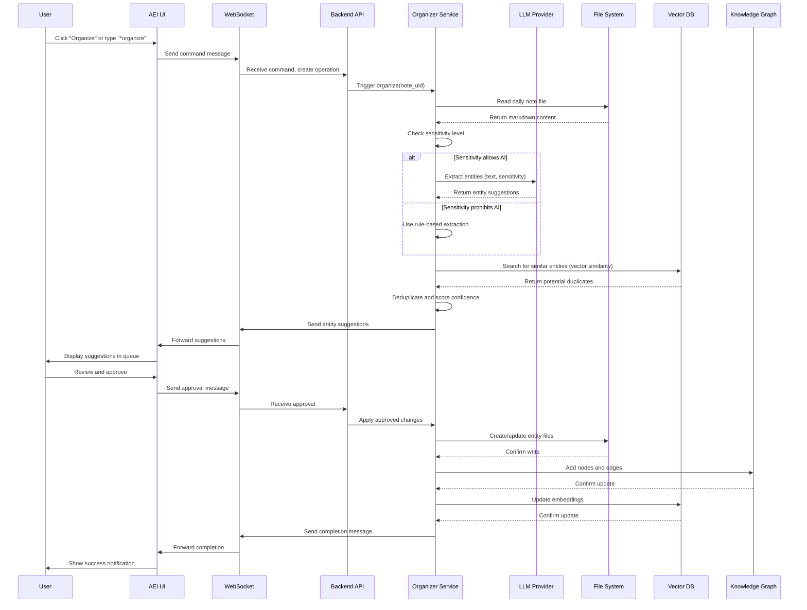

# Second Brain Foundation Fullstack Architecture Document

**Version:** 1.0  
**Date:** November 2, 2025  
**Status:** Draft  
**Architect:** Winston  

---

## Introduction

This document outlines the complete fullstack architecture for Second Brain Foundation, including backend systems, frontend implementation, and their integration. It serves as the single source of truth for AI-driven development, ensuring consistency across the entire technology stack.

This unified approach combines what would traditionally be separate backend and frontend architecture documents, streamlining the development process for modern fullstack applications where these concerns are increasingly intertwined.

### Starter Template or Existing Project

**Status:** N/A - Greenfield project

Second Brain Foundation is a greenfield open-source project with two distinct phases:
- **MVP (Phase 0-1):** Specifications and reference CLI tools (no application server)
- **Phase 2:** AI-Enabled Interface (AEI) - Full-stack application

For Phase 2 AEI, we'll architect from scratch with these considerations:
- Local-first architecture (desktop daemon/service)
- Optional web interface for chat
- Cross-platform support (Windows, macOS, Linux)
- Privacy-first design (local AI as primary)

### Change Log

| Date | Version | Description | Author |
|------|---------|-------------|--------|
| 2025-11-02 | 1.0 | Initial fullstack architecture for MVP and Phase 2 AEI | Winston (Architect) |

---

## High Level Architecture

### Technical Summary

Second Brain Foundation uses a **progressive architecture** that evolves from specifications (MVP) to a full local-first application (Phase 2). The MVP provides markdown-based specifications, entity templates, and reference CLI tools for validation without requiring server infrastructure. Phase 2 introduces the AI-Enabled Interface (AEI), a local-first desktop service with optional web UI, built on Electron/Tauri for cross-platform support, with a Python/Rust backend for AI operations and file system monitoring. The architecture emphasizes **data sovereignty** by keeping all data local by default, supporting both local LLMs (Ollama, LMStudio) and cloud AI providers (OpenAI, Anthropic) with explicit user permission. Integration with existing PKM tools (Obsidian, NotebookLM, AnythingLLM) is achieved through pure markdown compatibility, ensuring the framework remains tool-agnostic and portable.

### Platform and Infrastructure Choice

Given the unique nature of Second Brain Foundation (open-source framework, local-first, privacy-focused), our infrastructure needs are minimal for MVP and non-traditional for Phase 2.

#### MVP (Phase 0-1): No Infrastructure Required

**Platform:** GitHub + GitHub Pages (documentation only)
**Key Services:** 
- GitHub (repository, version control, issue tracking, discussions)
- GitHub Pages (documentation hosting - static site)
- GitHub Actions (CI/CD for validation scripts, linting)
- npm registry (if publishing CLI tools as packages)

**Rationale:** MVP is purely specifications and reference tools. No server infrastructure needed.

#### Phase 2 AEI: Local-First with Optional Cloud

**Platform:** User's local machine (primary), optional self-hosted or cloud for sync
**Key Services:**
- **Local Services:**
  - File system (markdown storage)
  - Local LLM runtime (Ollama, LMStudio, Jan.ai)
  - Local vector database (Chroma, LanceDB embedded)
  - Desktop application framework (Electron or Tauri)
  
- **Optional Cloud Services (User Choice):**
  - Cloud AI providers: OpenAI API, Anthropic API (user's API keys)
  - Sync service: User's choice (Dropbox, iCloud, Syncthing, Git, etc.)
  - Self-hosted option: Docker container for AEI service

**Deployment Model:** 
- Desktop app: Distributed via GitHub Releases (DMG, EXE, AppImage)
- Optional Docker: Self-hosted on user's infrastructure
- No central SaaS hosting (respects privacy and open-source principles)

**Rationale:**
- **Local-first** aligns with privacy philosophy
- **No vendor lock-in** - users control their infrastructure
- **Cost-effective** - no cloud costs for users (except optional AI APIs)
- **Open-source friendly** - users can fork and self-host
- **Flexible** - supports both technical users (self-host) and casual users (desktop app)

### Repository Structure

**Approach:** Monorepo using npm workspaces (lightweight, no tooling overhead)

```
second-brain-foundation/
├── packages/
│   ├── core/                    # Core specifications and schemas
│   │   ├── schemas/             # JSON schemas for frontmatter validation
│   │   ├── templates/           # Entity templates (markdown)
│   │   ├── algorithms/          # Organization algorithm specs
│   │   └── structure/           # Base folder structure
│   │
│   ├── cli/                     # CLI tools (Node.js/TypeScript)
│   │   ├── src/
│   │   │   ├── validate.ts      # Frontmatter validation
│   │   │   ├── uid.ts           # UID generation
│   │   │   ├── check.ts         # Change detection
│   │   │   └── init.ts          # Initialize new vault
│   │   └── package.json
│   │
│   ├── aei-core/                # Phase 2: AEI backend (Python)
│   │   ├── src/
│   │   │   ├── file_watcher/    # Monitor markdown changes
│   │   │   ├── entity_extractor/ # LLM-based entity extraction
│   │   │   ├── organizer/       # Progressive organization logic
│   │   │   ├── graph/           # Knowledge graph management
│   │   │   └── api/             # REST/WebSocket API
│   │   ├── pyproject.toml
│   │   └── README.md
│   │
│   ├── aei-ui/                  # Phase 2: AEI frontend (React/TypeScript)
│   │   ├── src/
│   │   │   ├── components/      # React components
│   │   │   ├── pages/           # Main views (Chat, Queue, Entities, Graph)
│   │   │   ├── hooks/           # Custom React hooks
│   │   │   ├── services/        # API client, state management
│   │   │   └── App.tsx
│   │   └── package.json
│   │
│   ├── desktop/                 # Phase 2: Desktop wrapper (Electron/Tauri)
│   │   ├── src/
│   │   │   ├── main/            # Main process (Node.js)
│   │   │   ├── preload/         # Preload scripts
│   │   │   └── renderer/        # Links to aei-ui
│   │   └── package.json
│   │
│   └── shared/                  # Shared types and utilities
│       ├── types/               # TypeScript types
│       └── utils/               # Shared helper functions
│
├── docs/                        # Documentation
├── examples/                    # Example vaults and workflows
├── scripts/                     # Build and deployment scripts
├── .github/                     # CI/CD workflows
├── package.json                 # Root workspace config
└── README.md
```

**Rationale:**
- **Monorepo** enables code sharing (types, utilities) between packages
- **npm workspaces** is simple, no complex tooling (Nx, Turborepo) needed initially
- **Separation of concerns:** Core specs separate from CLI tools separate from AEI
- **Progressive complexity:** Users can use core specs alone, add CLI tools, or use full AEI
- **Independent versioning:** Each package can be versioned separately

### Cross-Cutting Concerns

#### Logging

**MVP (CLI Tools):**
- Console logging with configurable verbosity (`--verbose`, `--quiet` flags)
- Error output to stderr, normal output to stdout
- No persistent logs (lightweight tools)

**Phase 2 (AEI):**
- **Structured logging** with levels (DEBUG, INFO, WARN, ERROR)
- **Backend:** Python `structlog` library for JSON-formatted logs
- **Frontend:** Console logging in development, silent in production (except errors)
- **Log rotation:** Keep last 7 days of logs, max 100MB per file
- **Log location:** User's app data directory (`~/.sbf/logs/`)
- **Privacy:** Never log sensitive content, only metadata (UIDs, file paths, operation types)

**Log Format (JSON):**
```json
{
  "timestamp": "2025-11-02T12:00:00Z",
  "level": "INFO",
  "component": "entity_extractor",
  "operation": "extract_entities",
  "duration_ms": 1234,
  "entity_count": 3,
  "file_path": "Daily/2025-11-02.md",
  "uid": "daily-2025-11-02"
}
```

#### Error Handling

**Philosophy:** Fail safely, never corrupt user data, provide actionable error messages.

**MVP (CLI Tools):**
- Exit codes: 0 (success), 1 (user error), 2 (system error)
- Descriptive error messages to stderr
- Validation errors show exact location (file, line number, field)
- Suggest fixes in error messages

**Phase 2 (AEI):**
- **Backend:**
  - Try/catch blocks around all operations
  - Rollback mechanisms for file modifications
  - Preview before applying changes (atomic operations)
  - Error recovery: retry with exponential backoff for transient errors
  
- **Frontend:**
  - Error boundaries around major components
  - Toast notifications for user-facing errors
  - Detailed error panel for developers (expandable)
  - Offline graceful degradation
  
- **Error Types:**
  - `ValidationError`: Invalid frontmatter, schema violation
  - `FileSystemError`: Read/write permission issues
  - `AIProviderError`: LLM API failures, rate limits
  - `ConcurrencyError`: File modified by external tool during operation
  - `NetworkError`: Cloud AI connection issues

**Error Response Format (API):**
```json
{
  "error": {
    "code": "ENTITY_DUPLICATE",
    "message": "Entity with name 'John Smith' already exists",
    "details": {
      "existing_uid": "person-john-smith-001",
      "existing_path": "People/john-smith.md",
      "suggested_action": "merge_or_rename"
    },
    "timestamp": "2025-11-02T12:00:00Z"
  }
}
```

#### Security

**Threat Model:**
- **In Scope:** Unauthorized access to user's markdown files, API key exposure, malicious LLM responses
- **Out of Scope:** Physical device security, OS-level attacks, network MitM (local-first)

**Security Measures:**

1. **API Key Management:**
   - Store in OS-specific secure storage (Keychain on macOS, Credential Manager on Windows, Secret Service on Linux)
   - Never log API keys
   - Encrypt at rest using OS-provided encryption
   - Allow environment variables for advanced users

2. **File System Access:**
   - Request explicit user permission for directory access
   - Sandboxed file operations (only access configured vault directory)
   - Validate all file paths to prevent directory traversal
   - Atomic file operations to prevent corruption

3. **AI Provider Security:**
   - TLS for all cloud AI connections
   - Validate TLS certificates
   - Timeout and retry logic to prevent hanging
   - Rate limiting to prevent abuse

4. **LLM Prompt Injection Prevention:**
   - Sanitize user input before sending to LLM
   - Use structured prompts with clear system/user boundaries
   - Validate LLM responses before applying to files
   - Confidence scoring to flag suspicious extractions

5. **Privacy Controls:**
   - Enforce sensitivity level permissions
   - UI indicators for which AI provider is active
   - Audit log of all AI operations (what data was sent where)
   - Dry-run mode to preview operations without execution

6. **Dependency Security:**
   - Regular dependency updates (Dependabot)
   - Scan for vulnerabilities (npm audit, Safety for Python)
   - Pin major versions, update minor/patch automatically
   - Minimal dependencies (reduce attack surface)

#### Testing Strategy

**MVP (Specifications and CLI):**
- **Unit tests:** JSON schema validation, UID generation logic
- **Integration tests:** CLI commands with fixture markdown files
- **Validation tests:** Ensure example templates pass own schemas
- **Tool:** Jest (TypeScript), Pytest (if Python CLI tools)
- **Coverage target:** 80%+ for CLI code

**Phase 2 (AEI):**
- **Backend:**
  - **Unit tests:** Entity extraction, relationship detection, file operations
  - **Integration tests:** End-to-end organization workflows
  - **AI mocking:** Mock LLM responses for deterministic tests
  - **File system fixtures:** Test vaults with known structure
  - **Coverage target:** 80%+ for business logic
  
- **Frontend:**
  - **Unit tests:** React components with React Testing Library
  - **Integration tests:** User flows (create entity, organize note)
  - **E2E tests:** Playwright for critical paths (onboarding, organization)
  - **Visual regression:** Percy or Chromatic for UI consistency
  - **Coverage target:** 70%+ (UI code is less critical)
  
- **Cross-Stack:**
  - **API contract tests:** Ensure frontend-backend compatibility
  - **Performance tests:** Measure organization time for 1000+ notes
  - **Stress tests:** Large vaults (10K+ notes), many concurrent operations

**CI/CD:**
- Run tests on every PR
- Lint checks (ESLint, Ruff for Python)
- Type checks (TypeScript strict mode, MyPy for Python)
- Build verification
- Automated releases on tag push

---

## Backend Architecture

### Technology Stack

**MVP (Phase 0-1):**
- **Language:** TypeScript (Node.js) for CLI tools
- **Runtime:** Node.js 18+ LTS
- **Schema Validation:** Ajv (JSON Schema validator)
- **File Operations:** Node.js fs/promises
- **CLI Framework:** Commander.js
- **Testing:** Jest

**Phase 2 (AEI Backend):**
- **Language:** Python 3.11+
- **Framework:** FastAPI (modern async API framework)
- **File Watcher:** watchfiles (Rust-based, faster than Watchdog)
- **LLM Integration:** 
  - LlamaIndex (RAG-optimized orchestration for knowledge retrieval)
  - Instructor (type-safe entity extraction with Pydantic)
  - OpenAI Python SDK (for OpenAI API)
  - Anthropic Python SDK (for Claude API)
  - Ollama Python client (for local LLMs)
- **Vector Database:** LanceDB (embedded, multi-modal ready, versioning built-in)
- **Graph Database:** SQLite with JSON columns and FTS5 (lightweight, embedded, queryable)
- **Automation:** APScheduler (embedded, MVP) → Prefect (production, observability)
- **API:** REST + WebSocket (for real-time chat)
- **Data Validation:** Pydantic v2 (schema validation and serialization)
- **Testing:** Pytest, Pytest-asyncio

**Rationale:**
- **Python** chosen for AEI backend due to:
  - Excellent AI/ML libraries (LlamaIndex, Instructor, HuggingFace)
  - Fast development for MVP
  - Large community for open-source contributions
  - Cross-platform support
- **FastAPI** provides async performance and auto-generated OpenAPI docs
- **LlamaIndex** optimized for RAG and knowledge retrieval (core use case)
- **Instructor** ensures type-safe entity extraction matching Pydantic schemas
- **LanceDB** embedded database with multi-modal support and versioning
- **SQLite** lightweight graph storage with FTS5 for hybrid search
- **Prefect** provides Python-native workflow orchestration with observability

### Data Models

#### Core Entities (Pydantic Models)

```python
from pydantic import BaseModel, Field
from typing import Optional, List, Literal
from datetime import datetime
from uuid import UUID

class Relationship(BaseModel):
    uid: str
    type: str  # e.g., "collaborates_with", "mentions", "parent_of"
    metadata: Optional[dict] = None

class ContextPermissions(BaseModel):
    cloud_ai_allowed: bool = False
    local_ai_allowed: bool = True
    export_allowed: bool = True

class EntityMetadata(BaseModel):
    """Base metadata for all entities"""
    uid: str
    type: Literal["person", "place", "topic", "project", "daily-note"]
    name: str
    created_at: datetime
    modified_at: datetime
    lifecycle_state: Literal["captured", "transitional", "permanent", "archived"] = "permanent"
    relationships: List[Relationship] = []
    sensitivity: Literal["public", "personal", "confidential", "secret"] = "personal"
    context_permissions: ContextPermissions = Field(default_factory=ContextPermissions)
    custom_fields: dict = {}

class Entity(BaseModel):
    """Full entity with content"""
    metadata: EntityMetadata
    content: str  # Markdown content below frontmatter
    file_path: str  # Relative path from vault root

class DailyNote(BaseModel):
    """Special case for daily notes"""
    metadata: EntityMetadata
    content: str
    file_path: str
    date: datetime  # Extracted from filename or metadata
    
    @property
    def age_hours(self) -> float:
        """Calculate age in hours for 48-hour lifecycle"""
        return (datetime.now() - self.date).total_seconds() / 3600

class EntitySuggestion(BaseModel):
    """AI-generated entity suggestion"""
    suggested_name: str
    suggested_type: Literal["person", "place", "topic", "project"]
    confidence: float  # 0.0 to 1.0
    source_note: str  # UID of note where entity was detected
    context_snippet: str  # Surrounding text for user review
    suggested_relationships: List[Relationship] = []
    reasoning: Optional[str] = None  # LLM explanation
```

#### Database Schemas

**Vector Database (Chroma) - For Semantic Search:**

```python
# Collection: entities
# Schema:
{
    "id": "person-john-smith-001",  # Entity UID
    "embedding": [0.1, 0.2, ...],   # Vector embedding of content
    "metadata": {
        "type": "person",
        "name": "John Smith",
        "sensitivity": "personal",
        "created_at": "2025-11-02T12:00:00Z",
        "file_path": "People/john-smith.md"
    },
    "document": "John Smith is a researcher..."  # Content for retrieval
}

# Collection: notes
# Schema:
{
    "id": "daily-2025-11-02",
    "embedding": [0.3, 0.4, ...],
    "metadata": {
        "type": "daily-note",
        "date": "2025-11-02",
        "lifecycle_state": "captured",
        "file_path": "Daily/2025-11-02.md"
    },
    "document": "Met with John about AI project..."
}
```

**Graph Database (NetworkX) - For Relationships:**

```python
# Node attributes:
{
    "uid": "person-john-smith-001",
    "type": "person",
    "name": "John Smith",
    "file_path": "People/john-smith.md",
    "created_at": "2025-11-02T12:00:00Z"
}

# Edge attributes:
{
    "type": "collaborates_with",
    "created_at": "2025-11-02T13:00:00Z",
    "source_note": "daily-2025-11-02",
    "confidence": 0.95
}
```

**File System (Source of Truth):**
- All data persists as markdown files with YAML frontmatter
- Databases are **caches** rebuilt from file system on startup
- File system changes detected by Watchdog, trigger database updates

### API Design

**Base URL:** `http://localhost:8765` (local server)

**WebSocket:** `ws://localhost:8765/ws` (for chat and real-time updates)

#### REST Endpoints

**Entities:**
```
GET    /api/v1/entities                    # List all entities
GET    /api/v1/entities/{type}             # List entities by type
GET    /api/v1/entities/{uid}              # Get entity by UID
POST   /api/v1/entities                    # Create new entity
PUT    /api/v1/entities/{uid}              # Update entity
DELETE /api/v1/entities/{uid}              # Archive entity
GET    /api/v1/entities/{uid}/relationships # Get entity relationships
POST   /api/v1/entities/{uid}/relationships # Add relationship
GET    /api/v1/entities/search             # Semantic search
```

**Organization Queue:**
```
GET    /api/v1/queue                       # Get pending suggestions
GET    /api/v1/queue/{id}                  # Get suggestion details
POST   /api/v1/queue/{id}/approve          # Approve suggestion
POST   /api/v1/queue/{id}/reject           # Reject suggestion
POST   /api/v1/queue/{id}/modify           # Modify and approve
POST   /api/v1/queue/batch                 # Batch approve/reject
```

**Organization:**
```
POST   /api/v1/organize                    # Trigger organization
GET    /api/v1/organize/status             # Get organization status
POST   /api/v1/organize/preview            # Preview changes without applying
```

**Daily Notes:**
```
GET    /api/v1/daily                       # List daily notes
GET    /api/v1/daily/{date}                # Get daily note by date
POST   /api/v1/daily                       # Create daily note
GET    /api/v1/daily/pending               # Get notes > 48 hours old
```

**Graph:**
```
GET    /api/v1/graph                       # Get full knowledge graph
GET    /api/v1/graph/{uid}                 # Get subgraph for entity
GET    /api/v1/graph/export                # Export graph (JSON, GraphML)
```

**Settings:**
```
GET    /api/v1/settings                    # Get all settings
PUT    /api/v1/settings                    # Update settings
GET    /api/v1/settings/ai-providers       # Get AI provider config
PUT    /api/v1/settings/ai-providers       # Update AI provider config
POST   /api/v1/settings/ai-providers/test  # Test AI provider connection
```

**System:**
```
GET    /api/v1/health                      # Health check
GET    /api/v1/version                     # Version info
GET    /api/v1/vault                       # Get vault info (path, stats)
POST   /api/v1/vault/scan                  # Rescan vault files
```

#### WebSocket API (Chat)

**Connection:** Client connects to `ws://localhost:8765/ws`

**Message Format:**
```json
// Client -> Server (Command)
{
  "id": "msg-001",
  "type": "command",
  "command": "*organize",
  "args": [],
  "timestamp": "2025-11-02T12:00:00Z"
}

// Client -> Server (Natural Language)
{
  "id": "msg-002",
  "type": "message",
  "content": "Show me all people I've met this week",
  "timestamp": "2025-11-02T12:00:00Z"
}

// Server -> Client (Response)
{
  "id": "msg-001",
  "type": "response",
  "content": "Starting organization process...",
  "data": {
    "operation_id": "org-12345",
    "notes_to_process": 3
  },
  "timestamp": "2025-11-02T12:00:01Z"
}

// Server -> Client (Progress Update)
{
  "type": "progress",
  "operation_id": "org-12345",
  "stage": "entity_extraction",
  "progress": 0.33,
  "message": "Extracting entities from Daily/2025-11-02.md",
  "timestamp": "2025-11-02T12:00:02Z"
}

// Server -> Client (Suggestion)
{
  "type": "suggestion",
  "operation_id": "org-12345",
  "suggestion_id": "sug-001",
  "suggestion": {
    "type": "entity",
    "entity_name": "John Smith",
    "entity_type": "person",
    "confidence": 0.95,
    "context": "Met with John Smith about the AI project"
  },
  "timestamp": "2025-11-02T12:00:03Z"
}

// Server -> Client (Error)
{
  "id": "msg-001",
  "type": "error",
  "error": {
    "code": "AI_PROVIDER_ERROR",
    "message": "OpenAI API rate limit exceeded",
    "retry_after": 60
  },
  "timestamp": "2025-11-02T12:00:04Z"
}
```

### External Integrations

#### LLM Providers

**Supported Providers:**
1. **OpenAI** (GPT-4, GPT-3.5-turbo)
2. **Anthropic** (Claude 3 Opus, Sonnet, Haiku)
3. **Ollama** (Local: Llama 3, Mistral, etc.)
4. **LMStudio** (Local: Various models)

**Integration Pattern (LangChain):**

```python
from langchain.chat_models import ChatOpenAI, ChatAnthropic
from langchain.llms import Ollama
from langchain.schema import HumanMessage, SystemMessage

class LLMProvider:
    def __init__(self, provider_type: str, api_key: Optional[str] = None):
        if provider_type == "openai":
            self.llm = ChatOpenAI(
                model="gpt-4-turbo-preview",
                api_key=api_key,
                temperature=0.3  # Lower for consistent extraction
            )
        elif provider_type == "anthropic":
            self.llm = ChatAnthropic(
                model="claude-3-sonnet-20240229",
                api_key=api_key,
                temperature=0.3
            )
        elif provider_type == "ollama":
            self.llm = Ollama(
                model="llama3:8b",
                base_url="http://localhost:11434"
            )
    
    def extract_entities(self, text: str, sensitivity: str) -> List[EntitySuggestion]:
        """Extract entities from text with privacy awareness"""
        if sensitivity in ["confidential", "secret"] and not self.is_local:
            raise PermissionError(f"Cannot use cloud AI for {sensitivity} content")
        
        system_prompt = """You are an entity extraction assistant for a personal knowledge management system.
        Extract people, places, topics, and projects mentioned in the text.
        Return JSON with: name, type, confidence (0-1), and relationships."""
        
        messages = [
            SystemMessage(content=system_prompt),
            HumanMessage(content=text)
        ]
        
        response = self.llm(messages)
        return self._parse_entity_response(response.content)
```

**Fallback Strategy:**
- Primary: User-configured provider (OpenAI, Anthropic, or Local)
- Fallback 1: Local Ollama (if available and privacy allows)
- Fallback 2: Rule-based extraction (regex patterns for common entities)
- Fallback 3: Queue for manual review

#### File System Monitoring

**Watchdog Integration:**

```python
from watchdog.observers import Observer
from watchdog.events import FileSystemEventHandler

class VaultWatcher(FileSystemEventHandler):
    def __init__(self, vault_path: str, callback):
        self.vault_path = vault_path
        self.callback = callback
    
    def on_modified(self, event):
        if event.is_directory or not event.src_path.endswith('.md'):
            return
        
        # Debounce: Ignore rapid successive events (e.g., editor saves)
        self.schedule_update(event.src_path)
    
    def on_created(self, event):
        if event.is_directory or not event.src_path.endswith('.md'):
            return
        
        self.callback('created', event.src_path)
    
    def on_deleted(self, event):
        if event.is_directory or not event.src_path.endswith('.md'):
            return
        
        self.callback('deleted', event.src_path)
    
    def schedule_update(self, file_path: str):
        """Debounce: Wait 1 second before processing to avoid duplicate events"""
        # Implementation uses asyncio.Task with cancellation
        pass

# Usage
observer = Observer()
watcher = VaultWatcher('/path/to/vault', handle_file_change)
observer.schedule(watcher, vault_path, recursive=True)
observer.start()
```

**Change Detection Logic:**
- Calculate SHA-256 hash of file content
- Compare with stored hash in `.sbf-tracking/hashes.json`
- If different, mark as modified by external tool (not AEI)
- Trigger re-analysis if lifecycle_state is "captured" or "transitional"
- Update vector database embeddings
- Rebuild knowledge graph relationships

---

## Frontend Architecture

### Technology Stack

**Phase 2 AEI UI:**
- **Framework:** React 18+ with TypeScript
- **Build Tool:** Vite (fast dev server, optimized builds)
- **State Management:** Zustand (lightweight, simpler than Redux)
- **Data Fetching:** TanStack Query (formerly React Query) for API state
- **Routing:** React Router v6
- **UI Components:** 
  - Headless UI (accessible components)
  - Radix UI (primitives for complex components)
  - Custom components following design system
- **Styling:** Tailwind CSS (utility-first, matches design system)
- **Forms:** React Hook Form with Zod validation
- **Charts/Graph:** D3.js for knowledge graph visualization
- **Markdown:** Marked.js for rendering, CodeMirror for editing
- **Icons:** Lucide React (matches design system)
- **Desktop Wrapper:** Electron or Tauri (TBD based on bundle size)

**Rationale:**
- **React** is mature, widely known, excellent for complex UIs
- **TypeScript** ensures type safety across frontend-backend boundary
- **Vite** provides fast dev experience and optimized production builds
- **Zustand** is simpler than Redux, sufficient for our needs
- **TanStack Query** handles caching, invalidation, background updates elegantly
- **Tailwind** accelerates UI development, matches our design tokens
- **Electron vs Tauri:** Will decide based on MVP testing (Tauri is lighter but less mature)

### Component Architecture

**Structure:**

```
src/
├── components/
│   ├── common/              # Reusable components
│   │   ├── Button.tsx
│   │   ├── Input.tsx
│   │   ├── Modal.tsx
│   │   ├── Tooltip.tsx
│   │   ├── Badge.tsx
│   │   └── ...
│   │
│   ├── entity/              # Entity-related components
│   │   ├── EntityCard.tsx
│   │   ├── EntityDetail.tsx
│   │   ├── EntityForm.tsx
│   │   ├── RelationshipLink.tsx
│   │   └── SensitivityIndicator.tsx
│   │
│   ├── chat/                # Chat interface components
│   │   ├── ChatInput.tsx
│   │   ├── Message.tsx
│   │   ├── MessageList.tsx
│   │   ├── SuggestedActions.tsx
│   │   └── TypingIndicator.tsx
│   │
│   ├── queue/               # Organization queue components
│   │   ├── QueueItem.tsx
│   │   ├── QueueList.tsx
│   │   ├── PreviewPanel.tsx
│   │   ├── DiffViewer.tsx
│   │   └── ConfidenceBadge.tsx
│   │
│   ├── graph/               # Knowledge graph components
│   │   ├── GraphCanvas.tsx
│   │   ├── GraphNode.tsx
│   │   ├── GraphEdge.tsx
│   │   ├── GraphControls.tsx
│   │   └── GraphFilters.tsx
│   │
│   └── layout/              # Layout components
│       ├── Sidebar.tsx
│       ├── Header.tsx
│       ├── MainLayout.tsx
│       └── SettingsLayout.tsx
│
├── pages/                   # Page components (one per route)
│   ├── Chat.tsx
│   ├── Queue.tsx
│   ├── Entities.tsx
│   ├── EntityDetail.tsx
│   ├── Graph.tsx
│   ├── Settings.tsx
│   └── Onboarding.tsx
│
├── hooks/                   # Custom React hooks
│   ├── useWebSocket.ts      # WebSocket connection management
│   ├── useEntities.ts       # Entity CRUD operations
│   ├── useQueue.ts          # Queue operations
│   ├── useGraph.ts          # Graph data and operations
│   ├── useKeyboard.ts       # Keyboard shortcut handler
│   └── useSettings.ts       # Settings management
│
├── services/                # API clients and business logic
│   ├── api.ts               # REST API client (axios wrapper)
│   ├── websocket.ts         # WebSocket client
│   ├── storage.ts           # Local storage wrapper
│   └── markdown.ts          # Markdown parsing utilities
│
├── store/                   # Global state (Zustand)
│   ├── chatStore.ts         # Chat history and state
│   ├── queueStore.ts        # Organization queue state
│   ├── entityStore.ts       # Entity cache
│   ├── settingsStore.ts     # User settings
│   └── uiStore.ts           # UI state (sidebar open, modals, etc.)
│
├── types/                   # TypeScript types
│   ├── entity.ts
│   ├── api.ts
│   ├── graph.ts
│   └── settings.ts
│
├── utils/                   # Utility functions
│   ├── formatting.ts
│   ├── validation.ts
│   ├── constants.ts
│   └── helpers.ts
│
├── styles/                  # Global styles
│   ├── globals.css
│   └── tailwind.css
│
├── App.tsx                  # Root component
└── main.tsx                 # Entry point
```

**Component Principles:**
- **Single Responsibility:** Each component does one thing well
- **Composition over Inheritance:** Build complex UIs from simple components
- **Presentational vs Container:** Separate UI (presentational) from logic (container/hooks)
- **TypeScript Strict:** All props and state typed
- **Accessibility First:** ARIA labels, keyboard navigation, focus management

### State Management

**Global State (Zustand):**

```typescript
// store/chatStore.ts
import create from 'zustand'

interface Message {
  id: string
  type: 'user' | 'aei' | 'system'
  content: string
  timestamp: Date
  data?: any
}

interface ChatState {
  messages: Message[]
  isProcessing: boolean
  currentOperationId: string | null
  
  // Actions
  addMessage: (message: Omit<Message, 'id' | 'timestamp'>) => void
  setProcessing: (processing: boolean) => void
  clearHistory: () => void
}

export const useChatStore = create<ChatState>((set) => ({
  messages: [],
  isProcessing: false,
  currentOperationId: null,
  
  addMessage: (msg) => set((state) => ({
    messages: [
      ...state.messages,
      { ...msg, id: generateId(), timestamp: new Date() }
    ]
  })),
  
  setProcessing: (processing) => set({ isProcessing: processing }),
  
  clearHistory: () => set({ messages: [] })
}))
```

**Server State (TanStack Query):**

```typescript
// hooks/useEntities.ts
import { useQuery, useMutation, useQueryClient } from '@tanstack/react-query'
import { api } from '../services/api'

export function useEntities(type?: EntityType) {
  return useQuery({
    queryKey: ['entities', type],
    queryFn: () => api.getEntities(type),
    staleTime: 5 * 60 * 1000, // 5 minutes
  })
}

export function useEntity(uid: string) {
  return useQuery({
    queryKey: ['entity', uid],
    queryFn: () => api.getEntity(uid),
    enabled: !!uid,
  })
}

export function useCreateEntity() {
  const queryClient = useQueryClient()
  
  return useMutation({
    mutationFn: api.createEntity,
    onSuccess: () => {
      // Invalidate and refetch entities list
      queryClient.invalidateQueries({ queryKey: ['entities'] })
    },
  })
}
```

**Local State:**
- Component state with `useState` for simple UI state (input values, toggle states)
- Form state with React Hook Form
- Derived state with `useMemo` for computed values

### Routing

**Route Structure:**

```typescript
// App.tsx
import { BrowserRouter, Routes, Route } from 'react-router-dom'

function App() {
  return (
    <BrowserRouter>
      <Routes>
        <Route path="/" element={<MainLayout />}>
          <Route index element={<Chat />} />
          <Route path="queue" element={<Queue />} />
          <Route path="entities" element={<Entities />} />
          <Route path="entities/:uid" element={<EntityDetail />} />
          <Route path="graph" element={<Graph />} />
          <Route path="settings" element={<Settings />} />
        </Route>
        <Route path="/onboarding" element={<Onboarding />} />
      </Routes>
    </BrowserRouter>
  )
}
```

**Navigation:**
- Sidebar links use React Router `<Link>` components
- Keyboard shortcuts trigger programmatic navigation via `useNavigate()`
- Deep linking supported (e.g., `/entities/person-john-smith-001`)

### Build and Deployment

**Development:**
```bash
npm run dev            # Start Vite dev server (hot reload)
npm run dev:desktop    # Start desktop app in dev mode
```

**Production Build:**
```bash
npm run build          # Build optimized frontend bundle
npm run build:desktop  # Build desktop app (DMG, EXE, AppImage)
```

**Build Optimizations:**
- Code splitting by route (React.lazy)
- Tree shaking (remove unused code)
- Minification and compression
- Asset optimization (images, fonts)
- Source maps for debugging (separate files)

**Desktop Packaging (Electron Builder):**
- **macOS:** DMG with code signing (optional)
- **Windows:** NSIS installer with optional code signing
- **Linux:** AppImage, DEB, RPM

**Distribution:**
- GitHub Releases (auto-publish via GitHub Actions)
- Auto-update mechanism (electron-updater)
- Version check on startup

---

## Data Flow

### Organization Workflow (End-to-End)

**Scenario:** User triggers organization of a 48-hour-old daily note



### Entity Creation Flow

**Scenario:** User creates a new Person entity via chat command

```
1. User types: "*entity create person 'Jane Doe'"
2. UI sends command via WebSocket
3. Backend parses command, validates input
4. Backend generates UID (person-jane-doe-001)
5. Backend creates EntityMetadata with defaults
6. Backend checks for duplicates (name similarity)
7. Backend prompts user if potential duplicate found
8. User confirms or modifies
9. Backend creates markdown file:
   - Vault/People/jane-doe.md
   - YAML frontmatter with metadata
   - Template content body
10. Backend updates vector DB (embed content)
11. Backend adds node to knowledge graph
12. Backend sends success response via WebSocket
13. UI displays new entity detail view
14. UI invalidates entities query cache (refetch list)
```

### Real-Time Updates Flow

**Scenario:** User edits entity in external tool (Obsidian)

```
1. User modifies Vault/People/john-smith.md in Obsidian
2. File system watcher detects change
3. Backend calculates new file hash
4. Backend compares with stored hash
5. Hash differs → external modification detected
6. Backend parses updated frontmatter
7. Backend validates schema compliance
8. Backend updates vector DB embedding
9. Backend updates knowledge graph node attributes
10. Backend broadcasts update via WebSocket
11. UI receives update message
12. UI invalidates cached entity data
13. UI refetches entity if currently viewing
14. UI displays notification: "Entity updated externally"
```

---

## Deployment Architecture

### MVP (Phase 0-1): Static Documentation

```
GitHub Repository
├── Source Code (specs, templates, CLI)
├── GitHub Actions CI/CD
│   ├── Lint and test on PR
│   ├── Build CLI packages
│   └── Publish to npm (optional)
└── GitHub Pages
    ├── Documentation site (MkDocs or Docusaurus)
    ├── Getting Started guides
    └── API reference
```

**Deployment Steps:**
1. Push to main branch
2. GitHub Actions builds docs site
3. Publishes to GitHub Pages
4. Available at: secondbrainfoundation.github.io

### Phase 2: Desktop Application

**Distribution:**

```
GitHub Releases
├── second-brain-foundation-1.0.0-mac-arm64.dmg
├── second-brain-foundation-1.0.0-mac-x64.dmg
├── second-brain-foundation-1.0.0-win-x64.exe
├── second-brain-foundation-1.0.0-linux-x64.AppImage
├── second-brain-foundation-1.0.0-linux-x64.deb
└── latest.yml (auto-update metadata)
```

**Release Process (Automated):**
1. Developer creates Git tag (e.g., v1.0.0)
2. GitHub Actions triggered on tag push
3. Actions workflow:
   - Run tests (backend and frontend)
   - Build Python backend wheel
   - Build React frontend bundle
   - Package Electron/Tauri app for all platforms
   - Create GitHub Release
   - Upload artifacts (DMG, EXE, AppImage, etc.)
   - Generate release notes from commits
4. Users notified of update in-app

**Local Installation:**

```
User's Machine
├── Application Bundle
│   ├── AEI UI (Electron/Tauri)
│   ├── Python Backend (bundled)
│   ├── Embedded Databases (LanceDB, SQLite)
│   └── Native Dependencies
│
├── User Data Directory (~/.sbf/ or AppData)
│   ├── settings.json
│   ├── logs/
│   ├── cache/
│   │   ├── vector_db/ (LanceDB)
│   │   └── graph_db/ (SQLite)
│   ├── prefect/ (optional workflow server)
│   └── api_keys.encrypted
│
└── Vault Directory (user-chosen location)
    ├── Daily/
    ├── People/
    ├── Places/
    ├── Topics/
    ├── Projects/
    └── Transitional/
```

**Auto-Update:**
- Check for updates on app startup
- Download in background
- Prompt user to restart and install
- Rollback mechanism if update fails

### Optional: Docker Self-Hosted

**For advanced users who want to run AEI as a service:**

```yaml
# docker-compose.yml
version: '3.8'

services:
  aei-backend:
    image: secondbrainfoundation/aei-backend:latest
    ports:
      - "8765:8765"
    volumes:
      - ./vault:/vault
      - ./config:/config
      - ./data:/data
    environment:
      - VAULT_PATH=/vault
      - OLLAMA_BASE_URL=http://ollama:11434
    depends_on:
      - ollama

  ollama:
    image: ollama/ollama:latest
    ports:
      - "11434:11434"
    volumes:
      - ./ollama:/root/.ollama

  aei-web:
    image: secondbrainfoundation/aei-web:latest
    ports:
      - "3000:3000"
    environment:
      - API_URL=http://aei-backend:8765
    depends_on:
      - aei-backend
```

**Usage:**
```bash
docker-compose up -d
# Access web UI at http://localhost:3000
```

---

## Performance Considerations

### Backend Performance

**Target Metrics:**
- API response time: < 100ms (p95) for reads, < 500ms for writes
- WebSocket message latency: < 50ms
- Organization processing: < 5s for 10 notes, < 30s for 100 notes
- File system scan: < 10s for 10K files
- Graph query: < 1s for 2-hop queries

**Optimization Strategies:**

1. **Caching:**
   - LRU cache for parsed markdown files (100 most recent)
   - Redis cache for frequent queries (if using Docker deployment)
   - HTTP caching headers for static assets

2. **Database Optimization:**
   - Index UIDs in vector DB
   - Batch vector operations (embed multiple at once)
   - Lazy-load graph nodes (only load visible subgraph)

3. **Async Operations:**
   - Use FastAPI async/await throughout
   - Celery for long-running tasks (organization, bulk operations)
   - Background file scanning (don't block API)

4. **File System:**
   - Debounce file watcher events (1 second delay)
   - Batch file writes (commit multiple changes atomically)
   - Use memory-mapped files for large vaults (mmap)

5. **LLM Calls:**
   - Cache LLM responses (deduplicate identical prompts)
   - Batch entity extractions when possible
   - Use streaming for long responses (don't wait for completion)
   - Implement rate limiting and retry logic

### Frontend Performance

**Target Metrics:**
- Time to Interactive (TTI): < 3s on 3G, < 1s on WiFi
- First Contentful Paint (FCP): < 1s
- Largest Contentful Paint (LCP): < 2.5s
- Interaction to Next Paint (INP): < 200ms
- Graph render (1000 nodes): < 3s initial, < 100ms interaction

**Optimization Strategies:**

1. **Code Splitting:**
   - Lazy-load routes (React.lazy)
   - Lazy-load heavy components (Graph, Settings)
   - Separate vendor chunks (React, D3, etc.)

2. **Bundle Size:**
   - Tree shaking enabled
   - Remove unused dependencies
   - Use lightweight alternatives (Zustand vs Redux)
   - Analyze bundle with webpack-bundle-analyzer

3. **Rendering:**
   - Virtualize long lists (react-window for entity list)
   - Memoize expensive computations (React.memo, useMemo)
   - Debounce search input (300ms)
   - Throttle scroll handlers

4. **Data Loading:**
   - Prefetch likely next actions (hover = prefetch entity detail)
   - Optimistic updates (show change immediately, revert on error)
   - Background refetch (TanStack Query handles this)
   - WebSocket for real-time updates (no polling)

5. **Graph Visualization:**
   - WebGL rendering for > 500 nodes (force-graph library)
   - Level-of-detail (LOD): simplify distant nodes
   - Viewport culling: don't render off-screen
   - Debounce layout recalculation (300ms after last interaction)

---

## Scalability Considerations

### Data Volume

**Expected Scale (MVP Target):**
- 10,000 notes
- 1,000 entities
- 5,000 relationships
- 100 daily notes (3 months of daily capture)

**Architecture Support (Design for 10x):**
- 100,000 notes
- 10,000 entities
- 50,000 relationships

**Scaling Strategies:**

1. **File System:**
   - Hierarchical folders reduce directory size
   - File system performance: ext4, APFS, NTFS handle 10K+ files per directory
   - Sharding: If needed, add subdirectories (People/A-F/, People/G-M/, etc.)

2. **Vector Database:**
   - Chroma embedded supports 100K+ documents
   - If scaling beyond: Migrate to Qdrant or Weaviate (client-server)
   - Horizontal scaling: Shard by entity type or date range

3. **Knowledge Graph:**
   - NetworkX in-memory supports 10K+ nodes
   - If scaling beyond: Migrate to Neo4j (persistent, ACID)
   - Neo4j Cypher queries efficient for large graphs

4. **Backend Processing:**
   - Prefect flows scale horizontally (add more workers)
   - APScheduler for MVP (embedded, zero deps)
   - Partition tasks by vault (multi-user support in future)
   - Async I/O for concurrent file operations

5. **Frontend:**
   - Virtualization handles 10K+ items in lists
   - Pagination for large result sets (100 per page)
   - Graph: Show only 2-hop neighborhood initially (expand on demand)

### Multi-User (Future Consideration)

**Current:** Single-user, local-first (MVP)

**Future:** Team collaboration (Phase 3+)

**Considerations:**
- Operational Transform (OT) or CRDT for real-time collaboration
- User authentication and authorization
- Per-entity permissions
- Conflict resolution for concurrent edits
- Sync protocol (custom or leverage existing: Git, Syncthing, etc.)

**Architecture Changes Needed:**
- Multi-tenant backend with user isolation
- WebSocket rooms per vault
- Shared entity ownership model
- Activity feed for team updates

---

## Technology Decision Rationale

### Why Python for Backend?

**Pros:**
- Excellent AI/ML libraries (LangChain, HuggingFace, sentence-transformers)
- Fast development (dynamic typing, high-level abstractions)
- Large community for open-source contributions
- Cross-platform support
- Rich ecosystem for file operations, async I/O

**Cons:**
- Slower than compiled languages (Rust, Go)
- Global Interpreter Lock (GIL) limits multi-threading
- Distribution complexity (bundle Python runtime)

**Decision:** Python chosen for Phase 2 because AI integration is core to AEI, and Python ecosystem is unmatched for AI. Performance concerns mitigated by async I/O and Prefect for parallel task orchestration. LlamaIndex provides RAG-optimized knowledge retrieval. For MVP, TypeScript CLI tools sufficient.

### Why React for Frontend?

**Pros:**
- Mature, stable, excellent documentation
- Large ecosystem (libraries, components, tooling)
- Wide community knowledge (easy to find contributors)
- Strong TypeScript support
- Excellent dev tools (React DevTools)

**Cons:**
- Larger bundle size than lighter alternatives (Preact, Svelte)
- More boilerplate than newer frameworks (SolidJS, Svelte)
- Virtual DOM overhead (though minimal in practice)

**Decision:** React chosen for maturity, community, and developer familiarity. For open-source project, maximizing contributor pool is priority. Performance is acceptable with proper optimization.

### Why Electron vs Tauri?

**Electron:**
- **Pros:** Mature, well-documented, large ecosystem, easier development
- **Cons:** Large bundle size (100-150 MB), higher memory usage, bundles Chromium

**Tauri:**
- **Pros:** Smaller bundle (10-20 MB), uses OS webview, lower memory, Rust backend
- **Cons:** Less mature, smaller ecosystem, more complex development

**Decision:** TBD - Prototype both and decide based on:
- Bundle size comparison (actual measurements)
- Developer experience (easier contributions more important)
- Stability and platform support
- Community feedback (users may prefer smaller download)

**Recommendation:** Start with Electron for familiarity, migrate to Tauri in Phase 3 if bundle size becomes issue.

### Why Zustand vs Redux?

**Zustand:**
- **Pros:** Minimal boilerplate, simpler API, smaller bundle, sufficient for our needs
- **Cons:** Less mature, smaller ecosystem, fewer devtools

**Redux:**
- **Pros:** Industry standard, excellent devtools, large ecosystem, predictable patterns
- **Cons:** Verbose, boilerplate-heavy, overkill for our complexity

**Decision:** Zustand chosen for simplicity and bundle size. Our state management needs are straightforward (chat history, UI state). Redux unnecessary complexity for MVP.

---

## Open Questions and Future Decisions

### To Be Decided Before Implementation

1. **Desktop Framework:**
   - [ ] Electron or Tauri? (Prototype both, measure bundle size)
   - [ ] Auto-update strategy (electron-updater or custom?)

2. **Python Packaging:**
   - [ ] Bundle Python runtime with Electron? (PyInstaller or PyOxidizer)
   - [ ] Or require Python installation? (Document installation steps)

3. **Vector Database:**
   - [ ] Chroma sufficient for MVP?
   - [ ] When to migrate to Qdrant/Weaviate?
   - [ ] Embedding model: all-MiniLM-L6-v2 (default) or user-selectable?

4. **LLM Provider Priority:**
   - [ ] Default to Ollama if available?
   - [ ] Or require user to configure on first launch?
   - [ ] Fallback hierarchy: Local → Cloud → Rule-based?

5. **Mobile Strategy:**
   - [ ] Native mobile apps (React Native) or PWA?
   - [ ] View-only companion or full functionality?
   - [ ] Timeline: Phase 3 or later?

6. **Sync Strategy:**
   - [ ] Built-in sync or rely on user's chosen solution?
   - [ ] If built-in: Use Git, custom protocol, or existing solution (Syncthing)?

### Research Needed

1. **Conflict Resolution:**
   - [ ] How to handle concurrent edits (user in Obsidian + AEI simultaneously)?
   - [ ] CRDT approach or simpler "last write wins" with warnings?

2. **Performance Benchmarks:**
   - [ ] Test LanceDB performance with 10K, 50K, 100K documents
   - [ ] Measure organization time for various vault sizes
   - [ ] Profile graph rendering with 1K, 5K, 10K nodes

3. **LLM Cost Analysis:**
   - [ ] Average API cost per organization operation
   - [ ] Compare cloud vs local LLM quality for entity extraction
   - [ ] Recommend free tier limits (e.g., "10 organizations/day without API key")

4. **Accessibility Testing:**
   - [ ] Test with screen readers (NVDA, JAWS, VoiceOver)
   - [ ] Validate keyboard navigation flows
   - [ ] Color contrast compliance verification

---

## Next Steps

### Immediate Actions (Post-Architecture)

1. **Setup Repository:**
   - Initialize monorepo with npm workspaces
   - Configure TypeScript and ESLint
   - Setup GitHub Actions CI/CD
   - Create project structure (packages/ directories)

2. **Develop MVP (Phase 0-1):**
   - Implement JSON schemas for frontmatter validation
   - Create CLI tools (validate, init, uid generate)
   - Write example templates and documentation
   - Publish to npm (optional)

3. **Prototype Phase 2 Decisions:**
   - Electron vs Tauri comparison
   - LLM provider integration tests
   - Graph rendering performance tests
   - Python bundling approach

4. **Begin Phase 2 Development:**
   - Backend: FastAPI skeleton, file watcher, API endpoints
   - Frontend: React app skeleton, component library, chat interface
   - Integration: WebSocket communication, API client

### Validation Checklist

- [ ] Architecture reviewed by team/stakeholders
- [ ] Technology choices validated with prototypes
- [ ] Open questions resolved or deferral plan documented
- [ ] Security review of API key storage and file access
- [ ] Performance targets validated as achievable
- [ ] Accessibility requirements mapped to implementation
- [ ] Cost analysis for cloud AI usage completed
- [ ] Deployment process documented and tested

---

## Appendices

### A. Technology Stack Summary

| Layer | Technology | Version | Purpose |
|-------|------------|---------|---------|
| **MVP** |
| CLI | TypeScript/Node.js | 18+ | Validation tools |
| Validation | Ajv | 8.x | JSON schema validation |
| **Backend** |
| Runtime | Python | 3.11+ | Backend service |
| API Framework | FastAPI | 0.104+ | REST + WebSocket API |
| LLM Orchestration | LlamaIndex | 0.9+ | RAG-optimized retrieval |
| Entity Extraction | Instructor | 1.0+ | Type-safe LLM output |
| File Watcher | watchfiles | 0.21+ | Rust-based file monitoring |
| Vector DB | LanceDB | 0.4+ | Multi-modal embeddings |
| Graph DB | SQLite + FTS5 | 3.40+ | Lightweight graph storage |
| Automation | Prefect | 2.14+ | Workflow orchestration |
| Validation | Pydantic | 2.5+ | Data schemas |
| **Frontend** |
| Framework | React | 18+ | UI framework |
| Language | TypeScript | 5.3+ | Type safety |
| Build Tool | Vite | 5.0+ | Dev server, bundler |
| State | Zustand | 4.4+ | Global state |
| Data Fetching | TanStack Query | 5.0+ | Server state |
| Routing | React Router | 6.20+ | Client-side routing |
| Styling | Tailwind CSS | 3.4+ | Utility-first CSS |
| Forms | React Hook Form | 7.49+ | Form management |
| Graph Viz | D3.js | 7.8+ | Knowledge graph |
| Icons | Lucide React | 0.300+ | Icon library |
| **Desktop** |
| Framework | Electron/Tauri | TBD | Desktop wrapper |
| **DevOps** |
| CI/CD | GitHub Actions | - | Automation |
| Testing | Jest, Pytest | - | Unit/integration tests |
| E2E Testing | Playwright | - | End-to-end tests |
| Linting | ESLint, Ruff | - | Code quality |

### B. API Endpoint Reference

Complete API documentation will be auto-generated from FastAPI OpenAPI schema and available at `http://localhost:8765/docs` (Swagger UI) and `http://localhost:8765/redoc` (ReDoc).

Quick reference provided in Backend Architecture > API Design section.

### C. Database Schemas

See Backend Architecture > Data Models for Pydantic schemas and database schemas.

### D. Glossary

- **AEI:** AI-Enabled Interface - The Phase 2 application providing chat-based organization
- **Entity:** A core knowledge object (Person, Place, Topic, or Project) with metadata
- **UID:** Unique Identifier - Deterministic ID for each entity
- **Frontmatter:** YAML metadata at the top of markdown files
- **Progressive Organization:** Capture → Connect → Structure lifecycle approach
- **Sensitivity:** Privacy level (public, personal, confidential, secret)
- **Context Permissions:** AI access control (cloud_ai_allowed, local_ai_allowed)
- **Lifecycle State:** Note status (captured, transitional, permanent, archived)
- **Knowledge Graph:** Network of entities and their relationships
- **Vector Database:** Semantic search database using embeddings
- **LLM:** Large Language Model (GPT-4, Claude, Llama, etc.)
- **Local-First:** Architecture where data lives on user's device by default

---

**Architecture Document Complete.** Ready for implementation planning and development kickoff.

*Architecture designed using BMAD-METHOD™ framework - November 2, 2025*
