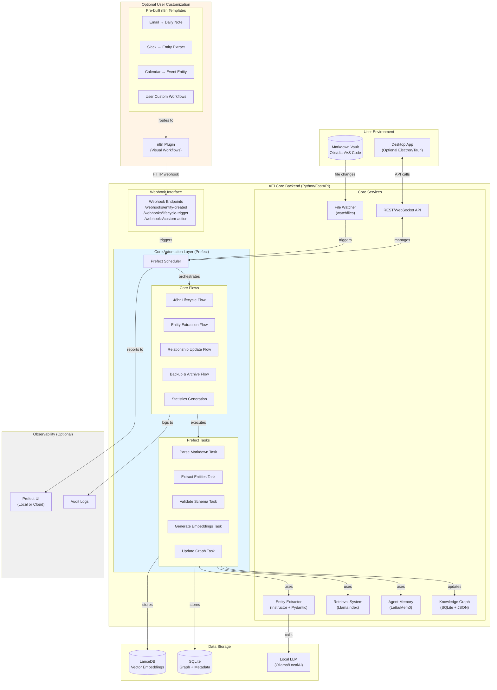

# Automation Integration Architecture
## Prefect + Optional n8n Plugin Strategy

**Version:** 1.0  
**Date:** 2025-11-13  
**Status:** Approved Architecture  
**Author:** System Architect

---

## Table of Contents

- [Executive Summary](#executive-summary)
- [Architecture Diagram](#architecture-diagram)
- [Component Responsibilities](#component-responsibilities)
  - [Core Automation (Prefect)](#1-core-automation-prefect)
  - [Optional n8n Plugin](#2-optional-n8n-plugin)
- [Implementation Phases](#implementation-phases)
- [Deployment Architecture](#deployment-architecture)
- [Technology Decisions](#technology-decisions)
- [Configuration](#configuration)
- [Migration Path](#migration-path)
- [Monitoring & Observability](#monitoring--observability)
- [Testing Strategy](#testing-strategy)
- [Security Considerations](#security-considerations)
- [Performance Optimization](#performance-optimization)
- [Cost Considerations](#cost-considerations)
- [Resources](#resources)
- [Decision Log](#decision-log)
- [Future Enhancements](#future-enhancements)

---

## Executive Summary

Second Brain Foundation uses a **dual-automation strategy**:
- **Prefect** (Python-native) for core automation workflows
- **n8n** (optional plugin) for user-customizable visual workflows

This architecture provides **developer control** (Prefect) while enabling **user flexibility** (n8n) without adding Node.js to the critical path.

---

## Architecture Diagram



---

## Component Responsibilities

### 1. Core Automation (Prefect)

**Why Prefect:**
- Python-native (matches FastAPI backend)
- Code-first workflows (easier to test and debug)
- Beautiful observability UI
- Trivial migration from simple APScheduler
- Free tier or self-hosted

**Core Workflows:**

#### 48-Hour Lifecycle Flow
```python
from prefect import flow, task
from datetime import datetime, timedelta

@task(retries=3)
def find_old_daily_notes(vault_path: str) -> list[str]:
    """Find daily notes older than 48 hours."""
    cutoff = datetime.now() - timedelta(hours=48)
    # Scan vault, return paths
    return old_notes

@task
def extract_entities_from_note(note_path: str) -> dict:
    """Use Instructor + LlamaIndex to extract entities."""
    # Returns structured Pydantic entities
    return entities

@task
def validate_entities(entities: dict) -> dict:
    """Validate with Pydantic schema."""
    # Returns validated entities
    return validated

@task
def create_entity_files(entities: dict, vault_path: str) -> list[str]:
    """Create markdown files for entities."""
    # Returns created file paths
    return created_files

@task
def update_knowledge_graph(entities: dict) -> None:
    """Update SQLite graph with relationships."""
    # Updates graph database
    pass

@flow(name="48hr-lifecycle", log_prints=True)
def lifecycle_workflow(vault_path: str):
    """Process daily notes past 48 hour threshold."""
    old_notes = find_old_daily_notes(vault_path)
    
    for note in old_notes:
        entities = extract_entities_from_note(note)
        validated = validate_entities(entities)
        files = create_entity_files(validated, vault_path)
        update_knowledge_graph(validated)
    
    return f"Processed {len(old_notes)} notes"
```

#### Entity Extraction Flow
```python
@flow(name="entity-extraction")
def entity_extraction_flow(file_path: str, event_type: str):
    """Triggered on file change events."""
    content = read_markdown(file_path)
    frontmatter = parse_frontmatter(content)
    
    # Check if needs extraction
    if should_extract(frontmatter, event_type):
        entities = extract_entities(content)
        validated = validate_schema(entities)
        
        # Queue for approval
        queue_for_approval(validated, file_path)
```

#### Relationship Maintenance Flow
```python
@flow(name="relationship-maintenance", schedule="0 2 * * *")
def relationship_maintenance():
    """Nightly relationship graph maintenance."""
    broken_links = find_broken_wikilinks()
    fix_links(broken_links)
    
    similar_entities = find_duplicate_candidates()
    suggest_merges(similar_entities)
    
    update_backlinks()
```

**Scheduling:**
```python
# In FastAPI startup
from prefect.deployments import Deployment

# Deploy lifecycle workflow (runs every 6 hours)
Deployment.build_from_flow(
    flow=lifecycle_workflow,
    name="lifecycle-6hr",
    schedule="0 */6 * * *",
    parameters={"vault_path": "/path/to/vault"}
)

# Deploy maintenance (nightly at 2 AM)
Deployment.build_from_flow(
    flow=relationship_maintenance,
    name="nightly-maintenance",
    schedule="0 2 * * *"
)
```

---

### 2. Optional n8n Plugin

**Why n8n as Plugin (not primary):**
- Visual workflow builder for non-technical users
- 400+ pre-built integrations
- Great for multi-SaaS orchestration (Email, Slack, Notion, etc.)
- Complements Prefect without replacing it

**Integration Pattern:**

#### n8n → FastAPI Webhooks
```javascript
// n8n workflow: Email to Daily Note
[
  {
    "node": "Email Trigger (IMAP)",
    "credentials": "user-email-account"
  },
  {
    "node": "Extract Email Content",
    "operation": "parse"
  },
  {
    "node": "HTTP Request",
    "method": "POST",
    "url": "http://localhost:8000/webhooks/create-daily-note",
    "body": {
      "content": "{{ $json.body }}",
      "subject": "{{ $json.subject }}",
      "sender": "{{ $json.from }}",
      "timestamp": "{{ $json.date }}"
    }
  }
]
```

#### FastAPI Webhook Handler
```python
from fastapi import APIRouter, BackgroundTasks
from prefect import get_client

router = APIRouter(prefix="/webhooks")

@router.post("/create-daily-note")
async def create_daily_note_webhook(
    payload: DailyNoteWebhook,
    background_tasks: BackgroundTasks
):
    """Webhook endpoint for n8n to create daily note."""
    
    # Create daily note file
    note_path = create_note_from_email(
        content=payload.content,
        subject=payload.subject,
        sender=payload.sender
    )
    
    # Trigger Prefect flow in background
    background_tasks.add_task(
        trigger_prefect_flow,
        flow_name="entity-extraction",
        parameters={"file_path": note_path}
    )
    
    return {"status": "created", "path": note_path}

async def trigger_prefect_flow(flow_name: str, parameters: dict):
    """Trigger Prefect flow from webhook."""
    async with get_client() as client:
        deployment = await client.read_deployment_by_name(flow_name)
        await client.create_flow_run_from_deployment(
            deployment.id,
            parameters=parameters
        )
```

**Pre-built n8n Templates:**

1. **Email → Daily Note**
   - IMAP trigger → Parse → Webhook → Create note → Extract entities

2. **Slack Messages → Entity Capture**
   - Slack mention → Filter → Webhook → Extract person/topic entities

3. **Calendar Events → Event Entities**
   - Google Calendar webhook → Parse → Create event entity

4. **Web Clipper → Source Entity**
   - Browser extension → n8n webhook → Create source entity

---

## Implementation Phases

### Phase 2a: MVP (Weeks 1-4)

**Use APScheduler (Embedded):**
```python
from apscheduler.schedulers.asyncio import AsyncIOScheduler
from fastapi import FastAPI

app = FastAPI()
scheduler = AsyncIOScheduler()

@app.on_event("startup")
async def start_scheduler():
    # Simple embedded scheduler for MVP
    scheduler.add_job(
        process_lifecycle,
        'interval',
        hours=6,
        id='lifecycle_processor'
    )
    scheduler.start()

async def process_lifecycle():
    # Direct function call, no framework
    pass
```

**Why Start Simple:**
- Zero external dependencies
- Fast to implement
- Easy to debug
- Proves concept before adding complexity

---

### Phase 2b: Production (Weeks 5-8)

**Migrate to Prefect:**
```python
# Migration is trivial - wrap existing functions

# Before (APScheduler)
async def process_lifecycle():
    notes = find_old_notes()
    for note in notes:
        extract_entities(note)

# After (Prefect) - same logic, better observability
@flow
def process_lifecycle():
    notes = find_old_notes()  # Now auto-retries
    for note in notes:
        extract_entities(note)  # Now tracked & logged
```

**Prefect Setup:**
```bash
# Install
pip install prefect

# Start local Prefect server (optional UI)
prefect server start

# Deploy flows
prefect deployment apply
```

**Benefits Gained:**
- Web UI for monitoring flows
- Automatic retries on failure
- Execution history and logs
- Task caching (skip redundant work)
- Better error handling

---

### Phase 3: User Customization (Future)

**Add n8n Plugin (Optional):**

1. **User installs n8n** (Docker or npm)
```bash
docker run -d \
  -p 5678:5678 \
  -v ~/.n8n:/home/node/.n8n \
  n8nio/n8n
```

2. **Import Second Brain workflow templates**
   - Download from community repository
   - Configure webhook URLs to local AEI
   - Customize triggers and actions

3. **AEI recognizes n8n integration**
```python
# AEI config
class Settings(BaseSettings):
    n8n_enabled: bool = False
    n8n_webhook_base: str = "http://localhost:5678/webhook"
    
    @property
    def supports_n8n(self) -> bool:
        # Auto-detect if n8n is running
        return self.n8n_enabled and is_n8n_reachable()
```

4. **UI shows n8n workflows**
```typescript
// React component
function AutomationSettings() {
  const { n8nEnabled, workflows } = useAutomation();
  
  return (
    <div>
      <h2>Automation</h2>
      
      {/* Core Prefect flows (always shown) */}
      <Section title="Core Workflows">
        <FlowCard flow="48hr-lifecycle" status={running} />
        <FlowCard flow="entity-extraction" status={running} />
      </Section>
      
      {/* Optional n8n workflows */}
      {n8nEnabled && (
        <Section title="Custom Workflows (n8n)">
          {workflows.map(w => <WorkflowCard key={w.id} workflow={w} />)}
          <Button onClick={openN8n}>Open n8n Editor</Button>
        </Section>
      )}
    </div>
  );
}
```

---

## Deployment Architecture

### Local Development
```
┌─────────────────────────────┐
│  Developer Machine          │
│                             │
│  ┌─────────────────────┐   │
│  │ FastAPI (port 8000) │   │
│  │  + APScheduler      │   │
│  └─────────────────────┘   │
│                             │
│  ┌─────────────────────┐   │
│  │ Markdown Vault      │   │
│  └─────────────────────┘   │
└─────────────────────────────┘
```

### Production (Single User)
```
┌─────────────────────────────┐
│  Desktop App (Electron)     │
│                             │
│  ┌─────────────────────┐   │
│  │ FastAPI Backend     │   │
│  │  + Prefect          │   │
│  └─────────────────────┘   │
│                             │
│  ┌─────────────────────┐   │
│  │ React Frontend      │   │
│  └─────────────────────┘   │
│                             │
│  ┌─────────────────────┐   │
│  │ SQLite + LanceDB    │   │
│  └─────────────────────┘   │
│                             │
│  ┌─────────────────────┐   │
│  │ Ollama (optional)   │   │
│  └─────────────────────┘   │
└─────────────────────────────┘
```

### Production with n8n (Power User)
```
┌─────────────────────────────┐
│  Desktop App                │
│  ┌─────────────────────┐   │
│  │ AEI Core + Prefect  │   │
│  └─────────────────────┘   │
└──────────┬──────────────────┘
           │
           │ HTTP Webhooks
           ▼
┌─────────────────────────────┐
│  n8n (Docker/Standalone)    │
│  ┌─────────────────────┐   │
│  │ Visual Workflows    │   │
│  │ - Email triggers    │   │
│  │ - Slack triggers    │   │
│  │ - Calendar sync     │   │
│  └─────────────────────┘   │
└─────────────────────────────┘
```

### Team Deployment (Future)
```
┌─────────────────────────────┐
│  Desktop Clients            │
│  ┌─────────────────────┐   │
│  │ Local Vaults        │   │
│  └─────────────────────┘   │
└──────────┬──────────────────┘
           │ Git Sync
           ▼
┌─────────────────────────────┐
│  Hub Server (VM/K8s)        │
│  ┌─────────────────────┐   │
│  │ AEI Core (FastAPI)  │   │
│  │  + Prefect          │   │
│  └─────────────────────┘   │
│  ┌─────────────────────┐   │
│  │ PostgreSQL          │   │
│  │  + pgvector         │   │
│  └─────────────────────┘   │
│  ┌─────────────────────┐   │
│  │ n8n (shared)        │   │
│  └─────────────────────┘   │
└─────────────────────────────┘
```

---

## Technology Decisions

### Primary Automation: Prefect ✅

**Reasons:**
1. **Python-native** - Seamless integration with FastAPI backend
2. **Code-first** - Easy to test, debug, and version control
3. **Progressive adoption** - Start with APScheduler, upgrade to Prefect
4. **Observability** - Beautiful UI without heavy infrastructure
5. **Free** - Self-hosted or free cloud tier
6. **Type-safe** - Works with Pydantic models
7. **Async-native** - Perfect for async Python workflows

**Alternatives Considered:**
- ❌ Temporal - Too complex, heavy infrastructure
- ❌ Airflow - Overkill, data engineering focused
- ❌ Dagster - Interesting but adds learning curve

---

### Optional Plugin: n8n ✅

**Reasons:**
1. **User empowerment** - Non-technical users can build workflows
2. **Integration ecosystem** - 400+ pre-built connectors
3. **Visual debugging** - See workflow execution in real-time
4. **Self-hosted** - Aligns with privacy-first philosophy
5. **Complements Prefect** - Doesn't replace core automation

**Why Not Primary:**
- Core workflows are code-heavy (LLM calls, Pydantic validation)
- Python backend already exists - no need for Node.js runtime
- Visual workflows get complex with heavy logic
- Debugging code > debugging visual nodes

---

## Configuration

### AEI Settings Schema
```yaml
automation:
  engine: prefect  # or 'apscheduler' for MVP
  
  prefect:
    enabled: true
    ui_url: http://localhost:4200  # Prefect UI
    deployment_mode: local  # or 'cloud'
    api_key: null  # For Prefect Cloud
  
  workflows:
    lifecycle:
      enabled: true
      schedule: "0 */6 * * *"  # Every 6 hours
      threshold_hours: 48
    
    relationship_maintenance:
      enabled: true
      schedule: "0 2 * * *"  # Nightly at 2 AM
    
    backup:
      enabled: true
      schedule: "0 3 * * *"  # Daily at 3 AM
      destination: git  # or 's3', 'local'
  
  n8n:
    enabled: false  # Optional plugin
    webhook_base: http://localhost:5678/webhook
    auto_detect: true  # Check if n8n is running
    templates_path: ~/.secondbrain/n8n-templates/
```

---

## Migration Path

### Step 1: MVP with APScheduler (Week 1-4)
```python
# Embedded in FastAPI, zero dependencies
scheduler = AsyncIOScheduler()

@app.on_event("startup")
def start_automation():
    scheduler.add_job(lifecycle_task, 'interval', hours=6)
    scheduler.start()
```

### Step 2: Add Prefect (Week 5-8)
```python
# Same functions, add decorators
from prefect import flow, task

@task
def lifecycle_task():
    # Existing code unchanged
    pass

@flow
def lifecycle_flow():
    lifecycle_task()
```

### Step 3: Deploy Prefect (Week 9+)
```bash
# Deploy to Prefect Cloud (free tier)
prefect cloud login

# Or self-host
prefect server start

# Deploy flows
prefect deployment build ./flows.py:lifecycle_flow -n production
prefect deployment apply lifecycle_flow-deployment.yaml
```

### Step 4: Add n8n Plugin (Optional, Future)
```bash
# User installs n8n
docker run -d -p 5678:5678 n8nio/n8n

# Import templates from Second Brain community
n8n import --templates secondbrain-workflows.json

# Configure webhook URLs in AEI settings
```

---

## Monitoring & Observability

### Prefect UI (Self-hosted)
```bash
# Start Prefect server with UI
prefect server start

# Access at http://localhost:4200
```

**Features:**
- Flow run history
- Task execution logs
- Failure notifications
- Retry tracking
- Performance metrics

### Prefect Cloud (Free Tier)
```bash
# Deploy to Prefect Cloud
prefect cloud login

# Runs show in cloud dashboard
```

**Benefits:**
- Hosted UI (no local server needed)
- Email notifications
- Team collaboration
- Generous free tier

### Audit Logs
```python
@flow
def lifecycle_flow(vault_path: str):
    logger = get_run_logger()
    
    logger.info(f"Starting lifecycle processing for {vault_path}")
    
    notes = find_old_notes(vault_path)
    logger.info(f"Found {len(notes)} notes to process")
    
    for note in notes:
        entities = extract_entities(note)
        logger.info(f"Extracted {len(entities)} entities from {note}")
    
    return {"processed": len(notes)}
```

---

## Testing Strategy

### Unit Tests (Pytest)
```python
from prefect.testing.utilities import prefect_test_harness

def test_lifecycle_flow():
    with prefect_test_harness():
        # Test flow logic
        result = lifecycle_flow("/test/vault")
        assert result["processed"] > 0
```

### Integration Tests
```python
@pytest.mark.integration
def test_entity_extraction_flow(test_vault):
    # Create test daily note
    note_path = create_test_note(test_vault)
    
    # Run flow
    result = entity_extraction_flow(note_path, "created")
    
    # Verify entities created
    assert entity_exists("person-john-smith-001")
```

### n8n Workflow Tests
```javascript
// n8n has built-in test execution
// Run workflow with test data, verify webhooks called
```

---

## Security Considerations

### Webhook Authentication
```python
from fastapi import Security, HTTPException
from fastapi.security import APIKeyHeader

api_key_header = APIKeyHeader(name="X-Webhook-Key")

@router.post("/webhooks/entity-created")
async def entity_created_webhook(
    payload: dict,
    api_key: str = Security(api_key_header)
):
    if api_key != settings.WEBHOOK_SECRET:
        raise HTTPException(401, "Invalid API key")
    
    # Process webhook
    pass
```

### Prefect API Key Storage
```python
# Store in environment or config file (never commit)
PREFECT_API_KEY=your-key-here

# Or use system keyring
import keyring
keyring.set_password("secondbrain", "prefect_api_key", api_key)
```

---

## Performance Optimization

### Task Caching
```python
from prefect import task
from datetime import timedelta

@task(cache_key_fn=task_input_hash, cache_expiration=timedelta(hours=1))
def generate_embeddings(text: str) -> list[float]:
    # Expensive operation - cache result for 1 hour
    return embedding_model.encode(text)
```

### Parallel Execution
```python
from prefect import flow
from prefect.task_runners import ConcurrentTaskRunner

@flow(task_runner=ConcurrentTaskRunner())
def batch_process_notes(notes: list[str]):
    # Process notes in parallel
    for note in notes:
        extract_entities.submit(note)  # .submit() = parallel
```

---

## Cost Considerations

### Self-Hosted (Free)
- Prefect: Open source, self-hosted
- n8n: Open source, self-hosted
- No recurring costs

### Prefect Cloud (Free Tier)
- 20,000 task runs/month free
- Good for small teams
- \$0.05/1000 task runs after free tier

### n8n Cloud (Avoid)
- Conflicts with privacy-first philosophy
- Recommend self-hosted only

---

## Resources

### Documentation
- **Prefect:** https://docs.prefect.io/
- **APScheduler:** https://apscheduler.readthedocs.io/
- **n8n:** https://docs.n8n.io/
- **LlamaIndex:** https://docs.llamaindex.ai/
- **Instructor:** https://python.useinstructor.com/

### Code Examples
- See `aei-core/flows/` for Prefect flow implementations
- See `aei-core/webhooks/` for webhook handlers
- See `docs/n8n-templates/` for community workflow templates

---

## Decision Log

| Date | Decision | Rationale |
|------|----------|-----------|
| 2025-11-13 | Use Prefect as primary automation | Python-native, code-first, easy migration from APScheduler |
| 2025-11-13 | n8n as optional plugin | User empowerment without adding complexity to core |
| 2025-11-13 | Start with APScheduler for MVP | Zero dependencies, prove concept first |
| 2025-11-13 | Prefect Cloud free tier for teams | Hosted UI, team collaboration, generous limits |

---

## Future Enhancements

### Phase 4+
- LangGraph for complex multi-agent workflows
- NATS/Kafka for event streaming (team deployments)
- Temporal for mission-critical workflows (enterprise)
- Custom Prefect blocks for Second Brain primitives

---

**Status:** ✅ Approved  
**Next Steps:** Begin MVP implementation with APScheduler (Week 1-4)
