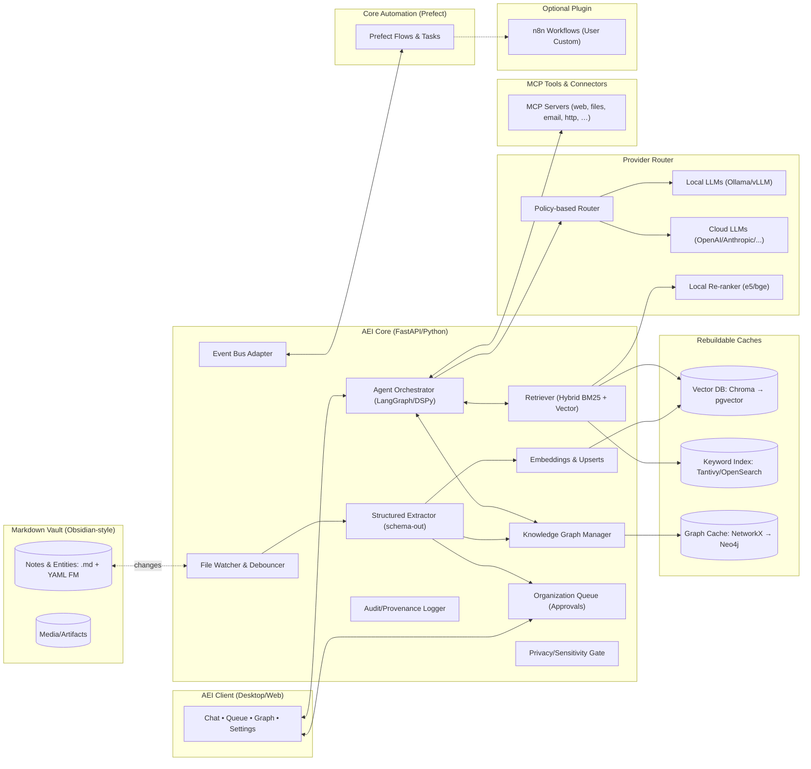

# 2BF AEI — Developer Architecture & Migration Plan (v1.0)

**Owner:** Derrick Parent (2ndBrainFound)  
**Audience:** Software developers, DevOps/SRE, solution architects  
**Purpose:** Provide a complete, build-ready reference for the 2BF AEI platform: box‑and‑arrows architecture, API/endpoint specs, data contracts, event taxonomy, deployment profiles, and a 5‑stage migration roadmap from MVP to Enterprise Hardening.

---

## 0. Guiding Principles
- **Local‑first source of truth:** Obsidian‑style Markdown vault (.md + YAML front matter). All other stores (vector, keyword, graph) are **rebuildable caches**.
- **Agentic by design:** Librarian, Researcher, QA, and Custom agents operate concurrently with deterministic policies and typed tool I/O.
- **Policy‑routed inference:** Local by default; cloud by exception (sensitivity gates, cost/latency heuristics).
- **Automation over inference:** Prefer deterministic Prefect/MCP tooling; use LLMs only where reasoning is needed. Optional n8n plugin for visual workflow customization.
- **Composable growth:** MVP monolith (A) that cleanly evolves to K8s microservices (C) and Graph‑primary mesh (D) without rewrites.

---

## 1. Box‑and‑Arrows Architecture



### 1.1 Component Responsibilities
- **AEI Client (Desktop/Web):** Conversation UI, Queue approvals with diffs, Graph view, Settings (model policy / privacy). WebSocket streaming.
- **File Watcher & Debouncer:** Monitors vault paths, batches rapid edits, emits normalized change events.
- **Structured Extractor:** Deterministic extraction of entities/relations/metadata to typed objects; never writes directly—proposes diffs to Queue.
- **Agent Orchestrator:** Runs named agents as deterministic graphs (LangGraph/DSPy). Manages tool calls, memory, and retries.
- **Retriever (Hybrid):** Keyword (BM25) + vector search + local re‑ranking for precision before LLM use.
- **Indexer:** Creates/updates embeddings; maintains per‑collection indices (notes, entities).
- **Knowledge Graph Manager:** Two‑way sync between markdown relations and graph cache; later promotes Neo4j to primary.
- **Organization Queue:** Human‑in‑the‑loop approval system for suggested changes; versioned diffs with confidence.
- **Policy Gate & Provider Router:** Enforces sensitivity; chooses local vs cloud models; rate‑limits; cost estimates.
- **Audit/Provenance:** Immutable, minimal logs linked to UIDs/paths and agent IDs; no secrets.
- **Event Bus Adapter:** Local in‑proc, NATS, or Kafka—same domain event schema across all stages.
- **MCP Tools:** Versioned capability modules (HTTP, web, files, email, calendar, Git, custom connectors).
- **Prefect (Core Automation):** Python-native workflow orchestration for lifecycle management, entity extraction, relationship updates. MVP uses APScheduler, production upgrades to Prefect.
- **n8n (Optional Plugin):** Visual workflow builder for user customization. Triggers webhook → Prefect flows for multi-SaaS integrations (Email, Slack, Calendar).

---

## 2. Data Contracts

### 2.1 Markdown Front Matter (canonical)
```yaml
uid: "ent_2025_0001"
type: person|org|project|note|concept|asset|task
title: "Example Entity"
sensitivity: public|internal|confidential|secret
cloud_ai_allowed: false
local_ai_allowed: true
lifecycle: draft|active|archived
provenance:
  source: "note://2025-11-11.md"
  created_at: 2025-11-11T16:00:00Z
  created_by: agent:librarian
relations:
  - type: authored_by
    to: "ent_2025_0007"
    confidence: 0.92
    source_uid: "note_2025_1111"
    ts: 2025-11-11T16:01:00Z
bmom:  # business/mission/operational metadata (freeform)
  tags: [ai, roadmap]
  owner: "derrick.parent"
```

### 2.2 Vector Index Schemas
- **notes**: `{ uid, path, fm:{type,sensitivity,tags…}, text, embedding, ts }`
- **entities**: `{ uid, kind, name, summary, embedding, ts }`

### 2.3 Graph (Neo4j later; cache now)
- Nodes:
  - `(:Entity {uid, kind, title, sensitivity})`
  - `(:Note {uid, path, ts})`
- Edges:
  - `(:Entity)-[:REL_TYPE {confidence, source_uid, ts}]->(:Entity|:Note)`

### 2.4 Event Taxonomy (domain events)
- `note.changed`, `index.upserted`, `entity.created`, `entity.updated`,
  `relation.proposed`, `relation.approved`, `relation.rejected`,
  `extraction.low_confidence`, `automation.trigger`, `alert.privacy_violation`

---

## 3. API / Endpoint Specs (AEI Core)

### 3.1 Auth & Transport
- **Local MVP:** no auth (loopback only). Optional API key for hub deployments.
- **Team/Enterprise:** JWT/OIDC (SSO), mTLS between services.
- **Streaming:** WebSocket for token streams and event notifications.

### 3.2 REST Endpoints

#### POST `/organize`
Runs Librarian pass on provided paths or full vault scan.
- **Body**
```json
{
  "paths": ["/Daily/2025-11-11.md"],
  "modes": ["entities","relations","filing"],
  "policy_hint": "local_only|hybrid|cloud_ok"
}
```
- **Response**
```json
{
  "suggestions": [
    {"id":"sug_001","type":"entity.create","target_uid":null,"diff":"...","confidence":0.91},
    {"id":"sug_002","type":"relation.add","target_uid":"ent_2025_0001","diff":"...","confidence":0.88}
  ]
}
```
- **Errors**: 400 invalid path; 429 busy; 500 internal.

#### GET `/queue`
Returns pending suggestions with diffs and context.
- **Query**: `status=pending|applied|rejected`, `limit`, `cursor`
- **Response**: array of suggestion summaries.

#### POST `/queue/{id}/apply`
Applies a suggestion; writes audit, updates indices.
- **Body**: `{ "force": false }`
- **Responses**: 200 applied; 409 conflict (file changed).

#### POST `/ask`
RAG chat/completion with policy routing; streams tokens via WS if `stream=true`.
- **Body**
```json
{
  "query": "What changed in Project X last week?",
  "top_k": 8,
  "policy_hint": "local_first",
  "agent": "researcher",
  "tools": ["web.search","calendar.get"]
}
```
- **Response**: `{ "answer": "...", "citations": [uid...], "usage": {"tokens":123} }`

#### GET `/graph/{uid}`
Returns entity or note with 1‑hop relations.
- **Response**
```json
{
  "node": {"uid":"ent_2025_0001","kind":"person",...},
  "edges": [
    {"type":"authored_by","to":"ent_2025_0007","confidence":0.92}
  ]
}
```

#### POST `/tools/{name}` (MCP proxy)
- **Body**: `{ "params": { ... }, "timeout_ms": 20000 }`
- **Response**: tool‑typed object; **Errors**: 408 tool timeout; 424 dependency failed.

#### GET `/audit`
- **Query**: `uid`, `since`, `limit`
- **Response**: chronological audit entries (time, agent, action, refs).

### 3.3 WebSocket Channels
- `ws://…/stream/chat` → token streams (server → client)
- `ws://…/events` → domain events (server → client)

---

## 4. Provider Routing (Policy Engine)
- **Inputs:** file sensitivity, user setting, model availability, latency budget, token budget, quality profile.
- **Rules:**
  1) If `sensitivity in {confidential, secret}` or `cloud_ai_allowed=false` → **local only**.
  2) Use local small models for classify/extract; escalate to larger local or cloud for complex reasoning.
  3) Always **rerank locally** before LLM to reduce tokens.
  4) Enforce **per‑call cost/latency caps**; fall back or truncate.
- **Outputs:** selected model, temperature, max tokens, tool grants, logging policy.

---

## 5. Observability & SRE
- **Metrics:** request latency, model latency, token usage, rerank hit rate, vector recall@k, queue age, automation success rate.
- **Logs:** structured JSON; redact secrets; include request IDs and UIDs.
- **Tracing:** OpenTelemetry spans for orchestrator → tools → provider.
- **Health:** `/healthz` (liveness), `/readyz` (readiness). Watcher emits heartbeat.

---

## 6. Security & Compliance
- **Secrets:** OS keychain (MVP) → Vault (enterprise). Short‑lived tokens for tools.
- **PII:** redact in logs; store references/hashes when possible.
- **Provenance:** immutable audit; diff snapshots for applied changes.
- **Modes:** Air‑gap mode (no egress); Residency pinning (restrict endpoints/regions).

---

## 7. Deployment Profiles

### 7.1 Profile A — Solo / Small Team (MVP)
- **Runtime:** Desktop (Electron/Tauri) + AEI Core (FastAPI) local.
- **Stores:** Chroma (embedded), Tantivy (embedded), NetworkX (in‑proc).
- **LLM:** Ollama; optional cloud via Router.
- **Automation:** APScheduler (embedded) for core workflows. Optional Prefect server for observability. Optional n8n plugin for user customization.
- **Events:** in‑proc or single‑node NATS.

### 7.2 Profile A+ — Team Hub (3–20 users)
- **Hub VM:** AEI Core, Postgres/pgvector, OpenSearch, single‑node NATS.
- **Automation:** Prefect server (shared workflow orchestration). Optional n8n instance (team workflows).
- **Sync:** Git/Obsidian Sync/rsync; hub rebuilds indices and offers shared RAG/graph.
- **Privacy:** agents may run local; hub provides shared automations and MCP.

### 7.3 Profile C/D — Enterprise
- **K8s:** microservices split; Ray/vLLM for GPU inference; Kafka/NATS; OTel; SSO.
- **Graph:** Neo4j as **primary**; markdown relations sync both ways.
- **Policy:** org‑wide routing, cost guardrails, tenancy controls.

---

## 8. Testing Strategy
- **Contract tests** for endpoints & events; **golden files** for extractors.
- **Determinism tests** for agent graphs (same inputs → same outputs within tolerance).
- **Index rebuild tests** (delete caches → full rebuild).
- **Policy tests** (matrix of sensitivity × provider availability × budgets).
- **Load tests** on retriever and queue; chaos tests on watcher.

---

## 9. 5‑Stage Migration Roadmap (with requirements & risks)

### Stage 1 — **MVP (Profile A)**
**Scope**
- AEI Core monolith (FastAPI) with Watcher, Extractor, Orchestrator, RAG, Indexer, Queue, Policy, Audit.
- Local caches: Chroma + Tantivy + NetworkX.
- Provider Router to Ollama; optional cloud keys in settings.
- Core automation with APScheduler (embedded); optional Prefect upgrade. Optional n8n plugin for user workflows.
- MCP basic toolset (web.search, http.get, files.read/write).

**Requirements**
- Deterministic extractor schemas; front matter contracts enforced.
- Queue with diff preview & undo; audit logging MVP.
- WS streaming; `/organize`, `/queue`, `/ask`, `/graph`, `/tools`, `/audit` implemented.

**Acceptance Criteria**
- Fresh clone → run installer → organize sample vault → apply suggestions → ask questions with citations.

**Risks & Concerns**
- Model drift across user hardware; embedding mismatch if model swapped.
- Large vaults may cause initial indexing lag (add progress UI & debouncing).

---

### Stage 2 — **Team Hub (Profile A+)**
**Scope**
- Stand up shared Hub VM with Postgres/pgvector, OpenSearch, NATS.
- Prefect server for shared workflow orchestration. Optional shared n8n instance for team workflows.
- AEI Core can point to hub stores; local nodes still operate offline.
- Vault sync strategy (Git/Obsidian Sync); conflict resolution policy.

**Requirements**
- Indexer supports remote pgvector/OpenSearch; incremental sync from local changes.
- Event Bus Adapter supports NATS; domain events published/consumed.
- Basic auth (API key) for hub APIs.

**Acceptance Criteria**
- Multiple users see improved retrieval from shared indices; hub automations run on events.

**Risks & Concerns**
- Merge conflicts on vaults; require clear conventions (naming, UID generation).
- Hub as single point of failure (take regular snapshots; scripted restore).

---

### Stage 3 — **Service Split (toward C)**
**Scope**
- Carve monolith into modules: `watcher`, `extractor`, `indexer`, `retriever`, `agent-orchestrator`, `policy`, `audit`, `mcp-adapter`, `events-gateway`.
- Containerize; deploy to K8s (or docker‑compose initially). Introduce **Ray** for agent concurrency; optional **vLLM** for on‑cluster models.

**Requirements**
- Stable gRPC/HTTP contracts between services; shared proto/JSON schemas.
- Centralized tracing (OTel), metrics, and distributed logging.
- Blue/green deployment playbooks; feature flags for fallbacks to monolith.

**Acceptance Criteria**
- Load test shows linear scaling of `retriever/indexer` with worker replicas.
- Failure of any single microservice degrades gracefully, not catastrophically.

**Risks & Concerns**
- Over‑fragmentation; latency inflation from chatty services (mitigate with NATS/Kafka patterns and server‑side batching).
- CI/CD complexity; require deployment gates and smoke tests.

---

### Stage 4 — **Graph Elevation (toward D)**
**Scope**
- Stand up **Neo4j**; migrate relations from markdown to graph; make graph **primary** for relationships while maintaining markdown sync for portability.
- Agents read/write graph first; retriever integrates graph traversal features.

**Requirements**
- Idempotent sync jobs; conflict rules when markdown and graph disagree.
- Cypher query library; RBAC rules on node/edge types; provenance preservation.
- Explainability surfaces in UI (why/how a relation exists).

**Acceptance Criteria**
- End‑to‑end flows rely on graph edges; audits reference graph changes; retrieval quality improves via graph‑aware prompts.

**Risks & Concerns**
- Modeling errors have systemic effects; require migration dry‑runs and backfills.
- Query hot‑spots; add indexes and caching for frequent traversals.

---

### Stage 5 — **Enterprise Hardening (C + D)**
**Scope**
- Full K8s deployment with autoscaling; GPU pools for vLLM/Triton; Kafka backbone; SSO/OIDC; policy management; per‑tenant isolation; DR.
- Compliance toolchain (audit exports, data residency, key management, eDiscovery endpoints).

**Requirements**
- mTLS between services; secret rotation; HSM/KMS integration.
- Multi‑region backups & restore drills; RPO/RTO objectives documented.
- FinOps dashboards (token spend, GPU utilization, cache hit‑rates); cost guardrails enforced at policy engine.

**Acceptance Criteria**
- SLA/SLOs met under load; failover exercises pass; auditors can trace provenance end‑to‑end.

**Risks & Concerns**
- Vendor lock‑in (mitigate via LiteLLM/OpenRouter abstraction, pluggable stores).
- Cost spikes from unbounded inference (mitigate via semantic caching, local rerankers, policy budgets).

---

## 10. RACI & Skills Matrix
- **Architecture & Policy:** CTO/Lead Architect (R)
- **Backend/API/Agents:** Python Lead + 2 Devs (R)
- **Indexing/RAG:** ML Engineer (R)
- **Graph Modeling:** Data Engineer (R), Architect (A)
- **DevOps/SRE:** 1 DevOps (R), Architect (A)
- **Security/Compliance:** SecEng (R), CTO (A)

---

## 11. KPIs & Milestones
- **MVP:** TTM ≤ 8 weeks; >90% deterministic extractor tests; queue approval latency < 200 ms.
- **A+:** shared RAG improvement +20% MRR@5 with hub; recovery from snapshot ≤ 15 min.
- **Service Split:** p95 retrieval latency ≤ 250 ms at 10x traffic.
- **Graph Elevation:** top‑k answer precision +15%; explainability coverage ≥ 80% changes.
- **Enterprise:** 99.9% uptime; DR drill pass; cost per active user within target.

---

## 12. Open Questions / Potential Concerns
- **Vault sync semantics:** definitive strategy for conflict resolution & UID generation at scale.
- **PII redaction pipeline:** automatic masking before indexing; policy exemptions.
- **Model standardization:** embedding model/version pinning to avoid drift.
- **Air‑gap packaging:** artifact pipeline for offline installs; update channels.
- **Multi‑tenancy boundaries:** shared vs per‑tenant graph/vector stores.

---

### Appendix A — Example Tool Contract (MCP)
```json
{
  "name": "web.search",
  "input": {"q":"string", "site":"string?", "top_k":"number?"},
  "output": {"results":[{"title":"string","url":"string","snippet":"string"}]},
  "errors": ["TIMEOUT","RATE_LIMIT","NO_RESULTS"]
}
```

### Appendix B — Error Codes (API)
- `AEI-001 INVALID_PATH`, `AEI-004 POLICY_BLOCKED`, `AEI-007 TOOL_TIMEOUT`, `AEI-009 CONFLICT`, `AEI-013 PROVIDER_UNAVAILABLE`.

### Appendix C — Example Rollback
- On failed apply: revert diff; re‑index affected files; write compensating audit entry with link to prior snapshot.

