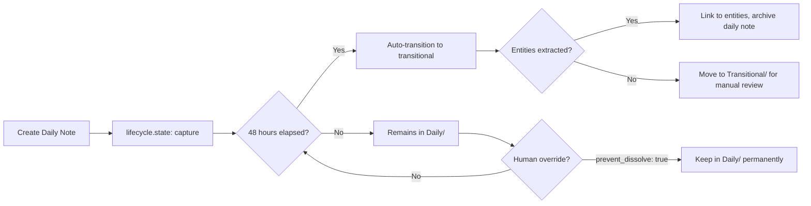

# Second Brain Foundation - Enhanced Architecture (v2.0)

**Version:** 2.0 (Graph-Based Architecture Integrated)  
**Date:** November 2, 2025  
**Status:** Active - Ready for Implementation  

---

## Executive Summary

This document represents the **merged architecture** combining the original Second Brain Foundation specifications with the graph-based Markdown knowledge architecture enhancements. It maintains backward compatibility while significantly expanding capabilities for semantic organization, typed relationships, and ontology-driven knowledge management.

### What Changed

| Aspect | v1.0 (Original) | v2.0 (Enhanced) | Impact |
|--------|-----------------|-----------------|---------|
| **Entity Types** | 4 core types | 10 types (4 core + 6 extended) | 🟢 Additive |
| **Relationships** | Simple UID arrays | Typed semantic edges | 🟡 Enhanced |
| **Metadata Fields** | 10 core fields | 20+ universal parameters | 🟡 Expanded |
| **Privacy Model** | Basic sensitivity levels | Granular permission objects | 🟢 Enhanced |
| **Provenance** | Basic citations | Full audit trail with confidence | 🟢 New |
| **Folder Structure** | 6 core folders | 6 core + 5 extended (optional) | 🟢 Additive |
| **BMOM Framework** | Not present | Full framework integrated | 🟢 New |
| **Tool Compatibility** | Implicit | Explicit compatibility markers | 🟢 New |

**Backward Compatibility:** ✅ **100% Compatible** - All v1.0 vaults work unchanged

---

## Core Philosophy

### 1. Progressive Organization (Unchanged)
48-hour lifecycle from capture → transitional → permanent remains foundational.

### 2. Context-Aware Privacy (Enhanced)
```yaml
# v1.0 (Still Supported)
sensitivity: personal

# v2.0 (Enhanced)
sensitivity:
  level: personal
  privacy:
    cloud_ai_allowed: false
    local_ai_allowed: true
    export_allowed: true
```

### 3. Graph-Based Knowledge (New)
Entities now form a typed semantic graph with relationship semantics:
```yaml
rel:
  - [informs, project-uid-123]      # This topic informs that project
  - [uses, process-uid-456]          # This uses that process
  - [authored_by, person-uid-789]    # Authored by that person
```

### 4. Human Override Supremacy (New)
```yaml
override:
  human_last: 2025-11-02T10:30:00Z  # Last human decision timestamp
  prevent_dissolve: true             # Override 48h lifecycle
```

---

## Entity Type System

### Core Entities (MVP - Always Available)

| Type | UID Pattern | Primary Use | Lifecycle Default |
|------|-------------|-------------|-------------------|
| **topic** | `topic-{slug}-{counter}` | Conceptual knowledge | permanent |
| **project** | `project-{slug}-{counter}` | Goal-driven work | permanent |
| **person** | `person-{slug}-{counter}` | Human actors | permanent |
| **place** | `place-{slug}-{counter}` | Locations (physical/virtual/conceptual) | permanent |
| **daily-note** | `daily-{YYYY-MM-DD}` | Zero-decision capture | capture (dissolves 48h) |

### Extended Entities (Phase 1.5+ - Opt-In)

| Type | UID Pattern | Primary Use | Lifecycle Default |
|------|-------------|-------------|-------------------|
| **source** | `source-{slug}-{counter}` | Research, articles, papers | permanent |
| **artifact** | `artifact-{slug}-{counter}` | Produced materials | permanent |
| **event** | `event-{slug}-{counter}` | Temporal activities | permanent |
| **task** | `task-{slug}-{counter}` | Actionable items | permanent |
| **process** | `process-{slug}-{counter}` | Workflows, SOPs | permanent |

---

## Universal Parameters

All entities share these fields:

### Identity
```yaml
uid: topic-machine-learning-042
type: topic
title: "Machine Learning Fundamentals"
aliases: [ML, ML Basics]
```

### Temporal Metadata
```yaml
created: 2025-11-02T08:00:00Z
updated: 2025-11-02T10:30:00Z
lifecycle:
  state: permanent  # capture | transitional | permanent | archived
  review_at: 2026-02-02T00:00:00Z
```

### Privacy & Sensitivity
```yaml
sensitivity:
  level: personal  # public | personal | confidential | secret
  privacy:
    cloud_ai_allowed: false
    local_ai_allowed: true
    export_allowed: true
```

### Relationships (Typed Graph)
```yaml
rel:
  - [informs, project-ai-research-001]
  - [related_to, topic-neural-networks-012]
  - [uses, process-literature-review-003]
```

### Provenance & Quality
```yaml
provenance:
  sources: [source-dl-book-2016-001]
  confidence: 1.0  # 0.0-1.0 (1.0 = human-created, <1.0 = AI-extracted)
checksum: "a1b2c3d4..."  # SHA-256 for integrity
override:
  human_last: 2025-11-02T10:30:00Z
```

### Status & Priority
```yaml
status: active  # Entity-specific (active, completed, archived, etc.)
importance: 4  # 1-5 priority score
owner: "Your Name"
stakeholders: [person-john-smith-001]
```

### BMOM Framework (Because-Meaning-Outcome-Measure)
```yaml
bmom:
  because: "Why this entity matters"
  meaning: "What it represents in your knowledge system"
  outcome: "Expected result or capability"
  measure: "Success criteria or metrics"
```

### Tool Compatibility
```yaml
tool:
  compat: [obsidian, notebooklm, anythingllm]
tags: [ai, learning, research]
```

---

## Relationship Type Vocabulary

### Standard Semantic Edges

#### Knowledge Relationships
- `informs` - Concept → Project (knowledge informs execution)
- `related_to` - General association
- `specializes` - Narrower concept
- `generalizes` - Broader concept

#### Structural Relationships
- `part_of` - Component → Whole
- `subproject_of` - Child → Parent project
- `depends_on` - Dependency chain

#### Action Relationships
- `uses` - Process → Artifact/Tool
- `produces` - Process → Output
- `authored_by` - Artifact → Person
- `cites` - Artifact → Source

#### Spatial/Temporal Relationships
- `occurs_at` - Event/Project → Place
- `mentioned_in` - Entity → Daily Note
- `collaborates_with` - Person → Person

#### Status Relationships
- `blocks` - Task → Task (blocker)
- `precedes` - Sequential ordering
- `duplicates` - Duplicate detection

**Extensible:** Projects can define custom relationship types as needed.

---

## Folder Structure

### Core Folders (Always Created)
```
your-vault/
├── Daily/              # Date-anchored capture (YYYY-MM-DD.md)
├── People/             # Person entities
├── Places/             # Location entities
├── Topics/             # Conceptual knowledge
├── Projects/           # Goal-driven work
└── Transitional/       # Notes awaiting entity assignment
```

### Extended Folders (Optional - Standard/Full Templates)
```
your-vault/
├── Sources/            # Research materials
├── Artifacts/          # Produced documents/designs
├── Events/             # Meetings, sessions, milestones
├── Tasks/              # Actionable items
└── Processes/          # Workflows and SOPs
```

### Supporting Files
```
your-vault/
├── .sbf-tracking/      # Change detection metadata
│   └── hashes.json     # File integrity database
└── README.md           # Vault documentation
```

---

## 48-Hour Lifecycle (Enhanced)

### Daily Note Flow


### Lifecycle States

| State | Description | Typical Duration | Next State |
|-------|-------------|------------------|------------|
| **capture** | Initial raw capture | 0-48 hours | transitional or dissolved |
| **transitional** | Awaiting entity classification | Variable | permanent or archived |
| **permanent** | Structured entity | Indefinite | archived |
| **archived** | Historical record | Indefinite | N/A |

### Override Mechanism
```yaml
lifecycle:
  state: capture
  dissolve_at: 2025-11-04T08:00:00Z
override:
  prevent_dissolve: true  # Human says "keep this as-is"
  human_last: 2025-11-03T15:30:00Z
```

---

## Privacy Model (Enhanced)

### Sensitivity Levels

| Level | Definition | Default Permissions | Use Cases |
|-------|------------|---------------------|-----------|
| **public** | Safe for cloud indexing | ✅ Cloud AI / ✅ Local AI / ✅ Export | Published research, public profiles |
| **personal** | Private workspace | ❌ Cloud AI / ✅ Local AI / ✅ Export | Daily notes, personal thoughts |
| **confidential** | Sensitive internal | ❌ Cloud AI / ✅ Local AI / ⚠️ Limited Export | Work projects, client data |
| **secret** | Highly restricted | ❌ Cloud AI / ❌ Local AI / ❌ Export | Financial, medical, legal |

### Permission Granularity
```yaml
sensitivity:
  level: confidential
  privacy:
    cloud_ai_allowed: false      # No OpenAI/Anthropic
    local_ai_allowed: true       # OK for Ollama/LMStudio
    export_allowed: false        # No export to NotebookLM
    
    # Optional: Fine-grained controls (Phase 2)
    allowed_models: [llama3, mistral]
    excluded_operations: [embedding, summarization]
    audit_all_access: true
```

---

## Implementation Phases

### Phase 1: MVP (Core Architecture)
**Status:** Specified, Ready for Implementation  
**Timeline:** 4-6 weeks  

**Scope:**
- ✅ 5 core entity types
- ✅ Universal parameters (basic set)
- ✅ Simple folder structure (6 core folders)
- ✅ Typed relationships
- ✅ 48-hour lifecycle
- ✅ Context-aware privacy
- ✅ CLI tools (init, validate, uid, check, status)

**Deliverables:**
- Working CLI (`@second-brain-foundation/cli`)
- 5 core entity templates
- Example vaults (minimal, standard, full)
- Comprehensive documentation

### Phase 1.5: Extended Architecture
**Status:** Specified, Not Started  
**Timeline:** 2-3 weeks (post-MVP)  

**Scope:**
- 🔄 5 extended entity types
- 🔄 Extended folder structure (optional)
- 🔄 Enhanced metadata (BMOM, provenance)
- 🔄 Checksum integrity checking
- 🔄 Human override mechanisms

**Deliverables:**
- Extended entity templates
- Migration guide (v1.0 → v2.0)
- Enhanced CLI validation

### Phase 2: AI-Enabled Interface (AEI)
**Status:** Planned  
**Timeline:** 3-4 months  

**Scope:**
- 🔮 Automated entity extraction
- 🔮 Relationship detection
- 🔮 Confidence scoring
- 🔮 Graph visualization
- 🔮 AEI session logging
- 🔮 Local + Cloud AI integration

---

## Migration Path

### From v1.0 to v2.0

**Zero Migration Required:** All v1.0 vaults work unchanged in v2.0.

**Optional Enhancements:**

1. **Add BMOM Framework:**
```yaml
# Add to existing entities
bmom:
  because: "Why this matters"
  meaning: "What it represents"
  outcome: "Expected result"
  measure: "Success criteria"
```

2. **Upgrade Privacy Model:**
```yaml
# Old (still works)
sensitivity: personal

# New (enhanced)
sensitivity:
  level: personal
  privacy:
    cloud_ai_allowed: false
    local_ai_allowed: true
    export_allowed: true
```

3. **Add Typed Relationships:**
```yaml
# Old (still works)
relationships:
  - uid: project-uid-123
    type: related

# New (semantic)
rel:
  - [informs, project-uid-123]
```

4. **Enable Extended Entities:**
- Run `sbf init --extend` to add Sources/, Artifacts/, etc.
- Start using new entity templates as needed

---

## Tool Compatibility

### Obsidian
- ✅ Full wikilink support
- ✅ Dataview queries on all metadata
- ✅ Graph view shows typed relationships
- ✅ Templates via Templater
- ✅ Privacy-aware canvas integration

### NotebookLM
- ✅ Frontmatter preserved during ingestion
- ✅ Citation tracking via `provenance.sources`
- ✅ Sensitivity filtering (only upload `public` entities)
- ✅ Source grounding enhanced by semantic graph

### AnythingLLM
- ✅ Markdown parsing compatible
- ✅ Embedding generation respects `privacy.export_allowed`
- ✅ Relationship graph enhances RAG context
- ✅ Local AI integration via Ollama

---

## Best Practices

### 1. Start Simple, Grow Gradually
- Begin with 4-5 core entity types
- Add extended types as needs emerge
- Don't over-structure upfront

### 2. Let Relationships Emerge
- Start with wikilinks `[[Person Name]]`
- Formalize into typed relationships when patterns clear
- Use `related_to` for unclear relationships

### 3. Respect Privacy Boundaries
- Default to `personal` sensitivity
- Explicitly mark `public` entities
- Use `confidential` for work/client data
- Reserve `secret` for truly sensitive info

### 4. Use BMOM for Clarity
- **Because:** Forces articulation of purpose
- **Meaning:** Clarifies significance
- **Outcome:** Defines success
- **Measure:** Enables evaluation

### 5. Trust Human Override
- AI suggestions are helpers, not dictators
- `override.human_last` always wins
- Review AI extractions before finalizing
- Use `prevent_dissolve` to keep important daily notes

### 6. Maintain Integrity
- Run `sbf check` periodically
- Review `checksum` mismatches
- Update `override.human_last` after manual edits
- Keep vault under version control (git)

---

## Metrics & Governance

### Health Metrics
```yaml
# Track in .sbf-tracking/metrics.json
graph_health:
  total_nodes: 250
  total_edges: 487
  orphan_count: 3  # Entities with no relationships
  node_degree_avg: 1.95
  reciprocity_ratio: 0.87  # Bidirectional links
  
sensitivity_distribution:
  public: 45
  personal: 180
  confidential: 20
  secret: 5
  
lifecycle_distribution:
  capture: 7  # Daily notes < 48h
  transitional: 3
  permanent: 235
  archived: 5
  
staleness:
  not_reviewed_90d: 12
  not_updated_180d: 8
```

### Audit Trail
```yaml
# Every AI action logged
aei_sessions:
  - session_id: aei-2025-11-02-001
    timestamp: 2025-11-02T10:30:00Z
    action: entity_extraction
    source: daily-2025-11-02
    extracted: [person-john-001, project-coffee-042]
    confidence: 0.92
    human_reviewed: true
    human_approved: true
```

---

## Summary

**v2.0 Enhanced Architecture** provides:

✅ **Backward compatibility** with v1.0 vaults  
✅ **10 entity types** (4 core + 6 extended)  
✅ **Typed semantic relationships** for graph-based knowledge  
✅ **Universal parameters** supporting provenance, BMOM, integrity  
✅ **Enhanced privacy model** with granular permissions  
✅ **Human override supremacy** via checksum + timestamps  
✅ **Tool compatibility markers** for Obsidian, NotebookLM, AnythingLLM  
✅ **Clear migration path** from simple to sophisticated  

**Ready for:** CLI implementation, template creation, MVP release

---

**Version:** 2.0  
**Date:** November 2, 2025  
**Authors:** John (PM), Winston (Architect), Mary (Analyst)  
**Status:** 🟢 Active - Ready for Implementation
