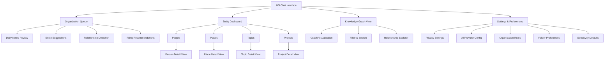
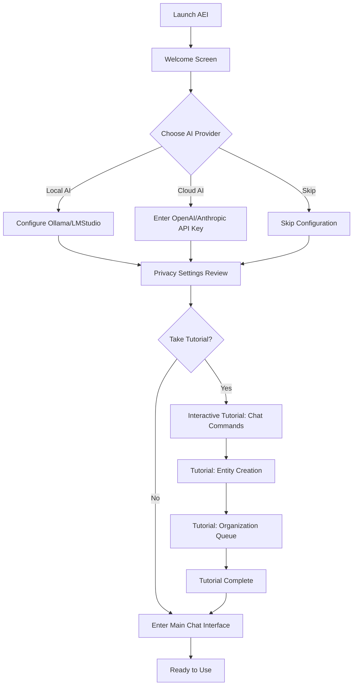
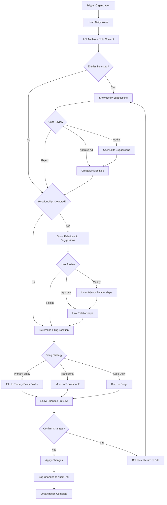
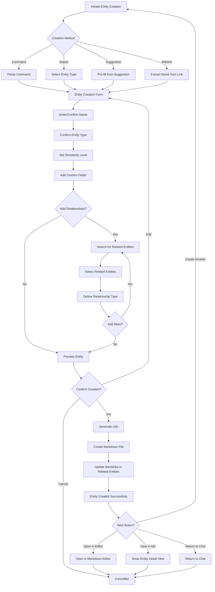
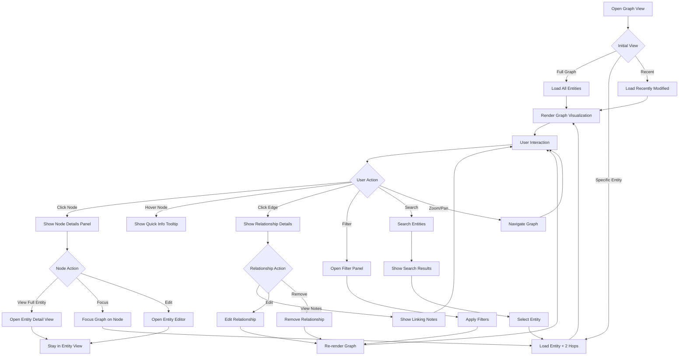

# Second Brain Foundation UI/UX Specification

**Version:** 1.0  
**Date:** November 2, 2025  
**Status:** Draft  
**UX Expert:** Sally  

---

## Introduction

This document defines the user experience goals, information architecture, user flows, and visual design specifications for Second Brain Foundation's future AI-Enabled Interface (AEI). It serves as the foundation for visual design and frontend development, ensuring a cohesive and user-centered experience.

**Note:** Second Brain Foundation's MVP is a specifications-focused framework without a dedicated UI. This specification focuses on the **Phase 2 AEI** (AI-Enabled Interface) that will provide chat-based organization assistance, entity management, and knowledge graph visualization.

### Overall UX Goals & Principles

#### Target User Personas

**Primary Persona: Technical Knowledge Worker "Alex"**
- **Age:** 28-45
- **Occupation:** Software developer, researcher, consultant, product manager
- **Technical Level:** Advanced (comfortable with markdown, command-line, git)
- **Current Workflow:** Uses Obsidian or Logseq manually, experiments with AI tools, values privacy
- **Pain Points:**
  - Manual organization is tedious and time-consuming
  - AI tools require sharing data with cloud providers
  - Multi-tool workflows are hacky and fragmented
- **Goals:**
  - Automate organization without losing control
  - Use AI locally for sensitive data
  - Maintain portability across tools
- **Expectations:**
  - Keyboard-driven interface
  - Technical precision over handholding
  - Transparency in AI operations

**Secondary Persona: Privacy-Conscious Researcher "Jordan"**
- **Age:** 30-55
- **Occupation:** Academic researcher, journalist, consultant with confidential data
- **Technical Level:** Intermediate (comfortable with apps, basic markdown)
- **Current Workflow:** Uses multiple tools, avoids cloud AI for sensitive work, manually organizes
- **Pain Points:**
  - Can't use AI tools due to data sensitivity
  - Spending too much time organizing instead of researching
  - Fear of vendor lock-in with proprietary tools
- **Goals:**
  - Leverage AI without compromising data sovereignty
  - Granular control over what data AI can access
  - Long-term data portability
- **Expectations:**
  - Clear privacy indicators and controls
  - Local AI as primary option
  - Audit trail of AI operations

**Tertiary Persona: PKM Enthusiast "Taylor"**
- **Age:** 22-40
- **Occupation:** Creator, writer, entrepreneur, lifelong learner
- **Technical Level:** Intermediate (uses apps, learning markdown)
- **Current Workflow:** Experiments with many PKM tools, follows productivity YouTubers
- **Pain Points:**
  - Tool overwhelm - too many options
  - Organization methods feel rigid
  - Missing connections between ideas
- **Goals:**
  - Simple capture without organizational burden
  - Discover unexpected connections
  - Progressive organization that adapts
- **Expectations:**
  - Gentle learning curve
  - Beautiful, inspiring interface
  - Clear guidance without condescension

#### Usability Goals

1. **Ease of Learning:** Technical users can start using AEI chat interface within 2 minutes; entity creation within 5 minutes
2. **Efficiency of Use:** Power users can execute common commands (organize, search, file) with <3 keystrokes or 1-2 word natural language
3. **Error Prevention:** Clear confirmation for destructive operations; undo available for all AI modifications; preview before applying changes
4. **Memorability:** Command syntax follows familiar patterns (BMAD-style `*commands`); visual consistency aids recall
5. **Satisfaction:** Progressive organization feels magical, not mechanical; users trust AI suggestions through transparency

#### Design Principles

1. **Transparency Over Magic** - Users always understand what AI is doing and why. Every automated operation is explainable and auditable.

2. **Progressive Disclosure** - Start with simple chat interface; reveal advanced features (entity dashboard, graph view) as users engage. Don't overwhelm on first use.

3. **Privacy First, Always** - Sensitivity indicators are prominently displayed. Users know at a glance what data AI can access. Privacy controls are never buried.

4. **Tool-Agnostic Philosophy** - Interface complements existing tools rather than replacing them. Markdown files remain the source of truth. AEI is a helpful layer, not a requirement.

5. **Conversational, Not Robotic** - AI interaction feels natural and collaborative. Suggestions are helpful, not prescriptive. Users feel in control, not managed.

6. **Developer Aesthetic** - Clean, minimal, terminal-inspired design. Dark mode primary. Monospaced fonts. Trust through technical precision.

### Change Log

| Date | Version | Description | Author |
|------|---------|-------------|--------|
| 2025-11-02 | 1.0 | Initial UI/UX specification for AEI Phase 2 | Sally (UX Expert) |

---

## Information Architecture (IA)

### Site Map / Screen Inventory

### Navigation Structure

**Primary Navigation (Persistent Left Sidebar):**
- **Chat** (💬) - Main AEI chat interface (default view, keyboard: `Cmd/Ctrl + 1`)
- **Queue** (📋) - Organization queue and pending suggestions (keyboard: `Cmd/Ctrl + 2`)
- **Entities** (🔗) - Entity dashboard and management (keyboard: `Cmd/Ctrl + 3`)
- **Graph** (🕸️) - Knowledge graph visualization (keyboard: `Cmd/Ctrl + 4`)
- **Settings** (⚙️) - Preferences and configuration (keyboard: `Cmd/Ctrl + ,`)

**Contextual Navigation:**
- Entity detail views show related entities and recent notes
- Graph view allows navigation by clicking nodes
- Queue items link to source notes and target entities

**Breadcrumb Strategy:**
- Not needed for primary views (flat hierarchy)
- Used in entity detail views: `Entities > People > John Smith`
- Used in settings: `Settings > Privacy Settings > Sensitivity Rules`

---

## User Flows

### Flow 1: First-Time Setup and Onboarding

**User Goal:** Configure AEI for first use, understand core concepts, start organizing

**Entry Points:** 
- First launch after installation
- Settings > Getting Started

**Success Criteria:**
- User configures AI provider (local or cloud)
- User understands sensitivity levels
- User completes first organization with AEI assistance

#### Flow Diagram

#### Edge Cases & Error Handling

- **API Key Invalid:** Clear error message with link to provider documentation; option to use local AI instead
- **Local AI Not Found:** Helpful guide to install Ollama; option to proceed with cloud AI
- **Skip All Setup:** Show minimal chat interface; prompt to configure when attempting first AI operation
- **Tutorial Interrupted:** Save progress; option to resume or restart tutorial later

**Notes:** Onboarding should be skippable for technical users. Default to local AI if available. Privacy review is non-skippable (core principle).

---

### Flow 2: Daily Note Organization

**User Goal:** Process daily notes, extract entities, file appropriately

**Entry Points:**
- AEI chat: `*organize` command
- Organization queue: "Review Daily Notes" button
- Automatic: Triggered after 48 hours (user can configure)

**Success Criteria:**
- Entities extracted and suggested
- Relationships detected and proposed
- User reviews and approves filing
- Daily note summarized and linked to entities

#### Flow Diagram

#### Edge Cases & Error Handling

- **No Entities Found:** Ask user if this is expected; option to manually create entity or leave in Daily/
- **Conflicting Entities:** Show similar entities, ask user to merge or create new with disambiguation
- **Low Confidence:** Mark suggestions with confidence score; suggest user review before accepting
- **File Conflict:** Detect if target filename exists; offer auto-rename or merge options
- **Interrupted Process:** Save progress; allow resume from last confirmed step

**Notes:** Users can adjust confidence thresholds in settings. All automated changes are preview-able before applying. Undo is always available immediately after operation.

---

### Flow 3: Entity Creation and Management

**User Goal:** Create or edit entity (Person, Place, Topic, Project), establish relationships

**Entry Points:**
- AEI chat: `*entity create person "John Smith"`
- Entity Dashboard: "New Entity" button
- Suggestion: Accept entity from organization queue
- Wikilink: Create entity from `[[Non-Existent Link]]`

**Success Criteria:**
- Entity created with proper UID
- Frontmatter populated (type, dates, sensitivity)
- Relationships established
- File saved to appropriate folder

#### Flow Diagram

#### Edge Cases & Error Handling

- **Duplicate Entity Detected:** Show existing entities with similar names; option to view, merge, or create with disambiguation
- **Invalid Characters in Name:** Auto-sanitize for filename; show user the resulting filename slug
- **Relationship Cycle Detected:** Warn user; allow creation but flag for review
- **Missing Required Fields:** Highlight missing fields; prevent creation until complete
- **File Write Error:** Show error; offer retry, save as different name, or copy to clipboard

**Notes:** Entity type determines available relationship types. Sensitivity inherits from parent if created from suggestion. Custom templates can be defined in settings.

---

### Flow 4: Knowledge Graph Exploration

**User Goal:** Visualize entity relationships, discover connections, navigate knowledge base

**Entry Points:**
- Navigation: Click "Graph" in sidebar
- Entity Detail: Click "Show in Graph" button
- AEI chat: `*graph` or `*show graph for [entity]`

**Success Criteria:**
- Graph displays entities as nodes, relationships as edges
- User can filter by entity type, sensitivity, date range
- User can click nodes to view details or navigate
- User discovers unexpected connections

#### Flow Diagram

#### Edge Cases & Error Handling

- **Large Graph (1000+ Nodes):** Warn user; offer to filter or focus; lazy-load off-screen nodes
- **Disconnected Entities:** Show option to hide orphaned nodes or view them separately
- **Circular References:** Visually indicate cycles; don't infinitely recurse
- **Graph Layout Collision:** Offer multiple layout algorithms (force-directed, hierarchical, circular)
- **Performance Issues:** Simplify rendering; reduce detail level; offer static snapshot export

**Notes:** Graph is real-time - updates as entities change. Users can save "views" with specific filters. Export options include PNG, SVG, and JSON for external tools.

---

## Wireframes & Mockups

**Primary Design Files:** Will be created in Figma once specification is approved. For now, conceptual layouts described below.

### Key Screen Layouts

#### Screen 1: AEI Chat Interface (Primary View)

**Purpose:** Main interaction point for users to communicate with AEI, execute commands, and receive assistance.

**Key Elements:**
- **Chat Input (Bottom):** Command-line style input with syntax highlighting for `*commands`, autocomplete for entity names in `[[brackets]]`
- **Message History (Center):** Scrollable conversation with user messages (right-aligned) and AEI responses (left-aligned)
- **Suggested Actions (Contextual):** Chips/buttons for common follow-up actions (e.g., "Create Entity", "Apply Changes", "View in Graph")
- **Processing Indicator:** When AEI is working (analyzing notes, etc.), show subtle animated indicator
- **Privacy Indicator (Top Right):** Icon showing current AI provider (local/cloud) and sensitivity context
- **Sidebar (Left):** Persistent navigation to Queue, Entities, Graph, Settings

**Interaction Notes:**
- Enter sends message; Shift+Enter for line break
- Up arrow recalls previous commands (shell-like)
- Tab autocompletes entity names and commands
- Cmd/Ctrl+K opens command palette
- Messages support markdown rendering for formatting

**Design File Reference:** `figma.com/file/sbf-aei/chat-interface` (placeholder)

---

#### Screen 2: Organization Queue

**Purpose:** Review pending organization tasks, approve/reject AEI suggestions, batch process daily notes.

**Key Elements:**
- **Queue List (Left Panel):** List of items awaiting user review, grouped by type (Entities, Relationships, Filing)
- **Detail Panel (Right):** Selected item details with before/after preview
- **Batch Actions (Top):** "Approve All", "Reject All", "Process Selected" buttons
- **Confidence Indicator:** Visual indicator (color, icon) for AEI confidence level
- **Filter/Sort Controls:** Filter by type, confidence, date; sort by priority
- **Preview Changes:** Diff view showing what will change in markdown files

**Interaction Notes:**
- Click item in list to view details
- Keyboard shortcuts: Space = Preview, Enter = Approve, Delete = Reject
- Drag items to reorder priority
- Right-click for context menu (Edit, Skip, Set Confidence Threshold)

**Design File Reference:** `figma.com/file/sbf-aei/organization-queue` (placeholder)

---

#### Screen 3: Entity Dashboard

**Purpose:** Browse, search, and manage entities across all types (People, Places, Topics, Projects).

**Key Elements:**
- **Entity Type Tabs (Top):** Tabs for People, Places, Topics, Projects, All
- **Entity Grid/List (Center):** Cards or rows showing entities with preview (name, description, relationship count, last modified)
- **Search/Filter Bar (Top Right):** Full-text search with advanced filters (sensitivity, tags, date range)
- **Quick Actions:** Hover over entity card to reveal actions (Open, Edit, Show in Graph, Archive)
- **New Entity Button (Floating):** Prominent button to create new entity
- **Sorting Controls:** Sort by name, last modified, relationship count, creation date

**Interaction Notes:**
- Click entity card to open detail view
- Double-click to open in markdown editor
- Select multiple entities for batch operations (merge, tag, archive)
- Drag entity to Graph tab to open graph view focused on that entity

**Design File Reference:** `figma.com/file/sbf-aei/entity-dashboard` (placeholder)

---

#### Screen 4: Entity Detail View

**Purpose:** Display comprehensive information about a single entity, including relationships, linked notes, and metadata.

**Key Elements:**
- **Header:** Entity name (editable inline), type badge, sensitivity indicator, last modified timestamp
- **Metadata Panel (Right Sidebar):** UID, created date, custom fields, tags
- **Relationships Section:** Visual list of related entities grouped by relationship type, click to navigate
- **Linked Notes Timeline:** Chronological list of notes mentioning this entity with context snippets
- **Quick Edit Panel:** Inline editing for description and common fields
- **Actions Menu:** Edit in Markdown, Show in Graph, Duplicate, Archive, Delete

**Interaction Notes:**
- Click relationship to view related entity
- Click note snippet to open full note
- Cmd/Ctrl+E to toggle edit mode
- Breadcrumb navigation back to Entity Dashboard

**Design File Reference:** `figma.com/file/sbf-aei/entity-detail` (placeholder)

---

#### Screen 5: Settings & Preferences

**Purpose:** Configure AEI behavior, privacy settings, AI providers, and organization rules.

**Key Elements:**
- **Settings Categories (Left Sidebar):** Privacy, AI Providers, Organization Rules, Interface, Advanced
- **Settings Panel (Center):** Category-specific settings with clear labels and help text
- **Reset to Defaults:** Per-category reset button
- **Import/Export:** Save and restore settings configurations
- **Preview/Test:** Test AI provider connection, preview organization rules

**Interaction Notes:**
- Settings auto-save on change
- Dangerous settings (delete all, reset) require confirmation
- Settings search at top of sidebar
- Tooltips explain technical settings

**Design File Reference:** `figma.com/file/sbf-aei/settings` (placeholder)

---

## Component Library / Design System

**Design System Approach:** Custom design system optimized for technical users and developer aesthetic. Inspired by VS Code, GitHub UI, and terminal interfaces. Built with accessibility and keyboard navigation as foundational requirements.

### Core Components

#### Component: Command Input

**Purpose:** Primary text input for AEI chat interface with command syntax support.

**Variants:**
- Default (inactive)
- Focused (active)
- Processing (AEI working)
- Error (invalid command/syntax)

**States:**
- Empty with placeholder
- Typing (show autocomplete)
- Command entered (syntax highlighted)
- Error (red underline, error message below)

**Usage Guidelines:**
- Always show command prefix `*` for commands vs natural language
- Autocomplete triggers after 2 characters for entity names `[[`
- Error messages are helpful, not accusatory ("Did you mean *organize?")
- Support multi-line input with Shift+Enter

---

#### Component: Entity Card

**Purpose:** Display entity summary in dashboard grid/list views.

**Variants:**
- Default (small card)
- Detailed (large card with preview)
- Compact (list row)

**States:**
- Default
- Hover (show quick actions)
- Selected (for batch operations)
- Archived (grayed out)

**Usage Guidelines:**
- Sensitivity indicator always visible (color-coded icon)
- Relationship count shown as badge
- Truncate long names with tooltip on hover
- Consistent card size across entity types

---

#### Component: Relationship Link

**Purpose:** Visual representation of connection between entities.

**Variants:**
- Inline (within text)
- Badge (in relationship list)
- Graph edge (in visualization)

**States:**
- Default
- Hover (show relationship type)
- Bidirectional (double arrow indicator)
- Broken (entity deleted, show as strikethrough)

**Usage Guidelines:**
- Always show relationship direction (arrow)
- Color-code by relationship type (collaborates_with, mentions, parent_of, etc.)
- Click to navigate to related entity
- Right-click for relationship context menu

---

#### Component: Sensitivity Indicator

**Purpose:** Display and control sensitivity level and AI access permissions.

**Variants:**
- Icon only (compact)
- Icon with label (full)
- Full detail (with permissions breakdown)

**States:**
- Public (green, unlocked icon)
- Personal (blue, home icon)
- Confidential (yellow, shield icon)
- Secret (red, locked icon)

**Usage Guidelines:**
- Color and icon must work together (not color-only for accessibility)
- Always visible in entity cards, detail views, and chat context
- Click to view/edit permissions
- Inherit parent sensitivity by default (with override option)

---

#### Component: Confidence Badge

**Purpose:** Show AEI's confidence level in suggestions.

**Variants:**
- High (>90%)
- Medium (70-90%)
- Low (<70%)

**States:**
- Default
- Hover (show numerical percentage)
- Click (explain confidence factors)

**Usage Guidelines:**
- High confidence can auto-apply with user setting
- Medium confidence suggests with default accept
- Low confidence requires explicit user review
- Always explainable - click to see why confidence is high/low

---

#### Component: Preview Panel

**Purpose:** Show before/after comparison of changes AEI will make.

**Variants:**
- Inline diff (small changes)
- Side-by-side diff (large changes)
- Summary (high-level overview)

**States:**
- Preview (read-only)
- Review (with approve/reject actions)
- Applied (showing result)

**Usage Guidelines:**
- Use unified diff format familiar to developers
- Highlight changed lines clearly
- Show full context (not just changed lines)
- Option to view in external diff tool

---

## Branding & Style Guide

### Visual Identity

**Brand Guidelines:** Second Brain Foundation follows a minimal, technical aesthetic inspired by developer tools and command-line interfaces. The brand emphasizes trust through transparency, control, and precision.

**Brand Personality:**
- Trustworthy and transparent
- Intelligent but humble
- Technical without being intimidating
- Respectful of user autonomy
- Open and collaborative

### Color Palette

| Color Type | Hex Code | Usage |
|------------|----------|-------|
| **Primary** | `#3B82F6` (Blue 500) | Primary actions, links, focus states |
| **Secondary** | `#8B5CF6` (Purple 500) | AI-related elements, AEI responses, suggestions |
| **Accent** | `#10B981` (Green 500) | Success states, high confidence, approvals |
| **Success** | `#10B981` | Positive feedback, confirmations, completed tasks |
| **Warning** | `#F59E0B` (Amber 500) | Cautions, medium confidence, important notices |
| **Error** | `#EF4444` (Red 500) | Errors, rejections, destructive actions, secret sensitivity |
| **Info** | `#06B6D4` (Cyan 500) | Information, tooltips, help text |
| **Neutral 100** | `#F3F4F6` | Light backgrounds (light mode) |
| **Neutral 900** | `#111827` | Dark backgrounds (dark mode primary) |
| **Neutral 800** | `#1F2937` | Secondary dark backgrounds, cards |
| **Neutral 600** | `#4B5563` | Muted text, disabled states |
| **Neutral 400** | `#9CA3AF` | Borders, dividers |
| **Neutral 200** | `#E5E7EB` | Subtle borders (light mode) |

**Sensitivity Colors:**
- Public: `#10B981` (Green) - safe to share
- Personal: `#3B82F6` (Blue) - default, local only
- Confidential: `#F59E0B` (Amber) - caution, review before sharing
- Secret: `#EF4444` (Red) - never process with AI

### Typography

#### Font Families

- **Primary (UI):** Inter (Google Fonts) - Clean, readable, excellent at small sizes
- **Monospace (Code/Commands):** JetBrains Mono (Google Fonts) - Ligatures for code, excellent readability
- **Fallbacks:** -apple-system, BlinkMacSystemFont, 'Segoe UI', Roboto, sans-serif (UI); 'Courier New', monospace (code)

#### Type Scale

| Element | Size | Weight | Line Height |
|---------|------|--------|-------------|
| **H1** | 36px (2.25rem) | 700 (Bold) | 1.2 |
| **H2** | 30px (1.875rem) | 700 (Bold) | 1.3 |
| **H3** | 24px (1.5rem) | 600 (Semibold) | 1.4 |
| **H4** | 20px (1.25rem) | 600 (Semibold) | 1.4 |
| **Body** | 16px (1rem) | 400 (Regular) | 1.6 |
| **Body Small** | 14px (0.875rem) | 400 (Regular) | 1.5 |
| **Caption** | 12px (0.75rem) | 400 (Regular) | 1.4 |
| **Code** | 14px (0.875rem) | 400 (Regular) | 1.5 (Monospace) |
| **Button** | 14px (0.875rem) | 500 (Medium) | 1 |

### Iconography

**Icon Library:** Lucide Icons (https://lucide.dev) - Open-source, consistent, developer-friendly

**Icon Sizes:**
- Small: 16px (inline, badges)
- Medium: 20px (buttons, UI elements)
- Large: 24px (headers, prominent actions)
- Extra Large: 32px (empty states, onboarding)

**Usage Guidelines:**
- Always pair with text labels for primary actions (icon-only for secondary/compact views)
- Use consistent icon style throughout (outline style, 2px stroke)
- Color icons semantically (success = green, error = red, etc.)
- Ensure 44x44px touch target minimum even for 16px icons

### Spacing & Layout

**Grid System:** 8px base unit (0.5rem) - all spacing and sizing should be multiples of 8px

**Spacing Scale:**
- `xs`: 4px (0.25rem)
- `sm`: 8px (0.5rem)
- `md`: 16px (1rem)
- `lg`: 24px (1.5rem)
- `xl`: 32px (2rem)
- `2xl`: 48px (3rem)
- `3xl`: 64px (4rem)

**Layout Principles:**
- Consistent padding: 16px (md) for cards, 24px (lg) for panels
- Consistent gaps: 8px (sm) for related elements, 16px (md) for sections
- Maximum content width: 1280px (centered on wide screens)
- Sidebar width: 240px (collapsed) / 280px (expanded)

---

## Accessibility Requirements

### Compliance Target

**Standard:** WCAG 2.1 Level AA compliance minimum, with select AAA features where feasible.

**Rationale:** Level AA ensures broad usability while remaining achievable. AAA features (especially around visual clarity) support technical users who may spend long hours in the interface.

### Key Requirements

**Visual:**
- **Color contrast ratios:** 4.5:1 minimum for normal text, 3:1 for large text (18px+), 7:1 target for body text (AAA)
- **Focus indicators:** 2px solid outline, high contrast (blue on dark, dark blue on light), visible on all interactive elements
- **Text sizing:** 16px minimum body text, user-scalable to 200% without breaking layout
- **Color not sole indicator:** All status/meaning conveyed by color must also use icons or text labels

**Interaction:**
- **Keyboard navigation:** All features accessible via keyboard, logical tab order, skip links for main content
- **Screen reader support:** Semantic HTML, ARIA labels where needed, live regions for dynamic updates (AEI processing), descriptive link text
- **Touch targets:** 44x44px minimum (mobile), 32x32px acceptable (desktop with precise input), adequate spacing between clickable elements

**Content:**
- **Alternative text:** All icons have aria-labels, images have descriptive alt text, decorative images marked as such
- **Heading structure:** Proper H1-H6 hierarchy, no skipped levels, one H1 per page
- **Form labels:** All inputs have visible labels, error messages linked to fields, clear validation feedback

### Testing Strategy

**Automated Testing:**
- Integrate axe-core or similar in CI/CD pipeline
- Run Lighthouse accessibility audits on each build
- Test color contrast ratios programmatically

**Manual Testing:**
- Keyboard-only navigation testing (regular QA)
- Screen reader testing (NVDA/JAWS on Windows, VoiceOver on macOS/iOS) for major features
- Color blindness simulation (Protanopia, Deuteranopia, Tritanopia)

**User Testing:**
- Include users with disabilities in beta testing program
- Accessibility feedback form prominently linked
- Regular accessibility audits by external specialist (annual)

---

## Responsiveness Strategy

### Breakpoints

| Breakpoint | Min Width | Max Width | Target Devices |
|------------|-----------|-----------|----------------|
| **Mobile** | 320px | 767px | iPhone SE, small Android phones, iPhone 12/13 mini |
| **Tablet** | 768px | 1023px | iPad, Android tablets, iPad Mini |
| **Desktop** | 1024px | 1439px | Laptops, smaller desktop monitors |
| **Wide** | 1440px | - | Large desktop monitors, ultrawide displays |

**Note:** AEI is desktop-first given technical user base, but should gracefully degrade to tablet. Mobile is **companion mode** only (view entities, quick notes, not full organization).

### Adaptation Patterns

**Layout Changes:**
- **Mobile:** Single column, hamburger menu, bottom navigation for key actions
- **Tablet:** Collapsible sidebar, entity grid 2 columns, chat panel 70% width
- **Desktop:** Full sidebar, entity grid 3-4 columns, chat panel 60% width, detail panels side-by-side
- **Wide:** Entity grid 5-6 columns, split-screen layouts, mini-map for graph view

**Navigation Changes:**
- **Mobile:** Bottom tab bar (Chat, Queue, Entities, More), top hamburger for settings
- **Tablet:** Left sidebar (collapsible), tabs for entity types
- **Desktop:** Full left sidebar (always visible), breadcrumbs for deep navigation
- **Wide:** Sidebar + right utility panel (recent items, quick actions)

**Content Priority:**
- **Mobile:** Show only essential info on cards (name, type icon), hide metadata; focus on chat input
- **Tablet:** Show name, type, relationship count; preview panel replaces detail view
- **Desktop:** Full metadata, inline editing, multi-pane layouts
- **Wide:** Show more entities per screen, rich previews, always-visible graph mini-map

**Interaction Changes:**
- **Mobile:** Touch-optimized (44px+ targets), swipe gestures (swipe to delete, pull to refresh), bottom sheet modals
- **Tablet:** Hybrid touch/keyboard, floating action button, tap-to-edit
- **Desktop:** Keyboard-first, hover states, context menus, keyboard shortcuts displayed
- **Wide:** Command palette prominent, multiple simultaneous panels

---

## Animation & Micro-interactions

### Motion Principles

1. **Purposeful, Not Decorative** - Every animation serves a functional purpose (feedback, context, continuity)
2. **Fast and Responsive** - Animations are snappy (200-300ms), never block user input
3. **Natural Easing** - Use cubic-bezier easing for organic feel (ease-out for entries, ease-in for exits)
4. **Respectful of Preferences** - Honor `prefers-reduced-motion` system setting by reducing/removing animations
5. **Subtle by Default** - Animations enhance but don't distract; power users should barely notice them

### Key Animations

- **Message Sent:** Chat message slides up and fades in from bottom (250ms, ease-out)
- **AEI Response:** Typing indicator (animated ellipsis) → message fades in with slight bounce (300ms, ease-out)
- **Entity Card Hover:** Lift effect (translateY -2px, shadow increase, 150ms, ease-out)
- **Confidence Badge Pulse:** Low confidence badges gently pulse to draw attention (2s loop, ease-in-out)
- **Graph Node Focus:** Smooth zoom and pan to centered node (500ms, ease-in-out), related nodes highlight
- **Queue Item Approval:** Checkmark animation + fade-out to right (400ms, ease-in), next item slides up
- **Settings Save:** Subtle green highlight flash on changed setting (300ms, linear)
- **Error Shake:** Invalid input gently shakes left-right (400ms, ease-in-out) to indicate error
- **Sidebar Expand/Collapse:** Smooth width transition (250ms, ease-in-out), icons fade/scale
- **Loading Spinner:** Continuous rotation for processing states (1s linear loop)
- **Toast Notification:** Slide in from top-right (300ms, ease-out), auto-dismiss after 4s with fade (200ms)
- **Modal Open/Close:** Scale and fade (200ms, ease-out for open, ease-in for close), backdrop fade (150ms)

---

## Performance Considerations

### Performance Goals

- **Page Load (Initial):** < 2 seconds on 3G connection, < 1 second on broadband
- **Interaction Response:** < 100ms for immediate feedback (button press, input), < 300ms for data fetching
- **Animation FPS:** 60fps minimum for all animations, degrade gracefully on low-end devices
- **AEI Response Time:** < 2 seconds for simple commands, < 5 seconds for complex analysis, show progress for longer operations
- **Graph Render (1000 nodes):** < 3 seconds initial render, < 100ms for interaction (pan, zoom)

### Design Strategies

**Code Splitting:**
- Lazy-load Graph view (largest component) only when accessed
- Separate bundles for Settings and advanced features
- Critical CSS inlined, remaining CSS loaded async

**Image Optimization:**
- Use SVG for all icons and illustrations (scalable, cacheable)
- No raster images in UI (entity avatars are initials or icons)
- Lazy-load off-screen entity cards

**Data Management:**
- Virtualize long lists (entity dashboard, queue, message history)
- Paginate or infinite-scroll for large datasets
- Debounce search input (300ms) to reduce queries
- Cache AEI responses and entity data locally

**Perceived Performance:**
- Optimistic UI updates (show change immediately, revert on error)
- Skeleton screens for loading states (not spinners alone)
- Progressive enhancement (show partial data as it loads)
- Pre-fetch next likely actions (e.g., load entity detail on hover)

**Graph Performance:**
- Use WebGL rendering for large graphs (>500 nodes)
- Level-of-detail rendering (simplify distant nodes)
- Viewport culling (don't render off-screen nodes)
- Debounce layout recalculation (300ms after last interaction)

---

## Next Steps

### Immediate Actions

1. **Review this specification with stakeholders** - Validate approach, gather feedback, confirm priorities
2. **Create high-fidelity mockups in Figma** - Design key screens (Chat, Queue, Entity Dashboard, Graph) with full visual detail
3. **Build interactive prototype** - Use Figma or Framer to demonstrate user flows and interactions
4. **Conduct usability testing** - Test prototype with 5-10 target users (technical knowledge workers, privacy-conscious researchers)
5. **Refine based on feedback** - Iterate on designs, clarify edge cases, validate accessibility
6. **Prepare design handoff** - Export assets, document component specs, create developer handoff guide
7. **Collaborate with Architect** - Review technical feasibility, discuss frontend framework, ensure alignment

### Design Handoff Checklist

- [x] All user flows documented
- [x] Component inventory complete
- [x] Accessibility requirements defined
- [x] Responsive strategy clear
- [x] Brand guidelines incorporated
- [x] Performance goals established
- [ ] High-fidelity mockups created in Figma
- [ ] Interactive prototype built
- [ ] Usability testing completed
- [ ] Component specifications exported
- [ ] Asset library prepared
- [ ] Developer handoff document written

---

## Checklist Results

*(UX checklist execution pending - will be populated after review)*

**Placeholder for checklist results:**
- User flow completeness
- Component coverage
- Accessibility compliance
- Responsive design validation
- Performance goal achievability
- Brand consistency check

---

**Next Agent:** Hand off to **Architect** for Full-Stack Architecture document. Architect should reference this UX specification when designing frontend architecture, component structure, state management, and API design.

**Architect Prompt:** "The UI/UX specification is complete. Please create the Full-Stack Architecture document for Second Brain Foundation, ensuring the frontend architecture supports the AEI interface design, entity management, and knowledge graph visualization outlined in the UX spec. Focus on Phase 2 implementation (AEI) while ensuring the foundation supports the MVP specifications framework."

---

*UI/UX Specification generated using BMAD-METHOD™ framework - November 2, 2025*
