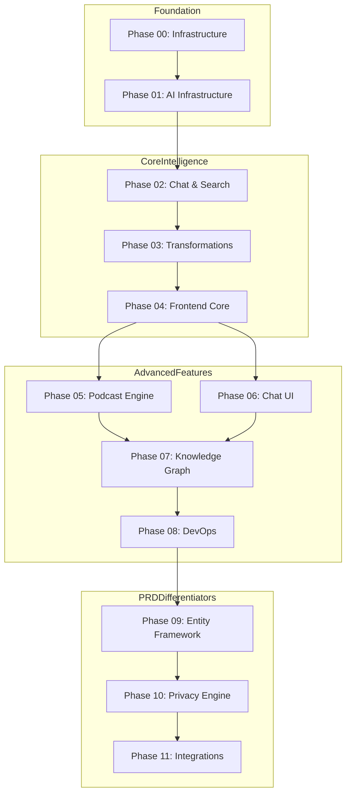

# Second Brain Foundation - Next-Gen Development Blueprint

**Analysis Date:** December 28, 2025  
**Blueprint Version:** 2.0 (Final Pass - BMad Orchestrator Party Mode)  
**Based on Comparison With:** HyperbookLM, Open Notebook  
**Generated by:** BMad Orchestrator Party Mode  
**Last Updated:** December 28, 2025 - Final Pass Review  

---

## 🎯 Master Implementation Checklist

> **Use this checklist to track overall progress. Each phase has its own detailed checklist.**

### Foundation (Weeks 1-5)
- [ ] **Phase 00**: Exception Hierarchy, BaseEntity, Job Runner, Migrations, Token Tracking
- [ ] **Phase 01**: Model Registry, Multi-Provider AI, Content Ingestion Pipeline

### Core Intelligence (Weeks 6-14)
- [ ] **Phase 02**: LangGraph Integration, RAG Chat, Hybrid Search
- [ ] **Phase 03**: Transformation Engine, Built-in Transformations, API
- [ ] **Phase 04**: Dashboard Shell, Auth UI, Notebook CRUD, Source Management

### Advanced Features (Weeks 15-28)
- [ ] **Phase 05**: Podcast Engine, Audio Generation, Speaker Profiles
- [ ] **Phase 06**: Chat Interface, Streaming UI, Search UI
- [ ] **Phase 07**: Knowledge Graph, Visualization, Entity Extraction
- [ ] **Phase 08**: Docker Production, CI/CD, Monitoring, Health Checks

### PRD Differentiators (Weeks 29-36) ⭐ CRITICAL
- [ ] **Phase 09**: Entity Framework, UID Generation, 48-hour Lifecycle, BMOM
- [ ] **Phase 10**: Sensitivity Tiers, Privacy Engine, AI Access Control
- [ ] **Phase 11**: Obsidian Plugin, CLI Tool, Migration Tools

---

## 📊 Phase Dependency Graph



---

## Executive Summary

This blueprint identifies critical gaps in Second Brain Foundation (SBF) compared to production-ready alternatives and provides a comprehensive development plan to bring SBF to feature parity and beyond. The analysis reveals that while SBF has superior architecture for multi-tenancy, privacy, and entity management, it lacks the **user-facing functionality** and **polished developer experience** that competitors have already shipped.

### Key Insights

| Aspect | SBF Current | Open Notebook | HyperbookLM | Action Required |
|--------|-------------|---------------|-------------|-----------------|
| **Core Architecture** | ✅ Superior | 🔶 Good | 🔶 Simple | Maintain leadership |
| **Multi-Tenancy** | ✅ Full RLS | ❌ Single-user | ❌ Single-user | Keep advantage |
| **Content Ingestion** | 🔶 Basic | ✅ Multi-format | ✅ Web+PDF | **COPY patterns** |
| **Chat/RAG** | 🔶 Scaffolded | ✅ Production | ✅ Production | **COPY patterns** |
| **Podcast/Audio** | ❌ None | ✅ Advanced | ✅ Basic | **COPY Open Notebook** |
| **Transformations** | ❌ None | ✅ Robust | ✅ Basic | **COPY Open Notebook** |
| **Search (Vector+Text)** | 🔶 Partial | ✅ Hybrid | 🔶 Basic | **COPY Open Notebook** |
| **Frontend UI** | ❌ Shell only | ✅ Production | ✅ Production | **COPY both** |
| **LangGraph Workflows** | ❌ None | ✅ Extensive | ❌ None | **COPY Open Notebook** |
| **Multi-Model Support** | 🔶 Partial | ✅ 16+ providers | 🔶 4 providers | **COPY Open Notebook** |
| **API Documentation** | 🔶 Basic | ✅ OpenAPI | 🔶 None | **COPY Open Notebook** |
| **Docker Deployment** | ✅ Has files | ✅ Production-ready | 🔶 Basic | Enhance |
| **Database Migrations** | ❌ None | ✅ Automated | ❌ None | **COPY Open Notebook** |

---

## Part 1: Critical Gaps to Address Immediately

### 1.1 Content Ingestion Pipeline (Priority: 🔴 CRITICAL)

**Current SBF State:** Basic file reading via VaultAdapter  
**Open Notebook Has:** Full content extraction via `content-core` library  
**HyperbookLM Has:** Web scraping via Hyperbrowser + PDF parsing via `unpdf`  

#### Action Plan: Implement Multi-Format Ingestion

```
packages/
  @sbf/
    content-engine/           # NEW PACKAGE
      src/
        extractors/
          web-scraper.ts      # Adapt from HyperbookLM
          pdf-extractor.ts    # Use pdf-parse or unpdf
          youtube-extractor.ts # From Open Notebook
          audio-extractor.ts  # Speech-to-text
        processors/
          markdown-converter.ts
          chunker.ts
          embedder.ts
        index.ts
```

**Copy from HyperbookLM:**
```typescript
// Reference: hyperbooklm-main/app/api/scrape/route.ts
const client = new Hyperbrowser({ apiKey });
const scrapeResult = await client.scrape.startAndWait({
  url,
  sessionOptions: {
    useProxy: true,
    solveCaptchas: true,
  },
});
```

**Copy from Open Notebook:**
```python
# Reference: open-notebook/open_notebook/graphs/source.py
from content_core import extract_content
processed_state = await extract_content(content_state)
```

---

### 1.2 RAG Chat System (Priority: 🔴 CRITICAL)

**Current SBF State:** `/rag` route scaffolded but empty  
**Open Notebook Has:** Full LangGraph-based chat with context management  

#### Action Plan: Implement Production Chat

**Copy from Open Notebook:**

```
apps/
  api/
    src/
      services/
        chat.service.ts       # NEW
        context.service.ts    # NEW
      routes/
        chat.routes.ts        # ENHANCE existing
```

**Key Pattern to Copy - Chat Graph with Checkpointing:**
```python
# Reference: open-notebook/open_notebook/graphs/chat.py
from langgraph.checkpoint.sqlite import SqliteSaver
from langgraph.graph import StateGraph

class ThreadState(TypedDict):
    messages: Annotated[list, add_messages]
    notebook: Optional[Notebook]
    context: Optional[str]
    context_config: Optional[dict]
    model_override: Optional[str]

agent_state = StateGraph(ThreadState)
agent_state.add_node("agent", call_model_with_messages)
graph = agent_state.compile(checkpointer=memory)
```

**SBF Implementation Path:**
1. Add `@langchain/langgraph` to `apps/aei-core`
2. Create `graphs/chat.py` with checkpointing
3. Implement context injection from Knowledge Graph
4. Add streaming response support

---

### 1.3 Multi-Provider Model Management (Priority: 🔴 CRITICAL)

**Current SBF State:** Hardcoded Together.ai in LLM Orchestrator  
**Open Notebook Has:** 16+ providers via Esperanto library, per-task model selection  

#### Action Plan: Implement Model Manager

**Copy from Open Notebook:**
```python
# Reference: open-notebook/open_notebook/domain/models.py
class ModelManager:
    async def get_model(self, model_id: str, **kwargs) -> ModelType:
        model = await Model.get(model_id)
        if model.type == "language":
            return AIFactory.create_language(
                model_name=model.name,
                provider=model.provider,
            )
        # ... embedding, speech_to_text, text_to_speech
```

**SBF Enhancement:**
```typescript
// packages/@sbf/ai-client/src/ModelManager.ts
export class ModelManager {
  private providers: Map<string, LlmProvider> = new Map();
  
  async getModel(modelId: string, type: ModelType): Promise<LlmProvider> {
    const config = await this.getModelConfig(modelId);
    return AiClientFactory.create(config);
  }
  
  async getDefaultModel(type: 'chat' | 'embedding' | 'tts' | 'stt'): Promise<LlmProvider> {
    const defaults = await this.getDefaultsConfig();
    return this.getModel(defaults[type]);
  }
}
```

---

### 1.4 Content Transformations (Priority: 🟡 HIGH)

**Current SBF State:** None  
**Open Notebook Has:** Customizable transformations with Jinja2 templates  

#### Action Plan: Implement Transformation Engine

**Copy from Open Notebook:**
```python
# Reference: open-notebook/open_notebook/domain/transformation.py
class Transformation(ObjectModel):
    table_name: ClassVar[str] = "transformation"
    name: str
    title: str
    description: str
    prompt: str  # Jinja2 template
    apply_default: bool
```

**SBF Implementation:**
```
packages/
  @sbf/
    transformation-engine/    # NEW PACKAGE
      src/
        models/
          Transformation.ts
        services/
          TransformationService.ts
        templates/
          summary.yaml
          key-insights.yaml
          action-items.yaml
          mindmap.yaml
          flashcards.yaml
```

**Built-in Transformations to Include:**
| Name | Description | Source |
|------|-------------|--------|
| Summary | Generate concise summary | Open Notebook |
| Key Insights | Extract key points | Open Notebook |
| Action Items | Extract actionable tasks | SBF Original |
| Mind Map | Generate hierarchical mind map | HyperbookLM |
| Study Notes | Generate study material | Open Notebook |
| Flashcards | Generate Q&A flashcards | SBF Original |

---

### 1.5 Podcast/Audio Generation (Priority: 🟡 HIGH)

**Current SBF State:** None  
**Open Notebook Has:** Advanced multi-speaker podcast with profiles  
**HyperbookLM Has:** ElevenLabs TTS integration  

#### Action Plan: Implement Podcast Engine

**Copy from Open Notebook:**
```python
# Reference: open-notebook/open_notebook/domain/podcast.py
class EpisodeProfile(ObjectModel):
    name: str
    speaker_config: str
    outline_provider: str
    transcript_model: str
    num_segments: int

class SpeakerProfile(ObjectModel):
    speakers: List[Dict[str, Any]]  # 1-4 speakers
    tts_provider: str
    tts_model: str
```

**SBF Implementation:**
```
packages/
  @sbf/
    podcast-engine/           # NEW PACKAGE
      src/
        models/
          EpisodeProfile.ts
          SpeakerProfile.ts
          PodcastEpisode.ts
        services/
          PodcastGenerationService.ts
          TTSService.ts
        graphs/
          podcast-workflow.ts   # LangGraph workflow
```

---

## Part 2: Frontend Revolution

### 2.1 Current State vs Competitors

| Feature | SBF | Open Notebook | HyperbookLM |
|---------|-----|---------------|-------------|
| Dashboard | ❌ Shell | ✅ Full | ✅ Full |
| Source Management | ❌ None | ✅ Full CRUD | ✅ Full |
| Chat Interface | ❌ None | ✅ Streaming | ✅ Streaming |
| Mind Map Viz | ❌ None | ❌ None | ✅ React Flow |
| Audio Player | ❌ None | ✅ Full | ✅ Basic |
| Search UI | ❌ None | ✅ Hybrid | ❌ None |
| Settings | ❌ None | ✅ Full | 🔶 Basic |
| Auth UI | ❌ None | ✅ Password | ❌ None |

### 2.2 UI Component Architecture to Copy

**From Open Notebook (Primary):**
```
frontend/
  src/
    app/
      (dashboard)/             # Route groups
        notebooks/
        sources/
        podcasts/
        settings/
    components/
      common/                  # Shared components
      layout/                  # App shell
      notebooks/               # Notebook CRUD
      sources/                 # Source management
      podcasts/                # Audio generation
      search/                  # Search interface
    lib/
      api/                     # API clients per domain
      stores/                  # Zustand stores
      hooks/                   # Custom hooks
      types/                   # TypeScript types
```

**From HyperbookLM (For Visualization):**
```
components/
  ChatInterface.tsx            # Streaming chat
  MindMap.tsx                  # React Flow graph
  OutputsPanel.tsx             # Results panel
  SourcesPanel.tsx             # Left sidebar
```

### 2.3 SBF Frontend Implementation Plan

```
apps/
  web/
    src/
      app/
        (auth)/
          login/
          register/
        (dashboard)/
          layout.tsx            # Dashboard shell
          page.tsx              # Dashboard home
          notebooks/
            page.tsx            # Notebook list
            [id]/
              page.tsx          # Notebook detail
          sources/
            page.tsx            # Source list
          chat/
            page.tsx            # Chat interface
          podcasts/
            page.tsx            # Podcast generator
          settings/
            page.tsx            # App settings
            models/
              page.tsx          # Model configuration
      components/
        chat/
          ChatInterface.tsx
          MessageList.tsx
          MessageInput.tsx
          StreamingMessage.tsx
        sources/
          SourceList.tsx
          AddSourceDialog.tsx
          SourceCard.tsx
        visualization/
          MindMap.tsx           # From HyperbookLM
          KnowledgeGraph.tsx
        audio/
          AudioPlayer.tsx
          PodcastGenerator.tsx
      lib/
        api/
          client.ts             # Axios with interceptors (from ON)
          notebooks.ts
          sources.ts
          chat.ts
          podcasts.ts
        stores/
          auth-store.ts
          notebook-store.ts
          chat-store.ts
        hooks/
          useChat.ts
          useNotebook.ts
          useSearch.ts
```

---

## Part 3: Backend Service Enhancements

### 3.1 API Routes to Add

**Copy from Open Notebook's Router Structure:**

```
apps/
  api/
    src/
      routes/
        index.ts              # ENHANCE
        # Existing
        entities.routes.ts
        tasks.routes.ts
        tenants.routes.ts
        # NEW
        notebooks.routes.ts   # Notebook CRUD
        sources.routes.ts     # Source management
        chat.routes.ts        # Chat sessions + messages
        search.routes.ts      # Hybrid search
        transformations.routes.ts
        podcasts.routes.ts
        episode-profiles.routes.ts
        speaker-profiles.routes.ts
        models.routes.ts      # Model config
        settings.routes.ts    # User settings
        insights.routes.ts    # Source insights
```

### 3.2 Database Schema Additions

**Copy from Open Notebook's SurrealDB Schema:**

```sql
-- notebooks table
CREATE TABLE notebooks (
  id UUID PRIMARY KEY,
  tenant_id UUID NOT NULL REFERENCES tenants(id),
  name VARCHAR(255) NOT NULL,
  description TEXT,
  archived BOOLEAN DEFAULT false,
  created_at TIMESTAMP DEFAULT NOW(),
  updated_at TIMESTAMP DEFAULT NOW()
);

-- sources table
CREATE TABLE sources (
  id UUID PRIMARY KEY,
  tenant_id UUID NOT NULL REFERENCES tenants(id),
  title VARCHAR(255),
  url TEXT,
  file_path TEXT,
  full_text TEXT,
  topics TEXT[],
  created_at TIMESTAMP DEFAULT NOW(),
  updated_at TIMESTAMP DEFAULT NOW()
);

-- notebook_sources (junction)
CREATE TABLE notebook_sources (
  notebook_id UUID REFERENCES notebooks(id),
  source_id UUID REFERENCES sources(id),
  PRIMARY KEY (notebook_id, source_id)
);

-- source_embeddings
CREATE TABLE source_embeddings (
  id UUID PRIMARY KEY,
  source_id UUID REFERENCES sources(id),
  content TEXT NOT NULL,
  embedding VECTOR(1536),
  created_at TIMESTAMP DEFAULT NOW()
);

-- source_insights
CREATE TABLE source_insights (
  id UUID PRIMARY KEY,
  source_id UUID REFERENCES sources(id),
  insight_type VARCHAR(50),
  content TEXT NOT NULL,
  created_at TIMESTAMP DEFAULT NOW()
);

-- chat_sessions
CREATE TABLE chat_sessions (
  id UUID PRIMARY KEY,
  tenant_id UUID NOT NULL REFERENCES tenants(id),
  notebook_id UUID REFERENCES notebooks(id),
  title VARCHAR(255),
  model_override VARCHAR(255),
  created_at TIMESTAMP DEFAULT NOW(),
  updated_at TIMESTAMP DEFAULT NOW()
);

-- chat_messages
CREATE TABLE chat_messages (
  id UUID PRIMARY KEY,
  session_id UUID REFERENCES chat_sessions(id),
  role VARCHAR(20) NOT NULL, -- 'user', 'assistant', 'system'
  content TEXT NOT NULL,
  created_at TIMESTAMP DEFAULT NOW()
);

-- transformations (template definitions)
CREATE TABLE transformations (
  id UUID PRIMARY KEY,
  tenant_id UUID REFERENCES tenants(id), -- NULL for system defaults
  name VARCHAR(100) NOT NULL,
  title VARCHAR(255) NOT NULL,
  description TEXT,
  prompt TEXT NOT NULL,
  apply_default BOOLEAN DEFAULT false,
  created_at TIMESTAMP DEFAULT NOW()
);

-- models (AI model registry)
CREATE TABLE models (
  id UUID PRIMARY KEY,
  name VARCHAR(255) NOT NULL,
  provider VARCHAR(100) NOT NULL,
  type VARCHAR(50) NOT NULL, -- 'language', 'embedding', 'tts', 'stt'
  config JSONB DEFAULT '{}',
  created_at TIMESTAMP DEFAULT NOW()
);

-- default_models (per-tenant defaults)
CREATE TABLE default_models (
  tenant_id UUID PRIMARY KEY REFERENCES tenants(id),
  default_chat_model UUID REFERENCES models(id),
  default_transformation_model UUID REFERENCES models(id),
  default_embedding_model UUID REFERENCES models(id),
  default_tts_model UUID REFERENCES models(id),
  default_stt_model UUID REFERENCES models(id),
  large_context_model UUID REFERENCES models(id)
);

-- podcast_episodes
CREATE TABLE podcast_episodes (
  id UUID PRIMARY KEY,
  tenant_id UUID NOT NULL REFERENCES tenants(id),
  name VARCHAR(255) NOT NULL,
  briefing TEXT,
  content TEXT,
  transcript JSONB,
  outline JSONB,
  audio_file TEXT,
  status VARCHAR(50) DEFAULT 'pending',
  created_at TIMESTAMP DEFAULT NOW(),
  updated_at TIMESTAMP DEFAULT NOW()
);

-- episode_profiles
CREATE TABLE episode_profiles (
  id UUID PRIMARY KEY,
  tenant_id UUID REFERENCES tenants(id), -- NULL for system defaults
  name VARCHAR(100) NOT NULL,
  description TEXT,
  speaker_config_id UUID REFERENCES speaker_profiles(id),
  outline_model UUID REFERENCES models(id),
  transcript_model UUID REFERENCES models(id),
  default_briefing TEXT,
  num_segments INT DEFAULT 5,
  created_at TIMESTAMP DEFAULT NOW()
);

-- speaker_profiles
CREATE TABLE speaker_profiles (
  id UUID PRIMARY KEY,
  tenant_id UUID REFERENCES tenants(id),
  name VARCHAR(100) NOT NULL,
  description TEXT,
  tts_provider VARCHAR(100) NOT NULL,
  tts_model VARCHAR(255) NOT NULL,
  speakers JSONB NOT NULL, -- Array of {name, voice_id, backstory, personality}
  created_at TIMESTAMP DEFAULT NOW()
);
```

### 3.3 Database Migration System

**Copy from Open Notebook:**
```python
# Reference: open-notebook/open_notebook/database/async_migrate.py
class AsyncMigrationManager:
    async def get_current_version(self) -> int:
        pass
    
    async def needs_migration(self) -> bool:
        pass
    
    async def run_migration_up(self) -> None:
        pass
```

**SBF Implementation:**
```
packages/
  @sbf/
    db-migrations/            # NEW PACKAGE
      src/
        MigrationManager.ts
        runner.ts
      migrations/
        001_initial_schema.sql
        002_notebooks_sources.sql
        003_chat_sessions.sql
        004_transformations.sql
        005_models_registry.sql
        006_podcasts.sql
```

---

## Part 4: LangGraph Workflow Integration

### 4.1 Current SBF State

No LangGraph/LangChain integration in Python AEI Core.

### 4.2 Open Notebook's LangGraph Patterns

**Copy These Graph Patterns:**

| Graph | Purpose | File |
|-------|---------|------|
| `source.py` | Content ingestion pipeline | `graphs/source.py` |
| `chat.py` | Stateful chat with checkpointing | `graphs/chat.py` |
| `ask.py` | Multi-step RAG with strategy | `graphs/ask.py` |
| `transformation.py` | Content transformation | `graphs/transformation.py` |

### 4.3 SBF LangGraph Implementation

```
apps/
  aei-core/
    graphs/                   # NEW DIRECTORY
      __init__.py
      source_ingestion.py     # From ON source.py
      chat.py                 # From ON chat.py
      ask.py                  # From ON ask.py
      transformation.py       # From ON transformation.py
      podcast_generation.py   # From ON podcast patterns
    prompts/                  # NEW DIRECTORY
      chat.jinja
      ask/
        entry.jinja
        query_process.jinja
        answer.jinja
      podcast/
        outline.jinja
        transcript.jinja
```

---

## Part 5: Search Implementation

### 5.1 Hybrid Search Pattern

**Copy from Open Notebook:**
```python
# Reference: open-notebook/api/search_service.py
def search(
    self,
    query: str,
    search_type: str = "text",  # "text" | "vector" | "hybrid"
    limit: int = 100,
    search_sources: bool = True,
    search_notes: bool = True,
    minimum_score: float = 0.2
) -> List[Dict[str, Any]]:
    pass
```

### 5.2 SBF Search Service

```
packages/
  @sbf/
    search-engine/            # NEW PACKAGE
      src/
        services/
          SearchService.ts
          TextSearchService.ts
          VectorSearchService.ts
          HybridSearchService.ts
        models/
          SearchQuery.ts
          SearchResult.ts
        index.ts
```

**Implementation:**
```typescript
// packages/@sbf/search-engine/src/services/SearchService.ts
export class SearchService {
  constructor(
    private vectorClient: PineconeVectorClient,
    private dbClient: DatabaseClient,
    private embeddingProvider: EmbeddingProvider
  ) {}

  async search(
    tenantId: string,
    query: SearchQuery
  ): Promise<SearchResult[]> {
    const results: SearchResult[] = [];
    
    if (query.type === 'vector' || query.type === 'hybrid') {
      const embedding = await this.embeddingProvider.embed(query.text);
      const vectorResults = await this.vectorClient.query(tenantId, {
        vector: embedding,
        topK: query.limit,
        includeMetadata: true
      });
      results.push(...this.transformVectorResults(vectorResults));
    }
    
    if (query.type === 'text' || query.type === 'hybrid') {
      const textResults = await this.dbClient.query(tenantId, `
        SELECT *, ts_rank(to_tsvector('english', content), 
               plainto_tsquery('english', $1)) as rank
        FROM entities
        WHERE to_tsvector('english', content) @@ plainto_tsquery('english', $1)
        ORDER BY rank DESC
        LIMIT $2
      `, [query.text, query.limit]);
      results.push(...this.transformTextResults(textResults));
    }
    
    return this.dedupeAndRank(results, query.minimumScore);
  }
}
```

---

## Part 6: Developer Experience Improvements

### 6.1 OpenAPI Documentation

**Copy from Open Notebook:**
```python
# Reference: open-notebook/api/main.py
app = FastAPI(
    title="Open Notebook API",
    description="API for Open Notebook - Research Assistant",
    version="0.2.2",
)
```

**SBF Enhancement:**
- Add Swagger UI at `/api/docs`
- Add ReDoc at `/api/redoc`
- Generate TypeScript types from OpenAPI

### 6.2 API Client Generation

```
packages/
  @sbf/
    api-client/               # NEW PACKAGE - Auto-generated
      src/
        client.ts
        types.ts
        notebooks.ts
        sources.ts
        chat.ts
        # ... all API modules
```

### 6.3 Improved Docker Setup

**Copy from Open Notebook:**
```yaml
# docker-compose.full.yml
services:
  api:
    build: .
    ports:
      - "5055:5055"
    environment:
      - DATABASE_URL=...
      - OPENAI_API_KEY=...
    volumes:
      - ./data:/app/data
    depends_on:
      - db
      - redis
  
  frontend:
    build: ./frontend
    ports:
      - "8502:8502"
    environment:
      - API_URL=http://api:5055
    depends_on:
      - api
  
  db:
    image: neon/postgres:latest
    volumes:
      - pgdata:/var/lib/postgresql/data
  
  redis:
    image: redis:7-alpine
    volumes:
      - redisdata:/data
```

---

## Part 7: Implementation Roadmap

### Phase 1: Foundation (Weeks 1-2)

| Task | Priority | Effort | Dependencies |
|------|----------|--------|--------------|
| Database migrations system | 🔴 Critical | 3 days | None |
| Model registry + manager | 🔴 Critical | 3 days | DB migrations |
| Multi-provider AI client | 🔴 Critical | 4 days | Model manager |
| Content ingestion pipeline | 🔴 Critical | 4 days | AI client |

### Phase 2: Chat & Search (Weeks 3-4)

| Task | Priority | Effort | Dependencies |
|------|----------|--------|--------------|
| LangGraph integration | 🔴 Critical | 3 days | Phase 1 |
| Chat graph with checkpointing | 🔴 Critical | 4 days | LangGraph |
| Hybrid search service | 🔴 Critical | 4 days | Phase 1 |
| Chat API endpoints | 🔴 Critical | 3 days | Chat graph |

### Phase 3: Transformations & Insights (Weeks 5-6)

| Task | Priority | Effort | Dependencies |
|------|----------|--------|--------------|
| Transformation engine | 🟡 High | 4 days | Phase 2 |
| Built-in transformations | 🟡 High | 3 days | Transform engine |
| Insight generation | 🟡 High | 3 days | Transform engine |
| API endpoints | 🟡 High | 2 days | All above |

### Phase 4: Frontend MVP (Weeks 7-10)

| Task | Priority | Effort | Dependencies |
|------|----------|--------|--------------|
| Dashboard shell | 🔴 Critical | 3 days | None |
| Authentication UI | 🔴 Critical | 3 days | Dashboard |
| Notebook management | 🔴 Critical | 5 days | Phase 3 API |
| Source management | 🔴 Critical | 5 days | Phase 3 API |
| Chat interface | 🔴 Critical | 5 days | Phase 3 API |
| Search interface | 🟡 High | 3 days | Phase 3 API |
| Settings pages | 🟡 High | 3 days | Phase 3 API |

### Phase 5: Audio & Advanced (Weeks 11-14)

| Task | Priority | Effort | Dependencies |
|------|----------|--------|--------------|
| TTS provider integration | 🟡 High | 4 days | Model manager |
| Podcast generation engine | 🟡 High | 5 days | TTS |
| Podcast API | 🟡 High | 3 days | Engine |
| Podcast UI | 🟡 High | 4 days | API |
| Mind map visualization | 🟢 Medium | 4 days | Phase 4 |
| Knowledge graph UI | 🟢 Medium | 4 days | Phase 4 |

---

## Part 8: Code to Copy Directly

### 8.1 From HyperbookLM

| File | Purpose | Target Location |
|------|---------|-----------------|
| `app/api/scrape/route.ts` | Web scraping | `apps/api/src/services/scraper.service.ts` |
| `app/api/chat/route.ts` | Streaming chat | `apps/api/src/services/streaming-chat.service.ts` |
| `app/api/gpt/mindmap/route.ts` | Mind map generation | `packages/@sbf/transformation-engine/mindmap.ts` |
| `app/api/audio/route.ts` | TTS integration | `packages/@sbf/podcast-engine/tts.service.ts` |
| `components/MindMap.tsx` | React Flow viz | `apps/web/src/components/visualization/MindMap.tsx` |
| `components/ChatInterface.tsx` | Chat UI | `apps/web/src/components/chat/ChatInterface.tsx` |

### 8.2 From Open Notebook

| File | Purpose | Target Location |
|------|---------|-----------------|
| `open_notebook/graphs/chat.py` | LangGraph chat | `apps/aei-core/graphs/chat.py` |
| `open_notebook/graphs/source.py` | Ingestion workflow | `apps/aei-core/graphs/source_ingestion.py` |
| `open_notebook/graphs/ask.py` | RAG strategy | `apps/aei-core/graphs/ask.py` |
| `open_notebook/domain/models.py` | Model manager | `packages/@sbf/ai-client/src/ModelManager.ts` |
| `open_notebook/domain/podcast.py` | Podcast models | `packages/@sbf/podcast-engine/models/` |
| `open_notebook/domain/transformation.py` | Transform models | `packages/@sbf/transformation-engine/models/` |
| `api/main.py` | FastAPI patterns | `apps/aei-core/main.py` enhancement |
| `api/chat_service.py` | Chat service | `apps/api/src/services/chat.service.ts` |
| `api/podcast_service.py` | Podcast service | `packages/@sbf/podcast-engine/PodcastService.ts` |
| `api/search_service.py` | Search patterns | `packages/@sbf/search-engine/SearchService.ts` |
| `frontend/src/lib/api/client.ts` | API client | `apps/web/src/lib/api/client.ts` |
| `frontend/src/lib/stores/*` | Zustand stores | `apps/web/src/lib/stores/` |

---

## Part 9: SBF Unique Advantages to Preserve

### 9.1 Multi-Tenancy (Keep)

Neither competitor has multi-tenancy. SBF's RLS-based approach is superior for B2B:
- Keep `withTenant()` pattern
- Keep tenant context middleware
- Keep per-tenant vector namespaces

### 9.2 Truth Hierarchy (Keep & Extend)

Unique to SBF - neither competitor has anything similar:
- Keep 5-level truth system
- Extend to transformations (AI-generated = L3, user-edited = U1)
- Use for conflict resolution in chat corrections

### 9.3 Entity Type System (Keep & Extend)

SBF has richer entity types than competitors:
- Keep 10 entity types
- Add `notebook`, `source`, `transformation`, `podcast` as new types
- Keep lifecycle states

### 9.4 AEI Security Code (Keep)

Unique privacy controls:
- Keep `canUseForAI()` and `canExport()` functions
- Extend to sources (mark sources as AI-allowed or not)
- Apply to podcasts (exclude sensitive content)

---

## Part 10: Success Metrics

### Milestone 1: Feature Parity (Week 14)

- [ ] Content ingestion: URL + PDF + YouTube
- [ ] Chat with RAG: 95%+ relevance
- [ ] Search: Hybrid text + vector
- [ ] Frontend: Functional notebook, source, chat UIs
- [ ] Podcast: Basic episode generation

### Milestone 2: Production Ready (Week 20)

- [ ] API documentation: 100% coverage
- [ ] Test coverage: >70%
- [ ] Docker: One-command deployment
- [ ] Performance: <2s first byte on queries
- [ ] Multi-model: 5+ providers working

### Milestone 3: Competitive Advantage (Week 26)

- [ ] Multi-tenant demo site
- [ ] Enterprise SSO integration
- [ ] Audit logging
- [ ] Custom transformation marketplace
- [ ] Mobile-responsive UI

---

## Appendix A: Package Creation Commands

```bash
# Create new packages
cd packages/@sbf
mkdir content-engine search-engine transformation-engine podcast-engine api-client db-migrations

# Initialize each package
for pkg in content-engine search-engine transformation-engine podcast-engine api-client db-migrations; do
  cd $pkg
  npm init -y
  echo '{"extends": "../../../tsconfig.base.json", "compilerOptions": {"outDir": "dist"}, "include": ["src"]}' > tsconfig.json
  mkdir src
  cd ..
done
```

## Appendix B: Dependencies to Add

```json
// Root package.json additions
{
  "devDependencies": {
    "@langchain/core": "^0.3.0",
    "@langchain/langgraph": "^0.2.0",
    "react-flow-renderer": "^10.3.0",
    "axios": "^1.6.0",
    "zustand": "^4.5.0"
  }
}

// apps/aei-core/requirements.txt additions
langgraph>=0.2.0
langchain>=0.3.0
langchain-openai>=0.2.0
langchain-anthropic>=0.2.0
ai-prompter>=0.5.0
content-core>=0.3.0
esperanto>=0.4.0
```

---

## Part 11: Sanity Check Amendments (v1.1)

> **Added:** December 28, 2025  
> **Purpose:** Address blind spots, missed opportunities, and higher-impact alternatives identified during blueprint validation.

### 11.1 CRITICAL BLIND SPOTS

#### 🔴 Missing: Exception Hierarchy

**What we missed:** Open Notebook has a comprehensive 13-type exception hierarchy in `open_notebook/exceptions.py`:
```python
class OpenNotebookError(Exception): ...
class ConfigurationError(OpenNotebookError): ...
class DatabaseOperationError(OpenNotebookError): ...
class InvalidInputError(OpenNotebookError): ...
class NotFoundError(OpenNotebookError): ...
class RateLimitError(OpenNotebookError): ...
class ExternalServiceError(OpenNotebookError): ...
class ContentProcessingError(OpenNotebookError): ...
class EmbeddingError(OpenNotebookError): ...
class AIProviderError(OpenNotebookError): ...
class PodcastError(OpenNotebookError): ...
class TransformationError(OpenNotebookError): ...
class ValidationError(OpenNotebookError): ...
```

**Impact:** Without standardized exceptions, error handling across SBF will be inconsistent, making debugging harder and error messages unclear to users.

**Action Required:**
```
packages/
  @sbf/
    errors/                   # NEW PACKAGE
      src/
        base.ts              # SBFError base class
        database.ts          # DatabaseError, NotFoundError
        validation.ts        # ValidationError, InvalidInputError
        external.ts          # AIProviderError, RateLimitError
        content.ts           # ContentProcessingError, EmbeddingError
        transformation.ts    # TransformationError
        podcast.ts           # PodcastError
        index.ts
```

---

#### 🔴 Missing: ObjectModel/BaseEntity Pattern with Auto-Embedding

**What we missed:** Open Notebook's `ObjectModel` base class in `open_notebook/domain/base.py` provides:
- Auto timestamps on create/update
- Auto embedding on save (when `auto_embedding=True`)
- Polymorphic `get()` dispatch by table name
- Automatic instance caching (singleton per record)
- JSON serialization with `model_dump_for_save()`

```python
class ObjectModel(BaseModel):
    auto_embedding: ClassVar[bool] = False
    table_name: ClassVar[str] = ""
    
    @classmethod
    async def get(cls, id: str) -> Optional["ObjectModel"]:
        # Polymorphic dispatch based on id prefix
        pass
    
    async def save(self) -> None:
        if self.auto_embedding:
            await self._generate_embedding()
        # Auto-set updated timestamp
```

**Impact:** Without this, every domain model will duplicate timestamp logic, embedding logic, and save patterns.

**Action Required:** Add to Phase 1 - create `packages/@sbf/domain-base/` with:
- `BaseEntity.ts` - auto timestamps, generic CRUD
- `EmbeddableEntity.ts` - extends BaseEntity with auto-embedding
- `SingletonEntity.ts` - for configuration-type entities

---

#### 🔴 Missing: Background Command System with Retry

**What we missed:** Open Notebook has a `@command` decorator system with retry strategies:

```python
# From commands/source_commands.py
@command(
    retry_strategy=wait_exponential_jitter(
        initial=2, max=60, jitter=5
    ),
    stop_strategy=stop_after_attempt(5),
)
async def ingest_source(input: SourceProcessingInput) -> None:
    # Background job with automatic retry
```

**Impact:** Without this, long-running operations (content ingestion, podcast generation) will fail silently or require manual retry.

**Action Required:** Create `packages/@sbf/job-runner/`:
```typescript
// Decorator pattern for TypeScript
export function withRetry(options: RetryOptions) {
  return function(target: any, key: string, descriptor: PropertyDescriptor) {
    // Wrap with exponential backoff + jitter
  };
}

export class JobRunner {
  async enqueue<T>(job: Job<T>): Promise<JobHandle>;
  async getStatus(handle: JobHandle): Promise<JobStatus>;
  async cancel(handle: JobHandle): Promise<void>;
}
```

---

#### 🔴 Missing: Context Builder Pattern

**What we missed:** Open Notebook has a sophisticated `ContextBuilder` class (502 lines) in `open_notebook/utils/context_builder.py`:
- Token counting and budget management
- Priority-based context assembly
- Deduplication across sources
- Configurable inclusion levels ("insights", "full content", "not in")
- Automatic truncation to fit model limits

**Impact:** Without smart context assembly, RAG will either overflow context windows or exclude important information.

**Action Required:** Add `ContextBuilder.ts` to `packages/@sbf/ai-client/`:
```typescript
interface ContextConfig {
  sources: Record<string, 'insights' | 'full' | 'exclude'>;
  notes: Record<string, 'full' | 'summary' | 'exclude'>;
  maxTokens: number;
  priorityWeights: { source: number; note: number; insight: number };
}

class ContextBuilder {
  async build(notebookId: string, config: ContextConfig): Promise<string>;
  private truncateToFit(items: ContextItem[], maxTokens: number): ContextItem[];
}
```

---

### 11.2 HIGH-IMPACT MISSED OPPORTUNITIES

#### 🟡 Token Cost Tracking

**Opportunity:** Open Notebook tracks token usage and calculates costs per operation via `token_utils.py`.

**Why it matters:** For SBF's B2B multi-tenant model, this enables:
- Per-tenant billing
- Cost allocation to specific operations
- Usage dashboards
- Rate limiting by spend

**Action:** Add `TokenTracker` to `packages/@sbf/ai-client/`:
```typescript
class TokenTracker {
  countTokens(text: string, model: string): number;
  calculateCost(tokens: number, model: string): number;
  recordUsage(tenantId: string, operation: string, tokens: number): Promise<void>;
}
```

---

#### 🟡 Tiktoken Caching

**Opportunity:** Open Notebook caches tiktoken encodings in a persistent folder to avoid re-downloading.

```python
# From config.py
TIKTOKEN_CACHE_DIR = f"{DATA_FOLDER}/tiktoken-cache"
os.makedirs(TIKTOKEN_CACHE_DIR, exist_ok=True)
os.environ["TIKTOKEN_CACHE_DIR"] = TIKTOKEN_CACHE_DIR
```

**Impact:** Faster startup, works offline, reduces network calls.

---

#### 🟡 Streaming Chat with Thinking Tag Cleaning

**Opportunity:** Open Notebook cleans `<think>...</think>` tags from AI responses before displaying:

```python
# From utils/text_utils.py
def clean_thinking_content(content: str) -> str:
    # Remove thinking tags from models like Claude
```

**Impact:** Better UX when using reasoning models that expose their thought process.

---

#### 🟡 LangGraph Checkpointing for Chat Continuity

**Opportunity:** Open Notebook persists chat state to SQLite:

```python
conn = sqlite3.connect(LANGGRAPH_CHECKPOINT_FILE, check_same_thread=False)
memory = SqliteSaver(conn)
graph = agent_state.compile(checkpointer=memory)
```

**Impact:** Chat sessions survive server restarts, enable "continue where you left off."

**SBF Enhancement:** Use PostgreSQL-based checkpointing for multi-tenant isolation:
```typescript
// Use tenant-scoped tables for checkpoints
checkpointer = new PostgresCheckpointer({
  connectionString: process.env.DATABASE_URL,
  tablePrefix: `langgraph_${tenantId}_`
});
```

---

#### 🟡 Design Principles Documentation

**Opportunity:** Open Notebook has `DESIGN_PRINCIPLES.md` documenting architectural decisions:
- Async-First
- Clean Separation of Concerns
- Type Safety with Runtime Validation
- Fail Fast with Clear Errors
- Test What Matters

**Impact:** Onboards new contributors faster, prevents architectural drift.

**Action:** Create `docs/architecture/DESIGN-PRINCIPLES.md` for SBF.

---

### 11.3 REVISED PHASE 1 TASKS

Add these to **Phase 1: Foundation (Weeks 1-2)**:

| Task | Priority | Effort | Dependencies |
|------|----------|--------|--------------|
| Exception hierarchy package | 🔴 Critical | 1 day | None |
| BaseEntity + EmbeddableEntity | 🔴 Critical | 2 days | Exceptions |
| Job runner with retry | 🔴 Critical | 2 days | Exceptions |
| Token tracker service | 🟡 High | 1 day | None |
| Context builder | 🔴 Critical | 2 days | Token tracker |
| Design principles doc | 🟡 High | 0.5 days | None |

**New Phase 1 Total:** 12 days → **16.5 days** (add 1 week buffer)

---

### 11.4 TEST ORGANIZATION PATTERNS

**What we missed:** Open Notebook has structured testing:

```
tests/
  conftest.py           # Shared fixtures, path setup
  test_domain.py        # Unit tests for models
  test_graphs.py        # LangGraph workflow tests
  test_models_api.py    # API integration tests
  test_utils.py         # Utility function tests
```

**Key patterns:**
- Pytest fixtures for database mocking
- Password auth disabled for tests via environment variable
- Tests grouped by domain (domain, graphs, API, utils)
- Clear docstrings explaining test purpose

**SBF Action:** Establish parallel test structure:
```
apps/aei-core/tests/
  conftest.py
  test_models.py
  test_graphs.py
  test_api.py
packages/@sbf/*/
  tests/
    *.test.ts
```

---

### 11.5 FRONTEND PATTERNS MISSED

#### Framer Motion Animations

**From HyperbookLM:** Chat uses Framer Motion for smooth message animations:
```tsx
<AnimatePresence initial={false}>
  {messages.map((message) => (
    <motion.div
      initial={{ opacity: 0, y: 10 }}
      animate={{ opacity: 1, y: 0 }}
      transition={{ duration: 0.3 }}
    >
```

**Impact:** Professional feel, competitive with ChatGPT/Claude UIs.

---

#### Streaming Cursor Animation

**From HyperbookLM:** Animated cursor during streaming:
```tsx
<motion.span
  animate={{ opacity: [0, 1, 0] }}
  transition={{ repeat: Infinity, duration: 0.8 }}
  className="inline-block w-1.5 h-4 ml-1 bg-black"
/>
```

---

#### Hook-Based State Management

**From HyperbookLM:** Clean separation via custom hooks:
```typescript
// hooks/useChat.ts
export function useChat(sources: Source[]) {
  const [messages, setMessages] = useState<Message[]>([]);
  const [isLoading, setIsLoading] = useState(false);
  const [error, setError] = useState<string | null>(null);
  const [streamingContent, setStreamingContent] = useState("");
  
  const sendMessage = useCallback(async (content: string) => {
    // Streaming logic
  }, [sources, isLoading]);
  
  return { messages, isLoading, error, streamingContent, sendMessage, clearMessages };
}
```

**Action:** Add to frontend architecture plan in Part 2.

---

### 11.6 RISK ASSESSMENT ADDITIONS

| Risk | Likelihood | Impact | Mitigation |
|------|------------|--------|------------|
| Scope creep from adopting all patterns | High | High | Prioritize by user-facing value |
| LangGraph learning curve | Medium | Medium | Start with simple chat graph only |
| Multi-tenant checkpoint isolation | Medium | High | Design upfront, don't retrofit |
| Token cost explosion | Medium | High | Implement hard limits per tenant |
| Test debt accumulation | High | Medium | TDD for new packages |

---

### 11.7 QUICK WINS NOT IN ORIGINAL BLUEPRINT

These can be done in < 1 day each with high user impact:

1. **Thinking tag cleanup** - Improve reasoning model outputs
2. **Tiktoken caching** - Faster startup times
3. **Better error messages** - User-friendly exceptions
4. **Loading states** - Framer Motion skeletons
5. **Auto-scroll in chat** - `scrollIntoView({ behavior: 'smooth' })`
6. **Message timestamps** - Display "2 minutes ago" in chat

---

*Sanity Check Amendment by BMad Orchestrator*  
*Additional patterns identified: 6 critical blind spots, 6 high-impact opportunities, 6 quick wins*  
*Estimated additional effort: +1 week to Phase 1*

---

*Generated by BMad Orchestrator Party Mode*  
*Agents: Analyst (gap analysis), Architect (system design), PM (roadmap), Dev (implementation details)*  
*Analysis Date: December 28, 2025*
