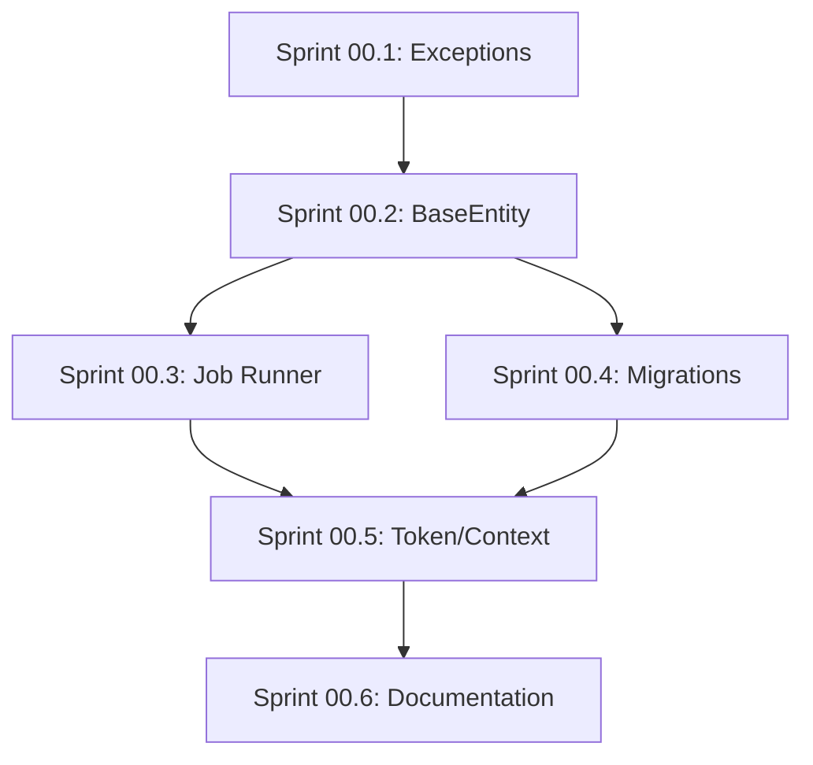
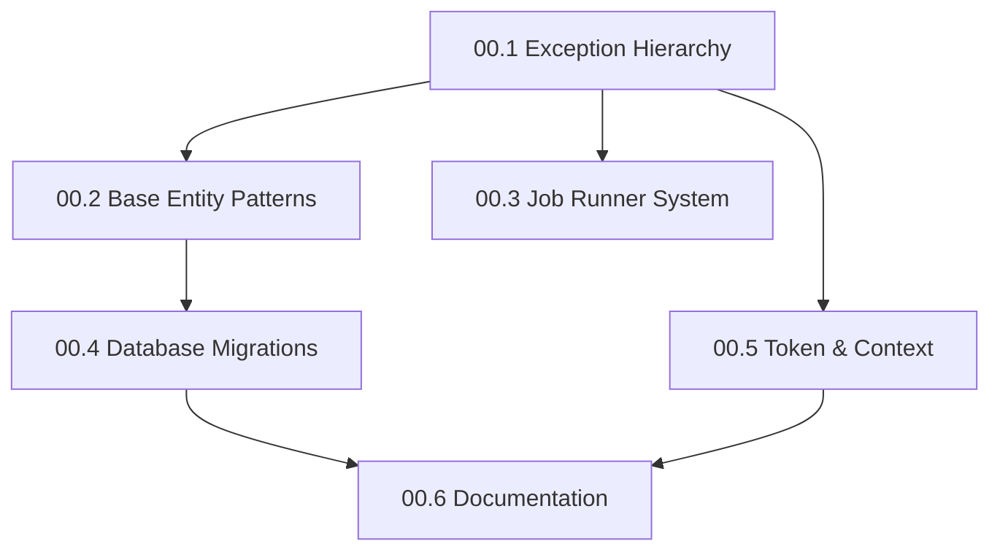

# NextGen Phase 00: Foundation Infrastructure

**Sprint Duration:** Week 1-2 (Extended to 3 weeks with buffer)  
**Priority:** 🔴 CRITICAL  
**Phase Type:** Infrastructure & Patterns  
**Generated:** December 28, 2025  
**Generated By:** BMad Orchestrator Party Mode  

---

## Executive Summary

Phase 00 establishes the foundational patterns and infrastructure that ALL subsequent phases depend on. This is a "zero-phase" because nothing else can be built safely without these patterns in place. Skipping or rushing this phase will result in technical debt that compounds exponentially.

**Key Outcomes:**
- Standardized error handling across all packages
- Base entity patterns with auto-timestamps and auto-embedding
- Background job system with retry strategies
- Database migration system
- Token tracking and cost management
- Design principles documentation

---

## PRD Alignment Matrix

| PRD Requirement | How This Phase Addresses It |
|-----------------|-----------------------------|
| FR24 (SHA-256 checksum) | BaseEntity includes `checksum` field generation |
| FR2 (Universal parameters) | BaseEntity defines timestamp, UID, lifecycle base fields |
| FR9 (ISO8601 timestamps) | Auto-timestamp utilities standardize date formats |
| NFR4 (No data corruption) | Exception hierarchy ensures safe error handling |
| NFR3 (Git-friendly) | Migration system creates deterministic, diffable SQL |

---

## Implementation Order (CRITICAL)

> ⚠️ **DO NOT PARALLELIZE SPRINTS IN PHASE 00** - Each sprint builds on the previous.



**Verification Gates:**
1. After 00.1: `pnpm test --filter @sbf/errors` must pass
2. After 00.2: `pnpm test --filter @sbf/domain-base` must pass  
3. After 00.4: `pnpm migrate:status` must show pending migrations
4. After 00.5: Token counting test with sample text must return accurate count

---

## Sprint 00.1: Exception Hierarchy (Days 1-2)

### Objective
Create a unified exception hierarchy for consistent error handling across SBF.

### Tasks

| ID | Task | Effort | Assignee |
|----|------|--------|----------|
| 00.1.1 | Create `packages/@sbf/errors` package structure | 2h | Dev |
| 00.1.2 | Implement `SBFError` base class with error codes | 4h | Dev |
| 00.1.3 | Implement database exceptions (`DatabaseError`, `NotFoundError`, `ConnectionError`) | 3h | Dev |
| 00.1.4 | Implement validation exceptions (`ValidationError`, `InvalidInputError`) | 2h | Dev |
| 00.1.5 | Implement external service exceptions (`AIProviderError`, `RateLimitError`, `ExternalServiceError`) | 3h | Dev |
| 00.1.6 | Implement domain-specific exceptions (`ContentProcessingError`, `EmbeddingError`, `TransformationError`, `PodcastError`) | 3h | Dev |
| 00.1.7 | Add error serialization for API responses | 2h | Dev |
| 00.1.8 | Write unit tests for all exception types | 3h | QA |
| 00.1.9 | Document exception usage patterns in README | 1h | Dev |

### Package Structure

```
packages/@sbf/errors/
├── package.json
├── tsconfig.json
├── README.md
├── src/
│   ├── index.ts
│   ├── base.ts              # SBFError base class
│   ├── codes.ts             # Error code enum
│   ├── database.ts          # DatabaseError, NotFoundError, ConnectionError
│   ├── validation.ts        # ValidationError, InvalidInputError
│   ├── external.ts          # AIProviderError, RateLimitError
│   ├── content.ts           # ContentProcessingError, EmbeddingError
│   ├── transformation.ts    # TransformationError
│   ├── podcast.ts           # PodcastError
│   └── serializer.ts        # toJSON, toAPIResponse
└── tests/
    └── errors.test.ts
```

### Reference Files

| Source | File | Pattern to Copy |
|--------|------|-----------------|
| Open Notebook | `references/external-repos/open-notebook-main/open_notebook/exceptions.py` | Exception hierarchy structure |

### Acceptance Criteria

- [ ] All exception types extend `SBFError`
- [ ] Each exception has a unique error code
- [ ] Exceptions serialize to consistent JSON format
- [ ] API middleware catches and formats all `SBFError` types
- [ ] 100% test coverage on exception classes

### Step-by-Step Implementation Guide

> 📋 **Follow these steps in order to implement Sprint 00.1**

**Step 1: Create Package Structure**
```powershell
# From workspace root
mkdir -p packages/@sbf/errors/src
mkdir -p packages/@sbf/errors/tests
cd packages/@sbf/errors
pnpm init
```

**Step 2: Configure Package**
```json
// packages/@sbf/errors/package.json
{
  "name": "@sbf/errors",
  "version": "0.1.0",
  "main": "dist/index.js",
  "types": "dist/index.d.ts",
  "scripts": {
    "build": "tsc",
    "test": "jest"
  },
  "devDependencies": {
    "typescript": "^5.0.0"
  }
}
```

**Step 3: Implement Base Class First**
Start with `src/base.ts`, then `src/codes.ts`, then specific error types.

**Step 4: Verify Integration**
```powershell
pnpm build --filter @sbf/errors
pnpm test --filter @sbf/errors
```

### Implementation Notes

```typescript
// Example implementation pattern
export enum ErrorCode {
  DATABASE_ERROR = 'E1000',
  NOT_FOUND = 'E1001',
  VALIDATION_ERROR = 'E2000',
  AI_PROVIDER_ERROR = 'E3000',
  RATE_LIMIT_ERROR = 'E3001',
  // Phase 09/10 additions
  ENTITY_NOT_FOUND = 'E1002',
  SENSITIVITY_VIOLATION = 'E4000',
  LIFECYCLE_INVALID_TRANSITION = 'E4001',
}

export class SBFError extends Error {
  constructor(
    message: string,
    public readonly code: ErrorCode,
    public readonly details?: Record<string, unknown>,
    public readonly cause?: Error
  ) {
    super(message);
    this.name = this.constructor.name;
  }

  toJSON() {
    return {
      error: this.name,
      code: this.code,
      message: this.message,
      details: this.details,
    };
  }
}
```

---

## Sprint 00.2: Base Entity Patterns (Days 3-5)

### Objective
Create foundational entity classes that provide auto-timestamps, auto-embedding, and generic CRUD operations.

### Tasks

| ID | Task | Effort | Assignee |
|----|------|--------|----------|
| 00.2.1 | Create `packages/@sbf/domain-base` package structure | 2h | Dev |
| 00.2.2 | Implement `BaseEntity` with auto-timestamps | 4h | Dev |
| 00.2.3 | Implement generic CRUD operations (save, get, delete, list) | 6h | Dev |
| 00.2.4 | Implement `EmbeddableEntity` with auto-embedding on save | 6h | Dev |
| 00.2.5 | Implement `SingletonEntity` for config-type entities | 3h | Dev |
| 00.2.6 | Add tenant isolation to all entity operations | 4h | Dev |
| 00.2.7 | Implement `model_dump_for_save()` pattern | 2h | Dev |
| 00.2.8 | Write comprehensive unit tests | 4h | QA |
| 00.2.9 | Document entity patterns in README | 2h | Dev |

### Package Structure

```
packages/@sbf/domain-base/
├── package.json
├── tsconfig.json
├── README.md
├── src/
│   ├── index.ts
│   ├── BaseEntity.ts
│   ├── EmbeddableEntity.ts
│   ├── SingletonEntity.ts
│   ├── types.ts
│   └── utils/
│       ├── timestamps.ts
│       └── serialization.ts
└── tests/
    ├── BaseEntity.test.ts
    ├── EmbeddableEntity.test.ts
    └── SingletonEntity.test.ts
```

### Reference Files

| Source | File | Pattern to Copy |
|--------|------|-----------------|
| Open Notebook | `references/external-repos/open-notebook-main/open_notebook/domain/base.py` | ObjectModel class with auto_embedding, polymorphic get() |
| Open Notebook | `references/external-repos/open-notebook-main/open_notebook/domain/notebook.py` | Concrete entity implementation |

### Key Patterns to Adopt

```typescript
// From Open Notebook's ObjectModel pattern
export abstract class BaseEntity<T> {
  static tableName: string;
  
  id?: string;
  createdAt?: Date;
  updatedAt?: Date;
  
  async save(): Promise<T> {
    this.updatedAt = new Date();
    if (!this.id) {
      this.createdAt = new Date();
      return this.create();
    }
    return this.update();
  }
  
  static async get<T extends BaseEntity<T>>(id: string): Promise<T | null> {
    // Polymorphic dispatch based on table prefix
  }
  
  modelDumpForSave(): Record<string, unknown> {
    // Exclude computed fields, format dates
  }
}

export abstract class EmbeddableEntity<T> extends BaseEntity<T> {
  static autoEmbedding = false;
  
  async save(): Promise<T> {
    if ((this.constructor as typeof EmbeddableEntity).autoEmbedding) {
      await this.generateEmbedding();
    }
    return super.save();
  }
  
  protected abstract getEmbeddingContent(): string;
}
```

### Acceptance Criteria

- [ ] `BaseEntity` auto-sets `createdAt` on first save
- [ ] `BaseEntity` auto-updates `updatedAt` on every save
- [ ] `EmbeddableEntity` generates embeddings when `autoEmbedding = true`
- [ ] All entity operations are tenant-scoped
- [ ] `SingletonEntity` returns same instance for same record_id
- [ ] 90%+ test coverage

---

## Sprint 00.3: Job Runner System (Days 6-8)

### Objective
Implement a background job system with retry strategies for long-running operations.

### Tasks

| ID | Task | Effort | Assignee |
|----|------|--------|----------|
| 00.3.1 | Create `packages/@sbf/job-runner` package structure | 2h | Dev |
| 00.3.2 | Implement `Job` and `JobHandle` interfaces | 3h | Dev |
| 00.3.3 | Implement `JobRunner` class with queue management | 6h | Dev |
| 00.3.4 | Implement retry strategies (exponential backoff, jitter) | 4h | Dev |
| 00.3.5 | Implement `@withRetry` decorator | 3h | Dev |
| 00.3.6 | Add job status tracking (pending, running, completed, failed) | 4h | Dev |
| 00.3.7 | Integrate with existing workers infrastructure | 4h | Dev |
| 00.3.8 | Write unit and integration tests | 4h | QA |
| 00.3.9 | Document job patterns and usage | 2h | Dev |

### Package Structure

```
packages/@sbf/job-runner/
├── package.json
├── tsconfig.json
├── README.md
├── src/
│   ├── index.ts
│   ├── Job.ts
│   ├── JobRunner.ts
│   ├── JobStatus.ts
│   ├── decorators/
│   │   └── withRetry.ts
│   ├── strategies/
│   │   ├── RetryStrategy.ts
│   │   ├── ExponentialBackoff.ts
│   │   └── ConstantDelay.ts
│   └── utils/
│       └── jitter.ts
└── tests/
    ├── JobRunner.test.ts
    └── strategies.test.ts
```

### Reference Files

| Source | File | Pattern to Copy |
|--------|------|-----------------|
| Open Notebook | `references/external-repos/open-notebook-main/commands/source_commands.py` | `@command` decorator with retry |
| Open Notebook | `references/external-repos/open-notebook-main/commands/podcast_commands.py` | Background job patterns |

### Key Implementation

```typescript
// Decorator pattern for retry
export interface RetryOptions {
  maxAttempts: number;
  initialDelay: number;
  maxDelay: number;
  jitter: number;
  retryOn?: (error: Error) => boolean;
}

export function withRetry(options: RetryOptions) {
  return function(
    target: any,
    propertyKey: string,
    descriptor: PropertyDescriptor
  ) {
    const originalMethod = descriptor.value;
    
    descriptor.value = async function(...args: any[]) {
      let lastError: Error;
      
      for (let attempt = 1; attempt <= options.maxAttempts; attempt++) {
        try {
          return await originalMethod.apply(this, args);
        } catch (error) {
          lastError = error as Error;
          
          if (options.retryOn && !options.retryOn(lastError)) {
            throw lastError;
          }
          
          if (attempt < options.maxAttempts) {
            const delay = calculateDelay(attempt, options);
            await sleep(delay);
          }
        }
      }
      
      throw lastError!;
    };
    
    return descriptor;
  };
}
```

### Acceptance Criteria

- [ ] Jobs can be enqueued and tracked by handle
- [ ] Retry with exponential backoff works correctly
- [ ] Jitter prevents thundering herd
- [ ] Job status is persisted and queryable
- [ ] Integration with `apps/workers` verified
- [ ] Decorator pattern works with async functions

---

## Sprint 00.4: Database Migrations (Days 9-11)

### Objective
Implement a database migration system for schema versioning.

### Tasks

| ID | Task | Effort | Assignee |
|----|------|--------|----------|
| 00.4.1 | Create `packages/@sbf/db-migrations` package structure | 2h | Dev |
| 00.4.2 | Implement `MigrationManager` class | 4h | Dev |
| 00.4.3 | Implement migration file discovery and ordering | 3h | Dev |
| 00.4.4 | Implement `migrate up` and `migrate down` commands | 4h | Dev |
| 00.4.5 | Create initial schema migration (001) | 4h | Dev |
| 00.4.6 | Create notebooks/sources migration (002) | 3h | Dev |
| 00.4.7 | Add migration CLI commands | 3h | Dev |
| 00.4.8 | Write tests for migration operations | 3h | QA |
| 00.4.9 | Document migration workflow | 2h | Dev |

### Package Structure

```
packages/@sbf/db-migrations/
├── package.json
├── tsconfig.json
├── README.md
├── src/
│   ├── index.ts
│   ├── MigrationManager.ts
│   ├── MigrationRunner.ts
│   ├── cli.ts
│   └── types.ts
├── migrations/
│   ├── 001_initial_schema.sql
│   ├── 002_notebooks_sources.sql
│   ├── 003_chat_sessions.sql
│   ├── 004_transformations.sql
│   ├── 005_models_registry.sql
│   └── 006_podcasts.sql
└── tests/
    └── MigrationManager.test.ts
```

### Reference Files

| Source | File | Pattern to Copy |
|--------|------|-----------------|
| Open Notebook | `references/external-repos/open-notebook-main/open_notebook/database/async_migrate.py` | Migration manager pattern |
| Open Notebook | `references/external-repos/open-notebook-main/open_notebook/database/repository.py` | Database operations |

### Migration 001: Initial Schema

```sql
-- 001_initial_schema.sql
-- Migration: 001
-- Description: Initial SBF schema with tenant support

CREATE TABLE IF NOT EXISTS schema_migrations (
  version INTEGER PRIMARY KEY,
  name VARCHAR(255) NOT NULL,
  applied_at TIMESTAMP DEFAULT NOW()
);

-- Ensure tenants table exists (may already exist)
CREATE TABLE IF NOT EXISTS tenants (
  id UUID PRIMARY KEY DEFAULT gen_random_uuid(),
  name VARCHAR(255) NOT NULL,
  slug VARCHAR(100) UNIQUE NOT NULL,
  config JSONB DEFAULT '{}',
  created_at TIMESTAMP DEFAULT NOW(),
  updated_at TIMESTAMP DEFAULT NOW()
);

-- Enable Row Level Security
ALTER TABLE tenants ENABLE ROW LEVEL SECURITY;

-- Create RLS policies
CREATE POLICY tenant_isolation ON tenants
  USING (id = current_setting('app.current_tenant_id')::UUID);
```

### Acceptance Criteria

- [ ] Migrations run in order by version number
- [ ] Migration status tracked in `schema_migrations` table
- [ ] `migrate up` applies pending migrations
- [ ] `migrate down` reverts last migration
- [ ] Migrations are idempotent (safe to re-run)
- [ ] CLI commands work (`pnpm migrate:up`, `pnpm migrate:down`, `pnpm migrate:status`)

---

## Sprint 00.5: Token Tracking & Context Builder (Days 12-14)

### Objective
Implement token counting, cost tracking, and context assembly for RAG operations.

### Tasks

| ID | Task | Effort | Assignee |
|----|------|--------|----------|
| 00.5.1 | Add `TokenTracker` to `packages/@sbf/ai-client` | 4h | Dev |
| 00.5.2 | Implement tiktoken integration with caching | 3h | Dev |
| 00.5.3 | Implement cost calculation per model | 3h | Dev |
| 00.5.4 | Implement usage recording with tenant scope | 4h | Dev |
| 00.5.5 | Create `ContextBuilder` class | 6h | Dev |
| 00.5.6 | Implement priority-based context assembly | 4h | Dev |
| 00.5.7 | Implement token budget management | 3h | Dev |
| 00.5.8 | Write unit tests | 4h | QA |
| 00.5.9 | Document context builder usage | 2h | Dev |

### File Additions to `packages/@sbf/ai-client`

```
packages/@sbf/ai-client/
├── src/
│   ├── tracking/
│   │   ├── TokenTracker.ts
│   │   ├── CostCalculator.ts
│   │   └── UsageRecorder.ts
│   └── context/
│       ├── ContextBuilder.ts
│       ├── ContextConfig.ts
│       └── ContextItem.ts
```

### Reference Files

| Source | File | Pattern to Copy |
|--------|------|-----------------|
| Open Notebook | `references/external-repos/open-notebook-main/open_notebook/utils/token_utils.py` | Token counting with tiktoken |
| Open Notebook | `references/external-repos/open-notebook-main/open_notebook/utils/context_builder.py` | Context assembly (502 lines!) |
| Open Notebook | `references/external-repos/open-notebook-main/open_notebook/config.py` | Tiktoken cache configuration |

### Key Implementation

```typescript
// ContextBuilder pattern from Open Notebook
export interface ContextConfig {
  sources: Record<string, 'insights' | 'full' | 'exclude'>;
  notes: Record<string, 'full' | 'summary' | 'exclude'>;
  maxTokens: number;
  priorityWeights: {
    source: number;
    note: number;
    insight: number;
  };
}

export class ContextBuilder {
  private items: ContextItem[] = [];
  
  constructor(
    private config: ContextConfig,
    private tokenTracker: TokenTracker
  ) {}
  
  async build(notebookId: string): Promise<string> {
    // 1. Gather sources based on config
    // 2. Calculate token counts
    // 3. Prioritize by weights
    // 4. Truncate to fit maxTokens
    // 5. Format and return
  }
  
  private truncateToFit(items: ContextItem[], maxTokens: number): ContextItem[] {
    // Sort by priority, keep adding until budget exhausted
  }
  
  private removeDuplicates(): void {
    // Dedupe by content hash
  }
}
```

### Acceptance Criteria

- [ ] Token counting matches tiktoken output
- [ ] Tiktoken encodings cached in persistent folder
- [ ] Cost calculation supports OpenAI, Anthropic, Gemini pricing
- [ ] Usage recorded per tenant with operation type
- [ ] Context builder respects token budget
- [ ] Priority weights affect inclusion order
- [ ] Deduplication prevents redundant content

---

## Sprint 00.6: Design Principles & Documentation (Days 15-16)

### Objective
Document architectural decisions and design principles for contributor onboarding.

### Tasks

| ID | Task | Effort | Assignee |
|----|------|--------|----------|
| 00.6.1 | Create `docs/architecture/DESIGN-PRINCIPLES.md` | 4h | Architect |
| 00.6.2 | Document error handling patterns | 2h | Dev |
| 00.6.3 | Document entity patterns | 2h | Dev |
| 00.6.4 | Document multi-tenancy patterns | 2h | Dev |
| 00.6.5 | Create `CONTRIBUTING.md` updates for new patterns | 3h | Dev |
| 00.6.6 | Review and approve documentation | 2h | PM |

### Reference Files

| Source | File | Pattern to Copy |
|--------|------|-----------------|
| Open Notebook | `references/external-repos/open-notebook-main/DESIGN_PRINCIPLES.md` | Documentation structure |
| Open Notebook | `references/external-repos/open-notebook-main/CONTRIBUTING.md` | Contribution guidelines |

### Design Principles Document Outline

```markdown
# SBF Design Principles

## 1. Multi-Tenancy First
- Every data operation is tenant-scoped
- RLS policies enforce isolation
- Tenant context injected via middleware

## 2. Async-First
- All I/O operations are async
- Background jobs for long-running tasks
- Streaming for real-time updates

## 3. Type Safety with Runtime Validation
- TypeScript strict mode
- Zod schemas for API validation
- Entity types enforced at boundaries

## 4. Fail Fast with Clear Errors
- Standardized exception hierarchy
- Error codes for programmatic handling
- User-friendly messages

## 5. Test What Matters
- Unit tests for business logic
- Integration tests for API endpoints
- E2E tests for critical flows

## 6. Separation of Concerns
- Packages have single responsibility
- Services don't know about HTTP
- Repositories don't know about business rules
```

---

## 🔴 BLIND SPOTS IDENTIFIED IN PHASE 00

### Blind Spot 1: Python vs TypeScript Parity

**Issue:** Open Notebook's patterns are Python-based. The TypeScript implementations need careful adaptation:
- Python's `@dataclass` → TypeScript classes with decorators
- Python's `async def` → TypeScript `async function`
- Pydantic validation → Zod schemas

**Mitigation:** Create explicit mapping document for pattern translation.

### Blind Spot 2: Existing Package Integration

**Issue:** SBF already has `packages/@sbf/db-client`. New packages must integrate, not duplicate:
- `@sbf/domain-base` should use `@sbf/db-client` internally
- `@sbf/job-runner` should integrate with existing `apps/workers`

**Mitigation:** Audit existing packages before implementing new ones.

### Blind Spot 3: AEI Core Synchronization

**Issue:** Some patterns belong in Python (`apps/aei-core`) not TypeScript:
- LangGraph is Python-native
- Some Open Notebook code should port to Python, not TypeScript

**Mitigation:** Decide per-pattern whether TypeScript API or Python AEI Core is the right home.

### Blind Spot 4: Testing Infrastructure

**Issue:** Test patterns are defined but Jest configuration may need updates.

**Mitigation:** Review `jest.config.js` and ensure new packages are included.

### Blind Spot 5: Monorepo Dependencies

**Issue:** New packages need proper workspace dependencies in `package.json`:
```json
{
  "dependencies": {
    "@sbf/errors": "workspace:*",
    "@sbf/db-client": "workspace:*"
  }
}
```

**Mitigation:** Use `pnpm add @sbf/errors --filter @sbf/domain-base` pattern.

---

## Phase 00 Dependencies



## Definition of Done

Phase 00 is complete when:

- [ ] All 6 sprints completed
- [ ] All packages published to workspace
- [ ] All tests passing (>90% coverage on new code)
- [ ] Documentation reviewed and approved
- [ ] Integration with existing packages verified
- [ ] No breaking changes to existing functionality

---

## Estimated Timeline

| Sprint | Duration | Cumulative |
|--------|----------|------------|
| 00.1 Exception Hierarchy | 2 days | Day 2 |
| 00.2 Base Entity Patterns | 3 days | Day 5 |
| 00.3 Job Runner System | 3 days | Day 8 |
| 00.4 Database Migrations | 3 days | Day 11 |
| 00.5 Token & Context | 3 days | Day 14 |
| 00.6 Documentation | 2 days | Day 16 |

**Total:** 16 working days (~3.5 weeks with buffer)

---

*Generated by BMad Orchestrator Party Mode*  
*Phase 00 Version: 1.0*
