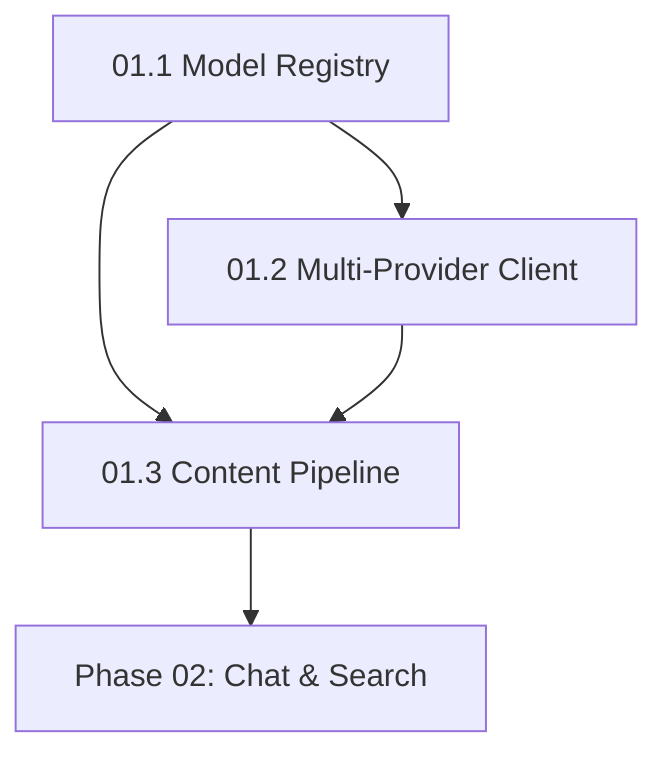

# NextGen Phase 01: AI Infrastructure

**Sprint Duration:** Week 4-5  
**Priority:** 🔴 CRITICAL  
**Phase Type:** Core AI Services  
**Prerequisites:** Phase 00 Complete  
**Generated:** December 28, 2025  
**Generated By:** BMad Orchestrator Party Mode  

---

## Executive Summary

Phase 01 builds the AI infrastructure that powers all intelligent features in SBF. This includes the Model Manager for multi-provider support, the content ingestion pipeline for processing various source types, and enhanced AI client capabilities.

**Key Outcomes:**
- Model registry with 16+ provider support
- Content ingestion for URL, PDF, YouTube, audio
- Unified AI client with provider abstraction
- Embedding service integration

---

## PRD Alignment Matrix

| PRD Requirement | How This Phase Addresses It |
|-----------------|-----------------------------|
| FR7 (cloud_ai vs local_ai) | ModelManager distinguishes cloud/local providers |
| FR6 (Sensitivity levels) | Provider selection respects sensitivity constraints |
| NFR7-9 (Tool compatibility) | Multi-provider support enables NotebookLM/AnythingLLM parity |

---

## Prerequisites Checklist

> ✅ **Verify ALL items before starting Phase 01**

- [ ] Phase 00 fully complete (all sprints passing tests)
- [ ] `@sbf/errors` package published to workspace
- [ ] `@sbf/domain-base` package published to workspace
- [ ] `@sbf/job-runner` package published to workspace
- [ ] Database migrations 001-004 applied successfully
- [ ] Existing `packages/@sbf/ai-client` reviewed for integration points
- [ ] API keys obtained: OpenAI, Anthropic, Google (minimum)

---

## Critical: Local AI Support (Ollama)

> 🔒 **Privacy Requirement**: Per PRD FR6-FR7, content with `sensitivity: personal` or higher MUST use local AI only.

**Ollama Integration is MANDATORY** - not optional. Include in Sprint 01.2:

```typescript
// packages/@sbf/ai-client/src/providers/OllamaProvider.ts
import { Ollama } from 'ollama';

export class OllamaProvider implements LlmProvider {
  readonly provider = 'ollama';
  readonly isLocal = true;  // CRITICAL: Privacy flag
  
  constructor(
    private client: Ollama,
    public readonly modelId: string
  ) {}
  
  // ... implementation
}
```

**Docker Compose Addition (Phase 08 preview):**
```yaml
# Add to docker-compose.yml
ollama:
  image: ollama/ollama:latest
  ports:
    - "11434:11434"
  volumes:
    - ollama_data:/root/.ollama
```

---

## Sprint 01.1: Model Registry & Manager (Days 1-4)

### Objective
Create a database-backed model registry and manager for dynamic model selection.

### Tasks

| ID | Task | Effort | Assignee |
|----|------|--------|----------|
| 01.1.1 | Create `models` database table migration | 3h | Dev |
| 01.1.2 | Create `default_models` per-tenant table | 2h | Dev |
| 01.1.3 | Implement `Model` entity using `BaseEntity` | 4h | Dev |
| 01.1.4 | Implement `ModelManager` class | 6h | Dev |
| 01.1.5 | Add model type support (language, embedding, tts, stt) | 4h | Dev |
| 01.1.6 | Implement per-tenant default model configuration | 4h | Dev |
| 01.1.7 | Create model seeding script with common models | 3h | Dev |
| 01.1.8 | Create API routes for model CRUD | 4h | Dev |
| 01.1.9 | Write unit and integration tests | 4h | QA |
| 01.1.10 | Document model management | 2h | Dev |

### Database Schema

```sql
-- Migration: 005_models_registry.sql

CREATE TABLE models (
  id UUID PRIMARY KEY DEFAULT gen_random_uuid(),
  name VARCHAR(255) NOT NULL,
  provider VARCHAR(100) NOT NULL,
  type VARCHAR(50) NOT NULL CHECK (type IN ('language', 'embedding', 'tts', 'stt')),
  model_id VARCHAR(255) NOT NULL, -- Provider's model identifier
  config JSONB DEFAULT '{}',
  capabilities JSONB DEFAULT '{}', -- max_tokens, supports_streaming, etc.
  cost_per_million_input DECIMAL(10, 6),
  cost_per_million_output DECIMAL(10, 6),
  is_active BOOLEAN DEFAULT true,
  created_at TIMESTAMP DEFAULT NOW(),
  updated_at TIMESTAMP DEFAULT NOW(),
  UNIQUE(provider, model_id)
);

CREATE TABLE default_models (
  id UUID PRIMARY KEY DEFAULT gen_random_uuid(),
  tenant_id UUID NOT NULL REFERENCES tenants(id),
  default_chat_model UUID REFERENCES models(id),
  default_transformation_model UUID REFERENCES models(id),
  default_embedding_model UUID REFERENCES models(id),
  default_tts_model UUID REFERENCES models(id),
  default_stt_model UUID REFERENCES models(id),
  large_context_model UUID REFERENCES models(id),
  created_at TIMESTAMP DEFAULT NOW(),
  updated_at TIMESTAMP DEFAULT NOW(),
  UNIQUE(tenant_id)
);

-- Seed common models
INSERT INTO models (name, provider, type, model_id, capabilities, cost_per_million_input, cost_per_million_output) VALUES
  ('GPT-4o', 'openai', 'language', 'gpt-4o', '{"max_tokens": 128000, "supports_streaming": true}', 2.50, 10.00),
  ('GPT-4o-mini', 'openai', 'language', 'gpt-4o-mini', '{"max_tokens": 128000, "supports_streaming": true}', 0.15, 0.60),
  ('Claude 3.5 Sonnet', 'anthropic', 'language', 'claude-3-5-sonnet-20241022', '{"max_tokens": 200000, "supports_streaming": true}', 3.00, 15.00),
  ('Claude 3.5 Haiku', 'anthropic', 'language', 'claude-3-5-haiku-20241022', '{"max_tokens": 200000, "supports_streaming": true}', 0.80, 4.00),
  ('Gemini 2.0 Flash', 'google', 'language', 'gemini-2.0-flash-exp', '{"max_tokens": 1000000, "supports_streaming": true}', 0.075, 0.30),
  ('text-embedding-3-small', 'openai', 'embedding', 'text-embedding-3-small', '{"dimensions": 1536}', 0.02, 0),
  ('text-embedding-3-large', 'openai', 'embedding', 'text-embedding-3-large', '{"dimensions": 3072}', 0.13, 0);
```

### Reference Files

| Source | File | Pattern to Copy |
|--------|------|-----------------|
| Open Notebook | `references/external-repos/open-notebook-main/open_notebook/domain/models.py` | ModelManager class |
| Open Notebook | `references/external-repos/open-notebook-main/api/models_service.py` | Model service patterns |

### Implementation Pattern

```typescript
// packages/@sbf/ai-client/src/ModelManager.ts
import { BaseEntity } from '@sbf/domain-base';
import { SBFError, ErrorCode } from '@sbf/errors';

export enum ModelType {
  LANGUAGE = 'language',
  EMBEDDING = 'embedding',
  TTS = 'tts',
  STT = 'stt',
}

export class Model extends BaseEntity<Model> {
  static tableName = 'models';
  
  name!: string;
  provider!: string;
  type!: ModelType;
  modelId!: string;
  config!: Record<string, unknown>;
  capabilities!: ModelCapabilities;
  isActive!: boolean;
}

export class ModelManager {
  private cache: Map<string, Model> = new Map();
  
  async getModel(modelId: string): Promise<Model> {
    if (this.cache.has(modelId)) {
      return this.cache.get(modelId)!;
    }
    
    const model = await Model.get(modelId);
    if (!model || !model.isActive) {
      throw new SBFError('Model not found or inactive', ErrorCode.NOT_FOUND);
    }
    
    this.cache.set(modelId, model);
    return model;
  }
  
  async getDefaultModel(tenantId: string, type: ModelType): Promise<Model> {
    const defaults = await this.getTenantDefaults(tenantId);
    const modelId = defaults[`default_${type}_model`];
    return this.getModel(modelId);
  }
  
  async createProvider(model: Model): Promise<LlmProvider> {
    switch (model.provider) {
      case 'openai':
        return new OpenAIProvider(model);
      case 'anthropic':
        return new AnthropicProvider(model);
      case 'google':
        return new GoogleProvider(model);
      // ... more providers
    }
  }
}
```

### Acceptance Criteria

- [ ] Model registry supports all 4 model types
- [ ] Per-tenant default models configurable
- [ ] Model capabilities queryable (max_tokens, streaming)
- [ ] Cost tracking integrated with TokenTracker
- [ ] At least 10 common models seeded
- [ ] API routes for model CRUD operations

---

## Sprint 01.2: Multi-Provider AI Client (Days 5-8)

### Objective
Enhance `@sbf/ai-client` to support 16+ AI providers with unified interface.

### Tasks

| ID | Task | Effort | Assignee |
|----|------|--------|----------|
| 01.2.1 | Define `LlmProvider` interface | 3h | Dev |
| 01.2.2 | Implement `OpenAIProvider` | 4h | Dev |
| 01.2.3 | Implement `AnthropicProvider` | 4h | Dev |
| 01.2.4 | Implement `GoogleProvider` (Gemini) | 4h | Dev |
| 01.2.5 | Implement `TogetherProvider` | 3h | Dev |
| 01.2.6 | Implement `GroqProvider` | 3h | Dev |
| 01.2.7 | Implement `MistralProvider` | 3h | Dev |
| 01.2.8 | Implement `OllamaProvider` (local) | 4h | Dev |
| 01.2.9 | Add streaming response support | 6h | Dev |
| 01.2.10 | Implement provider factory | 3h | Dev |
| 01.2.11 | Write comprehensive tests | 4h | QA |

### Provider Interface

```typescript
// packages/@sbf/ai-client/src/providers/LlmProvider.ts
export interface LlmProvider {
  readonly provider: string;
  readonly modelId: string;
  
  // Chat completion
  complete(messages: Message[], options?: CompletionOptions): Promise<CompletionResponse>;
  
  // Streaming chat
  stream(messages: Message[], options?: CompletionOptions): AsyncIterable<StreamChunk>;
  
  // Embeddings
  embed(text: string | string[]): Promise<number[][]>;
  
  // Token counting
  countTokens(text: string): number;
}

export interface CompletionOptions {
  maxTokens?: number;
  temperature?: number;
  topP?: number;
  stopSequences?: string[];
  responseFormat?: 'text' | 'json';
}

export interface StreamChunk {
  content: string;
  finishReason?: 'stop' | 'length' | 'content_filter';
  usage?: {
    promptTokens: number;
    completionTokens: number;
  };
}
```

### Reference Files

| Source | File | Pattern to Copy |
|--------|------|-----------------|
| Open Notebook | Uses `esperanto` library | Multi-provider abstraction |
| HyperbookLM | `references/external-repos/hyperbooklm-main/lib/api/claude.ts` | Streaming implementation |
| HyperbookLM | `references/external-repos/hyperbooklm-main/app/api/chat/route.ts` | SSE streaming |

### Streaming Implementation

```typescript
// From HyperbookLM pattern
async *stream(messages: Message[], options?: CompletionOptions): AsyncIterable<StreamChunk> {
  const response = await fetch(this.endpoint, {
    method: 'POST',
    headers: this.headers,
    body: JSON.stringify({
      model: this.modelId,
      messages: this.formatMessages(messages),
      stream: true,
      ...options,
    }),
  });

  const reader = response.body!.getReader();
  const decoder = new TextDecoder();

  while (true) {
    const { done, value } = await reader.read();
    if (done) break;
    
    const chunk = decoder.decode(value, { stream: true });
    const lines = chunk.split('\n').filter(line => line.startsWith('data: '));
    
    for (const line of lines) {
      const data = line.replace(/^data:\s*/, '');
      if (data === '[DONE]') return;
      
      try {
        const parsed = JSON.parse(data);
        yield this.parseStreamChunk(parsed);
      } catch {
        // Skip malformed chunks
      }
    }
  }
}
```

### Acceptance Criteria

- [ ] 7+ providers implemented and tested
- [ ] Streaming works for all providers that support it
- [ ] Unified interface regardless of provider
- [ ] Provider factory creates correct provider from model config
- [ ] Error handling maps provider-specific errors to `AIProviderError`
- [ ] Token counting works per-provider

---

## Sprint 01.3: Content Ingestion Pipeline (Days 9-14)

### Objective
Build the content extraction pipeline for multiple source types.

### Tasks

| ID | Task | Effort | Assignee |
|----|------|--------|----------|
| 01.3.1 | Create `packages/@sbf/content-engine` package | 2h | Dev |
| 01.3.2 | Implement `WebScraper` with Hyperbrowser | 6h | Dev |
| 01.3.3 | Implement `PDFExtractor` with unpdf | 4h | Dev |
| 01.3.4 | Implement `YouTubeExtractor` | 4h | Dev |
| 01.3.5 | Implement `AudioExtractor` (speech-to-text) | 6h | Dev |
| 01.3.6 | Implement `MarkdownConverter` | 3h | Dev |
| 01.3.7 | Implement `ContentChunker` with overlap | 4h | Dev |
| 01.3.8 | Implement `ContentPipeline` orchestrator | 4h | Dev |
| 01.3.9 | Add support for file uploads | 4h | Dev |
| 01.3.10 | Write extraction tests | 4h | QA |
| 01.3.11 | Document supported formats | 2h | Dev |

### Package Structure

```
packages/@sbf/content-engine/
├── package.json
├── tsconfig.json
├── README.md
├── src/
│   ├── index.ts
│   ├── extractors/
│   │   ├── BaseExtractor.ts
│   │   ├── WebScraper.ts
│   │   ├── PDFExtractor.ts
│   │   ├── YouTubeExtractor.ts
│   │   └── AudioExtractor.ts
│   ├── processors/
│   │   ├── MarkdownConverter.ts
│   │   ├── ContentChunker.ts
│   │   └── MetadataExtractor.ts
│   ├── pipeline/
│   │   ├── ContentPipeline.ts
│   │   └── PipelineStep.ts
│   └── types.ts
└── tests/
    ├── WebScraper.test.ts
    ├── PDFExtractor.test.ts
    └── ContentPipeline.test.ts
```

### Reference Files

| Source | File | Pattern to Copy |
|--------|------|-----------------|
| HyperbookLM | `references/external-repos/hyperbooklm-main/app/api/scrape/route.ts` | Hyperbrowser integration |
| Open Notebook | `references/external-repos/open-notebook-main/open_notebook/graphs/source.py` | Content extraction workflow |
| Open Notebook | Uses `content-core` library | Multi-format extraction |

### Web Scraper Implementation

```typescript
// From HyperbookLM pattern
import Hyperbrowser from '@anthropic-ai/sdk'; // Or actual Hyperbrowser SDK

export class WebScraper implements ContentExtractor {
  private client: Hyperbrowser;
  
  constructor(apiKey: string) {
    this.client = new Hyperbrowser({ apiKey });
  }
  
  async extract(url: string): Promise<ExtractedContent> {
    const result = await this.client.scrape.startAndWait({
      url,
      sessionOptions: {
        useProxy: true,
        solveCaptchas: true,
      },
    });
    
    if (!result.success) {
      throw new ContentProcessingError(`Failed to scrape ${url}: ${result.error}`);
    }
    
    return {
      type: 'web',
      url,
      title: result.data?.title,
      markdown: result.data?.markdown,
      text: result.data?.text,
      extractedAt: new Date(),
    };
  }
}
```

### Content Pipeline

```typescript
export class ContentPipeline {
  private steps: PipelineStep[] = [];
  
  addStep(step: PipelineStep): this {
    this.steps.push(step);
    return this;
  }
  
  async process(input: ContentInput): Promise<ProcessedContent> {
    let state = input;
    
    for (const step of this.steps) {
      state = await step.execute(state);
    }
    
    return state as ProcessedContent;
  }
  
  static createDefault(): ContentPipeline {
    return new ContentPipeline()
      .addStep(new ExtractStep())     // Extract raw content
      .addStep(new ConvertStep())     // Convert to markdown
      .addStep(new ChunkStep())       // Split into chunks
      .addStep(new EmbedStep());      // Generate embeddings
  }
}
```

### Acceptance Criteria

- [ ] Web scraping works with JavaScript-heavy sites
- [ ] PDF extraction handles multi-page documents
- [ ] YouTube transcripts extracted (or generated via STT)
- [ ] Audio files transcribed to text
- [ ] Content chunking preserves context (overlap)
- [ ] Pipeline is extensible with custom steps
- [ ] All extractors handle errors gracefully

---

## 🔴 BLIND SPOTS IDENTIFIED IN PHASE 01

### Blind Spot 1: Rate Limiting Across Providers

**Issue:** Different providers have different rate limits. Need unified rate limiting.

**Mitigation:** Add `RateLimiter` middleware to `LlmProvider` interface:
```typescript
interface RateLimitConfig {
  requestsPerMinute: number;
  tokensPerMinute: number;
}
```

### Blind Spot 2: API Key Management

**Issue:** Multiple API keys per provider (for different tenants or failover) not addressed.

**Mitigation:** Add `ApiKeyManager` that:
- Stores keys per tenant
- Rotates keys on rate limit
- Encrypts keys at rest

### Blind Spot 3: Fallback Provider Chain

**Issue:** If primary provider fails, no automatic fallback.

**Mitigation:** Implement `ProviderChain` that tries providers in order:
```typescript
const chain = new ProviderChain([openai, anthropic, gemini]);
const response = await chain.complete(messages); // Tries each until success
```

### Blind Spot 4: Large File Handling

**Issue:** PDF/audio files may be very large. Memory issues possible.

**Mitigation:** 
- Stream file processing
- Add file size limits
- Use temp files for large uploads

### Blind Spot 5: Content Licensing

**Issue:** Scraped content may have licensing restrictions.

**Mitigation:** 
- Add `robots.txt` checking to WebScraper
- Store original URL for attribution
- Add `canUseForAI` flag to sources (leverage SBF's AEI code)

### Blind Spot 6: Embedding Dimension Mismatch

**Issue:** Different embedding models produce different dimensions. Pinecone index is fixed.

**Mitigation:**
- Document supported embedding dimensions
- Add dimension check before storing
- Consider dimension reduction for larger embeddings

### 🆕 Blind Spot 7: Privacy-First Model Selection (PRD Critical)

**Issue:** No automatic routing of sensitive content to local AI.

**Mitigation - REQUIRED:**
```typescript
// In ModelManager
async getModelForSensitivity(
  tenantId: string,
  type: ModelType,
  sensitivity: SensitivityLevel
): Promise<Model> {
  if (sensitivity === 'confidential' || sensitivity === 'secret') {
    // MUST return local-only model (Ollama)
    return this.getLocalModel(tenantId, type);
  }
  if (sensitivity === 'personal') {
    // Default to local, allow user override
    const prefs = await this.getTenantPreferences(tenantId);
    return prefs.allowCloudForPersonal 
      ? this.getDefaultModel(tenantId, type)
      : this.getLocalModel(tenantId, type);
  }
  return this.getDefaultModel(tenantId, type);
}
```

---

## Phase 01 Dependencies



## Definition of Done

Phase 01 is complete when:

- [ ] Model registry operational with 10+ models
- [ ] 7+ AI providers implemented and tested
- [ ] Content ingestion supports URL, PDF, YouTube, Audio
- [ ] Streaming responses work end-to-end
- [ ] Token tracking records all AI operations
- [ ] API routes for model configuration exist

---

## Estimated Timeline

| Sprint | Duration | Cumulative |
|--------|----------|------------|
| 01.1 Model Registry | 4 days | Day 4 |
| 01.2 Multi-Provider Client | 4 days | Day 8 |
| 01.3 Content Pipeline | 6 days | Day 14 |

**Total:** 14 working days (~3 weeks)

---

## Dependencies to Install

```json
// packages/@sbf/ai-client/package.json
{
  "dependencies": {
    "openai": "^4.0.0",
    "@anthropic-ai/sdk": "^0.30.0",
    "@google/generative-ai": "^0.21.0",
    "groq-sdk": "^0.8.0",
    "ollama": "^0.5.0"
  }
}

// packages/@sbf/content-engine/package.json
{
  "dependencies": {
    "hyperbrowser-sdk": "^1.0.0",
    "unpdf": "^0.11.0",
    "pdf-parse": "^1.1.0",
    "ytdl-core": "^4.11.0",
    "youtube-transcript": "^1.0.0"
  }
}
```

---

*Generated by BMad Orchestrator Party Mode*  
*Phase 01 Version: 1.0*
