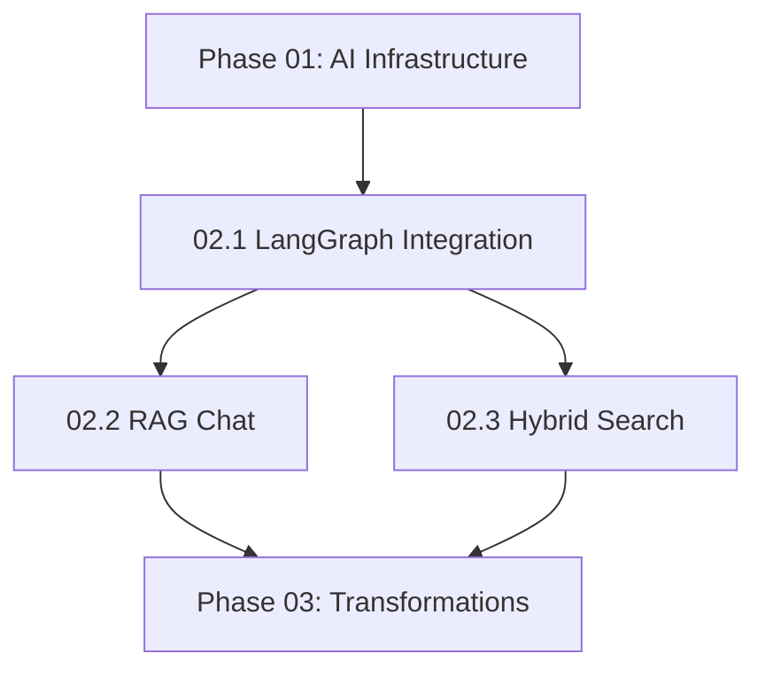

# NextGen Phase 02: Chat & Search Systems

**Sprint Duration:** Week 6-8  
**Priority:** 🔴 CRITICAL  
**Phase Type:** Core Intelligence Features  
**Prerequisites:** Phase 00, Phase 01 Complete  
**Generated:** December 28, 2025  
**Generated By:** BMad Orchestrator Party Mode  

---

## Executive Summary

Phase 02 implements the conversational AI and search capabilities that form the heart of SBF's user experience. This phase introduces LangGraph for workflow orchestration, implements RAG chat with checkpointing, and builds a hybrid search engine combining vector and full-text search.

**Key Outcomes:**
- LangGraph integration in AEI Core (Python)
- RAG chat with conversation memory and checkpointing
- Hybrid search (vector + full-text) with ranking
- Chat API endpoints with streaming support

---

## Sprint 02.1: LangGraph Integration (Days 1-4)

### Objective
Integrate LangGraph into `apps/aei-core` for workflow orchestration.

### Tasks

| ID | Task | Effort | Assignee |
|----|------|--------|----------|
| 02.1.1 | Add LangGraph dependencies to requirements.txt | 1h | Dev |
| 02.1.2 | Create `apps/aei-core/graphs/` directory structure | 1h | Dev |
| 02.1.3 | Implement `provision_langchain_model()` utility | 4h | Dev |
| 02.1.4 | Create base graph state types | 3h | Dev |
| 02.1.5 | Implement PostgreSQL checkpointer for multi-tenant | 6h | Dev |
| 02.1.6 | Create graph compilation utilities | 3h | Dev |
| 02.1.7 | Add Jinja2 prompt templates setup | 3h | Dev |
| 02.1.8 | Write integration tests | 4h | QA |
| 02.1.9 | Document LangGraph patterns | 2h | Dev |

### Directory Structure

```
apps/aei-core/
├── graphs/
│   ├── __init__.py
│   ├── base.py              # Base state types
│   ├── utils.py             # provision_langchain_model
│   ├── checkpointer.py      # PostgreSQL checkpointer
│   ├── chat.py              # Chat workflow (Sprint 02.2)
│   ├── ask.py               # RAG workflow (Sprint 02.2)
│   └── source_ingestion.py  # Content workflow (later)
├── prompts/
│   ├── __init__.py
│   ├── chat.jinja
│   ├── ask/
│   │   ├── entry.jinja
│   │   ├── query_process.jinja
│   │   └── answer.jinja
│   └── utils.py
```

### Reference Files

| Source | File | Pattern to Copy |
|--------|------|-----------------|
| Open Notebook | `references/external-repos/open-notebook-main/open_notebook/graphs/chat.py` | LangGraph chat pattern |
| Open Notebook | `references/external-repos/open-notebook-main/open_notebook/graphs/utils.py` | Model provisioning |
| Open Notebook | `references/external-repos/open-notebook-main/open_notebook/config.py` | Checkpoint config |

### PostgreSQL Checkpointer (Multi-Tenant)

```python
# apps/aei-core/graphs/checkpointer.py
from typing import Optional
from langgraph.checkpoint.base import BaseCheckpointSaver
import asyncpg

class PostgresCheckpointer(BaseCheckpointSaver):
    """
    Multi-tenant PostgreSQL checkpointer for LangGraph.
    Isolates chat state by tenant_id.
    """
    
    def __init__(self, connection_pool: asyncpg.Pool, tenant_id: str):
        self.pool = connection_pool
        self.tenant_id = tenant_id
        self.table_name = f"langgraph_checkpoints"
    
    async def setup(self):
        """Create checkpoint table if not exists."""
        async with self.pool.acquire() as conn:
            await conn.execute(f"""
                CREATE TABLE IF NOT EXISTS {self.table_name} (
                    id UUID PRIMARY KEY DEFAULT gen_random_uuid(),
                    tenant_id UUID NOT NULL,
                    thread_id TEXT NOT NULL,
                    checkpoint_id TEXT NOT NULL,
                    parent_id TEXT,
                    checkpoint JSONB NOT NULL,
                    metadata JSONB DEFAULT '{{}}',
                    created_at TIMESTAMP DEFAULT NOW(),
                    UNIQUE(tenant_id, thread_id, checkpoint_id)
                );
                
                CREATE INDEX IF NOT EXISTS idx_checkpoints_tenant_thread 
                ON {self.table_name}(tenant_id, thread_id);
                
                -- Enable RLS
                ALTER TABLE {self.table_name} ENABLE ROW LEVEL SECURITY;
                
                CREATE POLICY tenant_isolation ON {self.table_name}
                USING (tenant_id = current_setting('app.current_tenant_id')::UUID);
            """)
    
    async def get(self, config: dict) -> Optional[dict]:
        thread_id = config.get("configurable", {}).get("thread_id")
        async with self.pool.acquire() as conn:
            row = await conn.fetchrow(f"""
                SELECT checkpoint FROM {self.table_name}
                WHERE tenant_id = $1 AND thread_id = $2
                ORDER BY created_at DESC LIMIT 1
            """, self.tenant_id, thread_id)
            return row["checkpoint"] if row else None
    
    async def put(self, config: dict, checkpoint: dict, metadata: dict) -> dict:
        thread_id = config.get("configurable", {}).get("thread_id")
        checkpoint_id = checkpoint.get("id", str(uuid.uuid4()))
        
        async with self.pool.acquire() as conn:
            await conn.execute(f"""
                INSERT INTO {self.table_name} 
                (tenant_id, thread_id, checkpoint_id, checkpoint, metadata)
                VALUES ($1, $2, $3, $4, $5)
                ON CONFLICT (tenant_id, thread_id, checkpoint_id) 
                DO UPDATE SET checkpoint = $4, metadata = $5
            """, self.tenant_id, thread_id, checkpoint_id, 
                json.dumps(checkpoint), json.dumps(metadata))
        
        return {"configurable": {"thread_id": thread_id, "checkpoint_id": checkpoint_id}}
```

### Model Provisioning Utility

```python
# apps/aei-core/graphs/utils.py
from typing import Optional, Literal
from langchain_openai import ChatOpenAI
from langchain_anthropic import ChatAnthropic
from langchain_google_genai import ChatGoogleGenerativeAI

async def provision_langchain_model(
    prompt: str,
    model_id: Optional[str] = None,
    task_type: Literal["chat", "transformation", "embedding"] = "chat",
    max_tokens: int = 4096
):
    """
    Provision a LangChain model based on model_id or default for task type.
    """
    # Get model config from database
    if model_id:
        model_config = await get_model_config(model_id)
    else:
        model_config = await get_default_model_config(task_type)
    
    provider = model_config["provider"]
    model_name = model_config["model_id"]
    
    if provider == "openai":
        return ChatOpenAI(
            model=model_name,
            max_tokens=max_tokens,
            streaming=True
        )
    elif provider == "anthropic":
        return ChatAnthropic(
            model=model_name,
            max_tokens=max_tokens,
            streaming=True
        )
    elif provider == "google":
        return ChatGoogleGenerativeAI(
            model=model_name,
            max_tokens=max_tokens
        )
    else:
        raise ValueError(f"Unsupported provider: {provider}")
```

### Acceptance Criteria

- [ ] LangGraph compiles and runs in AEI Core
- [ ] PostgreSQL checkpointer isolates by tenant_id
- [ ] Model provisioning works with ModelManager from Phase 01
- [ ] Jinja2 prompt templates render correctly
- [ ] Integration tests pass with test database

---

## Sprint 02.2: RAG Chat Implementation (Days 5-10)

### Objective
Build the production RAG chat system with context injection and streaming.

### Tasks

| ID | Task | Effort | Assignee |
|----|------|--------|----------|
| 02.2.1 | Implement `ThreadState` TypedDict | 2h | Dev |
| 02.2.2 | Implement `call_model_with_messages` node | 4h | Dev |
| 02.2.3 | Integrate ContextBuilder for RAG context | 4h | Dev |
| 02.2.4 | Add thinking tag cleanup for reasoning models | 2h | Dev |
| 02.2.5 | Implement chat graph compilation | 3h | Dev |
| 02.2.6 | Create chat API endpoint (POST /chat) | 4h | Dev |
| 02.2.7 | Implement streaming SSE endpoint | 6h | Dev |
| 02.2.8 | Create chat session management | 4h | Dev |
| 02.2.9 | Add chat message persistence | 3h | Dev |
| 02.2.10 | Implement model override per-session | 2h | Dev |
| 02.2.11 | Write end-to-end chat tests | 4h | QA |
| 02.2.12 | Document chat API | 2h | Dev |

### Chat Graph Implementation

```python
# apps/aei-core/graphs/chat.py
from typing import Annotated, Optional
from typing_extensions import TypedDict
from langchain_core.messages import AIMessage, SystemMessage
from langchain_core.runnables import RunnableConfig
from langgraph.graph import END, START, StateGraph
from langgraph.graph.message import add_messages
from ai_prompter import Prompter

from open_notebook.utils import clean_thinking_content
from .checkpointer import PostgresCheckpointer
from .utils import provision_langchain_model


class ThreadState(TypedDict):
    messages: Annotated[list, add_messages]
    notebook_id: Optional[str]
    context: Optional[str]
    context_config: Optional[dict]
    model_override: Optional[str]
    tenant_id: str  # SBF-specific: multi-tenant


def call_model_with_messages(state: ThreadState, config: RunnableConfig) -> dict:
    """Main chat node that calls the LLM with context."""
    
    # Render system prompt with context
    system_prompt = Prompter(prompt_template="chat").render(data=state)
    
    # Build message payload
    payload = [SystemMessage(content=system_prompt)] + state.get("messages", [])
    
    # Get model (override or default)
    model_id = config.get("configurable", {}).get("model_id") or state.get("model_override")
    model = provision_langchain_model_sync(
        str(payload), 
        model_id, 
        "chat", 
        max_tokens=8192
    )
    
    # Invoke model
    ai_message = model.invoke(payload)
    
    # Clean thinking tags from response
    content = ai_message.content if isinstance(ai_message.content, str) else str(ai_message.content)
    cleaned_content = clean_thinking_content(content)
    cleaned_message = ai_message.model_copy(update={"content": cleaned_content})
    
    return {"messages": cleaned_message}


def create_chat_graph(checkpointer: PostgresCheckpointer):
    """Create and compile the chat graph with checkpointing."""
    
    agent_state = StateGraph(ThreadState)
    agent_state.add_node("agent", call_model_with_messages)
    agent_state.add_edge(START, "agent")
    agent_state.add_edge("agent", END)
    
    return agent_state.compile(checkpointer=checkpointer)
```

### Chat Prompt Template

```jinja
{# apps/aei-core/prompts/chat.jinja #}
You are an intelligent research assistant for the Second Brain Foundation platform.


## Research Context

The user has the following sources and notes in their notebook:

{{ context }}



## Instructions

1. Answer questions based on the provided context when available
2. If the context doesn't contain relevant information, say so clearly
3. Use citations in the format [Source: title] when referencing specific sources
4. Be concise but thorough
5. If asked to perform tasks outside your capabilities, explain what you can help with


Current Notebook ID: {{ notebook_id }}

```

### Reference Files

| Source | File | Pattern to Copy |
|--------|------|-----------------|
| Open Notebook | `references/external-repos/open-notebook-main/open_notebook/graphs/chat.py` | Full chat graph |
| Open Notebook | `references/external-repos/open-notebook-main/open_notebook/utils/text_utils.py` | `clean_thinking_content()` |
| HyperbookLM | `references/external-repos/hyperbooklm-main/hooks/useChat.ts` | Client-side streaming |

### Streaming API Endpoint

```python
# apps/aei-core/api/chat_routes.py
from fastapi import APIRouter, Depends
from fastapi.responses import StreamingResponse
from sse_starlette.sse import EventSourceResponse
import json

router = APIRouter(prefix="/chat", tags=["chat"])

@router.post("/{session_id}/message")
async def send_message(
    session_id: str,
    request: ChatMessageRequest,
    tenant_id: str = Depends(get_tenant_id),
    db: AsyncSession = Depends(get_db)
):
    """Send a message and get a response (non-streaming)."""
    
    # Load chat graph with tenant checkpointer
    checkpointer = PostgresCheckpointer(db, tenant_id)
    graph = create_chat_graph(checkpointer)
    
    # Get context if notebook is attached
    context = None
    if request.notebook_id:
        context = await build_context(request.notebook_id, request.context_config)
    
    # Invoke graph
    result = await graph.ainvoke(
        {
            "messages": [{"role": "user", "content": request.message}],
            "notebook_id": request.notebook_id,
            "context": context,
            "tenant_id": tenant_id,
        },
        config={"configurable": {"thread_id": session_id}}
    )
    
    return ChatMessageResponse(
        message=result["messages"][-1].content,
        session_id=session_id
    )


@router.post("/{session_id}/stream")
async def stream_message(
    session_id: str,
    request: ChatMessageRequest,
    tenant_id: str = Depends(get_tenant_id)
):
    """Send a message and stream the response via SSE."""
    
    async def event_generator():
        checkpointer = PostgresCheckpointer(db, tenant_id)
        graph = create_chat_graph(checkpointer)
        
        context = None
        if request.notebook_id:
            context = await build_context(request.notebook_id, request.context_config)
        
        async for event in graph.astream_events(
            {
                "messages": [{"role": "user", "content": request.message}],
                "notebook_id": request.notebook_id,
                "context": context,
                "tenant_id": tenant_id,
            },
            config={"configurable": {"thread_id": session_id}},
            version="v2"
        ):
            if event["event"] == "on_chat_model_stream":
                chunk = event["data"]["chunk"]
                if chunk.content:
                    yield {
                        "event": "token",
                        "data": json.dumps({"content": chunk.content})
                    }
            elif event["event"] == "on_chat_model_end":
                yield {
                    "event": "done",
                    "data": json.dumps({"finish_reason": "stop"})
                }
    
    return EventSourceResponse(event_generator())
```

### Acceptance Criteria

- [ ] Chat persists across sessions via checkpointing
- [ ] Context injection from ContextBuilder works
- [ ] Streaming responses work via SSE
- [ ] Thinking tags cleaned from Claude/reasoning model responses
- [ ] Model override per-session works
- [ ] Chat messages persisted to database
- [ ] Multi-tenant isolation verified

---

## Sprint 02.3: Hybrid Search Service (Days 11-16)

### Objective
Build a search engine combining vector similarity and full-text search.

### Tasks

| ID | Task | Effort | Assignee |
|----|------|--------|----------|
| 02.3.1 | Create `packages/@sbf/search-engine` package | 2h | Dev |
| 02.3.2 | Implement `TextSearchService` with PostgreSQL FTS | 4h | Dev |
| 02.3.3 | Implement `VectorSearchService` with Pinecone | 4h | Dev |
| 02.3.4 | Implement `HybridSearchService` combining both | 6h | Dev |
| 02.3.5 | Implement result ranking and deduplication | 4h | Dev |
| 02.3.6 | Add search filters (entity type, date range, notebook) | 4h | Dev |
| 02.3.7 | Create search API endpoints | 4h | Dev |
| 02.3.8 | Add search result highlighting | 3h | Dev |
| 02.3.9 | Write search tests with fixtures | 4h | QA |
| 02.3.10 | Document search API | 2h | Dev |

### Package Structure

```
packages/@sbf/search-engine/
├── package.json
├── tsconfig.json
├── README.md
├── src/
│   ├── index.ts
│   ├── services/
│   │   ├── SearchService.ts
│   │   ├── TextSearchService.ts
│   │   ├── VectorSearchService.ts
│   │   └── HybridSearchService.ts
│   ├── models/
│   │   ├── SearchQuery.ts
│   │   ├── SearchResult.ts
│   │   └── SearchFilters.ts
│   ├── ranking/
│   │   ├── ResultRanker.ts
│   │   └── ScoreNormalizer.ts
│   └── utils/
│       ├── highlighter.ts
│       └── deduplicator.ts
└── tests/
    ├── TextSearchService.test.ts
    ├── VectorSearchService.test.ts
    └── HybridSearchService.test.ts
```

### Reference Files

| Source | File | Pattern to Copy |
|--------|------|-----------------|
| Open Notebook | `references/external-repos/open-notebook-main/api/search_service.py` | Hybrid search implementation |
| Open Notebook | `references/external-repos/open-notebook-main/open_notebook/database/repository.py` | Query patterns |

### Search Service Implementation

```typescript
// packages/@sbf/search-engine/src/services/HybridSearchService.ts
import { SearchService, SearchQuery, SearchResult, SearchFilters } from '../models';
import { TextSearchService } from './TextSearchService';
import { VectorSearchService } from './VectorSearchService';
import { ResultRanker } from '../ranking/ResultRanker';
import { deduplicateResults } from '../utils/deduplicator';

export class HybridSearchService implements SearchService {
  constructor(
    private textSearch: TextSearchService,
    private vectorSearch: VectorSearchService,
    private ranker: ResultRanker
  ) {}

  async search(
    tenantId: string,
    query: SearchQuery
  ): Promise<SearchResult[]> {
    const results: SearchResult[] = [];
    
    // Execute searches based on query type
    const promises: Promise<SearchResult[]>[] = [];
    
    if (query.type === 'vector' || query.type === 'hybrid') {
      promises.push(this.vectorSearch.search(tenantId, query));
    }
    
    if (query.type === 'text' || query.type === 'hybrid') {
      promises.push(this.textSearch.search(tenantId, query));
    }
    
    // Wait for all searches
    const allResults = await Promise.all(promises);
    results.push(...allResults.flat());
    
    // Deduplicate and rank
    const deduped = deduplicateResults(results);
    const ranked = this.ranker.rank(deduped, query);
    
    // Apply filters and limits
    return this.applyFilters(ranked, query.filters)
      .slice(0, query.limit || 100);
  }

  private applyFilters(
    results: SearchResult[],
    filters?: SearchFilters
  ): SearchResult[] {
    if (!filters) return results;
    
    return results.filter(result => {
      if (filters.entityTypes?.length && 
          !filters.entityTypes.includes(result.entityType)) {
        return false;
      }
      
      if (filters.notebookId && result.notebookId !== filters.notebookId) {
        return false;
      }
      
      if (filters.dateRange) {
        const date = new Date(result.createdAt);
        if (date < filters.dateRange.start || date > filters.dateRange.end) {
          return false;
        }
      }
      
      if (filters.minimumScore && result.score < filters.minimumScore) {
        return false;
      }
      
      return true;
    });
  }
}
```

### Text Search with PostgreSQL

```typescript
// packages/@sbf/search-engine/src/services/TextSearchService.ts
export class TextSearchService {
  constructor(private db: DatabaseClient) {}

  async search(tenantId: string, query: SearchQuery): Promise<SearchResult[]> {
    const results = await this.db.withTenant(tenantId).query<SearchRow>(`
      SELECT 
        id,
        entity_type,
        title,
        content,
        ts_rank(
          to_tsvector('english', coalesce(title, '') || ' ' || content),
          plainto_tsquery('english', $1)
        ) as rank,
        ts_headline(
          'english',
          content,
          plainto_tsquery('english', $1),
          'StartSel=<mark>, StopSel=</mark>, MaxWords=35, MinWords=15'
        ) as snippet
      FROM entities
      WHERE to_tsvector('english', coalesce(title, '') || ' ' || content) 
            @@ plainto_tsquery('english', $1)
      ORDER BY rank DESC
      LIMIT $2
    `, [query.text, query.limit || 100]);

    return results.map(row => ({
      id: row.id,
      entityType: row.entity_type,
      title: row.title,
      snippet: row.snippet,
      score: row.rank,
      searchType: 'text',
    }));
  }
}
```

### Vector Search with Pinecone

```typescript
// packages/@sbf/search-engine/src/services/VectorSearchService.ts
import { PineconeClient } from '@pinecone-database/pinecone';

export class VectorSearchService {
  constructor(
    private pinecone: PineconeClient,
    private embeddingProvider: EmbeddingProvider,
    private indexName: string
  ) {}

  async search(tenantId: string, query: SearchQuery): Promise<SearchResult[]> {
    // Generate query embedding
    const embedding = await this.embeddingProvider.embed(query.text);
    
    // Query Pinecone with tenant namespace
    const index = this.pinecone.Index(this.indexName);
    const results = await index.namespace(tenantId).query({
      vector: embedding,
      topK: query.limit || 100,
      includeMetadata: true,
    });

    return results.matches.map(match => ({
      id: match.id,
      entityType: match.metadata?.entityType as string,
      title: match.metadata?.title as string,
      snippet: match.metadata?.content?.substring(0, 200) + '...',
      score: match.score,
      searchType: 'vector',
    }));
  }
}
```

### Acceptance Criteria

- [ ] Text search uses PostgreSQL full-text search
- [ ] Vector search queries Pinecone with tenant namespace
- [ ] Hybrid search combines and deduplicates results
- [ ] Results ranked by combined relevance score
- [ ] Filters work (entity type, notebook, date range, minimum score)
- [ ] Search results include highlighted snippets
- [ ] API endpoints support all three search modes

---

## 🔴 BLIND SPOTS IDENTIFIED IN PHASE 02

### Blind Spot 1: LangGraph Version Compatibility

**Issue:** LangGraph API changes frequently. Code may break with updates.

**Mitigation:** 
- Pin exact versions in requirements.txt
- Add CI tests that verify graph compilation
- Document tested version combinations

### Blind Spot 2: Checkpoint Size Growth

**Issue:** Long chat sessions will accumulate large checkpoints.

**Mitigation:**
- Add checkpoint pruning (keep last N checkpoints per thread)
- Implement checkpoint compression
- Add monitoring for checkpoint table size

### Blind Spot 3: Context Window Overflow

**Issue:** Large notebooks could exceed model context limits.

**Mitigation:**
- ContextBuilder already handles this (from Phase 00)
- Add warning when truncation occurs
- Log truncated content for debugging

### Blind Spot 4: Search Result Staleness

**Issue:** Vector embeddings may be outdated when content changes.

**Mitigation:**
- Trigger re-embedding on content update
- Add `embedding_updated_at` timestamp
- Consider background job to re-embed stale content

### Blind Spot 5: Cross-Notebook Search

**Issue:** Users may want to search across all notebooks, not just one.

**Mitigation:**
- Add `searchAllNotebooks` flag to SearchQuery
- Ensure RLS still isolates by tenant
- Add notebook grouping in results

### Blind Spot 6: Search Query Expansion

**Issue:** User queries may not match exact terms in content.

**Mitigation:**
- Add synonym expansion
- Consider query rewriting with LLM
- Add "did you mean" suggestions

### Blind Spot 7: Async Event Loop Conflicts

**Issue:** Open Notebook's chat.py has complex async handling to avoid event loop conflicts.

**Mitigation:** Copy the `run_in_new_loop()` pattern from Open Notebook exactly:
```python
def run_in_new_loop():
    new_loop = asyncio.new_event_loop()
    try:
        asyncio.set_event_loop(new_loop)
        return new_loop.run_until_complete(async_operation())
    finally:
        new_loop.close()
        asyncio.set_event_loop(None)
```

---

## Phase 02 Dependencies



## Definition of Done

Phase 02 is complete when:

- [ ] LangGraph running in AEI Core
- [ ] Chat sessions persist and resume correctly
- [ ] Streaming responses work end-to-end
- [ ] Hybrid search returns relevant results
- [ ] All endpoints documented in OpenAPI
- [ ] Performance: <500ms for search, <2s for first chat token

---

## Estimated Timeline

| Sprint | Duration | Cumulative |
|--------|----------|------------|
| 02.1 LangGraph Integration | 4 days | Day 4 |
| 02.2 RAG Chat Implementation | 6 days | Day 10 |
| 02.3 Hybrid Search Service | 6 days | Day 16 |

**Total:** 16 working days (~3.5 weeks)

---

## Dependencies to Install

```python
# apps/aei-core/requirements.txt additions
langgraph>=0.2.0
langchain>=0.3.0
langchain-core>=0.3.0
langchain-openai>=0.2.0
langchain-anthropic>=0.2.0
langchain-google-genai>=2.0.0
ai-prompter>=0.5.0
sse-starlette>=1.0.0
jinja2>=3.0.0
```

```json
// packages/@sbf/search-engine/package.json
{
  "dependencies": {
    "@pinecone-database/pinecone": "^3.0.0",
    "@sbf/ai-client": "workspace:*",
    "@sbf/db-client": "workspace:*"
  }
}
```

---

*Generated by BMad Orchestrator Party Mode*  
*Phase 02 Version: 1.0*
