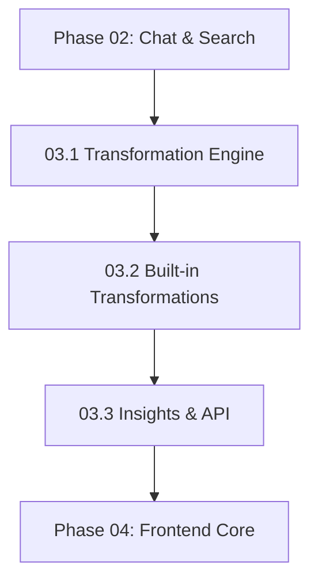

# NextGen Phase 03: Transformations & Insights

**Sprint Duration:** Week 9-10  
**Priority:** 🟡 HIGH  
**Phase Type:** Content Intelligence  
**Prerequisites:** Phase 02 Complete  
**Generated:** December 28, 2025  
**Generated By:** BMad Orchestrator Party Mode  

---

## Executive Summary

Phase 03 implements the transformation engine that converts raw content into structured insights. This includes summaries, key insights, action items, mind maps, flashcards, and custom transformations. The engine uses Jinja2 templates for prompt customization.

**Key Outcomes:**
- Transformation engine with template system
- 6+ built-in transformations
- Automatic insight generation on source ingestion
- API endpoints for transformation execution
- Custom transformation creation

---

## Sprint 03.1: Transformation Engine Core (Days 1-5)

### Objective
Build the transformation engine package with Jinja2 template support.

### Tasks

| ID | Task | Effort | Assignee |
|----|------|--------|----------|
| 03.1.1 | Create `packages/@sbf/transformation-engine` package | 2h | Dev |
| 03.1.2 | Create `transformations` database migration | 3h | Dev |
| 03.1.3 | Implement `Transformation` entity model | 4h | Dev |
| 03.1.4 | Implement Jinja2 template renderer | 4h | Dev |
| 03.1.5 | Implement `TransformationService` | 6h | Dev |
| 03.1.6 | Add output parsing (JSON, markdown, structured) | 4h | Dev |
| 03.1.7 | Integrate with ModelManager for model selection | 3h | Dev |
| 03.1.8 | Implement transformation execution with job runner | 4h | Dev |
| 03.1.9 | Write unit tests | 4h | QA |
| 03.1.10 | Document transformation API | 2h | Dev |

### Package Structure

```
packages/@sbf/transformation-engine/
├── package.json
├── tsconfig.json
├── README.md
├── src/
│   ├── index.ts
│   ├── models/
│   │   ├── Transformation.ts
│   │   ├── TransformationResult.ts
│   │   └── TransformationConfig.ts
│   ├── services/
│   │   ├── TransformationService.ts
│   │   ├── TemplateRenderer.ts
│   │   └── OutputParser.ts
│   ├── templates/
│   │   ├── summary.yaml
│   │   ├── key-insights.yaml
│   │   ├── action-items.yaml
│   │   ├── mindmap.yaml
│   │   ├── flashcards.yaml
│   │   └── study-notes.yaml
│   └── types.ts
└── tests/
    ├── TransformationService.test.ts
    └── TemplateRenderer.test.ts
```

### Database Schema

```sql
-- Migration: 004_transformations.sql

CREATE TABLE transformations (
  id UUID PRIMARY KEY DEFAULT gen_random_uuid(),
  tenant_id UUID REFERENCES tenants(id), -- NULL for system defaults
  name VARCHAR(100) NOT NULL,
  title VARCHAR(255) NOT NULL,
  description TEXT,
  prompt_template TEXT NOT NULL,  -- Jinja2 template
  output_format VARCHAR(50) DEFAULT 'markdown', -- 'markdown', 'json', 'structured'
  output_schema JSONB,  -- JSON schema for structured outputs
  apply_default BOOLEAN DEFAULT false,  -- Auto-apply on source ingestion
  model_override UUID REFERENCES models(id),  -- Use specific model
  created_at TIMESTAMP DEFAULT NOW(),
  updated_at TIMESTAMP DEFAULT NOW(),
  UNIQUE(tenant_id, name)
);

-- Enable RLS
ALTER TABLE transformations ENABLE ROW LEVEL SECURITY;

-- Allow reading system defaults (tenant_id IS NULL) and own tenant
CREATE POLICY transformation_access ON transformations
USING (
  tenant_id IS NULL OR 
  tenant_id = current_setting('app.current_tenant_id')::UUID
);

-- Transformation results
CREATE TABLE transformation_results (
  id UUID PRIMARY KEY DEFAULT gen_random_uuid(),
  tenant_id UUID NOT NULL REFERENCES tenants(id),
  transformation_id UUID NOT NULL REFERENCES transformations(id),
  source_id UUID NOT NULL REFERENCES sources(id),
  content TEXT NOT NULL,
  output_format VARCHAR(50) NOT NULL,
  model_used UUID REFERENCES models(id),
  token_count INTEGER,
  cost DECIMAL(10, 6),
  created_at TIMESTAMP DEFAULT NOW()
);

CREATE INDEX idx_transformation_results_source 
ON transformation_results(source_id);
```

### Reference Files

| Source | File | Pattern to Copy |
|--------|------|-----------------|
| Open Notebook | `references/external-repos/open-notebook-main/open_notebook/domain/transformation.py` | Transformation model |
| Open Notebook | `references/external-repos/open-notebook-main/open_notebook/graphs/transformation.py` | LangGraph transformation |
| HyperbookLM | `references/external-repos/hyperbooklm-main/app/api/gpt/mindmap/route.ts` | Mindmap generation |

### Transformation Model

```typescript
// packages/@sbf/transformation-engine/src/models/Transformation.ts
import { BaseEntity } from '@sbf/domain-base';

export type OutputFormat = 'markdown' | 'json' | 'structured';

export class Transformation extends BaseEntity<Transformation> {
  static tableName = 'transformations';
  
  tenantId?: string;  // null for system defaults
  name!: string;
  title!: string;
  description?: string;
  promptTemplate!: string;  // Jinja2
  outputFormat!: OutputFormat;
  outputSchema?: Record<string, unknown>;  // JSON Schema
  applyDefault!: boolean;
  modelOverride?: string;
  
  static async getSystemDefaults(): Promise<Transformation[]> {
    return this.findWhere({ tenantId: null });
  }
  
  static async getForTenant(tenantId: string): Promise<Transformation[]> {
    const systemDefaults = await this.getSystemDefaults();
    const tenantCustom = await this.findWhere({ tenantId });
    return [...systemDefaults, ...tenantCustom];
  }
  
  static async getDefaultsForIngestion(tenantId: string): Promise<Transformation[]> {
    return this.findWhere({ applyDefault: true, tenantId: [null, tenantId] });
  }
}
```

### Template Renderer

```typescript
// packages/@sbf/transformation-engine/src/services/TemplateRenderer.ts
import nunjucks from 'nunjucks';

export class TemplateRenderer {
  private env: nunjucks.Environment;
  
  constructor() {
    this.env = new nunjucks.Environment(null, { autoescape: false });
    
    // Add custom filters
    this.env.addFilter('truncate', (str: string, length: number) => {
      return str.length > length ? str.substring(0, length) + '...' : str;
    });
    
    this.env.addFilter('wordcount', (str: string) => {
      return str.split(/\s+/).length;
    });
  }
  
  render(template: string, data: TransformationContext): string {
    return this.env.renderString(template, data);
  }
}

export interface TransformationContext {
  source: {
    title: string;
    url?: string;
    content: string;
    fullText?: string;
    topics?: string[];
  };
  notebook?: {
    name: string;
    description?: string;
  };
  config?: {
    maxLength?: number;
    language?: string;
    style?: string;
  };
}
```

### Transformation Service

```typescript
// packages/@sbf/transformation-engine/src/services/TransformationService.ts
import { ModelManager } from '@sbf/ai-client';
import { JobRunner } from '@sbf/job-runner';
import { Transformation, TransformationResult } from '../models';
import { TemplateRenderer } from './TemplateRenderer';
import { OutputParser } from './OutputParser';

export class TransformationService {
  constructor(
    private modelManager: ModelManager,
    private templateRenderer: TemplateRenderer,
    private outputParser: OutputParser,
    private jobRunner: JobRunner
  ) {}
  
  async execute(
    tenantId: string,
    transformationId: string,
    sourceId: string,
    options?: ExecutionOptions
  ): Promise<TransformationResult> {
    // Load transformation and source
    const transformation = await Transformation.get(transformationId);
    const source = await Source.get(sourceId);
    
    // Render prompt template
    const prompt = this.templateRenderer.render(
      transformation.promptTemplate,
      { source, config: options?.config }
    );
    
    // Get model
    const modelId = transformation.modelOverride || 
      await this.modelManager.getDefaultModel(tenantId, 'transformation');
    const provider = await this.modelManager.createProvider(modelId);
    
    // Execute transformation
    const response = await provider.complete([
      { role: 'user', content: prompt }
    ], {
      maxTokens: options?.maxTokens || 4096,
      temperature: 0.3,  // Lower for more consistent outputs
    });
    
    // Parse output
    const parsedContent = this.outputParser.parse(
      response.content,
      transformation.outputFormat,
      transformation.outputSchema
    );
    
    // Save result
    const result = new TransformationResult({
      tenantId,
      transformationId,
      sourceId,
      content: parsedContent,
      outputFormat: transformation.outputFormat,
      modelUsed: modelId,
      tokenCount: response.usage?.totalTokens,
      cost: this.calculateCost(response.usage, modelId),
    });
    
    await result.save();
    return result;
  }
  
  async executeAsync(
    tenantId: string,
    transformationId: string,
    sourceId: string
  ): Promise<string> {
    // Returns job handle for async execution
    return this.jobRunner.enqueue({
      type: 'transformation',
      tenantId,
      transformationId,
      sourceId,
    });
  }
}
```

### Acceptance Criteria

- [ ] Transformation entity supports system and tenant-level definitions
- [ ] Jinja2 templates render correctly with source data
- [ ] Output parsing handles markdown, JSON, and structured formats
- [ ] Model selection respects transformation override
- [ ] Async execution via job runner works
- [ ] Cost tracking integrated

---

## Sprint 03.2: Built-in Transformations (Days 6-8)

### Objective
Create the 6+ built-in transformations for common use cases.

### Tasks

| ID | Task | Effort | Assignee |
|----|------|--------|----------|
| 03.2.1 | Create Summary transformation template | 2h | Dev |
| 03.2.2 | Create Key Insights transformation template | 2h | Dev |
| 03.2.3 | Create Action Items transformation template | 2h | Dev |
| 03.2.4 | Create Mind Map transformation template | 3h | Dev |
| 03.2.5 | Create Flashcards transformation template | 3h | Dev |
| 03.2.6 | Create Study Notes transformation template | 2h | Dev |
| 03.2.7 | Create seed script to insert system defaults | 2h | Dev |
| 03.2.8 | Test all transformations with real content | 4h | QA |

### Built-in Templates

#### Summary Template
```yaml
# templates/summary.yaml
name: summary
title: Summary
description: Generate a concise summary of the source content
output_format: markdown
apply_default: true
prompt_template: |
  Please provide a concise summary of the following content.
  
  ## Guidelines
  - Keep the summary between 100-300 words
  - Highlight the main points and key takeaways
  - Use bullet points for clarity when appropriate
  - Maintain the original tone and context
  
  ## Content
  Title: {{ source.title }}
  URL: {{ source.url }}
  
  {{ source.content | truncate(10000) }}
  
  ## Output
  Provide your summary in markdown format.
```

#### Key Insights Template
```yaml
# templates/key-insights.yaml
name: key-insights
title: Key Insights
description: Extract the most important insights from the content
output_format: json
output_schema:
  type: array
  items:
    type: object
    properties:
      insight:
        type: string
      importance:
        type: string
        enum: [critical, high, medium]
      related_quote:
        type: string
apply_default: true
prompt_template: |
  Analyze the following content and extract the key insights.
  
  ## Guidelines
  - Identify 3-7 key insights
  - Rate each insight by importance (critical, high, medium)
  - Include a relevant quote from the source for each insight
  
  ## Content
  {{ source.content | truncate(10000) }}
  
  ## Output Format
  Return a JSON array of insights:
  ```json
  [
    {
      "insight": "The main finding or key point",
      "importance": "critical|high|medium",
      "related_quote": "Quote from the source"
    }
  ]
  ```
```

#### Mind Map Template (JSON for React Flow)
```yaml
# templates/mindmap.yaml
name: mindmap
title: Mind Map
description: Generate a hierarchical mind map structure
output_format: json
output_schema:
  type: object
  properties:
    title:
      type: string
    children:
      type: array
      items:
        $ref: "#"
apply_default: false
prompt_template: |
  Create a hierarchical mind map structure from the following content.
  
  ## Guidelines
  - Root node should be the main topic
  - First level: 3-5 main themes
  - Second level: Key points under each theme
  - Maximum 3 levels deep
  
  ## Content
  {{ source.content | truncate(8000) }}
  
  ## Output Format
  Return a JSON object representing the mind map:
  ```json
  {
    "title": "Main Topic",
    "children": [
      {
        "title": "Theme 1",
        "children": [
          {"title": "Point 1"},
          {"title": "Point 2"}
        ]
      }
    ]
  }
  ```
```

#### Flashcards Template
```yaml
# templates/flashcards.yaml
name: flashcards
title: Flashcards
description: Generate Q&A flashcards for learning
output_format: json
output_schema:
  type: array
  items:
    type: object
    properties:
      question:
        type: string
      answer:
        type: string
      difficulty:
        type: string
        enum: [easy, medium, hard]
apply_default: false
prompt_template: |
  Create flashcards for studying the following content.
  
  ## Guidelines
  - Generate 5-15 flashcards
  - Questions should test understanding, not just recall
  - Answers should be concise but complete
  - Rate difficulty (easy, medium, hard)
  
  ## Content
  {{ source.content | truncate(8000) }}
  
  ## Output Format
  Return a JSON array of flashcards:
  ```json
  [
    {
      "question": "What is...",
      "answer": "The answer is...",
      "difficulty": "medium"
    }
  ]
  ```
```

### Reference Files

| Source | File | Pattern to Copy |
|--------|------|-----------------|
| HyperbookLM | `references/external-repos/hyperbooklm-main/app/api/gpt/mindmap/route.ts` | Mind map JSON format |
| Open Notebook | `references/external-repos/open-notebook-main/open_notebook/domain/transformation.py` | Transformation patterns |

### Acceptance Criteria

- [ ] All 6 built-in transformations work correctly
- [ ] JSON outputs validate against schemas
- [ ] Transformations handle long content gracefully
- [ ] Seed script creates system defaults
- [ ] Each transformation has clear description

---

## Sprint 03.3: Insight Generation & API (Days 9-12)

### Objective
Integrate transformations into source ingestion and expose via API.

### Tasks

| ID | Task | Effort | Assignee |
|----|------|--------|----------|
| 03.3.1 | Create `source_insights` database table | 2h | Dev |
| 03.3.2 | Implement `InsightService` | 4h | Dev |
| 03.3.3 | Integrate insight generation into content pipeline | 4h | Dev |
| 03.3.4 | Create transformation API routes | 4h | Dev |
| 03.3.5 | Create insights API routes | 3h | Dev |
| 03.3.6 | Add webhook for transformation completion | 3h | Dev |
| 03.3.7 | Write API tests | 4h | QA |
| 03.3.8 | Document transformation API | 2h | Dev |

### Source Insights Table

```sql
-- Already defined in Part 3.2 of blueprint, but adding here for clarity

CREATE TABLE source_insights (
  id UUID PRIMARY KEY DEFAULT gen_random_uuid(),
  tenant_id UUID NOT NULL REFERENCES tenants(id),
  source_id UUID NOT NULL REFERENCES sources(id),
  insight_type VARCHAR(50) NOT NULL, -- 'summary', 'key-insights', etc.
  content TEXT NOT NULL,
  transformation_id UUID REFERENCES transformations(id),
  created_at TIMESTAMP DEFAULT NOW()
);

CREATE INDEX idx_source_insights_source ON source_insights(source_id);
CREATE INDEX idx_source_insights_type ON source_insights(insight_type);
```

### Insight Service

```typescript
// packages/@sbf/transformation-engine/src/services/InsightService.ts
export class InsightService {
  constructor(
    private transformationService: TransformationService
  ) {}
  
  async generateInsights(
    tenantId: string,
    sourceId: string
  ): Promise<SourceInsight[]> {
    // Get default transformations
    const defaults = await Transformation.getDefaultsForIngestion(tenantId);
    
    // Execute each transformation
    const results = await Promise.all(
      defaults.map(t => 
        this.transformationService.execute(tenantId, t.id!, sourceId)
      )
    );
    
    // Save as insights
    const insights = results.map(result => new SourceInsight({
      tenantId,
      sourceId,
      insightType: result.transformation.name,
      content: result.content,
      transformationId: result.transformationId,
    }));
    
    await Promise.all(insights.map(i => i.save()));
    return insights;
  }
  
  async getInsightsForSource(
    sourceId: string
  ): Promise<SourceInsight[]> {
    return SourceInsight.findWhere({ sourceId });
  }
}
```

### API Routes

```typescript
// apps/api/src/routes/transformations.routes.ts
import { Router } from 'express';

const router = Router();

// List available transformations (system + tenant)
router.get('/', async (req, res) => {
  const transformations = await Transformation.getForTenant(req.tenantId);
  res.json(transformations);
});

// Get single transformation
router.get('/:id', async (req, res) => {
  const transformation = await Transformation.get(req.params.id);
  res.json(transformation);
});

// Create custom transformation
router.post('/', async (req, res) => {
  const transformation = new Transformation({
    ...req.body,
    tenantId: req.tenantId,
  });
  await transformation.save();
  res.status(201).json(transformation);
});

// Execute transformation on source
router.post('/:id/execute', async (req, res) => {
  const { sourceId, async: isAsync, config } = req.body;
  
  if (isAsync) {
    const jobHandle = await transformationService.executeAsync(
      req.tenantId,
      req.params.id,
      sourceId
    );
    res.json({ jobHandle, status: 'queued' });
  } else {
    const result = await transformationService.execute(
      req.tenantId,
      req.params.id,
      sourceId,
      { config }
    );
    res.json(result);
  }
});

// Get transformation results for source
router.get('/results/source/:sourceId', async (req, res) => {
  const results = await TransformationResult.findWhere({
    sourceId: req.params.sourceId
  });
  res.json(results);
});
```

### Integration with Content Pipeline

```typescript
// packages/@sbf/content-engine/src/pipeline/steps/InsightStep.ts
import { InsightService } from '@sbf/transformation-engine';

export class InsightStep implements PipelineStep {
  constructor(private insightService: InsightService) {}
  
  async execute(state: PipelineState): Promise<PipelineState> {
    if (!state.source?.id) {
      return state;  // Source not saved yet, skip
    }
    
    // Generate insights in background (don't block pipeline)
    this.insightService.generateInsights(
      state.tenantId,
      state.source.id
    ).catch(err => {
      console.error('Failed to generate insights:', err);
    });
    
    return state;
  }
}
```

### Acceptance Criteria

- [ ] Insights auto-generated when sources ingested
- [ ] API lists all transformations (system + tenant)
- [ ] Custom transformations can be created per tenant
- [ ] Execute endpoint supports sync and async modes
- [ ] Results retrievable by source ID
- [ ] Webhook fires on async completion

---

## 🔴 BLIND SPOTS IDENTIFIED IN PHASE 03

### Blind Spot 1: Token Limits per Transformation

**Issue:** Different transformations need different token budgets. Mindmap needs less than study notes.

**Mitigation:** Add `maxInputTokens` and `maxOutputTokens` to Transformation model.

### Blind Spot 2: Transformation Versioning

**Issue:** When system defaults are updated, existing results may be inconsistent.

**Mitigation:** 
- Add `version` field to transformations
- Store `transformationVersion` with results
- Allow re-running with latest version

### Blind Spot 3: Partial Failure Handling

**Issue:** If one default transformation fails, others should still complete.

**Mitigation:** 
- Use `Promise.allSettled` instead of `Promise.all`
- Log failures but don't block
- Add retry for failed transformations

### Blind Spot 4: Large Source Handling

**Issue:** Sources over 10k tokens need chunking strategy.

**Mitigation:**
- Add chunk-based transformation mode
- Summarize chunks then summarize summaries
- Add `chunkSize` and `chunkOverlap` options

### Blind Spot 5: Output Validation

**Issue:** LLM may not always produce valid JSON for structured outputs.

**Mitigation:**
- Implement robust JSON parsing with error recovery
- Use function calling / tool use for structured outputs
- Add retry with stricter prompt on parse failure

### Blind Spot 6: Custom Template Security

**Issue:** User-created Jinja2 templates could be malicious.

**Mitigation:**
- Use Jinja2 sandbox mode
- Whitelist allowed filters
- Limit template size
- Review templates before activation

### Blind Spot 7: Truth Hierarchy Integration

**Issue:** Transformations are AI-generated (should be L3) but SBF has Truth Hierarchy.

**Mitigation:**
- Set `truthLevel: 'L3'` on all transformation results
- Allow user to promote to `U1` after review
- Use for conflict resolution in chat

---

## Phase 03 Dependencies



## Definition of Done

Phase 03 is complete when:

- [ ] Transformation engine operational
- [ ] 6+ built-in transformations working
- [ ] Insights auto-generated on source ingestion
- [ ] API endpoints for all operations
- [ ] Custom transformations per tenant
- [ ] JSON outputs validate against schemas

---

## Estimated Timeline

| Sprint | Duration | Cumulative |
|--------|----------|------------|
| 03.1 Transformation Engine | 5 days | Day 5 |
| 03.2 Built-in Transformations | 3 days | Day 8 |
| 03.3 Insights & API | 4 days | Day 12 |

**Total:** 12 working days (~2.5 weeks)

---

## Dependencies to Install

```json
// packages/@sbf/transformation-engine/package.json
{
  "dependencies": {
    "@sbf/ai-client": "workspace:*",
    "@sbf/domain-base": "workspace:*",
    "@sbf/job-runner": "workspace:*",
    "@sbf/errors": "workspace:*",
    "nunjucks": "^3.2.4",
    "ajv": "^8.12.0"
  }
}
```

---

*Generated by BMad Orchestrator Party Mode*  
*Phase 03 Version: 1.0*
