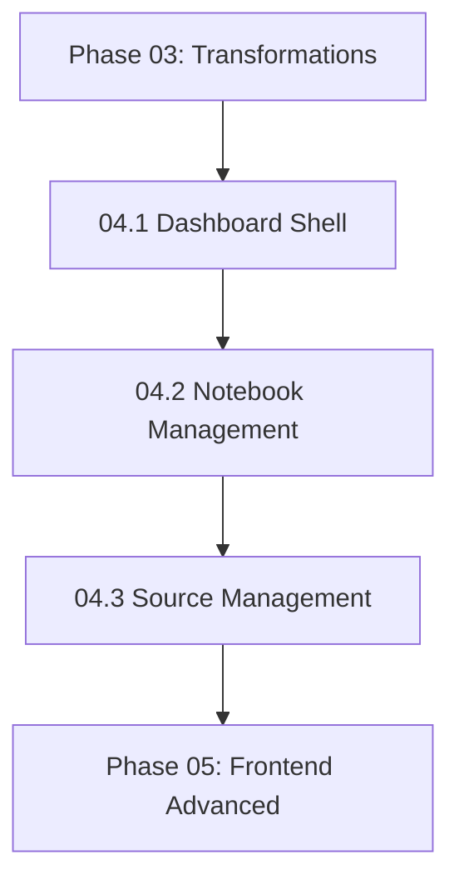

# NextGen Phase 04: Frontend Core

**Sprint Duration:** Week 11-14  
**Priority:** 🔴 CRITICAL  
**Phase Type:** User Interface  
**Prerequisites:** Phase 03 Complete  
**Generated:** December 28, 2025  
**Generated By:** BMad Orchestrator Party Mode  

---

## Executive Summary

Phase 04 begins the frontend revolution, implementing the core dashboard shell, authentication UI, and the foundational CRUD interfaces for notebooks and sources. This phase establishes the component architecture, state management patterns, and API integration layer that all subsequent frontend work builds upon.

**Key Outcomes:**
- Dashboard shell with navigation
- Authentication flow (login, register, logout)
- Notebook CRUD interface
- Source management (upload, scrape, list, delete)
- API client library with type safety
- Zustand stores for state management

---

## Sprint 04.1: Dashboard Shell & Authentication (Days 1-6)

### Objective
Build the application shell and authentication flow.

### Tasks

| ID | Task | Effort | Assignee |
|----|------|--------|----------|
| 04.1.1 | Create dashboard layout with sidebar navigation | 4h | Dev |
| 04.1.2 | Implement responsive header with user menu | 3h | Dev |
| 04.1.3 | Create login page with form validation | 4h | Dev |
| 04.1.4 | Create registration page | 3h | Dev |
| 04.1.5 | Implement auth-store with Zustand | 4h | Dev |
| 04.1.6 | Create protected route wrapper | 3h | Dev |
| 04.1.7 | Implement API client with auth interceptors | 4h | Dev |
| 04.1.8 | Add token refresh logic | 3h | Dev |
| 04.1.9 | Create loading states and skeletons | 3h | Dev |
| 04.1.10 | Write component tests | 4h | QA |
| 04.1.11 | Ensure mobile responsiveness | 3h | Dev |

### Directory Structure

```
apps/web/src/
├── app/
│   ├── (auth)/
│   │   ├── login/
│   │   │   └── page.tsx
│   │   ├── register/
│   │   │   └── page.tsx
│   │   └── layout.tsx
│   ├── (dashboard)/
│   │   ├── layout.tsx           # Dashboard shell
│   │   ├── page.tsx             # Dashboard home
│   │   ├── notebooks/
│   │   ├── sources/
│   │   ├── chat/
│   │   ├── podcasts/
│   │   └── settings/
│   ├── layout.tsx
│   └── page.tsx                 # Landing/redirect
├── components/
│   ├── layout/
│   │   ├── DashboardShell.tsx
│   │   ├── Sidebar.tsx
│   │   ├── Header.tsx
│   │   └── UserMenu.tsx
│   ├── ui/                      # shadcn/ui components
│   └── common/
│       ├── LoadingSpinner.tsx
│       ├── Skeleton.tsx
│       └── EmptyState.tsx
├── lib/
│   ├── api/
│   │   ├── client.ts
│   │   ├── auth.ts
│   │   └── types.ts
│   └── stores/
│       ├── auth-store.ts
│       └── ui-store.ts
```

### Reference Files

| Source | File | Pattern to Copy |
|--------|------|-----------------|
| Open Notebook | Frontend state management | Zustand stores |
| HyperbookLM | `references/external-repos/hyperbooklm-main/components/Navbar.tsx` | Navigation patterns |
| HyperbookLM | Component structure | Clean component organization |

### Dashboard Layout

```tsx
// apps/web/src/app/(dashboard)/layout.tsx
import { Sidebar } from '@/components/layout/Sidebar';
import { Header } from '@/components/layout/Header';
import { ProtectedRoute } from '@/components/auth/ProtectedRoute';

export default function DashboardLayout({
  children,
}: {
  children: React.ReactNode;
}) {
  return (
    <ProtectedRoute>
      <div className="flex h-screen bg-gray-50">
        <Sidebar />
        <div className="flex flex-1 flex-col overflow-hidden">
          <Header />
          <main className="flex-1 overflow-y-auto p-6">
            {children}
          </main>
        </div>
      </div>
    </ProtectedRoute>
  );
}
```

### Sidebar Component

```tsx
// apps/web/src/components/layout/Sidebar.tsx
'use client';

import Link from 'next/link';
import { usePathname } from 'next/navigation';
import { 
  BookOpen, 
  FileText, 
  MessageSquare, 
  Mic, 
  Settings,
  Search,
  Home
} from 'lucide-react';
import { cn } from '@/lib/utils';

const navItems = [
  { href: '/dashboard', icon: Home, label: 'Dashboard' },
  { href: '/notebooks', icon: BookOpen, label: 'Notebooks' },
  { href: '/sources', icon: FileText, label: 'Sources' },
  { href: '/chat', icon: MessageSquare, label: 'Chat' },
  { href: '/search', icon: Search, label: 'Search' },
  { href: '/podcasts', icon: Mic, label: 'Podcasts' },
  { href: '/settings', icon: Settings, label: 'Settings' },
];

export function Sidebar() {
  const pathname = usePathname();
  
  return (
    <aside className="w-64 bg-white border-r border-gray-200 flex flex-col">
      <div className="p-4 border-b">
        <h1 className="text-xl font-bold">Second Brain</h1>
      </div>
      
      <nav className="flex-1 p-4 space-y-1">
        {navItems.map((item) => {
          const isActive = pathname.startsWith(item.href);
          return (
            <Link
              key={item.href}
              href={item.href}
              className={cn(
                'flex items-center gap-3 px-3 py-2 rounded-lg text-sm font-medium transition-colors',
                isActive
                  ? 'bg-gray-100 text-gray-900'
                  : 'text-gray-600 hover:bg-gray-50 hover:text-gray-900'
              )}
            >
              <item.icon className="h-5 w-5" />
              {item.label}
            </Link>
          );
        })}
      </nav>
    </aside>
  );
}
```

### Auth Store (Zustand)

```typescript
// apps/web/src/lib/stores/auth-store.ts
import { create } from 'zustand';
import { persist } from 'zustand/middleware';
import { api } from '@/lib/api/client';

interface User {
  id: string;
  email: string;
  name: string;
  tenantId: string;
}

interface AuthState {
  user: User | null;
  token: string | null;
  isLoading: boolean;
  isAuthenticated: boolean;
  
  login: (email: string, password: string) => Promise<void>;
  register: (email: string, password: string, name: string) => Promise<void>;
  logout: () => void;
  refreshToken: () => Promise<void>;
  setUser: (user: User) => void;
}

export const useAuthStore = create<AuthState>()(
  persist(
    (set, get) => ({
      user: null,
      token: null,
      isLoading: false,
      isAuthenticated: false,
      
      login: async (email, password) => {
        set({ isLoading: true });
        try {
          const response = await api.post('/auth/login', { email, password });
          set({
            user: response.data.user,
            token: response.data.token,
            isAuthenticated: true,
            isLoading: false,
          });
        } catch (error) {
          set({ isLoading: false });
          throw error;
        }
      },
      
      register: async (email, password, name) => {
        set({ isLoading: true });
        try {
          const response = await api.post('/auth/register', { email, password, name });
          set({
            user: response.data.user,
            token: response.data.token,
            isAuthenticated: true,
            isLoading: false,
          });
        } catch (error) {
          set({ isLoading: false });
          throw error;
        }
      },
      
      logout: () => {
        set({
          user: null,
          token: null,
          isAuthenticated: false,
        });
      },
      
      refreshToken: async () => {
        const { token } = get();
        if (!token) return;
        
        try {
          const response = await api.post('/auth/refresh');
          set({ token: response.data.token });
        } catch {
          // Token invalid, logout
          get().logout();
        }
      },
      
      setUser: (user) => set({ user }),
    }),
    {
      name: 'sbf-auth',
      partialize: (state) => ({ token: state.token, user: state.user }),
    }
  )
);
```

### API Client

```typescript
// apps/web/src/lib/api/client.ts
import axios, { AxiosError, AxiosInstance } from 'axios';
import { useAuthStore } from '@/lib/stores/auth-store';

const API_BASE_URL = process.env.NEXT_PUBLIC_API_URL || 'http://localhost:3001';

export const api: AxiosInstance = axios.create({
  baseURL: API_BASE_URL,
  headers: {
    'Content-Type': 'application/json',
  },
});

// Request interceptor - add auth token
api.interceptors.request.use(
  (config) => {
    const token = useAuthStore.getState().token;
    if (token) {
      config.headers.Authorization = `Bearer ${token}`;
    }
    return config;
  },
  (error) => Promise.reject(error)
);

// Response interceptor - handle auth errors
api.interceptors.response.use(
  (response) => response,
  async (error: AxiosError) => {
    if (error.response?.status === 401) {
      // Try to refresh token
      try {
        await useAuthStore.getState().refreshToken();
        // Retry original request
        return api.request(error.config!);
      } catch {
        // Refresh failed, logout
        useAuthStore.getState().logout();
      }
    }
    return Promise.reject(error);
  }
);
```

### Acceptance Criteria

- [ ] Dashboard shell renders with sidebar and header
- [ ] Login and registration forms work with validation
- [ ] Auth state persists across page refreshes
- [ ] Protected routes redirect to login when unauthenticated
- [ ] API client automatically attaches auth token
- [ ] Token refresh works transparently
- [ ] Mobile responsive (sidebar collapses)

---

## Sprint 04.2: Notebook Management (Days 7-12)

### Objective
Implement the notebook CRUD interface with list, create, edit, and delete.

### Tasks

| ID | Task | Effort | Assignee |
|----|------|--------|----------|
| 04.2.1 | Create notebook-store with Zustand | 3h | Dev |
| 04.2.2 | Implement notebook API client | 3h | Dev |
| 04.2.3 | Create NotebookList component | 4h | Dev |
| 04.2.4 | Create NotebookCard component | 2h | Dev |
| 04.2.5 | Create CreateNotebookDialog | 4h | Dev |
| 04.2.6 | Create notebook detail page | 5h | Dev |
| 04.2.7 | Implement notebook editing inline | 3h | Dev |
| 04.2.8 | Add delete confirmation dialog | 2h | Dev |
| 04.2.9 | Add archive functionality | 2h | Dev |
| 04.2.10 | Create empty state component | 2h | Dev |
| 04.2.11 | Write component tests | 4h | QA |

### Notebook Store

```typescript
// apps/web/src/lib/stores/notebook-store.ts
import { create } from 'zustand';
import { notebookApi } from '@/lib/api/notebooks';

interface Notebook {
  id: string;
  name: string;
  description?: string;
  archived: boolean;
  sourceCount: number;
  createdAt: string;
  updatedAt: string;
}

interface NotebookState {
  notebooks: Notebook[];
  currentNotebook: Notebook | null;
  isLoading: boolean;
  error: string | null;
  
  fetchNotebooks: () => Promise<void>;
  fetchNotebook: (id: string) => Promise<void>;
  createNotebook: (data: CreateNotebookInput) => Promise<Notebook>;
  updateNotebook: (id: string, data: UpdateNotebookInput) => Promise<void>;
  deleteNotebook: (id: string) => Promise<void>;
  archiveNotebook: (id: string) => Promise<void>;
}

export const useNotebookStore = create<NotebookState>((set, get) => ({
  notebooks: [],
  currentNotebook: null,
  isLoading: false,
  error: null,
  
  fetchNotebooks: async () => {
    set({ isLoading: true, error: null });
    try {
      const notebooks = await notebookApi.list();
      set({ notebooks, isLoading: false });
    } catch (error) {
      set({ error: 'Failed to fetch notebooks', isLoading: false });
    }
  },
  
  fetchNotebook: async (id) => {
    set({ isLoading: true, error: null });
    try {
      const notebook = await notebookApi.get(id);
      set({ currentNotebook: notebook, isLoading: false });
    } catch (error) {
      set({ error: 'Failed to fetch notebook', isLoading: false });
    }
  },
  
  createNotebook: async (data) => {
    const notebook = await notebookApi.create(data);
    set((state) => ({ notebooks: [...state.notebooks, notebook] }));
    return notebook;
  },
  
  updateNotebook: async (id, data) => {
    await notebookApi.update(id, data);
    set((state) => ({
      notebooks: state.notebooks.map((n) =>
        n.id === id ? { ...n, ...data } : n
      ),
      currentNotebook:
        state.currentNotebook?.id === id
          ? { ...state.currentNotebook, ...data }
          : state.currentNotebook,
    }));
  },
  
  deleteNotebook: async (id) => {
    await notebookApi.delete(id);
    set((state) => ({
      notebooks: state.notebooks.filter((n) => n.id !== id),
      currentNotebook:
        state.currentNotebook?.id === id ? null : state.currentNotebook,
    }));
  },
  
  archiveNotebook: async (id) => {
    await notebookApi.archive(id);
    set((state) => ({
      notebooks: state.notebooks.map((n) =>
        n.id === id ? { ...n, archived: true } : n
      ),
    }));
  },
}));
```

### Notebook List Page

```tsx
// apps/web/src/app/(dashboard)/notebooks/page.tsx
'use client';

import { useEffect, useState } from 'react';
import { Plus } from 'lucide-react';
import { Button } from '@/components/ui/button';
import { NotebookCard } from '@/components/notebooks/NotebookCard';
import { CreateNotebookDialog } from '@/components/notebooks/CreateNotebookDialog';
import { EmptyState } from '@/components/common/EmptyState';
import { Skeleton } from '@/components/common/Skeleton';
import { useNotebookStore } from '@/lib/stores/notebook-store';

export default function NotebooksPage() {
  const { notebooks, isLoading, fetchNotebooks } = useNotebookStore();
  const [showCreate, setShowCreate] = useState(false);
  
  useEffect(() => {
    fetchNotebooks();
  }, [fetchNotebooks]);
  
  if (isLoading) {
    return (
      <div className="grid grid-cols-1 md:grid-cols-2 lg:grid-cols-3 gap-4">
        {[1, 2, 3].map((i) => (
          <Skeleton key={i} className="h-40" />
        ))}
      </div>
    );
  }
  
  if (notebooks.length === 0) {
    return (
      <>
        <EmptyState
          icon="notebook"
          title="No notebooks yet"
          description="Create your first notebook to start organizing your research."
          action={
            <Button onClick={() => setShowCreate(true)}>
              <Plus className="mr-2 h-4 w-4" />
              Create Notebook
            </Button>
          }
        />
        <CreateNotebookDialog 
          open={showCreate} 
          onOpenChange={setShowCreate} 
        />
      </>
    );
  }
  
  return (
    <div className="space-y-6">
      <div className="flex items-center justify-between">
        <h1 className="text-2xl font-bold">Notebooks</h1>
        <Button onClick={() => setShowCreate(true)}>
          <Plus className="mr-2 h-4 w-4" />
          Create Notebook
        </Button>
      </div>
      
      <div className="grid grid-cols-1 md:grid-cols-2 lg:grid-cols-3 gap-4">
        {notebooks
          .filter((n) => !n.archived)
          .map((notebook) => (
            <NotebookCard key={notebook.id} notebook={notebook} />
          ))}
      </div>
      
      <CreateNotebookDialog 
        open={showCreate} 
        onOpenChange={setShowCreate} 
      />
    </div>
  );
}
```

### Notebook Card

```tsx
// apps/web/src/components/notebooks/NotebookCard.tsx
'use client';

import Link from 'next/link';
import { MoreHorizontal, FileText, Archive, Trash } from 'lucide-react';
import { Card, CardHeader, CardContent, CardFooter } from '@/components/ui/card';
import {
  DropdownMenu,
  DropdownMenuContent,
  DropdownMenuItem,
  DropdownMenuTrigger,
} from '@/components/ui/dropdown-menu';
import { Button } from '@/components/ui/button';
import { useNotebookStore } from '@/lib/stores/notebook-store';
import { formatRelativeDate } from '@/lib/utils';

interface NotebookCardProps {
  notebook: Notebook;
}

export function NotebookCard({ notebook }: NotebookCardProps) {
  const { archiveNotebook, deleteNotebook } = useNotebookStore();
  
  return (
    <Card className="hover:shadow-md transition-shadow">
      <CardHeader className="flex flex-row items-start justify-between space-y-0">
        <Link href={`/notebooks/${notebook.id}`} className="flex-1">
          <h3 className="font-semibold hover:text-blue-600 transition-colors">
            {notebook.name}
          </h3>
        </Link>
        
        <DropdownMenu>
          <DropdownMenuTrigger asChild>
            <Button variant="ghost" size="icon">
              <MoreHorizontal className="h-4 w-4" />
            </Button>
          </DropdownMenuTrigger>
          <DropdownMenuContent align="end">
            <DropdownMenuItem onClick={() => archiveNotebook(notebook.id)}>
              <Archive className="mr-2 h-4 w-4" />
              Archive
            </DropdownMenuItem>
            <DropdownMenuItem 
              onClick={() => deleteNotebook(notebook.id)}
              className="text-red-600"
            >
              <Trash className="mr-2 h-4 w-4" />
              Delete
            </DropdownMenuItem>
          </DropdownMenuContent>
        </DropdownMenu>
      </CardHeader>
      
      <CardContent>
        <p className="text-sm text-gray-500 line-clamp-2">
          {notebook.description || 'No description'}
        </p>
      </CardContent>
      
      <CardFooter className="text-xs text-gray-400 flex justify-between">
        <span className="flex items-center gap-1">
          <FileText className="h-3 w-3" />
          {notebook.sourceCount} sources
        </span>
        <span>Updated {formatRelativeDate(notebook.updatedAt)}</span>
      </CardFooter>
    </Card>
  );
}
```

### Acceptance Criteria

- [ ] Notebook list shows all user notebooks
- [ ] Create notebook dialog works with validation
- [ ] Notebook cards link to detail page
- [ ] Edit notebook updates in place
- [ ] Delete shows confirmation dialog
- [ ] Archive hides from main list
- [ ] Empty state shows when no notebooks
- [ ] Loading skeleton during fetch

---

## Sprint 04.3: Source Management (Days 13-20)

### Objective
Implement source management including URL scraping, file upload, and listing.

### Tasks

| ID | Task | Effort | Assignee |
|----|------|--------|----------|
| 04.3.1 | Create source-store with Zustand | 3h | Dev |
| 04.3.2 | Implement source API client | 3h | Dev |
| 04.3.3 | Create SourceList component | 4h | Dev |
| 04.3.4 | Create SourceCard component | 3h | Dev |
| 04.3.5 | Create AddSourceDialog with tabs | 6h | Dev |
| 04.3.6 | Implement URL scraping form | 4h | Dev |
| 04.3.7 | Implement file upload with progress | 5h | Dev |
| 04.3.8 | Create source detail page | 4h | Dev |
| 04.3.9 | Display source insights | 3h | Dev |
| 04.3.10 | Add processing status indicator | 3h | Dev |
| 04.3.11 | Implement source deletion | 2h | Dev |
| 04.3.12 | Write component tests | 4h | QA |

### Reference Files

| Source | File | Pattern to Copy |
|--------|------|-----------------|
| HyperbookLM | `references/external-repos/hyperbooklm-main/components/AddSourceDialog.tsx` | Source dialog structure |
| HyperbookLM | `references/external-repos/hyperbooklm-main/components/SourcesPanel.tsx` | Source list layout |
| Open Notebook | `references/external-repos/open-notebook-main/api/routers/sources.py` | Source API patterns |

### Add Source Dialog

```tsx
// apps/web/src/components/sources/AddSourceDialog.tsx
'use client';

import { useState } from 'react';
import { Link2, Upload, Youtube } from 'lucide-react';
import {
  Dialog,
  DialogContent,
  DialogHeader,
  DialogTitle,
} from '@/components/ui/dialog';
import { Tabs, TabsContent, TabsList, TabsTrigger } from '@/components/ui/tabs';
import { Button } from '@/components/ui/button';
import { Input } from '@/components/ui/input';
import { Label } from '@/components/ui/label';
import { useSourceStore } from '@/lib/stores/source-store';
import { useToast } from '@/components/ui/use-toast';

interface AddSourceDialogProps {
  open: boolean;
  onOpenChange: (open: boolean) => void;
  notebookId?: string;
}

export function AddSourceDialog({ 
  open, 
  onOpenChange, 
  notebookId 
}: AddSourceDialogProps) {
  const [url, setUrl] = useState('');
  const [isLoading, setIsLoading] = useState(false);
  const { addSourceFromUrl, addSourceFromFile } = useSourceStore();
  const { toast } = useToast();
  
  const handleUrlSubmit = async (e: React.FormEvent) => {
    e.preventDefault();
    if (!url.trim()) return;
    
    setIsLoading(true);
    try {
      await addSourceFromUrl(url, notebookId);
      toast({
        title: 'Source added',
        description: 'The URL is being processed.',
      });
      setUrl('');
      onOpenChange(false);
    } catch (error) {
      toast({
        title: 'Failed to add source',
        description: error instanceof Error ? error.message : 'Unknown error',
        variant: 'destructive',
      });
    } finally {
      setIsLoading(false);
    }
  };
  
  const handleFileUpload = async (e: React.ChangeEvent<HTMLInputElement>) => {
    const file = e.target.files?.[0];
    if (!file) return;
    
    setIsLoading(true);
    try {
      await addSourceFromFile(file, notebookId);
      toast({
        title: 'Source uploaded',
        description: 'The file is being processed.',
      });
      onOpenChange(false);
    } catch (error) {
      toast({
        title: 'Failed to upload',
        description: error instanceof Error ? error.message : 'Unknown error',
        variant: 'destructive',
      });
    } finally {
      setIsLoading(false);
    }
  };
  
  return (
    <Dialog open={open} onOpenChange={onOpenChange}>
      <DialogContent className="sm:max-w-md">
        <DialogHeader>
          <DialogTitle>Add Source</DialogTitle>
        </DialogHeader>
        
        <Tabs defaultValue="url" className="mt-4">
          <TabsList className="grid w-full grid-cols-3">
            <TabsTrigger value="url">
              <Link2 className="mr-2 h-4 w-4" />
              URL
            </TabsTrigger>
            <TabsTrigger value="file">
              <Upload className="mr-2 h-4 w-4" />
              File
            </TabsTrigger>
            <TabsTrigger value="youtube">
              <Youtube className="mr-2 h-4 w-4" />
              YouTube
            </TabsTrigger>
          </TabsList>
          
          <TabsContent value="url" className="space-y-4">
            <form onSubmit={handleUrlSubmit} className="space-y-4">
              <div className="space-y-2">
                <Label htmlFor="url">Website URL</Label>
                <Input
                  id="url"
                  type="url"
                  placeholder="https://example.com/article"
                  value={url}
                  onChange={(e) => setUrl(e.target.value)}
                  disabled={isLoading}
                />
              </div>
              <Button type="submit" className="w-full" disabled={isLoading}>
                {isLoading ? 'Adding...' : 'Add URL'}
              </Button>
            </form>
          </TabsContent>
          
          <TabsContent value="file" className="space-y-4">
            <div className="space-y-2">
              <Label htmlFor="file">Upload PDF or Document</Label>
              <Input
                id="file"
                type="file"
                accept=".pdf,.doc,.docx,.txt,.md"
                onChange={handleFileUpload}
                disabled={isLoading}
              />
            </div>
            <p className="text-xs text-gray-500">
              Supported: PDF, Word, Text, Markdown (max 10MB)
            </p>
          </TabsContent>
          
          <TabsContent value="youtube" className="space-y-4">
            <form onSubmit={handleUrlSubmit} className="space-y-4">
              <div className="space-y-2">
                <Label htmlFor="youtube-url">YouTube URL</Label>
                <Input
                  id="youtube-url"
                  type="url"
                  placeholder="https://youtube.com/watch?v=..."
                  value={url}
                  onChange={(e) => setUrl(e.target.value)}
                  disabled={isLoading}
                />
              </div>
              <Button type="submit" className="w-full" disabled={isLoading}>
                {isLoading ? 'Adding...' : 'Add Video'}
              </Button>
            </form>
          </TabsContent>
        </Tabs>
      </DialogContent>
    </Dialog>
  );
}
```

### Source Status Indicator

```tsx
// apps/web/src/components/sources/SourceStatusBadge.tsx
import { Loader2, Check, AlertCircle } from 'lucide-react';
import { Badge } from '@/components/ui/badge';

type SourceStatus = 'pending' | 'processing' | 'completed' | 'error';

interface SourceStatusBadgeProps {
  status: SourceStatus;
}

export function SourceStatusBadge({ status }: SourceStatusBadgeProps) {
  const config = {
    pending: {
      icon: Loader2,
      label: 'Pending',
      variant: 'secondary' as const,
      className: 'animate-spin',
    },
    processing: {
      icon: Loader2,
      label: 'Processing',
      variant: 'secondary' as const,
      className: 'animate-spin',
    },
    completed: {
      icon: Check,
      label: 'Ready',
      variant: 'default' as const,
      className: '',
    },
    error: {
      icon: AlertCircle,
      label: 'Error',
      variant: 'destructive' as const,
      className: '',
    },
  };
  
  const { icon: Icon, label, variant, className } = config[status];
  
  return (
    <Badge variant={variant} className="flex items-center gap-1">
      <Icon className={`h-3 w-3 ${className}`} />
      {label}
    </Badge>
  );
}
```

### Acceptance Criteria

- [ ] Source list displays all sources for notebook
- [ ] URL scraping initiates content pipeline
- [ ] File upload with progress indicator
- [ ] YouTube URL extraction works
- [ ] Processing status shows (pending, processing, completed, error)
- [ ] Source detail page shows content and insights
- [ ] Delete source with confirmation
- [ ] Polling for status updates during processing

---

## 🔴 BLIND SPOTS IDENTIFIED IN PHASE 04

### Blind Spot 1: State Synchronization

**Issue:** Zustand stores may become stale when multiple tabs are open.

**Mitigation:**
- Use `zustand/middleware/sync` for cross-tab sync
- Consider React Query for server state
- Add periodic polling for critical data

### Blind Spot 2: Optimistic Updates

**Issue:** Current implementation waits for API response before updating UI.

**Mitigation:**
- Implement optimistic updates for better UX
- Add rollback on error
- Show pending state in UI

### Blind Spot 3: File Upload Size Limits

**Issue:** Large files may timeout or overwhelm server.

**Mitigation:**
- Add client-side file size validation (max 10MB)
- Implement chunked upload for large files
- Show upload progress

### Blind Spot 4: Error Boundaries

**Issue:** Component errors could crash entire app.

**Mitigation:**
- Add React Error Boundaries
- Create error fallback UI
- Log errors to monitoring

### Blind Spot 5: Accessibility

**Issue:** Dialogs and forms may not be accessible.

**Mitigation:**
- Use Radix UI primitives (shadcn/ui uses these)
- Test with screen reader
- Add keyboard navigation
- Follow ARIA patterns

### Blind Spot 6: Dark Mode

**Issue:** Only light theme implemented.

**Mitigation:**
- Add `next-themes` provider
- Use CSS variables for colors
- Test all components in dark mode

### Blind Spot 7: Form Validation

**Issue:** Basic validation only, no schema validation.

**Mitigation:**
- Add `react-hook-form` with `zod` schemas
- Server-side validation already exists
- Add inline error messages

---

## Phase 04 Dependencies



## Definition of Done

Phase 04 is complete when:

- [ ] Dashboard shell functional with navigation
- [ ] Authentication flow complete (login, register, logout)
- [ ] Notebook CRUD operations work
- [ ] Source management (URL, file, YouTube) works
- [ ] Processing status shows correctly
- [ ] Mobile responsive
- [ ] All major components tested

---

## Estimated Timeline

| Sprint | Duration | Cumulative |
|--------|----------|------------|
| 04.1 Dashboard & Auth | 6 days | Day 6 |
| 04.2 Notebook Management | 6 days | Day 12 |
| 04.3 Source Management | 8 days | Day 20 |

**Total:** 20 working days (~4 weeks)

---

## Dependencies to Install

```json
// apps/web/package.json additions
{
  "dependencies": {
    "zustand": "^4.5.0",
    "axios": "^1.6.0",
    "@radix-ui/react-dialog": "^1.0.0",
    "@radix-ui/react-tabs": "^1.0.0",
    "@radix-ui/react-dropdown-menu": "^2.0.0",
    "class-variance-authority": "^0.7.0",
    "clsx": "^2.0.0",
    "tailwind-merge": "^2.0.0",
    "lucide-react": "^0.300.0",
    "react-hook-form": "^7.50.0",
    "@hookform/resolvers": "^3.3.0",
    "zod": "^3.22.0"
  }
}
```

---

*Generated by BMad Orchestrator Party Mode*  
*Phase 04 Version: 1.0*
