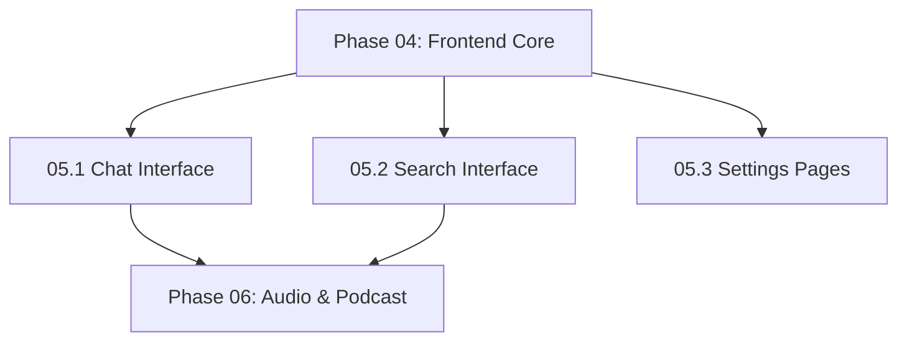

# NextGen Phase 05: Frontend Advanced Features

**Sprint Duration:** Week 15-17  
**Priority:** 🔴 CRITICAL  
**Phase Type:** User Interface - Advanced  
**Prerequisites:** Phase 04 Complete  
**Generated:** December 28, 2025  
**Generated By:** BMad Orchestrator Party Mode  

---

## Executive Summary

Phase 05 completes the frontend by implementing the most interactive features: streaming chat interface, hybrid search UI, and settings/configuration pages. This phase heavily leverages patterns from HyperbookLM and Open Notebook for polished user experiences.

**Key Outcomes:**
- Streaming chat interface with RAG context
- Search UI with filters and highlighting
- Settings pages (models, profile, preferences)
- Model configuration UI
- Custom hooks for chat and search

---

## Sprint 05.1: Streaming Chat Interface (Days 1-8)

### Objective
Build the production chat interface with streaming responses and RAG context.

### Tasks

| ID | Task | Effort | Assignee |
|----|------|--------|----------|
| 05.1.1 | Create chat-store with Zustand | 4h | Dev |
| 05.1.2 | Implement useChat custom hook | 6h | Dev |
| 05.1.3 | Create ChatInterface component | 4h | Dev |
| 05.1.4 | Create MessageList component | 3h | Dev |
| 05.1.5 | Create MessageInput component | 3h | Dev |
| 05.1.6 | Create StreamingMessage component | 4h | Dev |
| 05.1.7 | Implement SSE streaming handler | 6h | Dev |
| 05.1.8 | Add Framer Motion animations | 4h | Dev |
| 05.1.9 | Implement context configuration | 4h | Dev |
| 05.1.10 | Create chat session management | 3h | Dev |
| 05.1.11 | Add model selector in chat | 2h | Dev |
| 05.1.12 | Write component tests | 4h | QA |

### Reference Files

| Source | File | Pattern to Copy |
|--------|------|-----------------|
| HyperbookLM | `references/external-repos/hyperbooklm-main/hooks/useChat.ts` | Chat hook pattern |
| HyperbookLM | `references/external-repos/hyperbooklm-main/components/ChatInterface.tsx` | Chat UI structure |
| HyperbookLM | `references/external-repos/hyperbooklm-main/lib/api/claude.ts` | Streaming implementation |

### useChat Hook

```typescript
// apps/web/src/lib/hooks/useChat.ts
'use client';

import { useState, useCallback, useRef } from 'react';
import { chatApi } from '@/lib/api/chat';

interface Message {
  id: string;
  role: 'user' | 'assistant';
  content: string;
  timestamp: number;
}

interface ContextConfig {
  sources: Record<string, 'insights' | 'full' | 'exclude'>;
  notes: Record<string, 'full' | 'summary' | 'exclude'>;
}

interface UseChatOptions {
  sessionId?: string;
  notebookId?: string;
  modelId?: string;
  contextConfig?: ContextConfig;
}

export function useChat(options: UseChatOptions = {}) {
  const [messages, setMessages] = useState<Message[]>([]);
  const [isLoading, setIsLoading] = useState(false);
  const [error, setError] = useState<string | null>(null);
  const [streamingContent, setStreamingContent] = useState('');
  const abortControllerRef = useRef<AbortController | null>(null);
  
  const sendMessage = useCallback(async (content: string) => {
    if (!content.trim() || isLoading) return;
    
    // Create user message
    const userMessage: Message = {
      id: crypto.randomUUID(),
      role: 'user',
      content: content.trim(),
      timestamp: Date.now(),
    };
    
    setMessages(prev => [...prev, userMessage]);
    setIsLoading(true);
    setError(null);
    setStreamingContent('');
    
    const assistantMessageId = crypto.randomUUID();
    let fullResponse = '';
    
    // Create abort controller for cancellation
    abortControllerRef.current = new AbortController();
    
    try {
      await chatApi.streamMessage(
        options.sessionId!,
        {
          message: content.trim(),
          notebookId: options.notebookId,
          modelId: options.modelId,
          contextConfig: options.contextConfig,
        },
        {
          signal: abortControllerRef.current.signal,
          onToken: (token: string) => {
            fullResponse += token;
            setStreamingContent(fullResponse);
          },
          onComplete: () => {
            const assistantMessage: Message = {
              id: assistantMessageId,
              role: 'assistant',
              content: fullResponse,
              timestamp: Date.now(),
            };
            
            setMessages(prev => [...prev, assistantMessage]);
            setStreamingContent('');
            setIsLoading(false);
          },
          onError: (err: Error) => {
            setError(err.message);
            setIsLoading(false);
            setStreamingContent('');
          },
        }
      );
    } catch (err) {
      if (err instanceof Error && err.name === 'AbortError') {
        // User cancelled
        setIsLoading(false);
        setStreamingContent('');
        return;
      }
      
      const errorMessage = err instanceof Error 
        ? err.message 
        : 'Failed to send message';
      setError(errorMessage);
      setIsLoading(false);
      setStreamingContent('');
    }
  }, [options, isLoading]);
  
  const cancelStream = useCallback(() => {
    abortControllerRef.current?.abort();
  }, []);
  
  const clearMessages = useCallback(() => {
    setMessages([]);
    setError(null);
    setStreamingContent('');
  }, []);
  
  return {
    messages,
    isLoading,
    error,
    streamingContent,
    sendMessage,
    cancelStream,
    clearMessages,
  };
}
```

### Chat API with SSE Streaming

```typescript
// apps/web/src/lib/api/chat.ts
import { api } from './client';

interface StreamCallbacks {
  signal?: AbortSignal;
  onToken: (token: string) => void;
  onComplete: () => void;
  onError: (error: Error) => void;
}

export const chatApi = {
  createSession: async (notebookId?: string) => {
    const response = await api.post('/chat/sessions', { notebookId });
    return response.data;
  },
  
  getSessions: async () => {
    const response = await api.get('/chat/sessions');
    return response.data;
  },
  
  getSession: async (sessionId: string) => {
    const response = await api.get(`/chat/sessions/${sessionId}`);
    return response.data;
  },
  
  streamMessage: async (
    sessionId: string,
    payload: {
      message: string;
      notebookId?: string;
      modelId?: string;
      contextConfig?: ContextConfig;
    },
    callbacks: StreamCallbacks
  ) => {
    const response = await fetch(
      `${process.env.NEXT_PUBLIC_API_URL}/chat/${sessionId}/stream`,
      {
        method: 'POST',
        headers: {
          'Content-Type': 'application/json',
          'Authorization': `Bearer ${getToken()}`,
        },
        body: JSON.stringify(payload),
        signal: callbacks.signal,
      }
    );
    
    if (!response.ok) {
      const error = await response.json();
      throw new Error(error.message || 'Failed to stream message');
    }
    
    const reader = response.body!.getReader();
    const decoder = new TextDecoder();
    
    while (true) {
      const { done, value } = await reader.read();
      if (done) break;
      
      const chunk = decoder.decode(value, { stream: true });
      const lines = chunk.split('\n');
      
      for (const line of lines) {
        if (line.startsWith('event: ')) {
          const event = line.slice(7);
          
          if (event === 'done') {
            callbacks.onComplete();
            return;
          }
        }
        
        if (line.startsWith('data: ')) {
          const data = line.slice(6);
          if (data === '[DONE]') {
            callbacks.onComplete();
            return;
          }
          
          try {
            const parsed = JSON.parse(data);
            if (parsed.content) {
              callbacks.onToken(parsed.content);
            }
          } catch {
            // Skip malformed data
          }
        }
      }
    }
    
    callbacks.onComplete();
  },
};
```

### Chat Interface Component

```tsx
// apps/web/src/components/chat/ChatInterface.tsx
'use client';

import { useEffect, useRef, useState } from 'react';
import { Send, Loader2, Sparkles, StopCircle } from 'lucide-react';
import { motion, AnimatePresence } from 'framer-motion';
import { Button } from '@/components/ui/button';
import { Input } from '@/components/ui/input';
import { ScrollArea } from '@/components/ui/scroll-area';
import { ChatMessage } from './ChatMessage';
import { StreamingMessage } from './StreamingMessage';
import { useChat } from '@/lib/hooks/useChat';

interface ChatInterfaceProps {
  sessionId: string;
  notebookId?: string;
  hasContext: boolean;
}

export function ChatInterface({ 
  sessionId, 
  notebookId, 
  hasContext 
}: ChatInterfaceProps) {
  const [input, setInput] = useState('');
  const scrollRef = useRef<HTMLDivElement>(null);
  
  const {
    messages,
    isLoading,
    error,
    streamingContent,
    sendMessage,
    cancelStream,
  } = useChat({ sessionId, notebookId });
  
  // Auto-scroll to bottom
  useEffect(() => {
    scrollRef.current?.scrollIntoView({ behavior: 'smooth' });
  }, [messages, streamingContent]);
  
  const handleSubmit = (e: React.FormEvent) => {
    e.preventDefault();
    if (!input.trim() || isLoading) return;
    sendMessage(input);
    setInput('');
  };
  
  return (
    <div className="flex h-full flex-col bg-white rounded-xl border shadow-sm">
      {/* Messages Area */}
      <ScrollArea className="flex-1 p-6">
        <div className="space-y-6 max-w-3xl mx-auto">
          {messages.length === 0 && !streamingContent && (
            <div className="flex flex-col items-center justify-center min-h-[400px] text-center opacity-60">
              <Sparkles className="h-12 w-12 mb-4 text-gray-400" />
              <h3 className="text-xl font-medium mb-2">
                {hasContext ? 'Ready to Research' : 'Waiting for Context'}
              </h3>
              <p className="text-sm text-gray-500 max-w-xs">
                {hasContext
                  ? 'Ask questions about your sources. I can help synthesize and analyze.'
                  : 'Add sources to your notebook to enable context-aware chat.'}
              </p>
            </div>
          )}
          
          <AnimatePresence initial={false}>
            {messages.map((message) => (
              <motion.div
                key={message.id}
                initial={{ opacity: 0, y: 10 }}
                animate={{ opacity: 1, y: 0 }}
                transition={{ duration: 0.3 }}
              >
                <ChatMessage message={message} />
              </motion.div>
            ))}
          </AnimatePresence>
          
          {/* Streaming message */}
          {streamingContent && (
            <motion.div
              initial={{ opacity: 0 }}
              animate={{ opacity: 1 }}
            >
              <StreamingMessage content={streamingContent} />
            </motion.div>
          )}
          
          {/* Error display */}
          {error && (
            <div className="p-4 bg-red-50 border border-red-200 rounded-lg text-red-700 text-sm">
              {error}
            </div>
          )}
          
          <div ref={scrollRef} />
        </div>
      </ScrollArea>
      
      {/* Input Area */}
      <div className="border-t p-4">
        <form onSubmit={handleSubmit} className="flex gap-3 max-w-3xl mx-auto">
          <Input
            value={input}
            onChange={(e) => setInput(e.target.value)}
            placeholder={hasContext 
              ? "Ask a question about your sources..." 
              : "Add sources first to enable chat..."}
            disabled={isLoading || !hasContext}
            className="flex-1"
          />
          
          {isLoading ? (
            <Button 
              type="button" 
              variant="outline" 
              onClick={cancelStream}
            >
              <StopCircle className="h-4 w-4" />
            </Button>
          ) : (
            <Button type="submit" disabled={!input.trim() || !hasContext}>
              <Send className="h-4 w-4" />
            </Button>
          )}
        </form>
      </div>
    </div>
  );
}
```

### Streaming Message with Cursor

```tsx
// apps/web/src/components/chat/StreamingMessage.tsx
'use client';

import { motion } from 'framer-motion';
import { Sparkles } from 'lucide-react';

interface StreamingMessageProps {
  content: string;
}

export function StreamingMessage({ content }: StreamingMessageProps) {
  return (
    <div className="flex gap-4 justify-start">
      <div className="max-w-[80%] rounded-2xl rounded-tl-sm px-5 py-3 bg-gray-50 border">
        <div className="flex items-center gap-2 mb-2 opacity-50">
          <Sparkles className="h-3 w-3" />
          <span className="text-xs font-medium uppercase tracking-wider">
            Generating
          </span>
        </div>
        <p className="text-sm leading-relaxed whitespace-pre-wrap">
          {content}
          <motion.span
            animate={{ opacity: [0, 1, 0] }}
            transition={{ repeat: Infinity, duration: 0.8 }}
            className="inline-block w-1.5 h-4 ml-1 bg-gray-800 align-middle"
          />
        </p>
      </div>
    </div>
  );
}
```

### Acceptance Criteria

- [ ] Streaming responses display token-by-token
- [ ] Animated cursor during streaming
- [ ] Messages animate in with Framer Motion
- [ ] Cancel button stops streaming
- [ ] Auto-scroll to latest message
- [ ] Context indicator shows when RAG is active
- [ ] Model selector allows override
- [ ] Chat sessions persist and can be resumed

---

## Sprint 05.2: Search Interface (Days 9-13)

### Objective
Build the hybrid search UI with filters, highlighting, and result cards.

### Tasks

| ID | Task | Effort | Assignee |
|----|------|--------|----------|
| 05.2.1 | Create useSearch custom hook | 4h | Dev |
| 05.2.2 | Create SearchPage layout | 3h | Dev |
| 05.2.3 | Create SearchInput with debounce | 3h | Dev |
| 05.2.4 | Create SearchFilters component | 4h | Dev |
| 05.2.5 | Create SearchResultCard component | 3h | Dev |
| 05.2.6 | Implement result highlighting | 3h | Dev |
| 05.2.7 | Add search type toggle (vector/text/hybrid) | 2h | Dev |
| 05.2.8 | Implement keyboard navigation | 2h | Dev |
| 05.2.9 | Add empty/loading/error states | 2h | Dev |
| 05.2.10 | Write component tests | 3h | QA |

### useSearch Hook

```typescript
// apps/web/src/lib/hooks/useSearch.ts
'use client';

import { useState, useCallback, useEffect, useRef } from 'react';
import { searchApi, SearchResult, SearchFilters } from '@/lib/api/search';
import { useDebouncedCallback } from 'use-debounce';

interface UseSearchOptions {
  debounceMs?: number;
  defaultType?: 'text' | 'vector' | 'hybrid';
}

export function useSearch(options: UseSearchOptions = {}) {
  const { debounceMs = 300, defaultType = 'hybrid' } = options;
  
  const [query, setQuery] = useState('');
  const [results, setResults] = useState<SearchResult[]>([]);
  const [isLoading, setIsLoading] = useState(false);
  const [error, setError] = useState<string | null>(null);
  const [searchType, setSearchType] = useState(defaultType);
  const [filters, setFilters] = useState<SearchFilters>({});
  
  const executeSearch = useCallback(async (
    searchQuery: string,
    type: typeof searchType,
    searchFilters: SearchFilters
  ) => {
    if (!searchQuery.trim()) {
      setResults([]);
      return;
    }
    
    setIsLoading(true);
    setError(null);
    
    try {
      const searchResults = await searchApi.search({
        text: searchQuery,
        type,
        filters: searchFilters,
        limit: 50,
      });
      setResults(searchResults);
    } catch (err) {
      setError(err instanceof Error ? err.message : 'Search failed');
      setResults([]);
    } finally {
      setIsLoading(false);
    }
  }, []);
  
  const debouncedSearch = useDebouncedCallback(
    (q: string, t: typeof searchType, f: SearchFilters) => {
      executeSearch(q, t, f);
    },
    debounceMs
  );
  
  useEffect(() => {
    debouncedSearch(query, searchType, filters);
  }, [query, searchType, filters, debouncedSearch]);
  
  return {
    query,
    setQuery,
    results,
    isLoading,
    error,
    searchType,
    setSearchType,
    filters,
    setFilters,
  };
}
```

### Search Page

```tsx
// apps/web/src/app/(dashboard)/search/page.tsx
'use client';

import { Search } from 'lucide-react';
import { Input } from '@/components/ui/input';
import { Tabs, TabsList, TabsTrigger } from '@/components/ui/tabs';
import { SearchFilters } from '@/components/search/SearchFilters';
import { SearchResultCard } from '@/components/search/SearchResultCard';
import { useSearch } from '@/lib/hooks/useSearch';
import { Skeleton } from '@/components/common/Skeleton';

export default function SearchPage() {
  const {
    query,
    setQuery,
    results,
    isLoading,
    error,
    searchType,
    setSearchType,
    filters,
    setFilters,
  } = useSearch();
  
  return (
    <div className="space-y-6">
      <div className="flex items-center justify-between">
        <h1 className="text-2xl font-bold">Search</h1>
      </div>
      
      {/* Search Input */}
      <div className="relative">
        <Search className="absolute left-3 top-1/2 -translate-y-1/2 h-4 w-4 text-gray-400" />
        <Input
          value={query}
          onChange={(e) => setQuery(e.target.value)}
          placeholder="Search across all your content..."
          className="pl-10"
        />
      </div>
      
      {/* Search Type Toggle */}
      <div className="flex items-center gap-4">
        <Tabs value={searchType} onValueChange={(v) => setSearchType(v as any)}>
          <TabsList>
            <TabsTrigger value="hybrid">Hybrid</TabsTrigger>
            <TabsTrigger value="vector">Semantic</TabsTrigger>
            <TabsTrigger value="text">Keyword</TabsTrigger>
          </TabsList>
        </Tabs>
        
        <SearchFilters filters={filters} onFiltersChange={setFilters} />
      </div>
      
      {/* Results */}
      <div className="space-y-4">
        {isLoading && (
          <div className="space-y-4">
            {[1, 2, 3].map((i) => (
              <Skeleton key={i} className="h-32" />
            ))}
          </div>
        )}
        
        {error && (
          <div className="p-4 bg-red-50 border border-red-200 rounded-lg text-red-700">
            {error}
          </div>
        )}
        
        {!isLoading && !error && results.length === 0 && query && (
          <div className="text-center py-12 text-gray-500">
            No results found for "{query}"
          </div>
        )}
        
        {!isLoading && results.map((result) => (
          <SearchResultCard key={result.id} result={result} query={query} />
        ))}
      </div>
    </div>
  );
}
```

### Search Result Card with Highlighting

```tsx
// apps/web/src/components/search/SearchResultCard.tsx
import Link from 'next/link';
import { FileText, BookOpen, Lightbulb } from 'lucide-react';
import { Card, CardContent } from '@/components/ui/card';
import { Badge } from '@/components/ui/badge';

interface SearchResultCardProps {
  result: SearchResult;
  query: string;
}

export function SearchResultCard({ result, query }: SearchResultCardProps) {
  const icons = {
    source: FileText,
    note: BookOpen,
    insight: Lightbulb,
  };
  
  const Icon = icons[result.entityType] || FileText;
  
  // Highlight matching terms in snippet
  const highlightedSnippet = result.snippet?.replace(
    new RegExp(`(${query.split(' ').join('|')})`, 'gi'),
    '<mark class="bg-yellow-200 px-0.5">$1</mark>'
  );
  
  return (
    <Card className="hover:shadow-md transition-shadow">
      <CardContent className="p-4">
        <div className="flex items-start gap-4">
          <div className="p-2 bg-gray-100 rounded-lg">
            <Icon className="h-5 w-5 text-gray-600" />
          </div>
          
          <div className="flex-1 min-w-0">
            <div className="flex items-center gap-2 mb-1">
              <Link 
                href={`/${result.entityType}s/${result.id}`}
                className="font-medium hover:text-blue-600 truncate"
              >
                {result.title || 'Untitled'}
              </Link>
              <Badge variant="secondary" className="text-xs">
                {result.entityType}
              </Badge>
              {result.searchType && (
                <Badge variant="outline" className="text-xs">
                  {result.searchType}
                </Badge>
              )}
            </div>
            
            {highlightedSnippet && (
              <p 
                className="text-sm text-gray-600 line-clamp-3"
                dangerouslySetInnerHTML={{ __html: highlightedSnippet }}
              />
            )}
            
            <div className="flex items-center gap-4 mt-2 text-xs text-gray-400">
              <span>Score: {(result.score * 100).toFixed(0)}%</span>
              {result.notebookName && (
                <span>in {result.notebookName}</span>
              )}
            </div>
          </div>
        </div>
      </CardContent>
    </Card>
  );
}
```

### Acceptance Criteria

- [ ] Search results update as user types (debounced)
- [ ] Three search modes: hybrid, semantic, keyword
- [ ] Filters for entity type, notebook, date range
- [ ] Query terms highlighted in snippets
- [ ] Score displayed for each result
- [ ] Empty state when no results
- [ ] Keyboard navigation (up/down arrows)

---

## Sprint 05.3: Settings & Configuration (Days 14-18)

### Objective
Build settings pages for user profile, models, and preferences.

### Tasks

| ID | Task | Effort | Assignee |
|----|------|--------|----------|
| 05.3.1 | Create settings layout with tabs | 3h | Dev |
| 05.3.2 | Create Profile settings page | 4h | Dev |
| 05.3.3 | Create Models settings page | 6h | Dev |
| 05.3.4 | Create Preferences settings page | 3h | Dev |
| 05.3.5 | Create API Keys management page | 4h | Dev |
| 05.3.6 | Implement model default selection | 3h | Dev |
| 05.3.7 | Add model testing interface | 3h | Dev |
| 05.3.8 | Create usage/billing display | 3h | Dev |
| 05.3.9 | Write component tests | 3h | QA |

### Settings Layout

```tsx
// apps/web/src/app/(dashboard)/settings/layout.tsx
'use client';

import Link from 'next/link';
import { usePathname } from 'next/navigation';
import { User, Bot, Settings, Key, CreditCard } from 'lucide-react';
import { cn } from '@/lib/utils';

const settingsTabs = [
  { href: '/settings', icon: User, label: 'Profile' },
  { href: '/settings/models', icon: Bot, label: 'Models' },
  { href: '/settings/api-keys', icon: Key, label: 'API Keys' },
  { href: '/settings/preferences', icon: Settings, label: 'Preferences' },
  { href: '/settings/usage', icon: CreditCard, label: 'Usage' },
];

export default function SettingsLayout({
  children,
}: {
  children: React.ReactNode;
}) {
  const pathname = usePathname();
  
  return (
    <div className="space-y-6">
      <h1 className="text-2xl font-bold">Settings</h1>
      
      <div className="flex gap-8">
        {/* Settings Nav */}
        <nav className="w-48 flex-shrink-0 space-y-1">
          {settingsTabs.map((tab) => {
            const isActive = pathname === tab.href;
            return (
              <Link
                key={tab.href}
                href={tab.href}
                className={cn(
                  'flex items-center gap-3 px-3 py-2 rounded-lg text-sm font-medium transition-colors',
                  isActive
                    ? 'bg-gray-100 text-gray-900'
                    : 'text-gray-600 hover:bg-gray-50'
                )}
              >
                <tab.icon className="h-4 w-4" />
                {tab.label}
              </Link>
            );
          })}
        </nav>
        
        {/* Settings Content */}
        <div className="flex-1 max-w-2xl">
          {children}
        </div>
      </div>
    </div>
  );
}
```

### Models Settings Page

```tsx
// apps/web/src/app/(dashboard)/settings/models/page.tsx
'use client';

import { useEffect, useState } from 'react';
import { Bot, Check, TestTube } from 'lucide-react';
import { Card, CardContent, CardHeader, CardTitle } from '@/components/ui/card';
import { Button } from '@/components/ui/button';
import {
  Select,
  SelectContent,
  SelectItem,
  SelectTrigger,
  SelectValue,
} from '@/components/ui/select';
import { modelsApi } from '@/lib/api/models';
import { useToast } from '@/components/ui/use-toast';

interface Model {
  id: string;
  name: string;
  provider: string;
  type: string;
}

interface DefaultModels {
  default_chat_model: string;
  default_transformation_model: string;
  default_embedding_model: string;
  default_tts_model: string;
}

export default function ModelsSettingsPage() {
  const [models, setModels] = useState<Model[]>([]);
  const [defaults, setDefaults] = useState<DefaultModels | null>(null);
  const [isLoading, setIsLoading] = useState(true);
  const [isSaving, setIsSaving] = useState(false);
  const { toast } = useToast();
  
  useEffect(() => {
    Promise.all([
      modelsApi.listModels(),
      modelsApi.getDefaults(),
    ]).then(([modelsData, defaultsData]) => {
      setModels(modelsData);
      setDefaults(defaultsData);
      setIsLoading(false);
    });
  }, []);
  
  const handleDefaultChange = (key: keyof DefaultModels, value: string) => {
    setDefaults(prev => prev ? { ...prev, [key]: value } : null);
  };
  
  const handleSave = async () => {
    if (!defaults) return;
    
    setIsSaving(true);
    try {
      await modelsApi.updateDefaults(defaults);
      toast({
        title: 'Settings saved',
        description: 'Your model preferences have been updated.',
      });
    } catch (error) {
      toast({
        title: 'Failed to save',
        description: 'Could not update model preferences.',
        variant: 'destructive',
      });
    } finally {
      setIsSaving(false);
    }
  };
  
  const modelsByType = (type: string) => 
    models.filter(m => m.type === type);
  
  if (isLoading || !defaults) {
    return <div>Loading...</div>;
  }
  
  return (
    <div className="space-y-6">
      <Card>
        <CardHeader>
          <CardTitle className="flex items-center gap-2">
            <Bot className="h-5 w-5" />
            Default Models
          </CardTitle>
        </CardHeader>
        <CardContent className="space-y-4">
          <div className="space-y-2">
            <label className="text-sm font-medium">Chat Model</label>
            <Select
              value={defaults.default_chat_model}
              onValueChange={(v) => handleDefaultChange('default_chat_model', v)}
            >
              <SelectTrigger>
                <SelectValue />
              </SelectTrigger>
              <SelectContent>
                {modelsByType('language').map((model) => (
                  <SelectItem key={model.id} value={model.id}>
                    {model.name} ({model.provider})
                  </SelectItem>
                ))}
              </SelectContent>
            </Select>
            <p className="text-xs text-gray-500">
              Used for chat conversations and RAG queries
            </p>
          </div>
          
          <div className="space-y-2">
            <label className="text-sm font-medium">Transformation Model</label>
            <Select
              value={defaults.default_transformation_model}
              onValueChange={(v) => handleDefaultChange('default_transformation_model', v)}
            >
              <SelectTrigger>
                <SelectValue />
              </SelectTrigger>
              <SelectContent>
                {modelsByType('language').map((model) => (
                  <SelectItem key={model.id} value={model.id}>
                    {model.name} ({model.provider})
                  </SelectItem>
                ))}
              </SelectContent>
            </Select>
            <p className="text-xs text-gray-500">
              Used for summaries, insights, and other transformations
            </p>
          </div>
          
          <div className="space-y-2">
            <label className="text-sm font-medium">Embedding Model</label>
            <Select
              value={defaults.default_embedding_model}
              onValueChange={(v) => handleDefaultChange('default_embedding_model', v)}
            >
              <SelectTrigger>
                <SelectValue />
              </SelectTrigger>
              <SelectContent>
                {modelsByType('embedding').map((model) => (
                  <SelectItem key={model.id} value={model.id}>
                    {model.name} ({model.provider})
                  </SelectItem>
                ))}
              </SelectContent>
            </Select>
            <p className="text-xs text-gray-500">
              Used for semantic search and vector indexing
            </p>
          </div>
          
          <Button onClick={handleSave} disabled={isSaving}>
            {isSaving ? 'Saving...' : 'Save Preferences'}
          </Button>
        </CardContent>
      </Card>
      
      {/* Model Test Interface */}
      <Card>
        <CardHeader>
          <CardTitle className="flex items-center gap-2">
            <TestTube className="h-5 w-5" />
            Test Model
          </CardTitle>
        </CardHeader>
        <CardContent>
          {/* Model testing UI */}
        </CardContent>
      </Card>
    </div>
  );
}
```

### Acceptance Criteria

- [ ] Profile settings allow name/email update
- [ ] Models page shows all available models
- [ ] Default models configurable per task type
- [ ] API keys can be added/removed
- [ ] Preferences (theme, language) persist
- [ ] Usage shows token/cost breakdown
- [ ] Model test interface works

---

## 🔴 BLIND SPOTS IDENTIFIED IN PHASE 05

### Blind Spot 1: SSE Connection Management

**Issue:** Long-running SSE connections may timeout or disconnect.

**Mitigation:**
- Implement heartbeat/keepalive
- Auto-reconnect on disconnect
- Show connection status indicator

### Blind Spot 2: Message History Pagination

**Issue:** Long chat sessions could have many messages, performance issue.

**Mitigation:**
- Virtualize message list (react-window)
- Load older messages on scroll up
- Add "Load more" button

### Blind Spot 3: Search Result Pagination

**Issue:** Currently showing max 50 results, no pagination.

**Mitigation:**
- Add infinite scroll or pagination
- Show total result count
- Implement cursor-based pagination

### Blind Spot 4: Settings Persistence

**Issue:** Settings changes should sync across tabs/devices.

**Mitigation:**
- Refetch settings on focus
- Add optimistic updates
- Consider WebSocket for real-time sync

### Blind Spot 5: Model Cost Visibility

**Issue:** Users don't see cost before executing operations.

**Mitigation:**
- Show estimated cost before transformation
- Add cost confirmation for expensive operations
- Display running total in usage

### Blind Spot 6: Chat Context Visualization

**Issue:** Users can't see what context is being sent to the model.

**Mitigation:**
- Add "View Context" expandable panel
- Show which sources are included
- Display token count of context

---

## Phase 05 Dependencies



## Definition of Done

Phase 05 is complete when:

- [ ] Streaming chat works end-to-end
- [ ] Search returns relevant results with highlighting
- [ ] Settings pages functional
- [ ] Model defaults configurable
- [ ] All components tested
- [ ] Mobile responsive

---

## Estimated Timeline

| Sprint | Duration | Cumulative |
|--------|----------|------------|
| 05.1 Chat Interface | 8 days | Day 8 |
| 05.2 Search Interface | 5 days | Day 13 |
| 05.3 Settings Pages | 5 days | Day 18 |

**Total:** 18 working days (~4 weeks)

---

## Dependencies to Install

```json
// apps/web/package.json additions
{
  "dependencies": {
    "framer-motion": "^11.0.0",
    "use-debounce": "^10.0.0",
    "@radix-ui/react-select": "^2.0.0",
    "@radix-ui/react-scroll-area": "^1.0.0",
    "react-window": "^1.8.0"
  }
}
```

---

*Generated by BMad Orchestrator Party Mode*  
*Phase 05 Version: 1.0*
