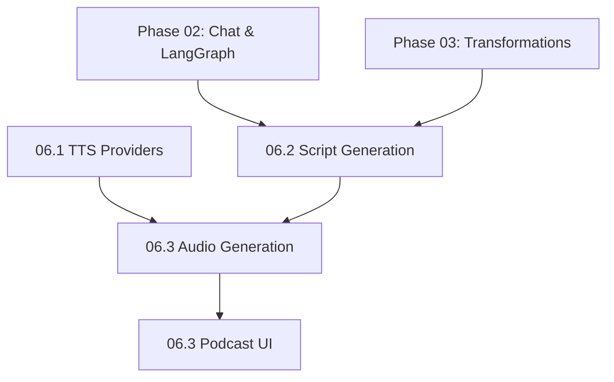

# NextGen Phase 06: Audio & Podcast Generation

**Sprint Duration:** Week 18-21  
**Priority:** 🟡 HIGH  
**Phase Type:** AI Feature - Audio  
**Prerequisites:** Phase 02 Complete (Chat), Phase 03 Complete (Transformations)  
**Generated:** December 28, 2025  
**Generated By:** BMad Orchestrator Party Mode  

---

## Executive Summary

Phase 06 implements the podcast generation pipeline - one of the most impressive features from NotebookLM and Open Notebook. This creates engaging audio conversations from source materials using multiple TTS providers.

**Key Outcomes:**
- Multi-provider TTS integration (ElevenLabs, OpenAI, Google, Azure)
- Podcast script generation with two distinct voices
- Audio segment stitching and background music
- Podcast management UI with playback

---

## Sprint 06.1: TTS Provider Integration (Days 1-7)

### Objective
Build a unified TTS client supporting multiple providers with fallback capability.

### Tasks

| ID | Task | Effort | Assignee |
|----|------|--------|----------|
| 06.1.1 | Create TTS provider interface | 3h | Dev |
| 06.1.2 | Implement ElevenLabs provider | 4h | Dev |
| 06.1.3 | Implement OpenAI TTS provider | 3h | Dev |
| 06.1.4 | Implement Google Cloud TTS provider | 4h | Dev |
| 06.1.5 | Implement Azure Cognitive TTS provider | 4h | Dev |
| 06.1.6 | Create TTSClient with provider routing | 4h | Dev |
| 06.1.7 | Add voice mapping configuration | 3h | Dev |
| 06.1.8 | Implement audio format conversion | 4h | Dev |
| 06.1.9 | Create voice testing endpoint | 2h | Dev |
| 06.1.10 | Write provider tests | 4h | QA |

### Reference Files

| Source | File | Pattern to Copy |
|--------|------|-----------------|
| Open Notebook | `references/external-repos/open-notebook-main/open_notebook/domain/podcast.py` | Podcast domain model |
| Open Notebook | `references/external-repos/open-notebook-main/commands/podcast_commands.py` | Podcast generation commands |
| Blueprint | `docs/nextgen-blueprint.md` Part 8.5 | TTS provider integration spec |

### Directory Structure

```
packages/@sbf/tts-client/
├── src/
│   ├── index.ts
│   ├── types.ts
│   ├── client.ts
│   ├── providers/
│   │   ├── index.ts
│   │   ├── base.ts
│   │   ├── elevenlabs.ts
│   │   ├── openai.ts
│   │   ├── google.ts
│   │   └── azure.ts
│   ├── voices/
│   │   └── mapping.ts
│   └── utils/
│       └── audio.ts
├── package.json
└── tsconfig.json
```

### TTS Provider Types

```typescript
// packages/@sbf/tts-client/src/types.ts

export interface TTSVoice {
  id: string;
  name: string;
  provider: TTSProvider;
  gender: 'male' | 'female' | 'neutral';
  language: string;
  style?: string;
  previewUrl?: string;
}

export type TTSProvider = 'elevenlabs' | 'openai' | 'google' | 'azure';

export interface TTSRequest {
  text: string;
  voiceId: string;
  provider?: TTSProvider;
  speed?: number; // 0.5 - 2.0
  pitch?: number; // -20 to 20
  format?: 'mp3' | 'wav' | 'ogg';
}

export interface TTSResponse {
  audio: Buffer;
  format: string;
  duration: number;
  characterCount: number;
  provider: TTSProvider;
}

export interface TTSProviderConfig {
  elevenlabs?: {
    apiKey: string;
    modelId?: string;
  };
  openai?: {
    apiKey: string;
  };
  google?: {
    projectId: string;
    keyFile: string;
  };
  azure?: {
    subscriptionKey: string;
    region: string;
  };
}

export interface BaseTTSProvider {
  name: TTSProvider;
  synthesize(request: TTSRequest): Promise<TTSResponse>;
  listVoices(): Promise<TTSVoice[]>;
  isConfigured(): boolean;
}
```

### ElevenLabs Provider

```typescript
// packages/@sbf/tts-client/src/providers/elevenlabs.ts
import { BaseTTSProvider, TTSRequest, TTSResponse, TTSVoice } from '../types';

interface ElevenLabsConfig {
  apiKey: string;
  modelId?: string;
}

export class ElevenLabsProvider implements BaseTTSProvider {
  readonly name = 'elevenlabs' as const;
  private apiKey: string;
  private modelId: string;
  
  constructor(config: ElevenLabsConfig) {
    this.apiKey = config.apiKey;
    this.modelId = config.modelId || 'eleven_multilingual_v2';
  }
  
  isConfigured(): boolean {
    return !!this.apiKey;
  }
  
  async synthesize(request: TTSRequest): Promise<TTSResponse> {
    const response = await fetch(
      `https://api.elevenlabs.io/v1/text-to-speech/${request.voiceId}`,
      {
        method: 'POST',
        headers: {
          'Content-Type': 'application/json',
          'xi-api-key': this.apiKey,
        },
        body: JSON.stringify({
          text: request.text,
          model_id: this.modelId,
          voice_settings: {
            stability: 0.5,
            similarity_boost: 0.75,
            style: 0.5,
            use_speaker_boost: true,
          },
        }),
      }
    );
    
    if (!response.ok) {
      const error = await response.json();
      throw new Error(`ElevenLabs TTS failed: ${error.detail?.message || 'Unknown error'}`);
    }
    
    const audioBuffer = Buffer.from(await response.arrayBuffer());
    
    return {
      audio: audioBuffer,
      format: 'mp3',
      duration: estimateDuration(request.text),
      characterCount: request.text.length,
      provider: 'elevenlabs',
    };
  }
  
  async listVoices(): Promise<TTSVoice[]> {
    const response = await fetch('https://api.elevenlabs.io/v1/voices', {
      headers: { 'xi-api-key': this.apiKey },
    });
    
    const data = await response.json();
    
    return data.voices.map((voice: any) => ({
      id: voice.voice_id,
      name: voice.name,
      provider: 'elevenlabs',
      gender: voice.labels?.gender || 'neutral',
      language: voice.labels?.language || 'en',
      previewUrl: voice.preview_url,
    }));
  }
}
```

### OpenAI TTS Provider

```typescript
// packages/@sbf/tts-client/src/providers/openai.ts
import OpenAI from 'openai';
import { BaseTTSProvider, TTSRequest, TTSResponse, TTSVoice } from '../types';

interface OpenAITTSConfig {
  apiKey: string;
}

export class OpenAITTSProvider implements BaseTTSProvider {
  readonly name = 'openai' as const;
  private client: OpenAI;
  
  constructor(config: OpenAITTSConfig) {
    this.client = new OpenAI({ apiKey: config.apiKey });
  }
  
  isConfigured(): boolean {
    return !!this.client;
  }
  
  async synthesize(request: TTSRequest): Promise<TTSResponse> {
    const mp3 = await this.client.audio.speech.create({
      model: 'tts-1-hd',
      voice: request.voiceId as any,
      input: request.text,
      speed: request.speed || 1.0,
    });
    
    const buffer = Buffer.from(await mp3.arrayBuffer());
    
    return {
      audio: buffer,
      format: 'mp3',
      duration: estimateDuration(request.text),
      characterCount: request.text.length,
      provider: 'openai',
    };
  }
  
  async listVoices(): Promise<TTSVoice[]> {
    // OpenAI has fixed voices
    return [
      { id: 'alloy', name: 'Alloy', provider: 'openai', gender: 'neutral', language: 'en' },
      { id: 'echo', name: 'Echo', provider: 'openai', gender: 'male', language: 'en' },
      { id: 'fable', name: 'Fable', provider: 'openai', gender: 'male', language: 'en' },
      { id: 'onyx', name: 'Onyx', provider: 'openai', gender: 'male', language: 'en' },
      { id: 'nova', name: 'Nova', provider: 'openai', gender: 'female', language: 'en' },
      { id: 'shimmer', name: 'Shimmer', provider: 'openai', gender: 'female', language: 'en' },
    ];
  }
}
```

### TTS Client with Provider Routing

```typescript
// packages/@sbf/tts-client/src/client.ts
import { 
  BaseTTSProvider, 
  TTSProvider, 
  TTSProviderConfig, 
  TTSRequest, 
  TTSResponse, 
  TTSVoice 
} from './types';
import { ElevenLabsProvider } from './providers/elevenlabs';
import { OpenAITTSProvider } from './providers/openai';
import { GoogleTTSProvider } from './providers/google';
import { AzureTTSProvider } from './providers/azure';

export class TTSClient {
  private providers: Map<TTSProvider, BaseTTSProvider> = new Map();
  private defaultProvider: TTSProvider = 'openai';
  
  constructor(config: TTSProviderConfig) {
    // Initialize configured providers
    if (config.elevenlabs?.apiKey) {
      this.providers.set('elevenlabs', new ElevenLabsProvider(config.elevenlabs));
    }
    if (config.openai?.apiKey) {
      this.providers.set('openai', new OpenAITTSProvider(config.openai));
    }
    if (config.google?.projectId) {
      this.providers.set('google', new GoogleTTSProvider(config.google));
    }
    if (config.azure?.subscriptionKey) {
      this.providers.set('azure', new AzureTTSProvider(config.azure));
    }
    
    // Set default to first available
    for (const provider of this.providers.keys()) {
      this.defaultProvider = provider;
      break;
    }
  }
  
  async synthesize(request: TTSRequest): Promise<TTSResponse> {
    const providerName = request.provider || this.defaultProvider;
    const provider = this.providers.get(providerName);
    
    if (!provider) {
      throw new Error(`TTS provider ${providerName} not configured`);
    }
    
    return provider.synthesize(request);
  }
  
  async listVoices(providerName?: TTSProvider): Promise<TTSVoice[]> {
    if (providerName) {
      const provider = this.providers.get(providerName);
      if (!provider) return [];
      return provider.listVoices();
    }
    
    // List voices from all providers
    const allVoices: TTSVoice[] = [];
    for (const provider of this.providers.values()) {
      const voices = await provider.listVoices();
      allVoices.push(...voices);
    }
    return allVoices;
  }
  
  getAvailableProviders(): TTSProvider[] {
    return Array.from(this.providers.keys());
  }
}
```

### Acceptance Criteria

- [ ] ElevenLabs TTS works with valid API key
- [ ] OpenAI TTS works with valid API key
- [ ] Provider auto-selection based on configuration
- [ ] Voice listing from each provider
- [ ] Audio returned in consistent format
- [ ] Provider errors handled gracefully

---

## Sprint 06.2: Podcast Script Generation (Days 8-14)

### Objective
Generate engaging podcast scripts with two distinct voices discussing the source material.

### Tasks

| ID | Task | Effort | Assignee |
|----|------|--------|----------|
| 06.2.1 | Design Podcast domain model | 3h | Dev |
| 06.2.2 | Create PodcastScript type definitions | 2h | Dev |
| 06.2.3 | Build podcast script prompt template | 6h | Dev |
| 06.2.4 | Create PodcastGenerator service | 6h | Dev |
| 06.2.5 | Implement multi-turn dialogue generation | 4h | Dev |
| 06.2.6 | Add voice personality configuration | 3h | Dev |
| 06.2.7 | Create script validation and formatting | 3h | Dev |
| 06.2.8 | Add intro/outro segment generation | 2h | Dev |
| 06.2.9 | Integrate with transformation-engine | 3h | Dev |
| 06.2.10 | Write script generation tests | 3h | QA |

### Podcast Domain Model

```typescript
// packages/@sbf/domain-base/src/entities/podcast.ts
import { BaseEntity } from './base';

export enum PodcastStatus {
  PENDING = 'pending',
  SCRIPT_GENERATING = 'script_generating',
  SCRIPT_READY = 'script_ready',
  AUDIO_GENERATING = 'audio_generating',
  PROCESSING = 'processing',
  READY = 'ready',
  FAILED = 'failed',
}

export interface PodcastSegment {
  id: string;
  speaker: 'host' | 'guest';
  text: string;
  audioUrl?: string;
  startTime?: number;
  endTime?: number;
}

export interface PodcastScript {
  title: string;
  description: string;
  segments: PodcastSegment[];
  totalDuration?: number;
}

export interface PodcastVoiceConfig {
  hostVoice: {
    voiceId: string;
    provider: string;
    name: string;
  };
  guestVoice: {
    voiceId: string;
    provider: string;
    name: string;
  };
}

export interface Podcast extends BaseEntity {
  notebookId: string;
  title: string;
  description?: string;
  status: PodcastStatus;
  script?: PodcastScript;
  voiceConfig?: PodcastVoiceConfig;
  audioUrl?: string;
  duration?: number; // seconds
  fileSize?: number; // bytes
  generatedAt?: Date;
  errorMessage?: string;
}
```

### Podcast Script Generator

```typescript
// apps/aei-core/services/podcast/script_generator.py
from typing import List, Dict, Any, Optional
from dataclasses import dataclass, field
from enum import Enum

from services.ai_client import AIClient
from models.podcast import Podcast, PodcastSegment, PodcastScript


@dataclass
class VoicePersonality:
    """Configuration for a podcast voice personality."""
    role: str  # 'host' or 'guest'
    name: str
    style: str  # 'professional', 'casual', 'enthusiastic'
    traits: List[str] = field(default_factory=list)


@dataclass
class PodcastConfig:
    """Configuration for podcast generation."""
    target_duration: int = 300  # 5 minutes default
    style: str = 'conversational'  # 'conversational', 'interview', 'debate'
    host: VoicePersonality = None
    guest: VoicePersonality = None
    include_intro: bool = True
    include_outro: bool = True


PODCAST_SCRIPT_PROMPT = """
You are creating a podcast script for two hosts discussing the following content.
The podcast should be engaging, conversational, and informative.

HOSTS:
- {host_name} ({host_role}): {host_style}. Traits: {host_traits}
- {guest_name} ({guest_role}): {guest_style}. Traits: {guest_traits}

STYLE: {podcast_style}
TARGET DURATION: {target_duration} seconds (approximately {word_count} words)

CONTENT TO DISCUSS:
{source_content}

KEY INSIGHTS:
{insights}

Create a natural conversation between the two hosts. Include:
1. {intro_instruction}
2. Discussion of main points
3. Personal reactions and insights
4. {outro_instruction}

Format each line as:
[SPEAKER_NAME]: Dialogue text

Ensure the dialogue feels natural with:
- Occasional interruptions
- Questions and answers
- Expressions of surprise or agreement
- Smooth transitions between topics
"""


class PodcastScriptGenerator:
    """Generates podcast scripts from source content."""
    
    def __init__(self, ai_client: AIClient):
        self.ai_client = ai_client
        
    async def generate_script(
        self,
        sources: List[Dict[str, Any]],
        insights: Optional[List[str]] = None,
        config: Optional[PodcastConfig] = None,
    ) -> PodcastScript:
        """Generate a podcast script from sources."""
        
        config = config or PodcastConfig()
        config.host = config.host or VoicePersonality(
            role='host',
            name='Alex',
            style='professional and curious',
            traits=['asks clarifying questions', 'summarizes key points']
        )
        config.guest = config.guest or VoicePersonality(
            role='guest', 
            name='Jordan',
            style='enthusiastic and insightful',
            traits=['provides examples', 'makes connections']
        )
        
        # Estimate word count from duration (150 words/minute)
        word_count = int(config.target_duration / 60 * 150)
        
        # Prepare source content
        source_content = self._prepare_source_content(sources)
        insights_text = '\n'.join(f"- {insight}" for insight in (insights or []))
        
        # Generate script with LLM
        prompt = PODCAST_SCRIPT_PROMPT.format(
            host_name=config.host.name,
            host_role=config.host.role,
            host_style=config.host.style,
            host_traits=', '.join(config.host.traits),
            guest_name=config.guest.name,
            guest_role=config.guest.role,
            guest_style=config.guest.style,
            guest_traits=', '.join(config.guest.traits),
            podcast_style=config.style,
            target_duration=config.target_duration,
            word_count=word_count,
            source_content=source_content,
            insights=insights_text or 'No specific insights provided',
            intro_instruction='Brief intro welcoming listeners' if config.include_intro else 'No intro needed',
            outro_instruction='Wrap-up and sign-off' if config.include_outro else 'End naturally',
        )
        
        response = await self.ai_client.generate(
            prompt=prompt,
            model_type='transformation',
            max_tokens=4000,
        )
        
        # Parse the generated script
        segments = self._parse_script(response.content, config)
        
        return PodcastScript(
            title=self._generate_title(sources),
            description=f"A {config.style} podcast discussing {len(sources)} sources.",
            segments=segments,
        )
    
    def _prepare_source_content(self, sources: List[Dict[str, Any]]) -> str:
        """Prepare source content for the prompt."""
        content_parts = []
        for source in sources:
            title = source.get('title', 'Untitled')
            summary = source.get('summary', source.get('content', ''))[:2000]
            content_parts.append(f"## {title}\n{summary}")
        return '\n\n'.join(content_parts)
    
    def _parse_script(
        self, 
        raw_script: str, 
        config: PodcastConfig
    ) -> List[PodcastSegment]:
        """Parse LLM output into structured segments."""
        segments = []
        lines = raw_script.strip().split('\n')
        
        for line in lines:
            line = line.strip()
            if not line:
                continue
                
            # Parse [SPEAKER]: text format
            if ':' in line:
                parts = line.split(':', 1)
                speaker_raw = parts[0].strip().lower()
                text = parts[1].strip() if len(parts) > 1 else ''
                
                # Map speaker name to role
                if config.host.name.lower() in speaker_raw:
                    speaker = 'host'
                elif config.guest.name.lower() in speaker_raw:
                    speaker = 'guest'
                else:
                    continue
                
                if text:
                    segments.append(PodcastSegment(
                        id=str(uuid.uuid4()),
                        speaker=speaker,
                        text=text,
                    ))
        
        return segments
    
    def _generate_title(self, sources: List[Dict[str, Any]]) -> str:
        """Generate a title for the podcast."""
        if sources:
            first_title = sources[0].get('title', 'Unknown')
            if len(sources) > 1:
                return f"Deep Dive: {first_title} and more"
            return f"Deep Dive: {first_title}"
        return "Knowledge Podcast"
```

### Acceptance Criteria

- [ ] Script generates two distinct voices
- [ ] Conversation feels natural with back-and-forth
- [ ] Intro and outro included when configured
- [ ] Target duration approximately correct
- [ ] Script segments properly formatted
- [ ] Insights incorporated into discussion

---

## Sprint 06.3: Audio Generation & UI (Days 15-21)

### Objective
Generate audio from scripts and build the podcast management UI.

### Tasks

| ID | Task | Effort | Assignee |
|----|------|--------|----------|
| 06.3.1 | Create PodcastEngine for full pipeline | 6h | Dev |
| 06.3.2 | Implement segment audio generation | 4h | Dev |
| 06.3.3 | Build audio stitching service | 6h | Dev |
| 06.3.4 | Add background music mixing | 4h | Dev |
| 06.3.5 | Create podcast API endpoints | 4h | Dev |
| 06.3.6 | Build PodcastList component | 3h | Dev |
| 06.3.7 | Build PodcastPlayer component | 4h | Dev |
| 06.3.8 | Build GeneratePodcastDialog | 4h | Dev |
| 06.3.9 | Add progress tracking UI | 2h | Dev |
| 06.3.10 | Write integration tests | 4h | QA |

### Podcast Engine

```python
# apps/aei-core/services/podcast/engine.py
import asyncio
from typing import List, Optional
from pathlib import Path
import uuid
from pydub import AudioSegment

from models.podcast import Podcast, PodcastStatus, PodcastScript, PodcastSegment
from services.tts_client import TTSClient
from services.podcast.script_generator import PodcastScriptGenerator
from db.repositories.podcast_repository import PodcastRepository


class PodcastEngine:
    """Full podcast generation pipeline."""
    
    def __init__(
        self,
        tts_client: TTSClient,
        script_generator: PodcastScriptGenerator,
        repository: PodcastRepository,
        output_dir: Path,
    ):
        self.tts = tts_client
        self.script_gen = script_generator
        self.repo = repository
        self.output_dir = output_dir
        self.output_dir.mkdir(parents=True, exist_ok=True)
        
    async def generate_podcast(
        self,
        podcast_id: str,
        sources: List[dict],
        insights: Optional[List[str]] = None,
        voice_config: Optional[dict] = None,
    ) -> Podcast:
        """Generate a complete podcast from sources."""
        
        podcast = await self.repo.get(podcast_id)
        
        try:
            # Step 1: Generate script
            await self._update_status(podcast, PodcastStatus.SCRIPT_GENERATING)
            
            script = await self.script_gen.generate_script(
                sources=sources,
                insights=insights,
            )
            
            podcast.script = script
            await self._update_status(podcast, PodcastStatus.SCRIPT_READY)
            
            # Step 2: Generate audio for each segment
            await self._update_status(podcast, PodcastStatus.AUDIO_GENERATING)
            
            host_voice = voice_config.get('hostVoice', {
                'voiceId': 'alloy',
                'provider': 'openai'
            })
            guest_voice = voice_config.get('guestVoice', {
                'voiceId': 'nova', 
                'provider': 'openai'
            })
            
            segment_files = []
            for segment in script.segments:
                voice = host_voice if segment.speaker == 'host' else guest_voice
                
                audio_data = await self.tts.synthesize(
                    text=segment.text,
                    voice_id=voice['voiceId'],
                    provider=voice['provider'],
                )
                
                # Save segment audio
                segment_path = self.output_dir / f"{podcast_id}_{segment.id}.mp3"
                with open(segment_path, 'wb') as f:
                    f.write(audio_data.audio)
                
                segment.audio_url = str(segment_path)
                segment_files.append(segment_path)
            
            # Step 3: Stitch audio together
            await self._update_status(podcast, PodcastStatus.PROCESSING)
            
            final_audio = await self._stitch_audio(
                segment_files,
                add_background_music=True,
            )
            
            # Save final audio
            final_path = self.output_dir / f"{podcast_id}_final.mp3"
            final_audio.export(final_path, format='mp3')
            
            # Update podcast
            podcast.audio_url = str(final_path)
            podcast.duration = len(final_audio) / 1000  # milliseconds to seconds
            podcast.file_size = final_path.stat().st_size
            podcast.generated_at = datetime.utcnow()
            
            await self._update_status(podcast, PodcastStatus.READY)
            
            # Cleanup segment files
            for f in segment_files:
                f.unlink(missing_ok=True)
            
            return podcast
            
        except Exception as e:
            podcast.error_message = str(e)
            await self._update_status(podcast, PodcastStatus.FAILED)
            raise
    
    async def _stitch_audio(
        self,
        segment_files: List[Path],
        add_background_music: bool = False,
        pause_duration: int = 500,  # ms between segments
    ) -> AudioSegment:
        """Stitch audio segments together."""
        
        combined = AudioSegment.empty()
        pause = AudioSegment.silent(duration=pause_duration)
        
        for i, segment_path in enumerate(segment_files):
            segment = AudioSegment.from_mp3(segment_path)
            combined += segment
            
            # Add pause between segments (not after last)
            if i < len(segment_files) - 1:
                combined += pause
        
        # Add background music if requested
        if add_background_music:
            combined = self._add_background_music(combined)
        
        return combined
    
    def _add_background_music(
        self,
        audio: AudioSegment,
        music_volume: int = -25,  # dB
    ) -> AudioSegment:
        """Add subtle background music."""
        
        music_path = self.output_dir.parent / 'assets' / 'podcast_bg.mp3'
        if not music_path.exists():
            return audio
        
        music = AudioSegment.from_mp3(music_path)
        music = music + music_volume  # Reduce volume
        
        # Loop music to match audio length
        while len(music) < len(audio):
            music = music + music
        
        music = music[:len(audio)]  # Trim to exact length
        
        return audio.overlay(music)
    
    async def _update_status(self, podcast: Podcast, status: PodcastStatus):
        """Update podcast status in database."""
        podcast.status = status
        await self.repo.update(podcast)
```

### Podcast API Endpoints

```python
# apps/aei-core/api/routes/podcasts.py
from fastapi import APIRouter, HTTPException, BackgroundTasks
from typing import List, Optional
from pydantic import BaseModel

from services.podcast.engine import PodcastEngine
from db.repositories.podcast_repository import PodcastRepository


router = APIRouter(prefix="/podcasts", tags=["podcasts"])


class CreatePodcastRequest(BaseModel):
    notebook_id: str
    source_ids: List[str]
    title: Optional[str] = None
    voice_config: Optional[dict] = None
    target_duration: Optional[int] = 300


class PodcastResponse(BaseModel):
    id: str
    title: str
    status: str
    audio_url: Optional[str]
    duration: Optional[int]
    created_at: str


@router.post("/", response_model=PodcastResponse)
async def create_podcast(
    request: CreatePodcastRequest,
    background_tasks: BackgroundTasks,
    podcast_engine: PodcastEngine = Depends(get_podcast_engine),
    repo: PodcastRepository = Depends(get_podcast_repo),
):
    """Create and start generating a podcast."""
    
    # Create podcast record
    podcast = await repo.create({
        'notebook_id': request.notebook_id,
        'title': request.title or 'Untitled Podcast',
        'status': 'pending',
    })
    
    # Start generation in background
    background_tasks.add_task(
        podcast_engine.generate_podcast,
        podcast.id,
        request.source_ids,
        request.voice_config,
    )
    
    return podcast


@router.get("/{podcast_id}", response_model=PodcastResponse)
async def get_podcast(
    podcast_id: str,
    repo: PodcastRepository = Depends(get_podcast_repo),
):
    """Get podcast status and details."""
    
    podcast = await repo.get(podcast_id)
    if not podcast:
        raise HTTPException(status_code=404, detail="Podcast not found")
    
    return podcast


@router.get("/notebook/{notebook_id}", response_model=List[PodcastResponse])
async def list_notebook_podcasts(
    notebook_id: str,
    repo: PodcastRepository = Depends(get_podcast_repo),
):
    """List all podcasts for a notebook."""
    
    return await repo.list_by_notebook(notebook_id)


@router.get("/{podcast_id}/audio")
async def stream_podcast_audio(
    podcast_id: str,
    repo: PodcastRepository = Depends(get_podcast_repo),
):
    """Stream podcast audio file."""
    
    podcast = await repo.get(podcast_id)
    if not podcast or not podcast.audio_url:
        raise HTTPException(status_code=404, detail="Podcast audio not found")
    
    return FileResponse(
        podcast.audio_url,
        media_type="audio/mpeg",
        filename=f"{podcast.title}.mp3",
    )
```

### Podcast Player Component

```tsx
// apps/web/src/components/podcast/PodcastPlayer.tsx
'use client';

import { useRef, useState, useEffect } from 'react';
import { Play, Pause, SkipBack, SkipForward, Volume2, VolumeX } from 'lucide-react';
import { Slider } from '@/components/ui/slider';
import { Button } from '@/components/ui/button';

interface PodcastPlayerProps {
  audioUrl: string;
  title: string;
  duration: number;
}

export function PodcastPlayer({ audioUrl, title, duration }: PodcastPlayerProps) {
  const audioRef = useRef<HTMLAudioElement>(null);
  const [isPlaying, setIsPlaying] = useState(false);
  const [currentTime, setCurrentTime] = useState(0);
  const [volume, setVolume] = useState(1);
  const [isMuted, setIsMuted] = useState(false);
  
  useEffect(() => {
    const audio = audioRef.current;
    if (!audio) return;
    
    const handleTimeUpdate = () => setCurrentTime(audio.currentTime);
    const handleEnded = () => setIsPlaying(false);
    
    audio.addEventListener('timeupdate', handleTimeUpdate);
    audio.addEventListener('ended', handleEnded);
    
    return () => {
      audio.removeEventListener('timeupdate', handleTimeUpdate);
      audio.removeEventListener('ended', handleEnded);
    };
  }, []);
  
  const togglePlay = () => {
    if (audioRef.current) {
      if (isPlaying) {
        audioRef.current.pause();
      } else {
        audioRef.current.play();
      }
      setIsPlaying(!isPlaying);
    }
  };
  
  const handleSeek = (value: number[]) => {
    if (audioRef.current) {
      audioRef.current.currentTime = value[0];
      setCurrentTime(value[0]);
    }
  };
  
  const skip = (seconds: number) => {
    if (audioRef.current) {
      audioRef.current.currentTime = Math.max(
        0,
        Math.min(audioRef.current.currentTime + seconds, duration)
      );
    }
  };
  
  const toggleMute = () => {
    if (audioRef.current) {
      audioRef.current.muted = !isMuted;
      setIsMuted(!isMuted);
    }
  };
  
  const formatTime = (seconds: number) => {
    const mins = Math.floor(seconds / 60);
    const secs = Math.floor(seconds % 60);
    return `${mins}:${secs.toString().padStart(2, '0')}`;
  };
  
  return (
    <div className="bg-white rounded-xl border shadow-sm p-4">
      <audio ref={audioRef} src={audioUrl} preload="metadata" />
      
      <h3 className="font-medium mb-4 truncate">{title}</h3>
      
      {/* Progress Bar */}
      <div className="mb-4">
        <Slider
          value={[currentTime]}
          max={duration}
          step={1}
          onValueChange={handleSeek}
          className="w-full"
        />
        <div className="flex justify-between text-xs text-gray-500 mt-1">
          <span>{formatTime(currentTime)}</span>
          <span>{formatTime(duration)}</span>
        </div>
      </div>
      
      {/* Controls */}
      <div className="flex items-center justify-between">
        <div className="flex items-center gap-2">
          <Button variant="ghost" size="icon" onClick={() => skip(-10)}>
            <SkipBack className="h-4 w-4" />
          </Button>
          
          <Button 
            variant="default" 
            size="icon" 
            className="h-12 w-12"
            onClick={togglePlay}
          >
            {isPlaying ? (
              <Pause className="h-6 w-6" />
            ) : (
              <Play className="h-6 w-6 ml-1" />
            )}
          </Button>
          
          <Button variant="ghost" size="icon" onClick={() => skip(10)}>
            <SkipForward className="h-4 w-4" />
          </Button>
        </div>
        
        <div className="flex items-center gap-2">
          <Button variant="ghost" size="icon" onClick={toggleMute}>
            {isMuted ? (
              <VolumeX className="h-4 w-4" />
            ) : (
              <Volume2 className="h-4 w-4" />
            )}
          </Button>
          <Slider
            value={[isMuted ? 0 : volume]}
            max={1}
            step={0.1}
            onValueChange={(v) => {
              setVolume(v[0]);
              if (audioRef.current) audioRef.current.volume = v[0];
            }}
            className="w-24"
          />
        </div>
      </div>
    </div>
  );
}
```

### Generate Podcast Dialog

```tsx
// apps/web/src/components/podcast/GeneratePodcastDialog.tsx
'use client';

import { useState } from 'react';
import { Mic, Loader2 } from 'lucide-react';
import {
  Dialog,
  DialogContent,
  DialogHeader,
  DialogTitle,
  DialogTrigger,
} from '@/components/ui/dialog';
import { Button } from '@/components/ui/button';
import { Input } from '@/components/ui/input';
import { Label } from '@/components/ui/label';
import {
  Select,
  SelectContent,
  SelectItem,
  SelectTrigger,
  SelectValue,
} from '@/components/ui/select';
import { podcastApi } from '@/lib/api/podcast';
import { useToast } from '@/components/ui/use-toast';

interface GeneratePodcastDialogProps {
  notebookId: string;
  sourceIds: string[];
  onGenerate?: () => void;
}

export function GeneratePodcastDialog({
  notebookId,
  sourceIds,
  onGenerate,
}: GeneratePodcastDialogProps) {
  const [open, setOpen] = useState(false);
  const [title, setTitle] = useState('');
  const [duration, setDuration] = useState('300');
  const [hostVoice, setHostVoice] = useState('alloy');
  const [guestVoice, setGuestVoice] = useState('nova');
  const [isGenerating, setIsGenerating] = useState(false);
  const { toast } = useToast();
  
  const handleGenerate = async () => {
    setIsGenerating(true);
    
    try {
      await podcastApi.create({
        notebookId,
        sourceIds,
        title: title || 'Untitled Podcast',
        targetDuration: parseInt(duration),
        voiceConfig: {
          hostVoice: { voiceId: hostVoice, provider: 'openai' },
          guestVoice: { voiceId: guestVoice, provider: 'openai' },
        },
      });
      
      toast({
        title: 'Podcast generating',
        description: 'Your podcast is being created. This may take a few minutes.',
      });
      
      setOpen(false);
      onGenerate?.();
    } catch (error) {
      toast({
        title: 'Generation failed',
        description: 'Could not start podcast generation.',
        variant: 'destructive',
      });
    } finally {
      setIsGenerating(false);
    }
  };
  
  return (
    <Dialog open={open} onOpenChange={setOpen}>
      <DialogTrigger asChild>
        <Button>
          <Mic className="h-4 w-4 mr-2" />
          Generate Podcast
        </Button>
      </DialogTrigger>
      <DialogContent>
        <DialogHeader>
          <DialogTitle>Generate Podcast</DialogTitle>
        </DialogHeader>
        
        <div className="space-y-4 py-4">
          <div className="space-y-2">
            <Label>Title</Label>
            <Input
              value={title}
              onChange={(e) => setTitle(e.target.value)}
              placeholder="My Podcast Episode"
            />
          </div>
          
          <div className="space-y-2">
            <Label>Duration</Label>
            <Select value={duration} onValueChange={setDuration}>
              <SelectTrigger>
                <SelectValue />
              </SelectTrigger>
              <SelectContent>
                <SelectItem value="180">3 minutes</SelectItem>
                <SelectItem value="300">5 minutes</SelectItem>
                <SelectItem value="600">10 minutes</SelectItem>
                <SelectItem value="900">15 minutes</SelectItem>
              </SelectContent>
            </Select>
          </div>
          
          <div className="grid grid-cols-2 gap-4">
            <div className="space-y-2">
              <Label>Host Voice</Label>
              <Select value={hostVoice} onValueChange={setHostVoice}>
                <SelectTrigger>
                  <SelectValue />
                </SelectTrigger>
                <SelectContent>
                  <SelectItem value="alloy">Alloy</SelectItem>
                  <SelectItem value="echo">Echo</SelectItem>
                  <SelectItem value="onyx">Onyx</SelectItem>
                </SelectContent>
              </Select>
            </div>
            
            <div className="space-y-2">
              <Label>Guest Voice</Label>
              <Select value={guestVoice} onValueChange={setGuestVoice}>
                <SelectTrigger>
                  <SelectValue />
                </SelectTrigger>
                <SelectContent>
                  <SelectItem value="nova">Nova</SelectItem>
                  <SelectItem value="shimmer">Shimmer</SelectItem>
                  <SelectItem value="fable">Fable</SelectItem>
                </SelectContent>
              </Select>
            </div>
          </div>
          
          <p className="text-sm text-gray-500">
            {sourceIds.length} source(s) will be used to generate the conversation.
          </p>
        </div>
        
        <div className="flex justify-end gap-2">
          <Button variant="outline" onClick={() => setOpen(false)}>
            Cancel
          </Button>
          <Button onClick={handleGenerate} disabled={isGenerating}>
            {isGenerating && <Loader2 className="h-4 w-4 mr-2 animate-spin" />}
            Generate
          </Button>
        </div>
      </DialogContent>
    </Dialog>
  );
}
```

### Acceptance Criteria

- [ ] Full podcast generation pipeline works
- [ ] Audio segments stitch seamlessly
- [ ] Background music option available
- [ ] Progress tracking visible during generation
- [ ] Podcast player with full controls
- [ ] Download option for generated audio

---

## 🔴 BLIND SPOTS IDENTIFIED IN PHASE 06

### Blind Spot 1: TTS Rate Limits

**Issue:** ElevenLabs has strict rate limits and character quotas.

**Mitigation:**
- Implement rate limiting at client level
- Queue segments with delay
- Fall back to OpenAI if rate limited
- Show quota remaining in UI

### Blind Spot 2: Audio File Storage

**Issue:** Generated audio files can be large (10+ MB per podcast).

**Mitigation:**
- Implement S3/cloud storage for audio
- Add cleanup job for old podcasts
- Compress audio with reasonable quality
- Consider streaming instead of download

### Blind Spot 3: Long Script Generation

**Issue:** Very long source content may exceed context limits.

**Mitigation:**
- Summarize sources before script generation
- Use hierarchical summarization for long content
- Chunk into multiple podcast episodes

### Blind Spot 4: Voice Consistency

**Issue:** Same voice may sound different across segments.

**Mitigation:**
- Use consistent voice settings
- Add slight crossfade between segments
- Test voice consistency in script order

### Blind Spot 5: Script Quality Variance

**Issue:** LLM may generate stilted or unnatural dialogue.

**Mitigation:**
- Refine prompts with examples
- Add script review/edit step
- Allow manual script editing before audio generation
- Include example dialogue patterns in prompt

### Blind Spot 6: Audio Processing Performance

**Issue:** pydub/ffmpeg processing is CPU intensive.

**Mitigation:**
- Offload to worker queue
- Consider cloud audio processing service
- Pre-generate intro/outro segments

---

## Phase 06 Dependencies



## Definition of Done

Phase 06 is complete when:

- [ ] At least 2 TTS providers working
- [ ] Script generation produces natural dialogue
- [ ] Audio generation completes under 5 minutes
- [ ] Podcast player fully functional
- [ ] Background music option works
- [ ] All tests passing

---

## Estimated Timeline

| Sprint | Duration | Cumulative |
|--------|----------|------------|
| 06.1 TTS Providers | 7 days | Day 7 |
| 06.2 Script Generation | 7 days | Day 14 |
| 06.3 Audio & UI | 7 days | Day 21 |

**Total:** 21 working days (~4 weeks)

---

## Dependencies to Install

```yaml
# Python (apps/aei-core/requirements.txt)
pydub==0.25.1
elevenlabs==1.0.0
google-cloud-texttospeech==2.14.0
azure-cognitiveservices-speech==1.35.0

# System requirement
# ffmpeg must be installed for pydub
```

```json
// packages/@sbf/tts-client/package.json
{
  "dependencies": {
    "openai": "^4.0.0"
  }
}
```

---

*Generated by BMad Orchestrator Party Mode*  
*Phase 06 Version: 1.0*
