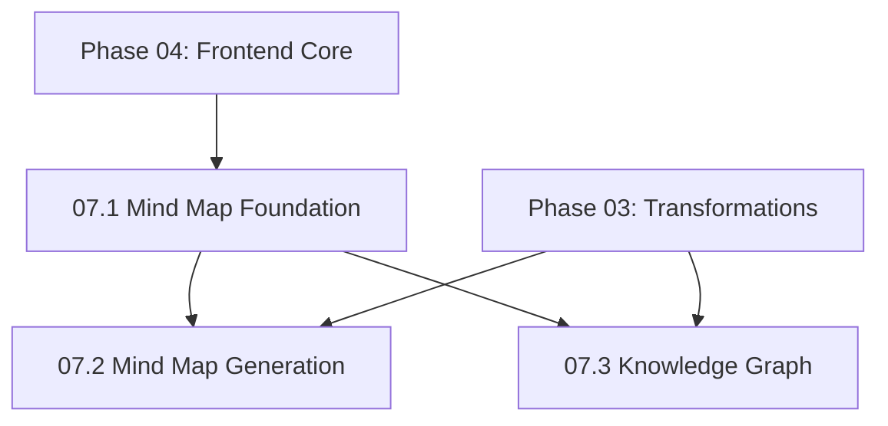

# NextGen Phase 07: Visualization & Knowledge Graphs

**Sprint Duration:** Week 22-24  
**Priority:** 🟡 HIGH  
**Phase Type:** Feature - Visualization  
**Prerequisites:** Phase 04 Complete (Frontend Core)  
**Generated:** December 28, 2025  
**Generated By:** BMad Orchestrator Party Mode  

---

## Executive Summary

Phase 07 implements advanced visualization features including interactive mind maps and knowledge graphs. These features provide visual exploration of content relationships, inspired by HyperbookLM's mind map functionality and expanding into knowledge graph territory.

**Key Outcomes:**
- Interactive mind maps using React Flow
- Knowledge graph visualization
- Entity relationship explorer
- Export visualizations as images/PDF

---

## Sprint 07.1: Mind Map Foundation (Days 1-7)

### Objective
Build the core mind map infrastructure using React Flow.

### Tasks

| ID | Task | Effort | Assignee |
|----|------|--------|----------|
| 07.1.1 | Set up React Flow infrastructure | 4h | Dev |
| 07.1.2 | Create custom MindMapNode component | 4h | Dev |
| 07.1.3 | Create custom edge components | 3h | Dev |
| 07.1.4 | Implement auto-layout algorithm | 6h | Dev |
| 07.1.5 | Create MindMap container component | 4h | Dev |
| 07.1.6 | Add pan/zoom controls | 2h | Dev |
| 07.1.7 | Implement node expand/collapse | 4h | Dev |
| 07.1.8 | Add minimap navigation | 2h | Dev |
| 07.1.9 | Create mind map store (Zustand) | 3h | Dev |
| 07.1.10 | Write component tests | 3h | QA |

### Reference Files

| Source | File | Pattern to Copy |
|--------|------|-----------------|
| HyperbookLM | `references/external-repos/hyperbooklm-main/components/MindMap.tsx` | Mind map component |
| HyperbookLM | `references/external-repos/hyperbooklm-main/lib/mindmap.ts` | Node layout utilities |

### Directory Structure

```
apps/web/src/
├── components/
│   └── visualization/
│       ├── MindMap.tsx
│       ├── MindMapNode.tsx
│       ├── MindMapEdge.tsx
│       ├── MindMapControls.tsx
│       ├── MindMapMinimap.tsx
│       ├── KnowledgeGraph.tsx
│       ├── GraphNode.tsx
│       ├── GraphEdge.tsx
│       └── ExportDialog.tsx
├── lib/
│   └── visualization/
│       ├── layout.ts
│       ├── mind-map-utils.ts
│       └── graph-utils.ts
└── stores/
    └── visualization-store.ts
```

### Mind Map Node Types

```typescript
// apps/web/src/components/visualization/types.ts
import { Node, Edge } from 'reactflow';

export interface MindMapNodeData {
  label: string;
  type: 'root' | 'topic' | 'subtopic' | 'detail';
  color?: string;
  icon?: string;
  description?: string;
  sourceId?: string;
  isExpanded?: boolean;
  childCount?: number;
}

export interface MindMapEdgeData {
  style?: 'solid' | 'dashed' | 'dotted';
  strength?: number;
}

export type MindMapNode = Node<MindMapNodeData>;
export type MindMapEdge = Edge<MindMapEdgeData>;

export interface MindMapData {
  id: string;
  title: string;
  nodes: MindMapNode[];
  edges: MindMapEdge[];
  createdAt: Date;
  sourceIds: string[];
}
```

### Mind Map Node Component

```tsx
// apps/web/src/components/visualization/MindMapNode.tsx
'use client';

import { memo } from 'react';
import { Handle, Position, NodeProps } from 'reactflow';
import { ChevronDown, ChevronRight } from 'lucide-react';
import { cn } from '@/lib/utils';
import { MindMapNodeData } from './types';

const nodeColors = {
  root: 'bg-indigo-600 text-white border-indigo-700',
  topic: 'bg-blue-500 text-white border-blue-600',
  subtopic: 'bg-teal-400 text-white border-teal-500',
  detail: 'bg-gray-100 text-gray-800 border-gray-300',
};

const nodeSizes = {
  root: 'px-6 py-3 text-lg font-bold',
  topic: 'px-4 py-2 text-base font-semibold',
  subtopic: 'px-3 py-1.5 text-sm font-medium',
  detail: 'px-2 py-1 text-xs',
};

export const MindMapNode = memo(function MindMapNode({
  data,
  isConnectable,
  selected,
}: NodeProps<MindMapNodeData>) {
  const { label, type, isExpanded, childCount, description } = data;
  
  return (
    <div
      className={cn(
        'rounded-lg border-2 shadow-md transition-all',
        'hover:shadow-lg cursor-pointer',
        nodeColors[type],
        nodeSizes[type],
        selected && 'ring-2 ring-offset-2 ring-indigo-500'
      )}
    >
      {/* Input handle - not for root */}
      {type !== 'root' && (
        <Handle
          type="target"
          position={Position.Left}
          isConnectable={isConnectable}
          className="!bg-gray-400 !w-2 !h-2"
        />
      )}
      
      <div className="flex items-center gap-2">
        {/* Expand/collapse indicator */}
        {childCount && childCount > 0 && (
          <span className="opacity-70">
            {isExpanded ? (
              <ChevronDown className="h-4 w-4" />
            ) : (
              <ChevronRight className="h-4 w-4" />
            )}
          </span>
        )}
        
        <span className="truncate max-w-[200px]">{label}</span>
        
        {/* Child count badge */}
        {!isExpanded && childCount && childCount > 0 && (
          <span className="text-xs opacity-70">
            +{childCount}
          </span>
        )}
      </div>
      
      {/* Description tooltip could go here */}
      
      {/* Output handle */}
      <Handle
        type="source"
        position={Position.Right}
        isConnectable={isConnectable}
        className="!bg-gray-400 !w-2 !h-2"
      />
    </div>
  );
});
```

### Mind Map Container

```tsx
// apps/web/src/components/visualization/MindMap.tsx
'use client';

import { useCallback, useMemo } from 'react';
import ReactFlow, {
  Background,
  Controls,
  MiniMap,
  useNodesState,
  useEdgesState,
  NodeTypes,
  EdgeTypes,
  Panel,
} from 'reactflow';
import 'reactflow/dist/style.css';

import { MindMapNode } from './MindMapNode';
import { MindMapEdge } from './MindMapEdge';
import { MindMapControls } from './MindMapControls';
import { useVisualizationStore } from '@/stores/visualization-store';
import { layoutMindMap } from '@/lib/visualization/layout';
import { MindMapData } from './types';

interface MindMapProps {
  data: MindMapData;
  onNodeClick?: (nodeId: string) => void;
  editable?: boolean;
}

const nodeTypes: NodeTypes = {
  mindMapNode: MindMapNode,
};

const edgeTypes: EdgeTypes = {
  mindMapEdge: MindMapEdge,
};

export function MindMap({ data, onNodeClick, editable = false }: MindMapProps) {
  // Apply auto-layout to nodes
  const layoutedData = useMemo(() => {
    return layoutMindMap(data.nodes, data.edges);
  }, [data.nodes, data.edges]);
  
  const [nodes, setNodes, onNodesChange] = useNodesState(layoutedData.nodes);
  const [edges, setEdges, onEdgesChange] = useEdgesState(layoutedData.edges);
  
  const { setSelectedNode, toggleNodeExpanded } = useVisualizationStore();
  
  const handleNodeClick = useCallback((event: React.MouseEvent, node: any) => {
    setSelectedNode(node.id);
    onNodeClick?.(node.id);
    
    // Toggle expand/collapse if node has children
    if (node.data.childCount > 0) {
      toggleNodeExpanded(node.id);
    }
  }, [setSelectedNode, toggleNodeExpanded, onNodeClick]);
  
  const handleExport = useCallback((format: 'png' | 'svg' | 'pdf') => {
    // Export implementation
  }, []);
  
  return (
    <div className="w-full h-full bg-gray-50 rounded-lg overflow-hidden">
      <ReactFlow
        nodes={nodes}
        edges={edges}
        onNodesChange={onNodesChange}
        onEdgesChange={onEdgesChange}
        onNodeClick={handleNodeClick}
        nodeTypes={nodeTypes}
        edgeTypes={edgeTypes}
        fitView
        attributionPosition="bottom-left"
        minZoom={0.2}
        maxZoom={2}
      >
        <Background color="#e5e7eb" gap={16} />
        <Controls />
        <MiniMap 
          nodeColor={(node) => {
            const colors = {
              root: '#4f46e5',
              topic: '#3b82f6',
              subtopic: '#2dd4bf',
              detail: '#e5e7eb',
            };
            return colors[node.data?.type] || '#e5e7eb';
          }}
        />
        
        <Panel position="top-right">
          <MindMapControls 
            onExport={handleExport}
            onFitView={() => {}}
            onRecenter={() => {}}
          />
        </Panel>
      </ReactFlow>
    </div>
  );
}
```

### Auto-Layout Algorithm

```typescript
// apps/web/src/lib/visualization/layout.ts
import dagre from 'dagre';
import { Node, Edge } from 'reactflow';

interface LayoutOptions {
  direction?: 'LR' | 'TB' | 'RL' | 'BT';
  nodeSpacing?: number;
  rankSpacing?: number;
}

export function layoutMindMap(
  nodes: Node[],
  edges: Edge[],
  options: LayoutOptions = {}
): { nodes: Node[]; edges: Edge[] } {
  const {
    direction = 'LR',
    nodeSpacing = 50,
    rankSpacing = 100,
  } = options;
  
  const dagreGraph = new dagre.graphlib.Graph();
  dagreGraph.setDefaultEdgeLabel(() => ({}));
  dagreGraph.setGraph({
    rankdir: direction,
    nodesep: nodeSpacing,
    ranksep: rankSpacing,
    marginx: 50,
    marginy: 50,
  });
  
  // Add nodes to dagre
  nodes.forEach((node) => {
    // Estimate node dimensions based on type
    const dimensions = getNodeDimensions(node.data?.type || 'detail');
    dagreGraph.setNode(node.id, dimensions);
  });
  
  // Add edges to dagre
  edges.forEach((edge) => {
    dagreGraph.setEdge(edge.source, edge.target);
  });
  
  // Run layout algorithm
  dagre.layout(dagreGraph);
  
  // Apply positions to nodes
  const layoutedNodes = nodes.map((node) => {
    const nodeWithPosition = dagreGraph.node(node.id);
    return {
      ...node,
      position: {
        x: nodeWithPosition.x - nodeWithPosition.width / 2,
        y: nodeWithPosition.y - nodeWithPosition.height / 2,
      },
    };
  });
  
  return { nodes: layoutedNodes, edges };
}

function getNodeDimensions(type: string): { width: number; height: number } {
  switch (type) {
    case 'root':
      return { width: 200, height: 60 };
    case 'topic':
      return { width: 160, height: 44 };
    case 'subtopic':
      return { width: 140, height: 36 };
    default:
      return { width: 120, height: 28 };
  }
}

// Radial layout for circular mind maps
export function layoutRadial(
  nodes: Node[],
  edges: Edge[],
  centerNodeId: string
): { nodes: Node[]; edges: Edge[] } {
  const centerNode = nodes.find(n => n.id === centerNodeId);
  if (!centerNode) return { nodes, edges };
  
  const levels = buildLevelMap(nodes, edges, centerNodeId);
  const layoutedNodes: Node[] = [];
  
  // Place center node
  layoutedNodes.push({
    ...centerNode,
    position: { x: 0, y: 0 },
  });
  
  // Place nodes in concentric circles
  levels.forEach((levelNodes, level) => {
    if (level === 0) return;
    
    const radius = level * 200;
    const angleStep = (2 * Math.PI) / levelNodes.length;
    
    levelNodes.forEach((node, i) => {
      const angle = i * angleStep - Math.PI / 2;
      layoutedNodes.push({
        ...node,
        position: {
          x: Math.cos(angle) * radius,
          y: Math.sin(angle) * radius,
        },
      });
    });
  });
  
  return { nodes: layoutedNodes, edges };
}

function buildLevelMap(
  nodes: Node[],
  edges: Edge[],
  rootId: string
): Map<number, Node[]> {
  const levels = new Map<number, Node[]>();
  const visited = new Set<string>();
  const queue: { nodeId: string; level: number }[] = [{ nodeId: rootId, level: 0 }];
  
  while (queue.length > 0) {
    const { nodeId, level } = queue.shift()!;
    if (visited.has(nodeId)) continue;
    visited.add(nodeId);
    
    const node = nodes.find(n => n.id === nodeId);
    if (node) {
      if (!levels.has(level)) levels.set(level, []);
      levels.get(level)!.push(node);
    }
    
    // Find children
    edges
      .filter(e => e.source === nodeId)
      .forEach(e => {
        if (!visited.has(e.target)) {
          queue.push({ nodeId: e.target, level: level + 1 });
        }
      });
  }
  
  return levels;
}
```

### Acceptance Criteria

- [ ] Mind map renders with React Flow
- [ ] Nodes display correctly by type (root/topic/subtopic/detail)
- [ ] Auto-layout positions nodes without overlap
- [ ] Pan and zoom work smoothly
- [ ] Minimap shows overview
- [ ] Node expand/collapse works

---

## Sprint 07.2: Mind Map Generation (Days 8-12)

### Objective
Generate mind maps from source content using AI transformation.

### Tasks

| ID | Task | Effort | Assignee |
|----|------|--------|----------|
| 07.2.1 | Create mind map transformation template | 4h | Dev |
| 07.2.2 | Build MindMapGenerator service | 4h | Dev |
| 07.2.3 | Create mind map API endpoints | 3h | Dev |
| 07.2.4 | Add mind map to notebook view | 3h | Dev |
| 07.2.5 | Implement regeneration flow | 2h | Dev |
| 07.2.6 | Create MindMapPage component | 3h | Dev |
| 07.2.7 | Write integration tests | 3h | QA |

### Mind Map Generator

```python
# apps/aei-core/services/visualization/mindmap_generator.py
import json
from typing import List, Dict, Any, Optional
from dataclasses import dataclass

from services.ai_client import AIClient
from services.transformation_engine import TransformationEngine


MINDMAP_PROMPT = """
Analyze the following content and create a hierarchical mind map structure.
The mind map should capture the main concepts and their relationships.

Content:
{content}

Generate a JSON structure with the following format:
{{
  "title": "Main topic title",
  "nodes": [
    {{
      "id": "unique_id",
      "label": "Node label (max 50 chars)",
      "type": "root|topic|subtopic|detail",
      "parentId": null or "parent_node_id",
      "description": "Optional longer description"
    }}
  ]
}}

Rules:
1. Create exactly ONE root node with type "root"
2. Create 3-7 topic nodes as direct children of root
3. Each topic can have 2-5 subtopics
4. Subtopics can have 1-3 details
5. Keep labels concise (under 50 characters)
6. Ensure all parentId references are valid

Return ONLY valid JSON, no additional text.
"""


@dataclass
class MindMapResult:
    """Result of mind map generation."""
    title: str
    nodes: List[Dict[str, Any]]
    edges: List[Dict[str, Any]]
    

class MindMapGenerator:
    """Generates mind maps from content."""
    
    def __init__(self, ai_client: AIClient):
        self.ai_client = ai_client
        
    async def generate(
        self,
        content: str,
        title: Optional[str] = None,
        max_depth: int = 4,
    ) -> MindMapResult:
        """Generate a mind map from content."""
        
        # Truncate content if too long
        if len(content) > 8000:
            content = content[:8000] + "..."
        
        response = await self.ai_client.generate(
            prompt=MINDMAP_PROMPT.format(content=content),
            model_type='transformation',
            max_tokens=2000,
        )
        
        # Parse JSON response
        try:
            data = json.loads(response.content)
        except json.JSONDecodeError:
            # Try to extract JSON from response
            import re
            json_match = re.search(r'\{[\s\S]*\}', response.content)
            if json_match:
                data = json.loads(json_match.group())
            else:
                raise ValueError("Could not parse mind map JSON")
        
        # Convert to nodes and edges format
        nodes = self._convert_nodes(data.get('nodes', []))
        edges = self._create_edges(data.get('nodes', []))
        
        return MindMapResult(
            title=title or data.get('title', 'Mind Map'),
            nodes=nodes,
            edges=edges,
        )
    
    def _convert_nodes(self, raw_nodes: List[Dict]) -> List[Dict]:
        """Convert raw nodes to React Flow format."""
        return [
            {
                'id': node['id'],
                'type': 'mindMapNode',
                'data': {
                    'label': node['label'],
                    'type': node.get('type', 'detail'),
                    'description': node.get('description'),
                    'isExpanded': node.get('type') in ['root', 'topic'],
                },
                'position': { 'x': 0, 'y': 0 },  # Will be calculated by layout
            }
            for node in raw_nodes
        ]
    
    def _create_edges(self, raw_nodes: List[Dict]) -> List[Dict]:
        """Create edges from parent-child relationships."""
        edges = []
        for node in raw_nodes:
            if node.get('parentId'):
                edges.append({
                    'id': f"e-{node['parentId']}-{node['id']}",
                    'source': node['parentId'],
                    'target': node['id'],
                    'type': 'mindMapEdge',
                })
        return edges
    
    async def generate_from_sources(
        self,
        sources: List[Dict[str, Any]],
    ) -> MindMapResult:
        """Generate a mind map from multiple sources."""
        
        # Combine source summaries
        combined_content = []
        for source in sources:
            title = source.get('title', 'Untitled')
            summary = source.get('summary', source.get('content', ''))[:1500]
            combined_content.append(f"## {title}\n{summary}")
        
        return await self.generate('\n\n'.join(combined_content))
```

### Mind Map API

```python
# apps/aei-core/api/routes/mindmaps.py
from fastapi import APIRouter, HTTPException
from typing import List
from pydantic import BaseModel

from services.visualization.mindmap_generator import MindMapGenerator


router = APIRouter(prefix="/mindmaps", tags=["mindmaps"])


class GenerateMindMapRequest(BaseModel):
    notebook_id: str
    source_ids: List[str]
    title: str | None = None


class MindMapResponse(BaseModel):
    id: str
    title: str
    nodes: List[dict]
    edges: List[dict]


@router.post("/generate", response_model=MindMapResponse)
async def generate_mindmap(
    request: GenerateMindMapRequest,
    generator: MindMapGenerator = Depends(get_mindmap_generator),
    source_repo = Depends(get_source_repo),
):
    """Generate a mind map from sources."""
    
    sources = await source_repo.get_many(request.source_ids)
    if not sources:
        raise HTTPException(status_code=400, detail="No sources found")
    
    result = await generator.generate_from_sources(
        sources=[s.dict() for s in sources],
    )
    
    return {
        'id': str(uuid.uuid4()),
        'title': result.title,
        'nodes': result.nodes,
        'edges': result.edges,
    }


@router.get("/notebook/{notebook_id}", response_model=List[MindMapResponse])
async def list_notebook_mindmaps(
    notebook_id: str,
    repo = Depends(get_mindmap_repo),
):
    """List all mind maps for a notebook."""
    return await repo.list_by_notebook(notebook_id)
```

### Acceptance Criteria

- [ ] Mind maps generate from source content
- [ ] AI produces well-structured hierarchies
- [ ] API returns React Flow compatible format
- [ ] Mind maps can be regenerated
- [ ] Multiple sources combine into single map

---

## Sprint 07.3: Knowledge Graph (Days 13-18)

### Objective
Build knowledge graph visualization showing entity relationships.

### Tasks

| ID | Task | Effort | Assignee |
|----|------|--------|----------|
| 07.3.1 | Design entity extraction prompt | 4h | Dev |
| 07.3.2 | Create EntityExtractor service | 4h | Dev |
| 07.3.3 | Build GraphNode component | 3h | Dev |
| 07.3.4 | Build GraphEdge with labels | 3h | Dev |
| 07.3.5 | Create KnowledgeGraph component | 4h | Dev |
| 07.3.6 | Implement force-directed layout | 4h | Dev |
| 07.3.7 | Add entity type filtering | 2h | Dev |
| 07.3.8 | Create entity detail panel | 3h | Dev |
| 07.3.9 | Add graph export functionality | 2h | Dev |
| 07.3.10 | Write component tests | 3h | QA |

### Entity Types

```typescript
// apps/web/src/components/visualization/graph-types.ts

export type EntityType = 
  | 'person'
  | 'organization'
  | 'concept'
  | 'event'
  | 'location'
  | 'document'
  | 'topic';

export interface GraphEntity {
  id: string;
  label: string;
  type: EntityType;
  description?: string;
  properties?: Record<string, any>;
  sourceIds?: string[];
}

export interface GraphRelation {
  id: string;
  sourceId: string;
  targetId: string;
  type: string; // 'mentions', 'related_to', 'authored_by', etc.
  weight?: number;
  label?: string;
}

export interface KnowledgeGraphData {
  entities: GraphEntity[];
  relations: GraphRelation[];
}
```

### Entity Extractor

```python
# apps/aei-core/services/visualization/entity_extractor.py
import json
from typing import List, Dict, Any
from dataclasses import dataclass

from services.ai_client import AIClient


ENTITY_EXTRACTION_PROMPT = """
Extract entities and their relationships from the following content.

Content:
{content}

Extract the following entity types:
- person: Names of people mentioned
- organization: Companies, institutions, groups
- concept: Key concepts, theories, ideas
- event: Specific events or occurrences
- location: Places mentioned
- topic: Main topics discussed

For each entity, identify relationships to other entities.

Return JSON in this format:
{{
  "entities": [
    {{
      "id": "unique_id",
      "label": "Entity name",
      "type": "person|organization|concept|event|location|topic",
      "description": "Brief description"
    }}
  ],
  "relations": [
    {{
      "sourceId": "entity_id",
      "targetId": "other_entity_id",
      "type": "mentions|related_to|authored_by|occurred_at|part_of",
      "label": "relationship description"
    }}
  ]
}}

Extract up to 30 entities and 50 relations.
Return ONLY valid JSON.
"""


@dataclass
class ExtractionResult:
    entities: List[Dict[str, Any]]
    relations: List[Dict[str, Any]]


class EntityExtractor:
    """Extracts entities and relationships from content."""
    
    def __init__(self, ai_client: AIClient):
        self.ai_client = ai_client
        
    async def extract(self, content: str) -> ExtractionResult:
        """Extract entities and relations from content."""
        
        if len(content) > 10000:
            content = content[:10000]
        
        response = await self.ai_client.generate(
            prompt=ENTITY_EXTRACTION_PROMPT.format(content=content),
            model_type='transformation',
            max_tokens=3000,
        )
        
        try:
            data = json.loads(response.content)
        except json.JSONDecodeError:
            import re
            json_match = re.search(r'\{[\s\S]*\}', response.content)
            if json_match:
                data = json.loads(json_match.group())
            else:
                raise ValueError("Could not parse entity extraction JSON")
        
        # Add unique IDs if missing
        entities = data.get('entities', [])
        for i, entity in enumerate(entities):
            if 'id' not in entity:
                entity['id'] = f"entity_{i}"
        
        relations = data.get('relations', [])
        for i, relation in enumerate(relations):
            if 'id' not in relation:
                relation['id'] = f"rel_{i}"
        
        return ExtractionResult(
            entities=entities,
            relations=relations,
        )
    
    async def extract_from_sources(
        self,
        sources: List[Dict[str, Any]],
        merge: bool = True,
    ) -> ExtractionResult:
        """Extract entities from multiple sources, optionally merging."""
        
        all_entities = []
        all_relations = []
        
        for source in sources:
            content = source.get('content', source.get('summary', ''))[:5000]
            result = await self.extract(content)
            
            # Tag entities with source
            for entity in result.entities:
                entity['sourceIds'] = [source.get('id')]
            
            all_entities.extend(result.entities)
            all_relations.extend(result.relations)
        
        if merge:
            # Merge duplicate entities
            all_entities, all_relations = self._merge_duplicates(
                all_entities, all_relations
            )
        
        return ExtractionResult(
            entities=all_entities,
            relations=all_relations,
        )
    
    def _merge_duplicates(
        self,
        entities: List[Dict],
        relations: List[Dict],
    ) -> tuple:
        """Merge entities with similar labels."""
        merged = {}
        id_mapping = {}
        
        for entity in entities:
            key = entity['label'].lower().strip()
            if key in merged:
                # Merge source IDs
                merged[key]['sourceIds'] = list(set(
                    merged[key].get('sourceIds', []) + 
                    entity.get('sourceIds', [])
                ))
                id_mapping[entity['id']] = merged[key]['id']
            else:
                merged[key] = entity
                id_mapping[entity['id']] = entity['id']
        
        # Update relation IDs
        updated_relations = []
        for rel in relations:
            new_rel = rel.copy()
            new_rel['sourceId'] = id_mapping.get(rel['sourceId'], rel['sourceId'])
            new_rel['targetId'] = id_mapping.get(rel['targetId'], rel['targetId'])
            
            # Skip self-references
            if new_rel['sourceId'] != new_rel['targetId']:
                updated_relations.append(new_rel)
        
        return list(merged.values()), updated_relations
```

### Knowledge Graph Component

```tsx
// apps/web/src/components/visualization/KnowledgeGraph.tsx
'use client';

import { useMemo, useState } from 'react';
import ReactFlow, {
  Background,
  Controls,
  MiniMap,
  useNodesState,
  useEdgesState,
} from 'reactflow';
import 'reactflow/dist/style.css';

import { GraphNode } from './GraphNode';
import { GraphEdge } from './GraphEdge';
import { EntityFilterPanel } from './EntityFilterPanel';
import { EntityDetailPanel } from './EntityDetailPanel';
import { layoutForceDirected } from '@/lib/visualization/layout';
import { KnowledgeGraphData, EntityType, GraphEntity } from './graph-types';

interface KnowledgeGraphProps {
  data: KnowledgeGraphData;
  onEntityClick?: (entity: GraphEntity) => void;
}

const nodeTypes = {
  graphNode: GraphNode,
};

const edgeTypes = {
  graphEdge: GraphEdge,
};

export function KnowledgeGraph({ data, onEntityClick }: KnowledgeGraphProps) {
  const [activeFilters, setActiveFilters] = useState<Set<EntityType>>(
    new Set(['person', 'organization', 'concept', 'topic'])
  );
  const [selectedEntity, setSelectedEntity] = useState<GraphEntity | null>(null);
  
  // Filter and layout
  const { nodes, edges } = useMemo(() => {
    const filteredEntities = data.entities.filter(e => 
      activeFilters.has(e.type)
    );
    
    const entityIds = new Set(filteredEntities.map(e => e.id));
    const filteredRelations = data.relations.filter(r =>
      entityIds.has(r.sourceId) && entityIds.has(r.targetId)
    );
    
    const graphNodes = filteredEntities.map(entity => ({
      id: entity.id,
      type: 'graphNode',
      data: {
        ...entity,
        isSelected: selectedEntity?.id === entity.id,
      },
      position: { x: 0, y: 0 },
    }));
    
    const graphEdges = filteredRelations.map(rel => ({
      id: rel.id,
      source: rel.sourceId,
      target: rel.targetId,
      type: 'graphEdge',
      data: {
        label: rel.label,
        type: rel.type,
      },
    }));
    
    return layoutForceDirected(graphNodes, graphEdges);
  }, [data, activeFilters, selectedEntity]);
  
  const [flowNodes, setNodes, onNodesChange] = useNodesState(nodes);
  const [flowEdges, setEdges, onEdgesChange] = useEdgesState(edges);
  
  const handleNodeClick = (event: React.MouseEvent, node: any) => {
    const entity = data.entities.find(e => e.id === node.id);
    if (entity) {
      setSelectedEntity(entity);
      onEntityClick?.(entity);
    }
  };
  
  return (
    <div className="flex h-full">
      {/* Main Graph */}
      <div className="flex-1">
        <ReactFlow
          nodes={flowNodes}
          edges={flowEdges}
          onNodesChange={onNodesChange}
          onEdgesChange={onEdgesChange}
          onNodeClick={handleNodeClick}
          nodeTypes={nodeTypes}
          edgeTypes={edgeTypes}
          fitView
        >
          <Background />
          <Controls />
          <MiniMap />
        </ReactFlow>
      </div>
      
      {/* Side Panels */}
      <div className="w-64 border-l bg-white">
        <EntityFilterPanel
          activeFilters={activeFilters}
          onFiltersChange={setActiveFilters}
          entityCounts={getEntityCounts(data.entities)}
        />
        
        {selectedEntity && (
          <EntityDetailPanel
            entity={selectedEntity}
            relations={data.relations.filter(r => 
              r.sourceId === selectedEntity.id || 
              r.targetId === selectedEntity.id
            )}
            onClose={() => setSelectedEntity(null)}
          />
        )}
      </div>
    </div>
  );
}

function getEntityCounts(entities: GraphEntity[]): Record<EntityType, number> {
  const counts: Record<string, number> = {};
  for (const entity of entities) {
    counts[entity.type] = (counts[entity.type] || 0) + 1;
  }
  return counts as Record<EntityType, number>;
}
```

### Force-Directed Layout

```typescript
// apps/web/src/lib/visualization/layout.ts (addition)
import { Node, Edge } from 'reactflow';

interface ForceNode extends d3.SimulationNodeDatum {
  id: string;
  x?: number;
  y?: number;
}

interface ForceLink extends d3.SimulationLinkDatum<ForceNode> {
  source: string | ForceNode;
  target: string | ForceNode;
}

export function layoutForceDirected(
  nodes: Node[],
  edges: Edge[],
  options: {
    width?: number;
    height?: number;
    strength?: number;
  } = {}
): { nodes: Node[]; edges: Edge[] } {
  const { width = 800, height = 600, strength = -300 } = options;
  
  // Create d3 simulation
  const forceNodes: ForceNode[] = nodes.map(n => ({ 
    id: n.id,
    x: Math.random() * width,
    y: Math.random() * height,
  }));
  
  const forceLinks: ForceLink[] = edges.map(e => ({
    source: e.source,
    target: e.target,
  }));
  
  const simulation = d3.forceSimulation(forceNodes)
    .force('link', d3.forceLink(forceLinks).id((d: any) => d.id).distance(100))
    .force('charge', d3.forceManyBody().strength(strength))
    .force('center', d3.forceCenter(width / 2, height / 2))
    .force('collision', d3.forceCollide().radius(50));
  
  // Run simulation synchronously
  simulation.tick(300);
  simulation.stop();
  
  // Map positions back to nodes
  const nodePositions = new Map(forceNodes.map(n => [n.id, { x: n.x!, y: n.y! }]));
  
  const positionedNodes = nodes.map(node => ({
    ...node,
    position: nodePositions.get(node.id) || { x: 0, y: 0 },
  }));
  
  return { nodes: positionedNodes, edges };
}
```

### Acceptance Criteria

- [ ] Entities extracted from content
- [ ] Relationships correctly identified
- [ ] Force-directed layout positions nodes
- [ ] Entity filtering by type
- [ ] Click to see entity details
- [ ] Duplicate entities merged across sources

---

## 🔴 BLIND SPOTS IDENTIFIED IN PHASE 07

### Blind Spot 1: Large Graph Performance

**Issue:** Graphs with 100+ nodes will be slow to render.

**Mitigation:**
- Implement node clustering
- Add level-of-detail rendering
- Use WebGL renderer for large graphs
- Limit extracted entities per source

### Blind Spot 2: Layout Determinism

**Issue:** Force-directed layouts produce different results each time.

**Mitigation:**
- Seed random number generator
- Cache computed layouts
- Allow manual node positioning
- Save layout with graph data

### Blind Spot 3: Entity Extraction Quality

**Issue:** AI may extract too many/few entities or miss relationships.

**Mitigation:**
- Tune extraction prompts
- Add confidence scores
- Allow manual entity addition/removal
- Provide feedback mechanism

### Blind Spot 4: Mobile Experience

**Issue:** Graph interactions (drag, pinch zoom) difficult on mobile.

**Mitigation:**
- Disable editing on mobile
- Provide simpler list view alternative
- Optimize touch gestures
- Consider dedicated mobile visualization

### Blind Spot 5: Export Quality

**Issue:** SVG/PNG exports may not match screen quality.

**Mitigation:**
- Export at 2x resolution for PNG
- Ensure SVG fonts are embedded
- Test exports across browsers
- Add PDF generation for print

---

## Phase 07 Dependencies



## Definition of Done

Phase 07 is complete when:

- [ ] Mind maps render and auto-layout
- [ ] Mind maps generate from AI
- [ ] Knowledge graphs show entity relationships
- [ ] Force-directed layout works
- [ ] Export to PNG/SVG works
- [ ] All components tested

---

## Estimated Timeline

| Sprint | Duration | Cumulative |
|--------|----------|------------|
| 07.1 Mind Map Foundation | 7 days | Day 7 |
| 07.2 Mind Map Generation | 5 days | Day 12 |
| 07.3 Knowledge Graph | 6 days | Day 18 |

**Total:** 18 working days (~3.5 weeks)

---

## Dependencies to Install

```json
// apps/web/package.json additions
{
  "dependencies": {
    "reactflow": "^11.10.0",
    "dagre": "^0.8.5",
    "d3-force": "^3.0.0",
    "d3-selection": "^3.0.0",
    "html-to-image": "^1.11.0"
  },
  "devDependencies": {
    "@types/dagre": "^0.7.0",
    "@types/d3-force": "^3.0.0"
  }
}
```

---

*Generated by BMad Orchestrator Party Mode*  
*Phase 07 Version: 1.0*
