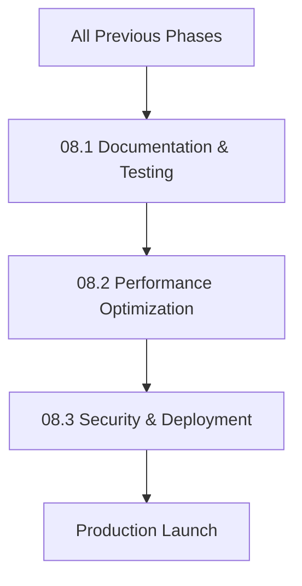

# NextGen Phase 08: Production Readiness & Optimization

**Sprint Duration:** Week 25-28  
**Priority:** 🔴 CRITICAL  
**Phase Type:** Production  
**Prerequisites:** All Previous Phases Complete  
**Generated:** December 28, 2025  
**Generated By:** BMad Orchestrator Party Mode  

---

## Executive Summary

Phase 08 prepares the entire system for production deployment. This includes comprehensive documentation, test coverage improvements, performance optimization, security hardening, and deployment automation. This phase ensures the system is ready for real users.

**Key Outcomes:**
- API documentation with OpenAPI/Swagger
- Test coverage >70% across all packages
- Docker deployment configuration
- Performance optimizations (caching, indexing)
- Security hardening
- Monitoring and observability

---

## Sprint 08.1: Documentation & Testing (Days 1-10)

### Objective
Create comprehensive documentation and achieve target test coverage.

### Tasks

| ID | Task | Effort | Assignee |
|----|------|--------|----------|
| 08.1.1 | Set up OpenAPI/Swagger for Python API | 4h | Dev |
| 08.1.2 | Document all API endpoints | 6h | Dev |
| 08.1.3 | Create API client SDK documentation | 4h | Dev |
| 08.1.4 | Write developer onboarding guide | 4h | Dev |
| 08.1.5 | Create architecture documentation | 4h | Dev |
| 08.1.6 | Add unit tests to reach 70% coverage | 16h | Dev |
| 08.1.7 | Create integration test suite | 8h | QA |
| 08.1.8 | Set up E2E tests with Playwright | 8h | QA |
| 08.1.9 | Configure test coverage reporting | 2h | Dev |
| 08.1.10 | Write deployment runbook | 3h | Dev |

### OpenAPI Documentation Setup

```python
# apps/aei-core/api/docs.py
from fastapi import FastAPI
from fastapi.openapi.utils import get_openapi
from fastapi.openapi.docs import get_swagger_ui_html, get_redoc_html


def custom_openapi(app: FastAPI):
    """Generate custom OpenAPI schema."""
    if app.openapi_schema:
        return app.openapi_schema
    
    openapi_schema = get_openapi(
        title="Second Brain Foundation API",
        version="1.0.0",
        description="""
## Second Brain Foundation API

The SBF API provides endpoints for:

- **Notebooks**: Create and manage research notebooks
- **Sources**: Add and process content from URLs, files, and YouTube
- **Chat**: RAG-powered chat with streaming responses
- **Search**: Hybrid search across all content
- **Transformations**: Generate summaries, insights, flashcards
- **Podcasts**: Generate audio discussions from sources
- **Visualizations**: Mind maps and knowledge graphs

### Authentication

All endpoints require Bearer token authentication:

```
Authorization: Bearer <your_token>
```

### Rate Limits

- Chat streaming: 10 requests/minute
- Transformations: 30 requests/minute
- Search: 60 requests/minute
- Content ingestion: 20 requests/minute

### Error Codes

| Code | Description |
|------|-------------|
| 400 | Invalid request parameters |
| 401 | Authentication required |
| 403 | Insufficient permissions |
| 404 | Resource not found |
| 429 | Rate limit exceeded |
| 500 | Internal server error |
        """,
        routes=app.routes,
        tags=[
            {"name": "notebooks", "description": "Notebook management"},
            {"name": "sources", "description": "Source content management"},
            {"name": "chat", "description": "RAG chat with streaming"},
            {"name": "search", "description": "Hybrid search"},
            {"name": "transformations", "description": "Content transformations"},
            {"name": "podcasts", "description": "Podcast generation"},
            {"name": "models", "description": "AI model configuration"},
            {"name": "users", "description": "User management"},
        ],
    )
    
    # Add security scheme
    openapi_schema["components"]["securitySchemes"] = {
        "bearerAuth": {
            "type": "http",
            "scheme": "bearer",
            "bearerFormat": "JWT",
        }
    }
    
    # Apply security to all endpoints
    openapi_schema["security"] = [{"bearerAuth": []}]
    
    app.openapi_schema = openapi_schema
    return app.openapi_schema


def setup_docs(app: FastAPI):
    """Set up documentation routes."""
    
    @app.get("/docs", include_in_schema=False)
    async def custom_swagger_ui():
        return get_swagger_ui_html(
            openapi_url="/openapi.json",
            title="SBF API Documentation",
        )
    
    @app.get("/redoc", include_in_schema=False)
    async def redoc():
        return get_redoc_html(
            openapi_url="/openapi.json",
            title="SBF API Reference",
        )
    
    app.openapi = lambda: custom_openapi(app)
```

### API Endpoint Documentation Example

```python
# apps/aei-core/api/routes/notebooks.py
from fastapi import APIRouter, HTTPException, Query
from typing import List, Optional
from pydantic import BaseModel, Field


class NotebookCreate(BaseModel):
    """Create a new notebook."""
    name: str = Field(..., min_length=1, max_length=100, example="AI Research")
    description: Optional[str] = Field(None, max_length=500, example="My AI research notes")
    
    class Config:
        schema_extra = {
            "example": {
                "name": "AI Research",
                "description": "Notes on artificial intelligence papers and concepts"
            }
        }


class NotebookResponse(BaseModel):
    """Notebook response object."""
    id: str = Field(..., description="Unique notebook identifier")
    name: str = Field(..., description="Notebook name")
    description: Optional[str] = Field(None, description="Notebook description")
    source_count: int = Field(..., description="Number of sources in notebook")
    created_at: str = Field(..., description="ISO 8601 creation timestamp")
    updated_at: str = Field(..., description="ISO 8601 last update timestamp")


router = APIRouter(prefix="/notebooks", tags=["notebooks"])


@router.post(
    "/",
    response_model=NotebookResponse,
    status_code=201,
    summary="Create notebook",
    description="Create a new research notebook to organize sources and notes.",
    responses={
        201: {"description": "Notebook created successfully"},
        400: {"description": "Invalid input"},
        401: {"description": "Not authenticated"},
    },
)
async def create_notebook(
    notebook: NotebookCreate,
    user = Depends(get_current_user),
):
    """
    Create a new notebook.
    
    - **name**: Required notebook name (1-100 characters)
    - **description**: Optional description (up to 500 characters)
    
    Returns the created notebook with generated ID and timestamps.
    """
    # Implementation
    pass


@router.get(
    "/",
    response_model=List[NotebookResponse],
    summary="List notebooks",
    description="List all notebooks for the authenticated user.",
)
async def list_notebooks(
    limit: int = Query(20, ge=1, le=100, description="Maximum results to return"),
    offset: int = Query(0, ge=0, description="Number of results to skip"),
    search: Optional[str] = Query(None, description="Search notebooks by name"),
    user = Depends(get_current_user),
):
    """
    List all notebooks owned by the authenticated user.
    
    Supports pagination via `limit` and `offset` parameters.
    Use `search` to filter by notebook name.
    """
    # Implementation
    pass
```

### Test Coverage Configuration

```javascript
// jest.config.js (root)
module.exports = {
  collectCoverage: true,
  coverageDirectory: 'coverage',
  coverageReporters: ['text', 'lcov', 'html'],
  coverageThreshold: {
    global: {
      branches: 70,
      functions: 70,
      lines: 70,
      statements: 70,
    },
  },
  projects: [
    '<rootDir>/packages/*/jest.config.js',
    '<rootDir>/apps/*/jest.config.js',
  ],
};
```

```yaml
# apps/aei-core/pytest.ini
[pytest]
minversion = 7.0
addopts = -ra -q --cov=. --cov-report=html --cov-report=term --cov-fail-under=70
testpaths = tests
python_files = test_*.py
python_classes = Test*
python_functions = test_*
```

### E2E Test Setup with Playwright

```typescript
// e2e/playwright.config.ts
import { PlaywrightTestConfig } from '@playwright/test';

const config: PlaywrightTestConfig = {
  testDir: './tests',
  timeout: 30000,
  retries: 2,
  use: {
    baseURL: process.env.TEST_BASE_URL || 'http://localhost:3000',
    trace: 'on-first-retry',
    screenshot: 'only-on-failure',
  },
  projects: [
    {
      name: 'chromium',
      use: { browserName: 'chromium' },
    },
    {
      name: 'firefox',
      use: { browserName: 'firefox' },
    },
  ],
  webServer: {
    command: 'pnpm --filter @sbf/web dev',
    port: 3000,
    timeout: 120000,
    reuseExistingServer: !process.env.CI,
  },
};

export default config;
```

```typescript
// e2e/tests/notebook-flow.spec.ts
import { test, expect } from '@playwright/test';

test.describe('Notebook Flow', () => {
  test.beforeEach(async ({ page }) => {
    // Login
    await page.goto('/login');
    await page.fill('[name="email"]', 'test@example.com');
    await page.fill('[name="password"]', 'testpassword');
    await page.click('button[type="submit"]');
    await page.waitForURL('/dashboard');
  });
  
  test('should create a new notebook', async ({ page }) => {
    await page.click('text=New Notebook');
    await page.fill('[name="name"]', 'Test Notebook');
    await page.click('text=Create');
    
    await expect(page.locator('text=Test Notebook')).toBeVisible();
  });
  
  test('should add a source to notebook', async ({ page }) => {
    // Navigate to notebook
    await page.click('text=Test Notebook');
    
    // Add source
    await page.click('text=Add Source');
    await page.click('text=URL');
    await page.fill('[name="url"]', 'https://example.com/article');
    await page.click('text=Add');
    
    // Wait for processing
    await expect(page.locator('text=Processing')).toBeVisible();
    await expect(page.locator('text=Ready')).toBeVisible({ timeout: 60000 });
  });
  
  test('should search across sources', async ({ page }) => {
    await page.goto('/search');
    await page.fill('[placeholder*="Search"]', 'example query');
    
    await expect(page.locator('.search-result')).toHaveCount.greaterThan(0);
  });
});
```

### Acceptance Criteria

- [ ] OpenAPI/Swagger docs accessible at /docs
- [ ] All endpoints documented with examples
- [ ] Unit test coverage ≥70%
- [ ] Integration tests pass
- [ ] E2E tests cover critical flows
- [ ] Developer guide complete

---

## Sprint 08.2: Performance Optimization (Days 11-18)

### Objective
Optimize system performance through caching, indexing, and query optimization.

### Tasks

| ID | Task | Effort | Assignee |
|----|------|--------|----------|
| 08.2.1 | Implement Redis caching layer | 6h | Dev |
| 08.2.2 | Add database query optimization | 4h | Dev |
| 08.2.3 | Create database indexes for common queries | 3h | Dev |
| 08.2.4 | Implement API response caching | 4h | Dev |
| 08.2.5 | Add connection pooling | 2h | Dev |
| 08.2.6 | Optimize embedding batch operations | 4h | Dev |
| 08.2.7 | Add lazy loading for large lists | 3h | Dev |
| 08.2.8 | Implement image optimization | 3h | Dev |
| 08.2.9 | Profile and optimize hot paths | 6h | Dev |
| 08.2.10 | Create performance benchmarks | 4h | QA |

### Redis Caching Layer

```python
# apps/aei-core/services/cache.py
import json
import hashlib
from typing import Optional, Any, TypeVar, Callable
from functools import wraps
import redis.asyncio as redis
from datetime import timedelta

T = TypeVar('T')


class CacheService:
    """Redis-based caching service."""
    
    def __init__(self, redis_url: str):
        self.redis = redis.from_url(redis_url)
        self.default_ttl = timedelta(minutes=15)
    
    async def get(self, key: str) -> Optional[Any]:
        """Get cached value."""
        value = await self.redis.get(key)
        if value:
            return json.loads(value)
        return None
    
    async def set(
        self, 
        key: str, 
        value: Any, 
        ttl: Optional[timedelta] = None
    ):
        """Set cached value."""
        ttl = ttl or self.default_ttl
        await self.redis.setex(
            key, 
            int(ttl.total_seconds()), 
            json.dumps(value, default=str)
        )
    
    async def delete(self, key: str):
        """Delete cached value."""
        await self.redis.delete(key)
    
    async def delete_pattern(self, pattern: str):
        """Delete all keys matching pattern."""
        keys = await self.redis.keys(pattern)
        if keys:
            await self.redis.delete(*keys)
    
    async def invalidate_notebook(self, notebook_id: str):
        """Invalidate all caches for a notebook."""
        await self.delete_pattern(f"notebook:{notebook_id}:*")
        await self.delete_pattern(f"search:*")  # Search results may include this notebook


def cached(
    ttl: timedelta = timedelta(minutes=15),
    key_prefix: str = "",
):
    """Decorator for caching function results."""
    def decorator(func: Callable[..., T]) -> Callable[..., T]:
        @wraps(func)
        async def wrapper(*args, **kwargs):
            # Generate cache key from function name and arguments
            cache_key = _generate_key(key_prefix, func.__name__, args, kwargs)
            
            # Get cache service from context
            cache = get_cache_service()
            
            # Check cache
            cached_value = await cache.get(cache_key)
            if cached_value is not None:
                return cached_value
            
            # Call function
            result = await func(*args, **kwargs)
            
            # Cache result
            await cache.set(cache_key, result, ttl)
            
            return result
        return wrapper
    return decorator


def _generate_key(prefix: str, func_name: str, args: tuple, kwargs: dict) -> str:
    """Generate a cache key from function call."""
    # Serialize args (skip self)
    key_parts = [prefix, func_name]
    
    for arg in args[1:]:  # Skip self
        if hasattr(arg, 'id'):
            key_parts.append(str(arg.id))
        elif isinstance(arg, (str, int, float, bool)):
            key_parts.append(str(arg))
    
    for k, v in sorted(kwargs.items()):
        if isinstance(v, (str, int, float, bool)):
            key_parts.append(f"{k}:{v}")
    
    key_string = ":".join(key_parts)
    return hashlib.md5(key_string.encode()).hexdigest()
```

### Database Indexes

```sql
-- infra/migrations/V009__performance_indexes.sql

-- Notebook queries
CREATE INDEX CONCURRENTLY IF NOT EXISTS idx_notebooks_user_id 
ON notebooks(user_id);

CREATE INDEX CONCURRENTLY IF NOT EXISTS idx_notebooks_user_updated 
ON notebooks(user_id, updated_at DESC);

-- Source queries
CREATE INDEX CONCURRENTLY IF NOT EXISTS idx_sources_notebook_id 
ON sources(notebook_id);

CREATE INDEX CONCURRENTLY IF NOT EXISTS idx_sources_status 
ON sources(status) WHERE status != 'ready';

CREATE INDEX CONCURRENTLY IF NOT EXISTS idx_sources_type 
ON sources(source_type);

-- Chat session queries
CREATE INDEX CONCURRENTLY IF NOT EXISTS idx_chat_sessions_notebook 
ON chat_sessions(notebook_id, created_at DESC);

CREATE INDEX CONCURRENTLY IF NOT EXISTS idx_chat_messages_session 
ON chat_messages(session_id, created_at);

-- Search optimization
CREATE INDEX CONCURRENTLY IF NOT EXISTS idx_sources_content_gin 
ON sources USING gin(to_tsvector('english', content));

CREATE INDEX CONCURRENTLY IF NOT EXISTS idx_insights_content_gin 
ON insights USING gin(to_tsvector('english', content));

-- Vector similarity (requires pgvector)
CREATE INDEX CONCURRENTLY IF NOT EXISTS idx_embeddings_vector 
ON embeddings USING ivfflat (embedding vector_cosine_ops) 
WITH (lists = 100);

-- Transformation queries
CREATE INDEX CONCURRENTLY IF NOT EXISTS idx_transformations_source 
ON transformations(source_id, transformation_type);

-- Job runner
CREATE INDEX CONCURRENTLY IF NOT EXISTS idx_jobs_status_priority 
ON jobs(status, priority DESC, created_at) 
WHERE status IN ('pending', 'running');

-- Token tracking
CREATE INDEX CONCURRENTLY IF NOT EXISTS idx_token_usage_user_date 
ON token_usage(user_id, created_at DESC);

-- Analyze tables after index creation
ANALYZE notebooks;
ANALYZE sources;
ANALYZE chat_sessions;
ANALYZE chat_messages;
ANALYZE embeddings;
ANALYZE transformations;
ANALYZE jobs;
```

### Query Optimization

```python
# apps/aei-core/db/repositories/optimized_queries.py
from sqlalchemy import select, func, and_, or_
from sqlalchemy.orm import selectinload, joinedload
from datetime import datetime, timedelta


class OptimizedSourceRepository:
    """Optimized source repository with batching and eager loading."""
    
    async def get_notebook_sources_with_insights(
        self,
        notebook_id: str,
        limit: int = 50,
    ):
        """Get sources with pre-loaded insights in single query."""
        query = (
            select(Source)
            .options(
                selectinload(Source.insights),
                selectinload(Source.transformations),
            )
            .where(Source.notebook_id == notebook_id)
            .order_by(Source.created_at.desc())
            .limit(limit)
        )
        
        result = await self.session.execute(query)
        return result.scalars().all()
    
    async def get_sources_for_context(
        self,
        source_ids: list[str],
        max_content_length: int = 10000,
    ):
        """Get sources optimized for RAG context building."""
        query = (
            select(
                Source.id,
                Source.title,
                func.left(Source.content, max_content_length).label('content'),
                Source.summary,
            )
            .where(Source.id.in_(source_ids))
        )
        
        result = await self.session.execute(query)
        return result.all()
    
    async def batch_update_status(
        self,
        source_ids: list[str],
        status: str,
    ):
        """Batch update source statuses."""
        await self.session.execute(
            update(Source)
            .where(Source.id.in_(source_ids))
            .values(status=status, updated_at=datetime.utcnow())
        )
        await self.session.commit()


class OptimizedSearchRepository:
    """Optimized search with connection pooling and caching."""
    
    async def hybrid_search(
        self,
        query_text: str,
        query_embedding: list[float],
        user_id: str,
        limit: int = 20,
        notebook_ids: list[str] | None = None,
    ):
        """Perform hybrid search with single optimized query."""
        
        # Build CTE for vector similarity
        vector_cte = (
            select(
                Embedding.source_id,
                (1 - Embedding.embedding.cosine_distance(query_embedding)).label('vector_score'),
            )
            .where(Embedding.source_id.in_(
                select(Source.id)
                .join(Notebook)
                .where(Notebook.user_id == user_id)
            ))
            .order_by(Embedding.embedding.cosine_distance(query_embedding))
            .limit(limit * 2)
        ).cte('vector_results')
        
        # Build CTE for text search
        ts_query = func.plainto_tsquery('english', query_text)
        text_cte = (
            select(
                Source.id.label('source_id'),
                func.ts_rank(
                    func.to_tsvector('english', Source.content),
                    ts_query
                ).label('text_score'),
            )
            .join(Notebook)
            .where(
                and_(
                    Notebook.user_id == user_id,
                    func.to_tsvector('english', Source.content).match(ts_query),
                )
            )
            .limit(limit * 2)
        ).cte('text_results')
        
        # Combine results with RRF
        combined = (
            select(
                Source.id,
                Source.title,
                func.left(Source.content, 500).label('snippet'),
                Source.source_type,
                (
                    func.coalesce(1.0 / (60 + func.row_number().over(
                        order_by=vector_cte.c.vector_score.desc()
                    )), 0) +
                    func.coalesce(1.0 / (60 + func.row_number().over(
                        order_by=text_cte.c.text_score.desc()
                    )), 0)
                ).label('rrf_score'),
            )
            .outerjoin(vector_cte, Source.id == vector_cte.c.source_id)
            .outerjoin(text_cte, Source.id == text_cte.c.source_id)
            .where(
                or_(
                    vector_cte.c.source_id.isnot(None),
                    text_cte.c.source_id.isnot(None),
                )
            )
            .order_by(text('rrf_score DESC'))
            .limit(limit)
        )
        
        if notebook_ids:
            combined = combined.where(Source.notebook_id.in_(notebook_ids))
        
        result = await self.session.execute(combined)
        return result.all()
```

### API Response Caching

```typescript
// apps/api/src/middleware/cache.ts
import { Request, Response, NextFunction } from 'express';
import { createClient } from 'redis';

const redis = createClient({ url: process.env.REDIS_URL });

interface CacheOptions {
  ttl?: number;
  keyGenerator?: (req: Request) => string;
  condition?: (req: Request) => boolean;
}

export function apiCache(options: CacheOptions = {}) {
  const { 
    ttl = 60, 
    keyGenerator = defaultKeyGenerator,
    condition = () => true,
  } = options;
  
  return async (req: Request, res: Response, next: NextFunction) => {
    // Skip caching for non-GET requests
    if (req.method !== 'GET') {
      return next();
    }
    
    // Check condition
    if (!condition(req)) {
      return next();
    }
    
    const cacheKey = `api:${keyGenerator(req)}`;
    
    try {
      // Check cache
      const cached = await redis.get(cacheKey);
      if (cached) {
        res.setHeader('X-Cache', 'HIT');
        return res.json(JSON.parse(cached));
      }
      
      // Capture response
      const originalJson = res.json.bind(res);
      res.json = (body: any) => {
        // Cache the response
        redis.setEx(cacheKey, ttl, JSON.stringify(body)).catch(console.error);
        res.setHeader('X-Cache', 'MISS');
        return originalJson(body);
      };
      
      next();
    } catch (error) {
      // On cache error, continue without caching
      next();
    }
  };
}

function defaultKeyGenerator(req: Request): string {
  const userId = (req as any).user?.id || 'anon';
  return `${userId}:${req.originalUrl}`;
}

// Usage
app.get('/api/notebooks', apiCache({ ttl: 30 }), listNotebooks);
app.get('/api/search', apiCache({ ttl: 10 }), search);
```

### Acceptance Criteria

- [ ] Redis caching operational
- [ ] Database queries use indexes
- [ ] P95 latency < 500ms for common operations
- [ ] API response caching reduces load
- [ ] Benchmark suite established

---

## Sprint 08.3: Security & Deployment (Days 19-28)

### Objective
Harden security and create production deployment configuration.

### Tasks

| ID | Task | Effort | Assignee |
|----|------|--------|----------|
| 08.3.1 | Implement rate limiting | 4h | Dev |
| 08.3.2 | Add input validation and sanitization | 4h | Dev |
| 08.3.3 | Configure CORS and CSP headers | 2h | Dev |
| 08.3.4 | Set up secret management | 3h | DevOps |
| 08.3.5 | Create Docker production images | 4h | DevOps |
| 08.3.6 | Write docker-compose.prod.yml | 4h | DevOps |
| 08.3.7 | Set up health check endpoints | 2h | Dev |
| 08.3.8 | Configure logging and monitoring | 4h | DevOps |
| 08.3.9 | Create Kubernetes manifests | 6h | DevOps |
| 08.3.10 | Set up CI/CD pipeline | 6h | DevOps |
| 08.3.11 | Security audit and penetration testing | 8h | Security |
| 08.3.12 | Create incident response runbook | 3h | DevOps |

### Rate Limiting

```python
# apps/aei-core/middleware/rate_limit.py
from fastapi import Request, HTTPException
from fastapi.responses import JSONResponse
import redis.asyncio as redis
from datetime import datetime
import hashlib


class RateLimiter:
    """Token bucket rate limiter using Redis."""
    
    def __init__(self, redis_client: redis.Redis):
        self.redis = redis_client
        
        # Rate limit configurations per endpoint category
        self.limits = {
            'chat': {'requests': 10, 'window': 60},      # 10/min
            'transform': {'requests': 30, 'window': 60}, # 30/min
            'search': {'requests': 60, 'window': 60},    # 60/min
            'ingest': {'requests': 20, 'window': 60},    # 20/min
            'default': {'requests': 100, 'window': 60},  # 100/min
        }
    
    async def check_rate_limit(
        self,
        user_id: str,
        endpoint_category: str = 'default',
    ) -> tuple[bool, dict]:
        """Check if request is within rate limit."""
        
        config = self.limits.get(endpoint_category, self.limits['default'])
        key = f"rate_limit:{user_id}:{endpoint_category}"
        
        current_time = int(datetime.utcnow().timestamp())
        window_start = current_time - config['window']
        
        # Use Redis sorted set for sliding window
        pipe = self.redis.pipeline()
        
        # Remove old entries
        pipe.zremrangebyscore(key, 0, window_start)
        
        # Count current requests
        pipe.zcard(key)
        
        # Add current request
        pipe.zadd(key, {str(current_time): current_time})
        
        # Set expiry
        pipe.expire(key, config['window'])
        
        results = await pipe.execute()
        current_count = results[1]
        
        is_allowed = current_count < config['requests']
        
        return is_allowed, {
            'limit': config['requests'],
            'remaining': max(0, config['requests'] - current_count - 1),
            'reset': current_time + config['window'],
        }


async def rate_limit_middleware(request: Request, call_next):
    """FastAPI middleware for rate limiting."""
    
    # Get user from request
    user_id = getattr(request.state, 'user_id', None)
    if not user_id:
        user_id = request.client.host  # Fall back to IP
    
    # Determine endpoint category
    path = request.url.path
    if '/chat' in path:
        category = 'chat'
    elif '/transform' in path:
        category = 'transform'
    elif '/search' in path:
        category = 'search'
    elif '/sources' in path and request.method == 'POST':
        category = 'ingest'
    else:
        category = 'default'
    
    limiter = request.app.state.rate_limiter
    is_allowed, info = await limiter.check_rate_limit(user_id, category)
    
    if not is_allowed:
        return JSONResponse(
            status_code=429,
            content={
                'error': 'Rate limit exceeded',
                'retry_after': info['reset'] - int(datetime.utcnow().timestamp()),
            },
            headers={
                'X-RateLimit-Limit': str(info['limit']),
                'X-RateLimit-Remaining': str(info['remaining']),
                'X-RateLimit-Reset': str(info['reset']),
                'Retry-After': str(info['reset'] - int(datetime.utcnow().timestamp())),
            },
        )
    
    response = await call_next(request)
    
    # Add rate limit headers
    response.headers['X-RateLimit-Limit'] = str(info['limit'])
    response.headers['X-RateLimit-Remaining'] = str(info['remaining'])
    response.headers['X-RateLimit-Reset'] = str(info['reset'])
    
    return response
```

### Production Docker Configuration

```dockerfile
# apps/aei-core/Dockerfile.prod
FROM python:3.11-slim AS builder

WORKDIR /app

# Install build dependencies
RUN apt-get update && apt-get install -y \
    build-essential \
    libpq-dev \
    && rm -rf /var/lib/apt/lists/*

# Install Python dependencies
COPY requirements.txt .
RUN pip install --no-cache-dir -r requirements.txt

# Production stage
FROM python:3.11-slim AS production

WORKDIR /app

# Install runtime dependencies only
RUN apt-get update && apt-get install -y \
    libpq5 \
    ffmpeg \
    && rm -rf /var/lib/apt/lists/* \
    && useradd -m -u 1000 appuser

# Copy installed packages from builder
COPY --from=builder /usr/local/lib/python3.11/site-packages /usr/local/lib/python3.11/site-packages
COPY --from=builder /usr/local/bin /usr/local/bin

# Copy application code
COPY --chown=appuser:appuser . .

USER appuser

# Health check
HEALTHCHECK --interval=30s --timeout=10s --start-period=5s --retries=3 \
    CMD curl -f http://localhost:8000/health || exit 1

EXPOSE 8000

CMD ["uvicorn", "main:app", "--host", "0.0.0.0", "--port", "8000", "--workers", "4"]
```

```yaml
# docker-compose.prod.yml
version: '3.8'

services:
  api:
    build:
      context: ./apps/aei-core
      dockerfile: Dockerfile.prod
    environment:
      - DATABASE_URL=${DATABASE_URL}
      - REDIS_URL=redis://redis:6379
      - OPENAI_API_KEY=${OPENAI_API_KEY}
      - ANTHROPIC_API_KEY=${ANTHROPIC_API_KEY}
      - JWT_SECRET=${JWT_SECRET}
      - LOG_LEVEL=INFO
    depends_on:
      - postgres
      - redis
    deploy:
      replicas: 3
      resources:
        limits:
          cpus: '2'
          memory: 4G
        reservations:
          cpus: '0.5'
          memory: 1G
    healthcheck:
      test: ["CMD", "curl", "-f", "http://localhost:8000/health"]
      interval: 30s
      timeout: 10s
      retries: 3
    networks:
      - sbf-network

  web:
    build:
      context: ./apps/web
      dockerfile: Dockerfile.prod
    environment:
      - NEXT_PUBLIC_API_URL=https://api.sbf.io
    deploy:
      replicas: 2
      resources:
        limits:
          cpus: '1'
          memory: 2G
    networks:
      - sbf-network

  workers:
    build:
      context: ./apps/workers
      dockerfile: Dockerfile.prod
    environment:
      - DATABASE_URL=${DATABASE_URL}
      - REDIS_URL=redis://redis:6379
    deploy:
      replicas: 2
      resources:
        limits:
          cpus: '2'
          memory: 4G
    depends_on:
      - postgres
      - redis
    networks:
      - sbf-network

  postgres:
    image: pgvector/pgvector:pg16
    volumes:
      - postgres_data:/var/lib/postgresql/data
    environment:
      - POSTGRES_DB=sbf
      - POSTGRES_USER=${DB_USER}
      - POSTGRES_PASSWORD=${DB_PASSWORD}
    deploy:
      resources:
        limits:
          cpus: '4'
          memory: 8G
    networks:
      - sbf-network

  redis:
    image: redis:7-alpine
    volumes:
      - redis_data:/data
    command: redis-server --appendonly yes
    deploy:
      resources:
        limits:
          cpus: '1'
          memory: 2G
    networks:
      - sbf-network

  nginx:
    image: nginx:alpine
    volumes:
      - ./infra/nginx/nginx.conf:/etc/nginx/nginx.conf
      - ./infra/nginx/certs:/etc/nginx/certs
    ports:
      - "80:80"
      - "443:443"
    depends_on:
      - api
      - web
    networks:
      - sbf-network

volumes:
  postgres_data:
  redis_data:

networks:
  sbf-network:
    driver: overlay
```

### Health Check Endpoints

```python
# apps/aei-core/api/routes/health.py
from fastapi import APIRouter, Depends
from datetime import datetime
import redis.asyncio as redis
from sqlalchemy.ext.asyncio import AsyncSession

router = APIRouter(tags=["health"])


@router.get("/health")
async def health_check():
    """Basic health check."""
    return {
        "status": "healthy",
        "timestamp": datetime.utcnow().isoformat(),
    }


@router.get("/health/ready")
async def readiness_check(
    db: AsyncSession = Depends(get_db),
    redis_client: redis.Redis = Depends(get_redis),
):
    """Readiness check with dependency verification."""
    checks = {}
    
    # Database check
    try:
        await db.execute("SELECT 1")
        checks["database"] = "healthy"
    except Exception as e:
        checks["database"] = f"unhealthy: {str(e)}"
    
    # Redis check
    try:
        await redis_client.ping()
        checks["redis"] = "healthy"
    except Exception as e:
        checks["redis"] = f"unhealthy: {str(e)}"
    
    all_healthy = all(v == "healthy" for v in checks.values())
    
    return {
        "status": "ready" if all_healthy else "not_ready",
        "checks": checks,
        "timestamp": datetime.utcnow().isoformat(),
    }


@router.get("/health/live")
async def liveness_check():
    """Liveness check for Kubernetes."""
    return {"status": "alive"}
```

### CI/CD Pipeline

```yaml
# .github/workflows/deploy.yml
name: Deploy

on:
  push:
    branches: [main]
  pull_request:
    branches: [main]

env:
  REGISTRY: ghcr.io
  IMAGE_NAME: ${{ github.repository }}

jobs:
  test:
    runs-on: ubuntu-latest
    steps:
      - uses: actions/checkout@v4
      
      - name: Set up Python
        uses: actions/setup-python@v5
        with:
          python-version: '3.11'
      
      - name: Set up Node.js
        uses: actions/setup-node@v4
        with:
          node-version: '20'
      
      - name: Install pnpm
        uses: pnpm/action-setup@v2
        with:
          version: 8
      
      - name: Install dependencies
        run: pnpm install
      
      - name: Run linting
        run: pnpm lint
      
      - name: Run tests
        run: pnpm test
        env:
          CI: true
      
      - name: Run Python tests
        working-directory: apps/aei-core
        run: |
          pip install -r requirements.txt
          pytest --cov --cov-fail-under=70

  build:
    needs: test
    runs-on: ubuntu-latest
    if: github.event_name == 'push'
    
    steps:
      - uses: actions/checkout@v4
      
      - name: Log in to Container Registry
        uses: docker/login-action@v3
        with:
          registry: ${{ env.REGISTRY }}
          username: ${{ github.actor }}
          password: ${{ secrets.GITHUB_TOKEN }}
      
      - name: Build and push API
        uses: docker/build-push-action@v5
        with:
          context: ./apps/aei-core
          file: ./apps/aei-core/Dockerfile.prod
          push: true
          tags: ${{ env.REGISTRY }}/${{ env.IMAGE_NAME }}/api:${{ github.sha }}
      
      - name: Build and push Web
        uses: docker/build-push-action@v5
        with:
          context: ./apps/web
          file: ./apps/web/Dockerfile.prod
          push: true
          tags: ${{ env.REGISTRY }}/${{ env.IMAGE_NAME }}/web:${{ github.sha }}

  deploy:
    needs: build
    runs-on: ubuntu-latest
    if: github.ref == 'refs/heads/main'
    
    steps:
      - uses: actions/checkout@v4
      
      - name: Deploy to Production
        uses: appleboy/ssh-action@v1.0.0
        with:
          host: ${{ secrets.PROD_HOST }}
          username: ${{ secrets.PROD_USER }}
          key: ${{ secrets.PROD_SSH_KEY }}
          script: |
            cd /opt/sbf
            docker-compose -f docker-compose.prod.yml pull
            docker-compose -f docker-compose.prod.yml up -d
            docker system prune -f
```

### Acceptance Criteria

- [ ] Rate limiting prevents abuse
- [ ] All inputs validated
- [ ] Security headers configured
- [ ] Docker images optimized
- [ ] Health checks operational
- [ ] CI/CD pipeline deploys automatically
- [ ] Monitoring dashboards available

---

## 🔴 BLIND SPOTS IDENTIFIED IN PHASE 08

### Blind Spot 1: Database Migration Strategy

**Issue:** Zero-downtime migrations for production.

**Mitigation:**
- Use blue-green deployment
- Test migrations on staging first
- Implement rollback procedures
- Use expand-contract pattern

### Blind Spot 2: Secret Rotation

**Issue:** API keys and secrets need rotation without downtime.

**Mitigation:**
- Use secrets manager (Vault, AWS Secrets Manager)
- Support multiple active keys during rotation
- Automate rotation schedule

### Blind Spot 3: Cache Invalidation Timing

**Issue:** Stale cache data after updates.

**Mitigation:**
- Use cache-aside pattern with short TTLs
- Implement explicit invalidation on writes
- Add cache version prefix

### Blind Spot 4: Error Monitoring

**Issue:** Production errors may go unnoticed.

**Mitigation:**
- Integrate Sentry for error tracking
- Set up PagerDuty alerts
- Create error rate dashboards

### Blind Spot 5: Data Backup & Recovery

**Issue:** No backup strategy defined.

**Mitigation:**
- Implement automated daily backups
- Test restore procedures
- Define RPO/RTO targets
- Document disaster recovery

### Blind Spot 6: Load Testing

**Issue:** Unknown breaking point under load.

**Mitigation:**
- Run k6/Locust load tests
- Establish baseline metrics
- Test auto-scaling behavior
- Document capacity limits

---

## Phase 08 Dependencies



## Definition of Done

Phase 08 is complete when:

- [ ] API documentation complete at /docs
- [ ] Test coverage ≥70%
- [ ] P95 latency < 500ms
- [ ] Rate limiting active
- [ ] Docker production images ready
- [ ] CI/CD pipeline operational
- [ ] Monitoring dashboards live
- [ ] Security audit passed

---

## Estimated Timeline

| Sprint | Duration | Cumulative |
|--------|----------|------------|
| 08.1 Documentation & Testing | 10 days | Day 10 |
| 08.2 Performance Optimization | 8 days | Day 18 |
| 08.3 Security & Deployment | 10 days | Day 28 |

**Total:** 28 working days (~6 weeks)

---

## Post-Launch Checklist

```markdown
## Pre-Launch Verification

- [ ] All tests passing in CI
- [ ] Staging environment tested
- [ ] Load testing completed
- [ ] Security audit completed
- [ ] Backup verified
- [ ] Rollback procedure documented
- [ ] Monitoring alerts configured
- [ ] On-call schedule established

## Launch Day

- [ ] Deploy to production
- [ ] Verify health checks
- [ ] Monitor error rates
- [ ] Monitor latency metrics
- [ ] Verify feature functionality
- [ ] Enable traffic gradually

## Post-Launch

- [ ] Monitor for 24 hours
- [ ] Review error logs
- [ ] Gather user feedback
- [ ] Document lessons learned
- [ ] Schedule retrospective
```

---

*Generated by BMad Orchestrator Party Mode*  
*Phase 08 Version: 1.0*
