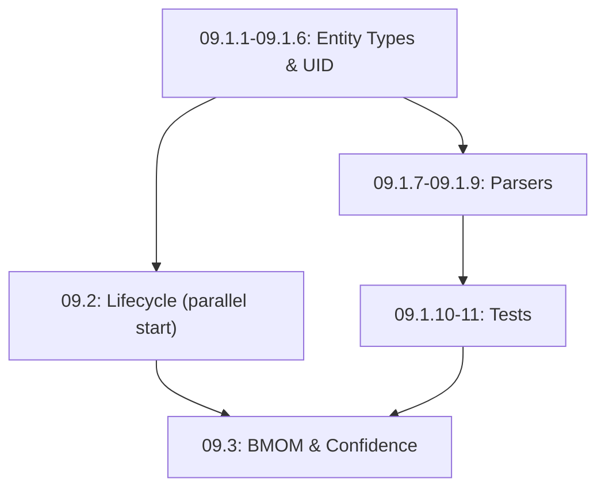
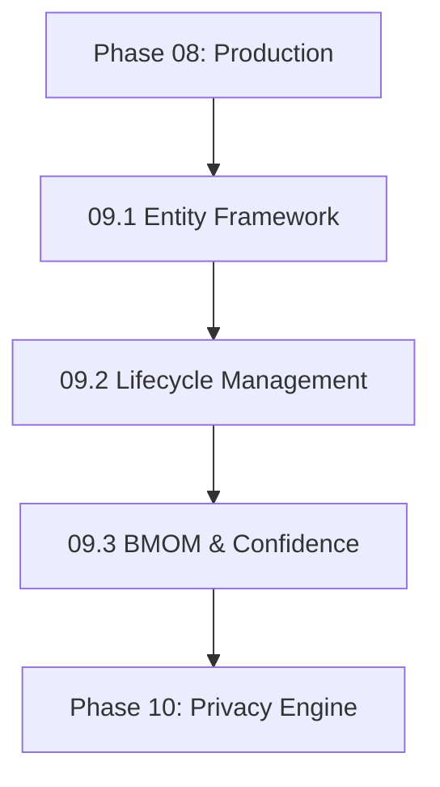

# NextGen Phase 09: Progressive Organization Engine

**Sprint Duration:** Week 29-31  
**Priority:** 🔴 CRITICAL  
**Phase Type:** Core PRD Feature  
**Prerequisites:** Phase 08 Complete  
**Generated:** December 28, 2025  
**Generated By:** BMad Orchestrator Party Mode - Sanity Check V2  

---

## Executive Summary

Phase 09 implements the **core differentiating features** from the PRD that make Second Brain Foundation unique among knowledge management tools. This includes the entity framework, UID system, 48-hour lifecycle management, BMOM framework, and confidence-based review workflows.

**Key Outcomes:**
- Extensible entity type registry
- PRD-compliant UID generation (`{type}-{slug}-{counter}`)
- 48-hour lifecycle state machine
- BMOM (Because-Meaning-Outcome-Measure) extraction
- Confidence scoring with human review queue

---

## PRD Requirements Addressed

| Requirement | Description | Status | Verification Test |
|-------------|-------------|--------|-------------------|
| FR1-FR5 | Hierarchical folder structure | ✅ Addressed | `entity_types.folder_path` matches PRD folders |
| FR6-FR9 | Entity templates with universal parameters | ✅ Addressed | Frontmatter parser extracts all fields |
| FR3/FR10 | UID format `{type}-{slug}-{counter}` | ✅ Addressed | UIDGenerator test: `person-john-smith-001` |
| FR4 | Typed relationship arrays | ✅ Addressed | Relationship vocab matches PRD FR22 |
| FR8/FR10 | 48-hour lifecycle with states | ✅ Addressed | LifecycleStateMachine transitions correctly |
| FR21 | BMOM framework | ✅ Addressed | BMOMExtractor extracts all 4 fields |
| FR20/FR25 | Confidence scoring with review | ✅ Addressed | ReviewQueueService triggers at <0.90 |

---

## Implementation Order (CRITICAL)

> ⚠️ **Phase 09 sprints CAN be partially parallelized**



**Verification Gates:**
1. After 09.1.6: `SELECT * FROM entity_types WHERE is_system = true` returns 6 rows
2. After 09.1.9: Wikilink `[[person-john-smith-001]]` resolves to correct entity
3. After 09.2: Entity created 49 hours ago has `lifecycle_state = 'maturing'`
4. After 09.3: Low-confidence entity appears in review queue

---

## Sprint 09.1: Entity Framework (Days 1-5)

### Objective
Create the extensible entity type system with PRD-compliant UID generation.

### Tasks

| ID | Task | Effort | Assignee |
|----|------|--------|----------|
| 09.1.1 | Create `@sbf/entity-framework` package | 2h | Dev |
| 09.1.2 | Design and create entity_types table | 3h | Dev |
| 09.1.3 | Design and create entities table | 3h | Dev |
| 09.1.4 | Design and create entity_relationships table | 3h | Dev |
| 09.1.5 | Implement EntityTypeRegistry service | 6h | Dev |
| 09.1.6 | Implement UIDGenerator service | 4h | Dev |
| 09.1.7 | Create EntityService for CRUD operations | 6h | Dev |
| 09.1.8 | Create YAML frontmatter parser/generator | 4h | Dev |
| 09.1.9 | Implement wikilink `[[UID]]` parser | 4h | Dev |
| 09.1.10 | Create seed data for default entity types | 3h | Dev |
| 09.1.11 | Write unit tests | 4h | QA |

### Package Structure

```
packages/@sbf/entity-framework/
├── package.json
├── tsconfig.json
├── README.md
├── src/
│   ├── index.ts
│   ├── types.ts
│   ├── entities/
│   │   ├── EntityType.ts
│   │   ├── Entity.ts
│   │   └── EntityRelationship.ts
│   ├── services/
│   │   ├── EntityTypeRegistry.ts
│   │   ├── UIDGenerator.ts
│   │   ├── EntityService.ts
│   │   └── RelationshipService.ts
│   ├── parsers/
│   │   ├── FrontmatterParser.ts
│   │   └── WikilinkParser.ts
│   └── templates/
│       ├── person.yaml
│       ├── place.yaml
│       ├── topic.yaml
│       ├── project.yaml
│       ├── event.yaml
│       └── artifact.yaml
└── tests/
    ├── EntityTypeRegistry.test.ts
    ├── UIDGenerator.test.ts
    └── FrontmatterParser.test.ts
```

### Database Schema

```sql
-- Migration: 010_entity_framework.sql

-- Entity Type Registry
CREATE TABLE entity_types (
  id UUID PRIMARY KEY DEFAULT gen_random_uuid(),
  tenant_id UUID REFERENCES tenants(id), -- NULL for system defaults
  name VARCHAR(50) NOT NULL,
  slug VARCHAR(50) NOT NULL,
  description TEXT,
  icon VARCHAR(50) DEFAULT 'file',
  color VARCHAR(20) DEFAULT '#6B7280',
  folder_path VARCHAR(255) NOT NULL, -- e.g., 'People/', 'Projects/'
  schema JSONB NOT NULL DEFAULT '{}', -- JSON Schema for entity metadata
  template TEXT NOT NULL, -- Markdown template with frontmatter
  uid_counter INTEGER DEFAULT 0, -- For sequential UID generation
  is_system BOOLEAN DEFAULT false,
  created_at TIMESTAMP DEFAULT NOW(),
  updated_at TIMESTAMP DEFAULT NOW(),
  UNIQUE(tenant_id, slug)
);

-- Enable RLS
ALTER TABLE entity_types ENABLE ROW LEVEL SECURITY;

CREATE POLICY entity_types_access ON entity_types
USING (
  tenant_id IS NULL OR 
  tenant_id = current_setting('app.current_tenant_id')::UUID
);

-- Entities (core knowledge objects)
CREATE TABLE entities (
  id UUID PRIMARY KEY DEFAULT gen_random_uuid(),
  tenant_id UUID NOT NULL REFERENCES tenants(id),
  uid VARCHAR(100) NOT NULL, -- {type}-{slug}-{counter} format
  type_id UUID NOT NULL REFERENCES entity_types(id),
  name VARCHAR(255) NOT NULL,
  slug VARCHAR(255) NOT NULL,
  content TEXT, -- Markdown content
  summary TEXT, -- AI-generated summary
  
  -- Universal Parameters (FR6)
  sensitivity VARCHAR(20) DEFAULT 'personal', -- public, personal, confidential, secret
  truth_level VARCHAR(10) DEFAULT 'U1', -- L1-L3, U1-U3
  lifecycle_state VARCHAR(20) DEFAULT 'captured', -- captured, transitional, permanent, archived
  
  -- Metadata
  metadata JSONB NOT NULL DEFAULT '{}', -- Type-specific metadata
  bmom JSONB, -- BMOM framework data
  
  -- Integrity & Tracking (FR24)
  checksum VARCHAR(64), -- SHA-256 of content
  override_by UUID REFERENCES users(id), -- Last manual override
  override_at TIMESTAMP,
  
  -- Timestamps
  captured_at TIMESTAMP DEFAULT NOW(), -- When first created
  filed_at TIMESTAMP, -- When moved to permanent
  created_at TIMESTAMP DEFAULT NOW(),
  modified_at TIMESTAMP DEFAULT NOW(),
  
  UNIQUE(tenant_id, uid)
);

CREATE INDEX idx_entities_tenant ON entities(tenant_id);
CREATE INDEX idx_entities_type ON entities(type_id);
CREATE INDEX idx_entities_lifecycle ON entities(lifecycle_state);
CREATE INDEX idx_entities_sensitivity ON entities(sensitivity);
CREATE INDEX idx_entities_modified ON entities(modified_at DESC);

-- Enable RLS
ALTER TABLE entities ENABLE ROW LEVEL SECURITY;

CREATE POLICY entities_tenant_isolation ON entities
USING (tenant_id = current_setting('app.current_tenant_id')::UUID);

-- Entity Relationships (FR11-FR12)
CREATE TABLE entity_relationships (
  id UUID PRIMARY KEY DEFAULT gen_random_uuid(),
  tenant_id UUID NOT NULL REFERENCES tenants(id),
  source_uid VARCHAR(100) NOT NULL,
  target_uid VARCHAR(100) NOT NULL,
  relationship_type VARCHAR(50) NOT NULL, -- informs, uses, occurs_at, etc.
  context TEXT, -- Optional context for the relationship
  confidence DECIMAL(3,2) DEFAULT 1.0, -- 0.0-1.0
  is_manual BOOLEAN DEFAULT false, -- User-created vs AI-extracted
  created_at TIMESTAMP DEFAULT NOW(),
  
  UNIQUE(tenant_id, source_uid, target_uid, relationship_type)
);

CREATE INDEX idx_relationships_source ON entity_relationships(source_uid);
CREATE INDEX idx_relationships_target ON entity_relationships(target_uid);
CREATE INDEX idx_relationships_type ON entity_relationships(relationship_type);

-- Relationship Type Vocabulary (FR22)
CREATE TABLE relationship_types (
  id UUID PRIMARY KEY DEFAULT gen_random_uuid(),
  tenant_id UUID REFERENCES tenants(id), -- NULL for system defaults
  name VARCHAR(50) NOT NULL,
  inverse_name VARCHAR(50), -- e.g., 'authored_by' inverse is 'authored'
  description TEXT,
  is_bidirectional BOOLEAN DEFAULT false,
  UNIQUE(tenant_id, name)
);

-- Seed default relationship types
INSERT INTO relationship_types (name, inverse_name, description, is_bidirectional) VALUES
('informs', 'informed_by', 'One entity provides information to another', false),
('uses', 'used_by', 'One entity uses or depends on another', false),
('occurs_at', 'hosts', 'Event occurs at a place', false),
('authored_by', 'authored', 'Content authored by a person', false),
('cites', 'cited_by', 'One entity cites another', false),
('subproject_of', 'has_subproject', 'Project hierarchy', false),
('part_of', 'contains', 'Containment relationship', false),
('depends_on', 'dependency_of', 'Dependency relationship', false),
('blocks', 'blocked_by', 'Blocking relationship', false),
('collaborates_with', NULL, 'Collaboration relationship', true),
('mentioned_in', 'mentions', 'Entity mentioned in another', false),
('duplicates', NULL, 'Duplicate relationship', true),
('related_to', NULL, 'Generic relationship', true);

-- Seed default entity types
INSERT INTO entity_types (name, slug, description, icon, color, folder_path, schema, template, is_system) VALUES
('Person', 'person', 'A person in your network', 'user', '#3B82F6', 'People/', 
  '{"properties": {"email": {"type": "string"}, "organization": {"type": "string"}, "role": {"type": "string"}}}',
  E'---\nuid: {{uid}}\ntype: person\nname: {{name}}\ncreated_at: {{created_at}}\nmodified_at: {{modified_at}}\nrelationships: []\nsensitivity: personal\ntruth_level: U1\n---\n\n# {{name}}\n\n## Overview\n\n## Interactions\n\n## Notes\n',
  true),
('Place', 'place', 'A physical, virtual, or conceptual location', 'map-pin', '#10B981', 'Places/',
  '{"properties": {"location_type": {"type": "string", "enum": ["physical", "virtual", "conceptual"]}, "address": {"type": "string"}}}',
  E'---\nuid: {{uid}}\ntype: place\nname: {{name}}\ncreated_at: {{created_at}}\nmodified_at: {{modified_at}}\nrelationships: []\nsensitivity: personal\ntruth_level: U1\n---\n\n# {{name}}\n\n## Description\n\n## Events\n\n## Notes\n',
  true),
('Topic', 'topic', 'A subject or area of knowledge', 'book-open', '#8B5CF6', 'Topics/',
  '{"properties": {"category": {"type": "string"}, "parent_topic": {"type": "string"}}}',
  E'---\nuid: {{uid}}\ntype: topic\nname: {{name}}\ncreated_at: {{created_at}}\nmodified_at: {{modified_at}}\nrelationships: []\nsensitivity: personal\ntruth_level: U1\n---\n\n# {{name}}\n\n## Overview\n\n## Key Concepts\n\n## Resources\n\n## Notes\n',
  true),
('Project', 'project', 'An initiative with goals and outcomes', 'folder', '#F59E0B', 'Projects/',
  '{"properties": {"status": {"type": "string", "enum": ["planning", "active", "on-hold", "completed"]}, "start_date": {"type": "string"}, "target_date": {"type": "string"}}}',
  E'---\nuid: {{uid}}\ntype: project\nname: {{name}}\ncreated_at: {{created_at}}\nmodified_at: {{modified_at}}\nrelationships: []\nsensitivity: personal\ntruth_level: U1\nstatus: planning\n---\n\n# {{name}}\n\n## Overview\n\n## Goals\n\n## Tasks\n\n## Timeline\n\n## Notes\n',
  true),
('Event', 'event', 'A specific occurrence in time', 'calendar', '#EF4444', 'Events/',
  '{"properties": {"start_time": {"type": "string"}, "end_time": {"type": "string"}, "location_uid": {"type": "string"}}}',
  E'---\nuid: {{uid}}\ntype: event\nname: {{name}}\ncreated_at: {{created_at}}\nmodified_at: {{modified_at}}\nrelationships: []\nsensitivity: personal\ntruth_level: U1\n---\n\n# {{name}}\n\n## Details\n\n## Participants\n\n## Notes\n',
  true),
('Artifact', 'artifact', 'A document, file, or created object', 'file-text', '#6366F1', 'Artifacts/',
  '{"properties": {"format": {"type": "string"}, "version": {"type": "string"}, "file_path": {"type": "string"}}}',
  E'---\nuid: {{uid}}\ntype: artifact\nname: {{name}}\ncreated_at: {{created_at}}\nmodified_at: {{modified_at}}\nrelationships: []\nsensitivity: personal\ntruth_level: U1\n---\n\n# {{name}}\n\n## Description\n\n## Contents\n\n## Notes\n',
  true);
```

### Entity Type Registry

```typescript
// packages/@sbf/entity-framework/src/services/EntityTypeRegistry.ts
import { BaseEntity } from '@sbf/domain-base';

export interface EntityTypeSchema {
  properties: Record<string, {
    type: string;
    enum?: string[];
    description?: string;
    required?: boolean;
  }>;
}

export class EntityType extends BaseEntity<EntityType> {
  static tableName = 'entity_types';
  
  tenantId?: string;
  name!: string;
  slug!: string;
  description?: string;
  icon!: string;
  color!: string;
  folderPath!: string;
  schema!: EntityTypeSchema;
  template!: string;
  uidCounter!: number;
  isSystem!: boolean;
  
  static async getSystemDefaults(): Promise<EntityType[]> {
    return this.findWhere({ isSystem: true });
  }
  
  static async getForTenant(tenantId: string): Promise<EntityType[]> {
    const system = await this.getSystemDefaults();
    const custom = await this.findWhere({ tenantId });
    return [...system, ...custom];
  }
  
  static async getBySlug(tenantId: string, slug: string): Promise<EntityType | null> {
    // Check tenant-specific first, then system
    const custom = await this.findOne({ tenantId, slug });
    if (custom) return custom;
    return this.findOne({ isSystem: true, slug });
  }
}

export class EntityTypeRegistry {
  private cache: Map<string, EntityType[]> = new Map();
  
  async getTypes(tenantId: string): Promise<EntityType[]> {
    const cacheKey = `types:${tenantId}`;
    if (this.cache.has(cacheKey)) {
      return this.cache.get(cacheKey)!;
    }
    
    const types = await EntityType.getForTenant(tenantId);
    this.cache.set(cacheKey, types);
    return types;
  }
  
  async getType(tenantId: string, slug: string): Promise<EntityType | null> {
    return EntityType.getBySlug(tenantId, slug);
  }
  
  async registerType(type: Partial<EntityType>): Promise<EntityType> {
    const entityType = new EntityType(type);
    await entityType.save();
    this.invalidateCache(type.tenantId!);
    return entityType;
  }
  
  invalidateCache(tenantId: string): void {
    this.cache.delete(`types:${tenantId}`);
  }
}
```

### UID Generator

```typescript
// packages/@sbf/entity-framework/src/services/UIDGenerator.ts
import { EntityType } from './EntityTypeRegistry';

export class UIDGenerator {
  /**
   * Generate a PRD-compliant UID in format: {type}-{slug}-{counter}
   * Example: person-john-smith-001, project-website-redesign-042
   */
  async generateUID(
    tenantId: string,
    typeSlug: string,
    name: string
  ): Promise<string> {
    // Get entity type and increment counter atomically
    const entityType = await EntityType.getBySlug(tenantId, typeSlug);
    if (!entityType) {
      throw new Error(`Unknown entity type: ${typeSlug}`);
    }
    
    // Generate slug from name
    const nameSlug = this.slugify(name);
    
    // Increment counter atomically
    const counter = await this.incrementCounter(entityType.id!);
    
    // Format: {type}-{name-slug}-{counter}
    const uid = `${typeSlug}-${nameSlug}-${counter.toString().padStart(3, '0')}`;
    
    return uid;
  }
  
  private slugify(text: string): string {
    return text
      .toLowerCase()
      .trim()
      .replace(/[^\w\s-]/g, '') // Remove special characters
      .replace(/\s+/g, '-')     // Replace spaces with hyphens
      .replace(/-+/g, '-')      // Replace multiple hyphens with single
      .substring(0, 50);        // Limit length
  }
  
  private async incrementCounter(typeId: string): Promise<number> {
    // Atomic increment using PostgreSQL
    const result = await db.raw(`
      UPDATE entity_types 
      SET uid_counter = uid_counter + 1 
      WHERE id = ? 
      RETURNING uid_counter
    `, [typeId]);
    
    return result.rows[0].uid_counter;
  }
  
  /**
   * Parse a UID into its components
   */
  parseUID(uid: string): { type: string; slug: string; counter: number } | null {
    const match = uid.match(/^([a-z]+)-(.+)-(\d{3,})$/);
    if (!match) return null;
    
    return {
      type: match[1],
      slug: match[2],
      counter: parseInt(match[3], 10),
    };
  }
}
```

### Frontmatter Parser

```typescript
// packages/@sbf/entity-framework/src/parsers/FrontmatterParser.ts
import * as yaml from 'js-yaml';

export interface Frontmatter {
  uid: string;
  type: string;
  name: string;
  created_at: string;
  modified_at: string;
  relationships: Array<{
    target_uid: string;
    type: string;
    context?: string;
  }>;
  sensitivity: 'public' | 'personal' | 'confidential' | 'secret';
  truth_level: 'L1' | 'L2' | 'L3' | 'U1' | 'U2' | 'U3';
  [key: string]: any; // Type-specific fields
}

export class FrontmatterParser {
  private static FRONTMATTER_REGEX = /^---\r?\n([\s\S]*?)\r?\n---/;
  
  /**
   * Extract frontmatter from markdown content
   */
  parse(content: string): { frontmatter: Frontmatter | null; body: string } {
    const match = content.match(FrontmatterParser.FRONTMATTER_REGEX);
    
    if (!match) {
      return { frontmatter: null, body: content };
    }
    
    try {
      const frontmatter = yaml.load(match[1]) as Frontmatter;
      const body = content.slice(match[0].length).trim();
      return { frontmatter, body };
    } catch (error) {
      console.error('Failed to parse frontmatter:', error);
      return { frontmatter: null, body: content };
    }
  }
  
  /**
   * Generate frontmatter YAML from data
   */
  generate(data: Partial<Frontmatter>): string {
    const frontmatter = yaml.dump(data, {
      indent: 2,
      lineWidth: 120,
      quotingType: '"',
    });
    
    return `---\n${frontmatter}---\n`;
  }
  
  /**
   * Update frontmatter in existing content
   */
  update(content: string, updates: Partial<Frontmatter>): string {
    const { frontmatter, body } = this.parse(content);
    
    const updated = {
      ...frontmatter,
      ...updates,
      modified_at: new Date().toISOString(),
    };
    
    return this.generate(updated) + '\n' + body;
  }
  
  /**
   * Render template with data
   */
  renderTemplate(template: string, data: Record<string, any>): string {
    return template.replace(/\{\{(\w+)\}\}/g, (match, key) => {
      return data[key] ?? match;
    });
  }
}
```

### Wikilink Parser

```typescript
// packages/@sbf/entity-framework/src/parsers/WikilinkParser.ts

export interface WikiLink {
  uid: string;
  displayText?: string;
  start: number;
  end: number;
}

export class WikilinkParser {
  private static WIKILINK_REGEX = /\[\[([^\]|]+)(?:\|([^\]]+))?\]\]/g;
  
  /**
   * Extract all wikilinks from content
   */
  extract(content: string): WikiLink[] {
    const links: WikiLink[] = [];
    let match: RegExpExecArray | null;
    
    while ((match = WikilinkParser.WIKILINK_REGEX.exec(content)) !== null) {
      links.push({
        uid: match[1].trim(),
        displayText: match[2]?.trim(),
        start: match.index,
        end: match.index + match[0].length,
      });
    }
    
    return links;
  }
  
  /**
   * Replace wikilinks with resolved content
   */
  resolve(
    content: string,
    resolver: (uid: string) => string | null
  ): string {
    return content.replace(
      WikilinkParser.WIKILINK_REGEX,
      (match, uid, displayText) => {
        const resolved = resolver(uid.trim());
        if (resolved === null) {
          return match; // Keep original if not resolved
        }
        return displayText || resolved;
      }
    );
  }
  
  /**
   * Create a wikilink string
   */
  create(uid: string, displayText?: string): string {
    if (displayText) {
      return `[[${uid}|${displayText}]]`;
    }
    return `[[${uid}]]`;
  }
  
  /**
   * Validate a UID format
   */
  isValidUID(uid: string): boolean {
    return /^[a-z]+-[a-z0-9-]+-\d{3,}$/.test(uid);
  }
}
```

### Acceptance Criteria

- [ ] Entity types table created with system defaults
- [ ] UID generator produces PRD-compliant format
- [ ] Frontmatter parser handles YAML correctly
- [ ] Wikilink parser extracts `[[UID]]` links
- [ ] Entity CRUD operations work
- [ ] Relationship types vocabulary seeded

---

## Sprint 09.2: Lifecycle Management (Days 6-10)

### Objective
Implement the 48-hour lifecycle state machine from PRD FR13-14.

### Tasks

| ID | Task | Effort | Assignee |
|----|------|--------|----------|
| 09.2.1 | Create `@sbf/lifecycle-engine` package | 2h | Dev |
| 09.2.2 | Implement LifecycleStateMachine | 8h | Dev |
| 09.2.3 | Create lifecycle transition scheduler | 6h | Dev |
| 09.2.4 | Build auto-summarization on transition | 6h | Dev |
| 09.2.5 | Add lifecycle API endpoints | 4h | Dev |
| 09.2.6 | Create lifecycle state filters | 3h | Dev |
| 09.2.7 | Build lifecycle dashboard widget | 4h | Dev |
| 09.2.8 | Write unit tests | 4h | QA |

### Package Structure

```
packages/@sbf/lifecycle-engine/
├── package.json
├── tsconfig.json
├── src/
│   ├── index.ts
│   ├── types.ts
│   ├── LifecycleStateMachine.ts
│   ├── LifecycleScheduler.ts
│   ├── TransitionProcessor.ts
│   └── SummarizationService.ts
└── tests/
    └── LifecycleStateMachine.test.ts
```

### Lifecycle State Machine

```typescript
// packages/@sbf/lifecycle-engine/src/types.ts

export enum LifecycleState {
  CAPTURED = 'captured',       // Fresh note, 0-48h
  TRANSITIONAL = 'transitional', // Awaiting entity assignment
  PERMANENT = 'permanent',     // Filed with entities
  ARCHIVED = 'archived',       // Deprecated
}

export enum TransitionTrigger {
  TIME = 'time',               // 48-hour threshold
  ENTITY_ASSIGNED = 'entity_assigned',
  MANUAL = 'manual',
  ARCHIVED = 'archived',
}

export interface TransitionCondition {
  type: 'age_hours' | 'has_primary_entity' | 'has_summary' | 'manual_override';
  value: any;
}

export interface LifecycleTransition {
  from: LifecycleState;
  to: LifecycleState;
  trigger: TransitionTrigger;
  conditions: TransitionCondition[];
  actions: TransitionAction[];
}

export interface TransitionAction {
  type: 'summarize' | 'notify' | 'file' | 'update_metadata';
  params?: Record<string, any>;
}

export interface TransitionResult {
  entityId: string;
  fromState: LifecycleState;
  toState: LifecycleState;
  success: boolean;
  error?: string;
  actionsExecuted: string[];
}
```

```typescript
// packages/@sbf/lifecycle-engine/src/LifecycleStateMachine.ts
import { 
  LifecycleState, 
  LifecycleTransition, 
  TransitionTrigger,
  TransitionResult 
} from './types';
import { Entity } from '@sbf/entity-framework';

export class LifecycleStateMachine {
  private transitions: LifecycleTransition[] = [
    // Captured → Transitional after 48 hours
    {
      from: LifecycleState.CAPTURED,
      to: LifecycleState.TRANSITIONAL,
      trigger: TransitionTrigger.TIME,
      conditions: [{ type: 'age_hours', value: 48 }],
      actions: [
        { type: 'summarize' },
        { type: 'notify', params: { message: 'Note ready for filing' } },
      ],
    },
    // Transitional → Permanent when entity assigned
    {
      from: LifecycleState.TRANSITIONAL,
      to: LifecycleState.PERMANENT,
      trigger: TransitionTrigger.ENTITY_ASSIGNED,
      conditions: [{ type: 'has_primary_entity', value: true }],
      actions: [
        { type: 'file' },
        { type: 'update_metadata', params: { filed_at: 'now' } },
      ],
    },
    // Any → Archived manually
    {
      from: LifecycleState.CAPTURED,
      to: LifecycleState.ARCHIVED,
      trigger: TransitionTrigger.MANUAL,
      conditions: [],
      actions: [],
    },
    {
      from: LifecycleState.TRANSITIONAL,
      to: LifecycleState.ARCHIVED,
      trigger: TransitionTrigger.MANUAL,
      conditions: [],
      actions: [],
    },
    {
      from: LifecycleState.PERMANENT,
      to: LifecycleState.ARCHIVED,
      trigger: TransitionTrigger.MANUAL,
      conditions: [],
      actions: [],
    },
  ];
  
  constructor(
    private entityService: EntityService,
    private summarizer: SummarizationService,
    private notifier: NotificationService,
  ) {}
  
  /**
   * Get valid transitions from current state
   */
  getValidTransitions(currentState: LifecycleState): LifecycleTransition[] {
    return this.transitions.filter(t => t.from === currentState);
  }
  
  /**
   * Check if an entity can transition
   */
  async canTransition(
    entity: Entity,
    targetState: LifecycleState
  ): Promise<{ canTransition: boolean; reason?: string }> {
    const transition = this.transitions.find(
      t => t.from === entity.lifecycleState && t.to === targetState
    );
    
    if (!transition) {
      return { 
        canTransition: false, 
        reason: `No valid transition from ${entity.lifecycleState} to ${targetState}` 
      };
    }
    
    // Check all conditions
    for (const condition of transition.conditions) {
      const met = await this.checkCondition(entity, condition);
      if (!met) {
        return { 
          canTransition: false, 
          reason: `Condition not met: ${condition.type}` 
        };
      }
    }
    
    return { canTransition: true };
  }
  
  /**
   * Execute a state transition
   */
  async transition(
    entity: Entity,
    targetState: LifecycleState,
    options?: { force?: boolean }
  ): Promise<TransitionResult> {
    const transition = this.transitions.find(
      t => t.from === entity.lifecycleState && t.to === targetState
    );
    
    if (!transition && !options?.force) {
      return {
        entityId: entity.id!,
        fromState: entity.lifecycleState as LifecycleState,
        toState: targetState,
        success: false,
        error: 'Invalid transition',
        actionsExecuted: [],
      };
    }
    
    const actionsExecuted: string[] = [];
    
    try {
      // Execute transition actions
      for (const action of transition?.actions || []) {
        await this.executeAction(entity, action);
        actionsExecuted.push(action.type);
      }
      
      // Update entity state
      entity.lifecycleState = targetState;
      if (targetState === LifecycleState.PERMANENT) {
        entity.filedAt = new Date();
      }
      await entity.save();
      
      return {
        entityId: entity.id!,
        fromState: entity.lifecycleState as LifecycleState,
        toState: targetState,
        success: true,
        actionsExecuted,
      };
    } catch (error) {
      return {
        entityId: entity.id!,
        fromState: entity.lifecycleState as LifecycleState,
        toState: targetState,
        success: false,
        error: error instanceof Error ? error.message : 'Unknown error',
        actionsExecuted,
      };
    }
  }
  
  private async checkCondition(
    entity: Entity,
    condition: TransitionCondition
  ): Promise<boolean> {
    switch (condition.type) {
      case 'age_hours': {
        const ageMs = Date.now() - new Date(entity.capturedAt).getTime();
        const ageHours = ageMs / (1000 * 60 * 60);
        return ageHours >= condition.value;
      }
      case 'has_primary_entity': {
        const relationships = await this.entityService.getRelationships(entity.uid);
        return relationships.length > 0;
      }
      case 'has_summary': {
        return !!entity.summary;
      }
      default:
        return true;
    }
  }
  
  private async executeAction(
    entity: Entity,
    action: TransitionAction
  ): Promise<void> {
    switch (action.type) {
      case 'summarize':
        if (!entity.summary) {
          entity.summary = await this.summarizer.summarize(entity.content || '');
        }
        break;
      case 'notify':
        await this.notifier.notify(entity.tenantId, action.params?.message);
        break;
      case 'file':
        // File to appropriate folder based on entity type
        // This is conceptual - actual filing depends on storage strategy
        break;
      case 'update_metadata':
        if (action.params?.filed_at === 'now') {
          entity.filedAt = new Date();
        }
        break;
    }
  }
}
```

### Lifecycle Scheduler

```typescript
// packages/@sbf/lifecycle-engine/src/LifecycleScheduler.ts
import { JobRunner } from '@sbf/job-runner';
import { Entity } from '@sbf/entity-framework';
import { LifecycleStateMachine, LifecycleState } from './LifecycleStateMachine';

export class LifecycleScheduler {
  constructor(
    private stateMachine: LifecycleStateMachine,
    private jobRunner: JobRunner,
  ) {}
  
  /**
   * Schedule lifecycle processing job (runs every hour)
   */
  async scheduleProcessing(): Promise<void> {
    await this.jobRunner.scheduleRecurring({
      type: 'lifecycle_processing',
      cron: '0 * * * *', // Every hour
      handler: () => this.processLifecycles(),
    });
  }
  
  /**
   * Process all entities ready for transition
   */
  async processLifecycles(): Promise<ProcessingResult> {
    const results = {
      processed: 0,
      transitioned: 0,
      errors: 0,
    };
    
    // Find entities in CAPTURED state older than 48 hours
    const capturedEntities = await Entity.findWhere({
      lifecycleState: LifecycleState.CAPTURED,
      capturedAt: { $lt: new Date(Date.now() - 48 * 60 * 60 * 1000) },
    });
    
    for (const entity of capturedEntities) {
      results.processed++;
      
      const result = await this.stateMachine.transition(
        entity,
        LifecycleState.TRANSITIONAL
      );
      
      if (result.success) {
        results.transitioned++;
      } else {
        results.errors++;
        console.error(`Failed to transition ${entity.uid}:`, result.error);
      }
    }
    
    return results;
  }
  
  /**
   * Get entities pending review (in transitional state)
   */
  async getPendingReview(tenantId: string): Promise<Entity[]> {
    return Entity.findWhere({
      tenantId,
      lifecycleState: LifecycleState.TRANSITIONAL,
    });
  }
}
```

### Acceptance Criteria

- [ ] Lifecycle states tracked on all entities
- [ ] 48-hour automatic transition works
- [ ] Auto-summarization on transition
- [ ] Manual transition API works
- [ ] Lifecycle dashboard shows pending items
- [ ] Scheduler processes entities hourly

---

## Sprint 09.3: BMOM & Confidence (Days 11-15)

### Objective
Implement BMOM framework (FR18-19) and confidence scoring (FR25).

### Tasks

| ID | Task | Effort | Assignee |
|----|------|--------|----------|
| 09.3.1 | Create BMOM extraction transformation | 6h | Dev |
| 09.3.2 | Add BMOM storage to entities | 3h | Dev |
| 09.3.3 | Create BMOM API endpoints | 3h | Dev |
| 09.3.4 | Implement ConfidenceScorer service | 6h | Dev |
| 09.3.5 | Create ReviewQueueService | 6h | Dev |
| 09.3.6 | Build review queue API endpoints | 4h | Dev |
| 09.3.7 | Create BMOM display component | 4h | Dev |
| 09.3.8 | Create review queue UI | 6h | Dev |
| 09.3.9 | Write unit tests | 4h | QA |

### BMOM Extraction

```typescript
// packages/@sbf/entity-framework/src/services/BMOMExtractor.ts

export interface BMOM {
  because: string;   // Why this content matters
  meaning: string;   // What it means in context
  outcome: string;   // Expected results or implications
  measure: string;   // How to measure success/validity
  confidence: number; // 0.0-1.0
  extractedAt: Date;
}

const BMOM_PROMPT = `
Analyze the following content and extract the BMOM framework components:

CONTENT:
{content}

Extract and return JSON with these fields:
{
  "because": "Why this content matters - the motivation or trigger",
  "meaning": "What this means in the broader context",
  "outcome": "Expected results, implications, or next steps",
  "measure": "How to measure success or validate this"
}

Each field should be 1-3 sentences. Be concise but meaningful.
Return ONLY valid JSON.
`;

export class BMOMExtractor {
  constructor(private aiClient: AIClient) {}
  
  async extract(content: string): Promise<BMOM | null> {
    if (!content || content.length < 100) {
      return null; // Too short for meaningful BMOM
    }
    
    try {
      const response = await this.aiClient.generate({
        prompt: BMOM_PROMPT.replace('{content}', content.substring(0, 5000)),
        modelType: 'transformation',
        maxTokens: 500,
      });
      
      const parsed = JSON.parse(response.content);
      
      // Calculate confidence based on response quality
      const confidence = this.calculateConfidence(parsed);
      
      return {
        because: parsed.because || '',
        meaning: parsed.meaning || '',
        outcome: parsed.outcome || '',
        measure: parsed.measure || '',
        confidence,
        extractedAt: new Date(),
      };
    } catch (error) {
      console.error('BMOM extraction failed:', error);
      return null;
    }
  }
  
  private calculateConfidence(bmom: Partial<BMOM>): number {
    let score = 0;
    let checks = 0;
    
    // Check each field has meaningful content
    if (bmom.because && bmom.because.length > 20) { score++; }
    checks++;
    
    if (bmom.meaning && bmom.meaning.length > 20) { score++; }
    checks++;
    
    if (bmom.outcome && bmom.outcome.length > 20) { score++; }
    checks++;
    
    if (bmom.measure && bmom.measure.length > 20) { score++; }
    checks++;
    
    return score / checks;
  }
}
```

### Confidence Scoring

```typescript
// packages/@sbf/entity-framework/src/services/ConfidenceScorer.ts

export interface ConfidenceScore {
  overall: number;    // 0.0-1.0
  components: {
    name: string;
    score: number;
    reason: string;
  }[];
  needsReview: boolean;
  reviewThreshold: number;
}

export class ConfidenceScorer {
  private defaultThreshold = 0.90; // FR25 default
  
  constructor(private configService: ConfigService) {}
  
  /**
   * Score confidence for entity extraction
   */
  scoreEntityExtraction(
    extraction: ExtractedEntity,
    context: ExtractionContext
  ): ConfidenceScore {
    const components: ConfidenceScore['components'] = [];
    
    // Name clarity
    const nameScore = this.scoreNameClarity(extraction.name);
    components.push({ name: 'name_clarity', score: nameScore, reason: 'Name quality' });
    
    // Type certainty
    const typeScore = extraction.typeConfidence || 0.5;
    components.push({ name: 'type_certainty', score: typeScore, reason: 'Entity type' });
    
    // Context support
    const contextScore = this.scoreContextSupport(extraction, context);
    components.push({ name: 'context_support', score: contextScore, reason: 'Context evidence' });
    
    // Calculate overall
    const overall = components.reduce((sum, c) => sum + c.score, 0) / components.length;
    const threshold = this.configService.get('confidence_threshold', this.defaultThreshold);
    
    return {
      overall,
      components,
      needsReview: overall < threshold,
      reviewThreshold: threshold,
    };
  }
  
  private scoreNameClarity(name: string): number {
    if (!name || name.length < 2) return 0.1;
    if (name.length > 100) return 0.5;
    if (/^[A-Z]/.test(name)) return 0.9; // Proper capitalization
    return 0.7;
  }
  
  private scoreContextSupport(
    extraction: ExtractedEntity,
    context: ExtractionContext
  ): number {
    // Count supporting mentions
    const mentions = (context.content.match(new RegExp(extraction.name, 'gi')) || []).length;
    if (mentions >= 3) return 0.95;
    if (mentions >= 2) return 0.8;
    if (mentions >= 1) return 0.6;
    return 0.3;
  }
}
```

### Review Queue

```typescript
// packages/@sbf/entity-framework/src/services/ReviewQueueService.ts

export interface ReviewItem {
  id: string;
  type: 'entity_extraction' | 'relationship' | 'bmom' | 'sensitivity';
  entityId?: string;
  data: any;
  confidence: number;
  createdAt: Date;
  status: 'pending' | 'approved' | 'rejected' | 'modified';
  reviewedBy?: string;
  reviewedAt?: Date;
}

export class ReviewQueueService {
  /**
   * Add item to review queue
   */
  async addToQueue(
    tenantId: string,
    type: ReviewItem['type'],
    data: any,
    confidence: number,
    entityId?: string
  ): Promise<ReviewItem> {
    const item = await ReviewItem.create({
      tenantId,
      type,
      entityId,
      data,
      confidence,
      status: 'pending',
    });
    
    return item;
  }
  
  /**
   * Get pending review items
   */
  async getPendingReviews(
    tenantId: string,
    options?: { type?: ReviewItem['type']; limit?: number }
  ): Promise<ReviewItem[]> {
    return ReviewItem.findWhere({
      tenantId,
      status: 'pending',
      ...(options?.type && { type: options.type }),
    }, { limit: options?.limit || 50, orderBy: 'confidence ASC' });
  }
  
  /**
   * Approve review item
   */
  async approve(
    itemId: string,
    reviewerId: string,
    modifications?: any
  ): Promise<ReviewItem> {
    const item = await ReviewItem.get(itemId);
    
    item.status = modifications ? 'modified' : 'approved';
    item.reviewedBy = reviewerId;
    item.reviewedAt = new Date();
    
    if (modifications) {
      item.data = { ...item.data, ...modifications };
    }
    
    await item.save();
    
    // Apply the approved changes
    await this.applyApproval(item);
    
    return item;
  }
  
  /**
   * Reject review item
   */
  async reject(itemId: string, reviewerId: string, reason?: string): Promise<ReviewItem> {
    const item = await ReviewItem.get(itemId);
    
    item.status = 'rejected';
    item.reviewedBy = reviewerId;
    item.reviewedAt = new Date();
    item.data.rejectionReason = reason;
    
    await item.save();
    return item;
  }
  
  private async applyApproval(item: ReviewItem): Promise<void> {
    switch (item.type) {
      case 'entity_extraction':
        // Create the entity
        await this.entityService.createFromExtraction(item.data);
        break;
      case 'relationship':
        // Create the relationship
        await this.relationshipService.create(item.data);
        break;
      case 'bmom':
        // Update entity with BMOM
        await this.entityService.updateBMOM(item.entityId!, item.data);
        break;
      case 'sensitivity':
        // Update sensitivity
        await this.entityService.updateSensitivity(item.entityId!, item.data.sensitivity);
        break;
    }
  }
}
```

### Acceptance Criteria

- [ ] BMOM extraction works on entity content
- [ ] Confidence scoring calculates correctly
- [ ] Low-confidence items go to review queue
- [ ] Review queue API works (list, approve, reject)
- [ ] BMOM displays in entity detail view
- [ ] Review queue UI shows pending items

---

## 🔴 BLIND SPOTS IDENTIFIED IN PHASE 09

### Blind Spot 1: Entity Name Disambiguation

**Issue:** Different entities with similar names may be confused.

**Mitigation:**
- Add alias support to entities
- Use context-aware matching
- Show disambiguation UI when uncertain

### Blind Spot 2: Circular Relationships

**Issue:** Relationships could form cycles causing infinite loops.

**Mitigation:**
- Detect cycles on relationship creation
- Limit traversal depth
- Show cycle warnings in UI

### Blind Spot 3: UID Collision Risk

**Issue:** Slugified names could collide across tenants.

**Mitigation:**
- Include tenant prefix in UID
- Use database unique constraint
- Add collision detection

### Blind Spot 4: Large Entity Volume

**Issue:** Tenants with 10,000+ entities may have performance issues.

**Mitigation:**
- Add pagination everywhere
- Index by type and lifecycle
- Consider sharding strategy

---

## Phase 09 Dependencies



## Definition of Done

Phase 09 is complete when:

- [ ] Entity type registry operational
- [ ] UID generation PRD-compliant
- [ ] 48-hour lifecycle works automatically
- [ ] BMOM extraction integrated
- [ ] Confidence scoring triggers review
- [ ] Review queue functional
- [ ] All tests passing

---

## Estimated Timeline

| Sprint | Duration | Cumulative |
|--------|----------|------------|
| 09.1 Entity Framework | 5 days | Day 5 |
| 09.2 Lifecycle Management | 5 days | Day 10 |
| 09.3 BMOM & Confidence | 5 days | Day 15 |

**Total:** 15 working days (~3 weeks)

---

## Dependencies to Install

```json
// packages/@sbf/entity-framework/package.json
{
  "dependencies": {
    "@sbf/domain-base": "workspace:*",
    "@sbf/ai-client": "workspace:*",
    "@sbf/job-runner": "workspace:*",
    "js-yaml": "^4.1.0",
    "uuid": "^9.0.0"
  }
}
```

---

*Generated by BMad Orchestrator Party Mode - Sanity Check V2*  
*Phase 09 Version: 1.0*
