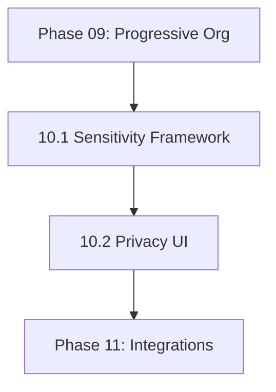

# NextGen Phase 10: Sensitivity & Privacy Engine

**Sprint Duration:** Week 32-33  
**Priority:** 🔴 CRITICAL  
**Phase Type:** Core PRD Feature - Privacy  
**Prerequisites:** Phase 09 Complete  
**Generated:** December 28, 2025  
**Generated By:** BMad Orchestrator Party Mode - Sanity Check V2  

---

## Executive Summary

Phase 10 implements the **privacy and sensitivity framework** from PRD FR15-19. This is critical for SBF's differentiation as a privacy-first knowledge management platform. Users need fine-grained control over what content can be processed by AI (local vs cloud), exported, or shared.

**Key Outcomes:**
- Tiered sensitivity levels (public, personal, confidential, secret)
- Context-based AI permissions
- Sensitivity inheritance from parent entities
- Privacy audit logging
- Secret content blocking from all AI

---

## PRD Requirements Addressed

| Requirement | Description | Status | Security Test |
|-------------|-------------|--------|---------------|
| FR6/FR15 | Tiered sensitivity (public/personal/confidential/secret) | ✅ Addressed | Verify 4 levels exist with correct defaults |
| FR16 | Default sensitivity "personal" | ✅ Addressed | New entity without explicit sensitivity = personal |
| FR17 | Sensitivity inheritance from parent entity | ✅ Addressed | Child of confidential parent = confidential |
| FR7/FR18 | Context permissions (cloud_ai, local_ai, export, sync) | ✅ Addressed | Permission matrix matches PRD table |
| FR19 | "secret" content NEVER processed by AI | ✅ Addressed | **CRITICAL TEST**: Secret entity + AI call = BLOCKED |
| NFR10 | Sensitivity metadata NEVER exposed to cloud AI unless permitted | ✅ Addressed | Audit log captures all cloud AI attempts |

---

## 🚨 SECURITY-CRITICAL IMPLEMENTATION NOTES

> **This phase contains security-sensitive code. ALL implementations must pass security review.**

### Mandatory Security Tests (Add to CI/CD)

```typescript
// tests/security/sensitivity.security.test.ts

describe('Sensitivity Security', () => {
  it('MUST block secret content from ANY AI', async () => {
    const secretEntity = await createEntity({ sensitivity: 'secret' });
    
    // This MUST throw
    await expect(
      aiService.process(secretEntity.uid, 'cloud')
    ).rejects.toThrow('SECRET cannot be processed');
    
    // Local AI also blocked for secret
    await expect(
      aiService.process(secretEntity.uid, 'local')
    ).rejects.toThrow('SECRET cannot be processed');
  });
  
  it('MUST NOT expose sensitivity metadata to cloud AI', async () => {
    const entity = await createEntity({ sensitivity: 'personal' });
    const context = await buildAIContext([entity.uid], 'cloud');
    
    // Context should NOT contain sensitivity field
    expect(context).not.toContain('sensitivity');
    expect(context).not.toContain('personal');
  });
  
  it('MUST audit ALL cloud AI access attempts', async () => {
    const entity = await createEntity({ sensitivity: 'public' });
    await aiService.process(entity.uid, 'cloud');
    
    const auditLog = await getAuditLog(entity.uid);
    expect(auditLog).toContainEqual(
      expect.objectContaining({ action: 'ai_access_allowed' })
    );
  });
});
```

### Permission Matrix Reference

| Level | cloud_ai | local_ai | export | sync | share | index |
|-------|----------|----------|--------|------|-------|-------|
| public | ✅ | ✅ | ✅ | ✅ | ✅ | ✅ |
| personal | ❌ | ✅ | ✅ | ✅ | ❌ | ✅ |
| confidential | ❌ | ✅ | ❌ | ❌ | ❌ | ✅ |
| secret | ❌ | ❌ | ❌ | ❌ | ❌ | ❌ |

---

## Sprint 10.1: Sensitivity Framework (Days 1-5)

### Objective
Implement the core sensitivity metadata system with context permissions.

### Tasks

| ID | Task | Effort | Assignee |
|----|------|--------|----------|
| 10.1.1 | Create `@sbf/privacy-engine` package | 2h | Dev |
| 10.1.2 | Define sensitivity types and interfaces | 3h | Dev |
| 10.1.3 | Create SensitivityService | 6h | Dev |
| 10.1.4 | Implement sensitivity inheritance logic | 4h | Dev |
| 10.1.5 | Create context permission checker | 4h | Dev |
| 10.1.6 | Add AI access control middleware | 6h | Dev |
| 10.1.7 | Implement "secret" blocking | 4h | Dev |
| 10.1.8 | Add sensitivity API endpoints | 3h | Dev |
| 10.1.9 | Create privacy audit logger | 4h | Dev |
| 10.1.10 | Write unit tests | 4h | QA |

### Package Structure

```
packages/@sbf/privacy-engine/
├── package.json
├── tsconfig.json
├── README.md
├── src/
│   ├── index.ts
│   ├── types.ts
│   ├── services/
│   │   ├── SensitivityService.ts
│   │   ├── PermissionChecker.ts
│   │   ├── InheritanceResolver.ts
│   │   └── AuditLogger.ts
│   ├── middleware/
│   │   ├── SensitivityFilter.ts
│   │   └── AIAccessControl.ts
│   └── constants.ts
└── tests/
    ├── SensitivityService.test.ts
    └── PermissionChecker.test.ts
```

### Sensitivity Types

```typescript
// packages/@sbf/privacy-engine/src/types.ts

/**
 * Sensitivity levels per PRD FR15
 */
export enum SensitivityLevel {
  PUBLIC = 'public',           // Shareable anywhere, any AI
  PERSONAL = 'personal',       // Local only (default per FR16)
  CONFIDENTIAL = 'confidential', // Encrypted, no cloud, no export
  SECRET = 'secret',           // Never processed by ANY AI (FR19)
}

/**
 * Context-based permissions per PRD FR18
 */
export interface ContextPermissions {
  cloud_ai_allowed: boolean;   // Can send to cloud AI (OpenAI, Anthropic, etc.)
  local_ai_allowed: boolean;   // Can process with local AI (Ollama, etc.)
  export_allowed: boolean;     // Can export to files/PDF
  sync_allowed: boolean;       // Can sync to cloud storage
  share_allowed: boolean;      // Can share with other users
  index_allowed: boolean;      // Can include in search index
}

/**
 * Full sensitivity configuration for an entity
 */
export interface SensitivityConfig {
  level: SensitivityLevel;
  permissions: ContextPermissions;
  inherit_from_parent: boolean;
  inherited_from?: string;     // Parent entity UID if inherited
  override_by?: string;        // User ID who last overrode
  override_at?: Date;          // When last overridden
  override_reason?: string;    // Why it was overridden
}

/**
 * Audit log entry for privacy operations
 */
export interface PrivacyAuditEntry {
  id: string;
  tenant_id: string;
  entity_uid: string;
  action: PrivacyAction;
  actor_id: string;            // User or system that performed action
  actor_type: 'user' | 'system' | 'ai';
  from_level?: SensitivityLevel;
  to_level?: SensitivityLevel;
  permissions_requested?: Partial<ContextPermissions>;
  permissions_granted?: Partial<ContextPermissions>;
  blocked_reason?: string;
  metadata?: Record<string, any>;
  timestamp: Date;
}

export type PrivacyAction = 
  | 'sensitivity_changed'
  | 'ai_access_allowed'
  | 'ai_access_blocked'
  | 'export_allowed'
  | 'export_blocked'
  | 'share_attempted'
  | 'inheritance_applied'
  | 'override_applied';
```

### Default Permissions by Sensitivity Level

```typescript
// packages/@sbf/privacy-engine/src/constants.ts

import { SensitivityLevel, ContextPermissions } from './types';

/**
 * Default permissions for each sensitivity level
 * Per PRD FR15-FR19
 */
export const DEFAULT_PERMISSIONS: Record<SensitivityLevel, ContextPermissions> = {
  [SensitivityLevel.PUBLIC]: {
    cloud_ai_allowed: true,
    local_ai_allowed: true,
    export_allowed: true,
    sync_allowed: true,
    share_allowed: true,
    index_allowed: true,
  },
  [SensitivityLevel.PERSONAL]: {
    cloud_ai_allowed: false,   // FR18: Default no cloud AI
    local_ai_allowed: true,
    export_allowed: true,
    sync_allowed: true,
    share_allowed: false,
    index_allowed: true,
  },
  [SensitivityLevel.CONFIDENTIAL]: {
    cloud_ai_allowed: false,
    local_ai_allowed: true,
    export_allowed: false,     // Cannot export
    sync_allowed: false,       // Cannot sync to cloud
    share_allowed: false,
    index_allowed: true,       // Can search locally
  },
  [SensitivityLevel.SECRET]: {
    cloud_ai_allowed: false,
    local_ai_allowed: false,   // FR19: NO AI at all
    export_allowed: false,
    sync_allowed: false,
    share_allowed: false,
    index_allowed: false,      // Not even in search index
  },
};

/**
 * Sensitivity level hierarchy for inheritance
 * Higher index = more restrictive
 */
export const SENSITIVITY_HIERARCHY: SensitivityLevel[] = [
  SensitivityLevel.PUBLIC,
  SensitivityLevel.PERSONAL,
  SensitivityLevel.CONFIDENTIAL,
  SensitivityLevel.SECRET,
];
```

### Sensitivity Service

```typescript
// packages/@sbf/privacy-engine/src/services/SensitivityService.ts

import { 
  SensitivityLevel, 
  SensitivityConfig, 
  ContextPermissions 
} from '../types';
import { DEFAULT_PERMISSIONS, SENSITIVITY_HIERARCHY } from '../constants';
import { InheritanceResolver } from './InheritanceResolver';
import { AuditLogger } from './AuditLogger';

export class SensitivityService {
  constructor(
    private inheritanceResolver: InheritanceResolver,
    private auditLogger: AuditLogger,
  ) {}
  
  /**
   * Get the effective sensitivity config for an entity
   * Considers inheritance from parent entities
   */
  async getEffectiveSensitivity(
    entityUid: string,
    tenantId: string
  ): Promise<SensitivityConfig> {
    const entity = await Entity.findByUid(tenantId, entityUid);
    
    if (!entity) {
      // Return default for non-existent entities
      return this.getDefaultConfig();
    }
    
    // If entity has explicit sensitivity, use it
    if (entity.sensitivity && !entity.sensitivityConfig?.inherit_from_parent) {
      return {
        level: entity.sensitivity as SensitivityLevel,
        permissions: this.getPermissionsForLevel(entity.sensitivity as SensitivityLevel),
        inherit_from_parent: false,
      };
    }
    
    // Otherwise, resolve inheritance
    const inherited = await this.inheritanceResolver.resolve(entity, tenantId);
    return inherited;
  }
  
  /**
   * Get default sensitivity config (personal per FR16)
   */
  getDefaultConfig(): SensitivityConfig {
    return {
      level: SensitivityLevel.PERSONAL,
      permissions: { ...DEFAULT_PERMISSIONS[SensitivityLevel.PERSONAL] },
      inherit_from_parent: false,
    };
  }
  
  /**
   * Get permissions for a sensitivity level
   */
  getPermissionsForLevel(level: SensitivityLevel): ContextPermissions {
    return { ...DEFAULT_PERMISSIONS[level] };
  }
  
  /**
   * Update entity sensitivity
   */
  async updateSensitivity(
    entityUid: string,
    tenantId: string,
    newLevel: SensitivityLevel,
    userId: string,
    reason?: string
  ): Promise<void> {
    const entity = await Entity.findByUid(tenantId, entityUid);
    if (!entity) throw new Error(`Entity not found: ${entityUid}`);
    
    const oldLevel = entity.sensitivity;
    
    // Update entity
    entity.sensitivity = newLevel;
    entity.sensitivityConfig = {
      level: newLevel,
      permissions: this.getPermissionsForLevel(newLevel),
      inherit_from_parent: false,
      override_by: userId,
      override_at: new Date(),
      override_reason: reason,
    };
    
    await entity.save();
    
    // Audit log
    await this.auditLogger.log({
      tenant_id: tenantId,
      entity_uid: entityUid,
      action: 'sensitivity_changed',
      actor_id: userId,
      actor_type: 'user',
      from_level: oldLevel as SensitivityLevel,
      to_level: newLevel,
      metadata: { reason },
    });
    
    // Propagate to children if more restrictive
    await this.propagateToChildren(entity, newLevel, tenantId);
  }
  
  /**
   * Check if entity can be processed by AI
   */
  async canProcessWithAI(
    entityUid: string,
    tenantId: string,
    aiType: 'cloud' | 'local'
  ): Promise<{ allowed: boolean; reason?: string }> {
    const config = await this.getEffectiveSensitivity(entityUid, tenantId);
    
    // FR19: Secret NEVER processed by any AI
    if (config.level === SensitivityLevel.SECRET) {
      return { 
        allowed: false, 
        reason: 'Content marked as SECRET cannot be processed by any AI' 
      };
    }
    
    const permission = aiType === 'cloud' 
      ? config.permissions.cloud_ai_allowed 
      : config.permissions.local_ai_allowed;
    
    if (!permission) {
      return {
        allowed: false,
        reason: `${aiType} AI access not permitted for ${config.level} content`,
      };
    }
    
    return { allowed: true };
  }
  
  /**
   * Get the most restrictive sensitivity from multiple entities
   */
  getMostRestrictive(levels: SensitivityLevel[]): SensitivityLevel {
    if (levels.length === 0) return SensitivityLevel.PERSONAL;
    
    let mostRestrictive = levels[0];
    let maxIndex = SENSITIVITY_HIERARCHY.indexOf(mostRestrictive);
    
    for (const level of levels) {
      const index = SENSITIVITY_HIERARCHY.indexOf(level);
      if (index > maxIndex) {
        maxIndex = index;
        mostRestrictive = level;
      }
    }
    
    return mostRestrictive;
  }
  
  /**
   * Propagate more restrictive sensitivity to children
   */
  private async propagateToChildren(
    parent: Entity,
    newLevel: SensitivityLevel,
    tenantId: string
  ): Promise<void> {
    const children = await Entity.findWhere({
      tenantId,
      'sensitivityConfig.inherit_from_parent': true,
    });
    
    const newIndex = SENSITIVITY_HIERARCHY.indexOf(newLevel);
    
    for (const child of children) {
      // Check if this child inherits from parent
      const parentRelation = await EntityRelationship.findOne({
        target_uid: child.uid,
        relationship_type: 'contains',
      });
      
      if (parentRelation?.source_uid === parent.uid) {
        const childIndex = SENSITIVITY_HIERARCHY.indexOf(
          child.sensitivity as SensitivityLevel
        );
        
        // Only propagate if more restrictive
        if (newIndex > childIndex) {
          child.sensitivity = newLevel;
          child.sensitivityConfig = {
            ...child.sensitivityConfig,
            level: newLevel,
            inherited_from: parent.uid,
          };
          await child.save();
        }
      }
    }
  }
}
```

### AI Access Control Middleware

```typescript
// packages/@sbf/privacy-engine/src/middleware/AIAccessControl.ts

import { SensitivityService } from '../services/SensitivityService';
import { AuditLogger } from '../services/AuditLogger';
import { SensitivityLevel } from '../types';

export interface AIRequest {
  tenantId: string;
  userId: string;
  entityUids: string[];     // Entities being processed
  aiProvider: string;       // 'openai', 'anthropic', 'ollama', etc.
  aiType: 'cloud' | 'local';
  operation: string;        // 'chat', 'transformation', 'embedding', etc.
}

export interface AIAccessResult {
  allowed: boolean;
  blockedEntities: string[];
  allowedEntities: string[];
  reason?: string;
}

export class AIAccessControl {
  constructor(
    private sensitivityService: SensitivityService,
    private auditLogger: AuditLogger,
  ) {}
  
  /**
   * Check if AI request is allowed
   * Filters out entities that cannot be processed
   */
  async checkAccess(request: AIRequest): Promise<AIAccessResult> {
    const blockedEntities: string[] = [];
    const allowedEntities: string[] = [];
    const blockReasons: string[] = [];
    
    for (const entityUid of request.entityUids) {
      const { allowed, reason } = await this.sensitivityService.canProcessWithAI(
        entityUid,
        request.tenantId,
        request.aiType
      );
      
      if (allowed) {
        allowedEntities.push(entityUid);
      } else {
        blockedEntities.push(entityUid);
        if (reason) blockReasons.push(reason);
        
        // Log the block
        await this.auditLogger.log({
          tenant_id: request.tenantId,
          entity_uid: entityUid,
          action: 'ai_access_blocked',
          actor_id: request.userId,
          actor_type: 'user',
          metadata: {
            ai_provider: request.aiProvider,
            ai_type: request.aiType,
            operation: request.operation,
            reason,
          },
        });
      }
    }
    
    // Log allowed access
    for (const entityUid of allowedEntities) {
      await this.auditLogger.log({
        tenant_id: request.tenantId,
        entity_uid: entityUid,
        action: 'ai_access_allowed',
        actor_id: request.userId,
        actor_type: 'user',
        metadata: {
          ai_provider: request.aiProvider,
          ai_type: request.aiType,
          operation: request.operation,
        },
      });
    }
    
    return {
      allowed: allowedEntities.length > 0,
      blockedEntities,
      allowedEntities,
      reason: blockedEntities.length > 0 
        ? `${blockedEntities.length} entities blocked: ${blockReasons[0]}`
        : undefined,
    };
  }
  
  /**
   * Filter content by sensitivity before sending to AI
   */
  async filterContent(
    content: ContentWithSensitivity[],
    request: Pick<AIRequest, 'tenantId' | 'aiType'>
  ): Promise<ContentWithSensitivity[]> {
    return content.filter(async (item) => {
      const { allowed } = await this.sensitivityService.canProcessWithAI(
        item.entityUid,
        request.tenantId,
        request.aiType
      );
      return allowed;
    });
  }
  
  /**
   * Get warning message for mixed sensitivity content
   */
  getWarningMessage(result: AIAccessResult): string | null {
    if (result.blockedEntities.length === 0) {
      return null;
    }
    
    return `${result.blockedEntities.length} source(s) were excluded due to privacy settings. ` +
      `Only ${result.allowedEntities.length} source(s) will be processed.`;
  }
}
```

### Sensitivity Filter for Context Building

```typescript
// packages/@sbf/privacy-engine/src/middleware/SensitivityFilter.ts

import { SensitivityService } from '../services/SensitivityService';

export interface FilteredContext {
  allowed: ContextItem[];
  blocked: ContextItem[];
  warning?: string;
}

export interface ContextItem {
  entityUid: string;
  content: string;
  sensitivity?: string;
}

export class SensitivityFilter {
  constructor(private sensitivityService: SensitivityService) {}
  
  /**
   * Filter context items before sending to AI
   * Used by RAG chat and transformations
   */
  async filterForAI(
    items: ContextItem[],
    tenantId: string,
    aiType: 'cloud' | 'local'
  ): Promise<FilteredContext> {
    const allowed: ContextItem[] = [];
    const blocked: ContextItem[] = [];
    
    for (const item of items) {
      const { allowed: canProcess } = await this.sensitivityService.canProcessWithAI(
        item.entityUid,
        tenantId,
        aiType
      );
      
      if (canProcess) {
        allowed.push(item);
      } else {
        blocked.push(item);
      }
    }
    
    let warning: string | undefined;
    if (blocked.length > 0) {
      warning = `${blocked.length} item(s) excluded due to privacy settings. ` +
        `They are marked as too sensitive for ${aiType} AI processing.`;
    }
    
    return { allowed, blocked, warning };
  }
  
  /**
   * Filter for export operations
   */
  async filterForExport(
    items: ContextItem[],
    tenantId: string
  ): Promise<FilteredContext> {
    const allowed: ContextItem[] = [];
    const blocked: ContextItem[] = [];
    
    for (const item of items) {
      const config = await this.sensitivityService.getEffectiveSensitivity(
        item.entityUid,
        tenantId
      );
      
      if (config.permissions.export_allowed) {
        allowed.push(item);
      } else {
        blocked.push(item);
      }
    }
    
    return { allowed, blocked };
  }
}
```

### Acceptance Criteria

- [ ] Sensitivity levels stored on all entities
- [ ] Default "personal" applied to new entities
- [ ] Sensitivity inheritance works from parents
- [ ] Cloud AI blocked for non-public content
- [ ] Secret content blocked from ALL AI
- [ ] Audit log captures all privacy actions

---

## Sprint 10.2: Privacy UI & Audit (Days 6-10)

### Objective
Build the user interface for managing sensitivity and viewing privacy audit logs.

### Tasks

| ID | Task | Effort | Assignee |
|----|------|--------|----------|
| 10.2.1 | Create SensitivityPicker component | 4h | Dev |
| 10.2.2 | Create SensitivityBadge component | 2h | Dev |
| 10.2.3 | Add sensitivity indicators to all entity lists | 4h | Dev |
| 10.2.4 | Create BulkSensitivityDialog | 4h | Dev |
| 10.2.5 | Build privacy audit log API | 4h | Dev |
| 10.2.6 | Create PrivacyAuditLog component | 6h | Dev |
| 10.2.7 | Create privacy settings page | 4h | Dev |
| 10.2.8 | Add AI access warning dialogs | 3h | Dev |
| 10.2.9 | Write component tests | 4h | QA |

### Sensitivity Picker Component

```tsx
// apps/web/src/components/privacy/SensitivityPicker.tsx
'use client';

import { useState } from 'react';
import { Shield, ShieldAlert, ShieldCheck, ShieldOff } from 'lucide-react';
import {
  Select,
  SelectContent,
  SelectItem,
  SelectTrigger,
  SelectValue,
} from '@/components/ui/select';
import { Label } from '@/components/ui/label';
import { Textarea } from '@/components/ui/textarea';
import {
  Dialog,
  DialogContent,
  DialogHeader,
  DialogTitle,
  DialogFooter,
} from '@/components/ui/dialog';
import { Button } from '@/components/ui/button';
import { sensitivityApi } from '@/lib/api/sensitivity';

type SensitivityLevel = 'public' | 'personal' | 'confidential' | 'secret';

interface SensitivityPickerProps {
  entityUid: string;
  currentLevel: SensitivityLevel;
  onChange?: (level: SensitivityLevel) => void;
  showDescription?: boolean;
}

const SENSITIVITY_CONFIG = {
  public: {
    icon: ShieldCheck,
    color: 'text-green-600',
    bgColor: 'bg-green-50',
    label: 'Public',
    description: 'Can be shared anywhere, processed by any AI',
  },
  personal: {
    icon: Shield,
    color: 'text-blue-600',
    bgColor: 'bg-blue-50',
    label: 'Personal',
    description: 'Local AI only, can be exported but not shared',
  },
  confidential: {
    icon: ShieldAlert,
    color: 'text-amber-600',
    bgColor: 'bg-amber-50',
    label: 'Confidential',
    description: 'Local AI only, no export or cloud sync',
  },
  secret: {
    icon: ShieldOff,
    color: 'text-red-600',
    bgColor: 'bg-red-50',
    label: 'Secret',
    description: 'Never processed by any AI, not searchable',
  },
};

export function SensitivityPicker({
  entityUid,
  currentLevel,
  onChange,
  showDescription = true,
}: SensitivityPickerProps) {
  const [showConfirm, setShowConfirm] = useState(false);
  const [pendingLevel, setPendingLevel] = useState<SensitivityLevel | null>(null);
  const [reason, setReason] = useState('');
  const [isUpdating, setIsUpdating] = useState(false);
  
  const handleChange = (value: SensitivityLevel) => {
    // Confirm if changing to more permissive (lower security)
    const levels: SensitivityLevel[] = ['public', 'personal', 'confidential', 'secret'];
    const currentIndex = levels.indexOf(currentLevel);
    const newIndex = levels.indexOf(value);
    
    if (newIndex < currentIndex) {
      // Making more permissive - require confirmation
      setPendingLevel(value);
      setShowConfirm(true);
    } else {
      // Making more restrictive - apply immediately
      applyChange(value);
    }
  };
  
  const applyChange = async (level: SensitivityLevel) => {
    setIsUpdating(true);
    try {
      await sensitivityApi.update(entityUid, level, reason || undefined);
      onChange?.(level);
    } finally {
      setIsUpdating(false);
      setShowConfirm(false);
      setPendingLevel(null);
      setReason('');
    }
  };
  
  const config = SENSITIVITY_CONFIG[currentLevel];
  const Icon = config.icon;
  
  return (
    <>
      <div className="space-y-2">
        <Label className="flex items-center gap-2">
          <Icon className={`h-4 w-4 ${config.color}`} />
          Sensitivity Level
        </Label>
        
        <Select value={currentLevel} onValueChange={handleChange} disabled={isUpdating}>
          <SelectTrigger className={`${config.bgColor}`}>
            <SelectValue />
          </SelectTrigger>
          <SelectContent>
            {Object.entries(SENSITIVITY_CONFIG).map(([level, cfg]) => {
              const ItemIcon = cfg.icon;
              return (
                <SelectItem key={level} value={level}>
                  <div className="flex items-center gap-2">
                    <ItemIcon className={`h-4 w-4 ${cfg.color}`} />
                    <span>{cfg.label}</span>
                  </div>
                </SelectItem>
              );
            })}
          </SelectContent>
        </Select>
        
        {showDescription && (
          <p className="text-xs text-gray-500">{config.description}</p>
        )}
      </div>
      
      {/* Confirmation Dialog */}
      <Dialog open={showConfirm} onOpenChange={setShowConfirm}>
        <DialogContent>
          <DialogHeader>
            <DialogTitle>Confirm Sensitivity Change</DialogTitle>
          </DialogHeader>
          
          <div className="space-y-4">
            <p className="text-sm text-gray-600">
              You are making this content <strong>more accessible</strong> by 
              changing from <strong>{SENSITIVITY_CONFIG[currentLevel].label}</strong> to{' '}
              <strong>{pendingLevel && SENSITIVITY_CONFIG[pendingLevel].label}</strong>.
            </p>
            
            <p className="text-sm text-gray-600">
              This will allow: {pendingLevel && SENSITIVITY_CONFIG[pendingLevel].description}
            </p>
            
            <div className="space-y-2">
              <Label>Reason for change (optional)</Label>
              <Textarea
                value={reason}
                onChange={(e) => setReason(e.target.value)}
                placeholder="Why are you making this content more accessible?"
                rows={2}
              />
            </div>
          </div>
          
          <DialogFooter>
            <Button variant="outline" onClick={() => setShowConfirm(false)}>
              Cancel
            </Button>
            <Button 
              onClick={() => pendingLevel && applyChange(pendingLevel)}
              disabled={isUpdating}
            >
              Confirm Change
            </Button>
          </DialogFooter>
        </DialogContent>
      </Dialog>
    </>
  );
}
```

### Sensitivity Badge Component

```tsx
// apps/web/src/components/privacy/SensitivityBadge.tsx
'use client';

import { Shield, ShieldAlert, ShieldCheck, ShieldOff } from 'lucide-react';
import { Badge } from '@/components/ui/badge';
import {
  Tooltip,
  TooltipContent,
  TooltipProvider,
  TooltipTrigger,
} from '@/components/ui/tooltip';

type SensitivityLevel = 'public' | 'personal' | 'confidential' | 'secret';

interface SensitivityBadgeProps {
  level: SensitivityLevel;
  size?: 'sm' | 'md';
  showLabel?: boolean;
}

const BADGE_CONFIG = {
  public: {
    icon: ShieldCheck,
    variant: 'default' as const,
    className: 'bg-green-100 text-green-700 hover:bg-green-100',
    label: 'Public',
    tooltip: 'Shareable anywhere, any AI can process',
  },
  personal: {
    icon: Shield,
    variant: 'secondary' as const,
    className: 'bg-blue-100 text-blue-700 hover:bg-blue-100',
    label: 'Personal',
    tooltip: 'Local AI only, no cloud sharing',
  },
  confidential: {
    icon: ShieldAlert,
    variant: 'outline' as const,
    className: 'bg-amber-100 text-amber-700 hover:bg-amber-100 border-amber-300',
    label: 'Confidential',
    tooltip: 'Local AI only, no export or sync',
  },
  secret: {
    icon: ShieldOff,
    variant: 'destructive' as const,
    className: 'bg-red-100 text-red-700 hover:bg-red-100',
    label: 'Secret',
    tooltip: 'No AI processing, not in search',
  },
};

export function SensitivityBadge({
  level,
  size = 'sm',
  showLabel = true,
}: SensitivityBadgeProps) {
  const config = BADGE_CONFIG[level];
  const Icon = config.icon;
  const iconSize = size === 'sm' ? 'h-3 w-3' : 'h-4 w-4';
  
  return (
    <TooltipProvider>
      <Tooltip>
        <TooltipTrigger asChild>
          <Badge variant={config.variant} className={config.className}>
            <Icon className={`${iconSize} ${showLabel ? 'mr-1' : ''}`} />
            {showLabel && config.label}
          </Badge>
        </TooltipTrigger>
        <TooltipContent>
          <p>{config.tooltip}</p>
        </TooltipContent>
      </Tooltip>
    </TooltipProvider>
  );
}
```

### AI Access Warning Dialog

```tsx
// apps/web/src/components/privacy/AIAccessWarning.tsx
'use client';

import { AlertTriangle, ShieldOff } from 'lucide-react';
import {
  AlertDialog,
  AlertDialogAction,
  AlertDialogCancel,
  AlertDialogContent,
  AlertDialogDescription,
  AlertDialogFooter,
  AlertDialogHeader,
  AlertDialogTitle,
} from '@/components/ui/alert-dialog';

interface AIAccessWarningProps {
  open: boolean;
  onOpenChange: (open: boolean) => void;
  blockedCount: number;
  allowedCount: number;
  onProceed: () => void;
  onCancel: () => void;
}

export function AIAccessWarning({
  open,
  onOpenChange,
  blockedCount,
  allowedCount,
  onProceed,
  onCancel,
}: AIAccessWarningProps) {
  return (
    <AlertDialog open={open} onOpenChange={onOpenChange}>
      <AlertDialogContent>
        <AlertDialogHeader>
          <AlertDialogTitle className="flex items-center gap-2">
            <AlertTriangle className="h-5 w-5 text-amber-500" />
            Some content will be excluded
          </AlertDialogTitle>
          <AlertDialogDescription className="space-y-3">
            <p>
              Due to privacy settings, <strong>{blockedCount} source(s)</strong> cannot 
              be processed by AI and will be excluded.
            </p>
            
            <p>
              Only <strong>{allowedCount} source(s)</strong> will be included in this 
              operation.
            </p>
            
            <div className="flex items-center gap-2 p-3 bg-amber-50 rounded-lg text-amber-700 text-sm">
              <ShieldOff className="h-4 w-4 flex-shrink-0" />
              <span>
                Content marked as Confidential or Secret is protected from AI processing 
                to ensure your privacy.
              </span>
            </div>
          </AlertDialogDescription>
        </AlertDialogHeader>
        <AlertDialogFooter>
          <AlertDialogCancel onClick={onCancel}>Cancel</AlertDialogCancel>
          <AlertDialogAction onClick={onProceed}>
            Proceed with {allowedCount} source(s)
          </AlertDialogAction>
        </AlertDialogFooter>
      </AlertDialogContent>
    </AlertDialog>
  );
}
```

### Privacy Settings Page

```tsx
// apps/web/src/app/(dashboard)/settings/privacy/page.tsx
'use client';

import { useEffect, useState } from 'react';
import { Shield, History, AlertTriangle, FileText } from 'lucide-react';
import { Card, CardContent, CardHeader, CardTitle, CardDescription } from '@/components/ui/card';
import { Switch } from '@/components/ui/switch';
import { Label } from '@/components/ui/label';
import { Button } from '@/components/ui/button';
import {
  Select,
  SelectContent,
  SelectItem,
  SelectTrigger,
  SelectValue,
} from '@/components/ui/select';
import { PrivacyAuditLog } from '@/components/privacy/PrivacyAuditLog';
import { privacyApi } from '@/lib/api/privacy';
import { useToast } from '@/components/ui/use-toast';

interface PrivacyPreferences {
  defaultSensitivity: 'public' | 'personal' | 'confidential' | 'secret';
  inheritFromParent: boolean;
  requireConfirmForPublic: boolean;
  auditLogRetentionDays: number;
}

export default function PrivacySettingsPage() {
  const [preferences, setPreferences] = useState<PrivacyPreferences | null>(null);
  const [isLoading, setIsLoading] = useState(true);
  const [isSaving, setIsSaving] = useState(false);
  const { toast } = useToast();
  
  useEffect(() => {
    privacyApi.getPreferences().then((prefs) => {
      setPreferences(prefs);
      setIsLoading(false);
    });
  }, []);
  
  const handleSave = async () => {
    if (!preferences) return;
    
    setIsSaving(true);
    try {
      await privacyApi.updatePreferences(preferences);
      toast({
        title: 'Privacy settings saved',
        description: 'Your privacy preferences have been updated.',
      });
    } catch (error) {
      toast({
        title: 'Failed to save',
        description: 'Could not update privacy settings.',
        variant: 'destructive',
      });
    } finally {
      setIsSaving(false);
    }
  };
  
  if (isLoading || !preferences) {
    return <div>Loading...</div>;
  }
  
  return (
    <div className="space-y-6">
      <Card>
        <CardHeader>
          <CardTitle className="flex items-center gap-2">
            <Shield className="h-5 w-5" />
            Privacy Defaults
          </CardTitle>
          <CardDescription>
            Configure default privacy settings for new content
          </CardDescription>
        </CardHeader>
        <CardContent className="space-y-6">
          <div className="space-y-2">
            <Label>Default Sensitivity for New Content</Label>
            <Select
              value={preferences.defaultSensitivity}
              onValueChange={(v) => setPreferences({
                ...preferences,
                defaultSensitivity: v as any,
              })}
            >
              <SelectTrigger className="w-48">
                <SelectValue />
              </SelectTrigger>
              <SelectContent>
                <SelectItem value="public">Public</SelectItem>
                <SelectItem value="personal">Personal (Recommended)</SelectItem>
                <SelectItem value="confidential">Confidential</SelectItem>
                <SelectItem value="secret">Secret</SelectItem>
              </SelectContent>
            </Select>
            <p className="text-xs text-gray-500">
              New notes and sources will default to this sensitivity level.
            </p>
          </div>
          
          <div className="flex items-center justify-between">
            <div className="space-y-0.5">
              <Label>Inherit Sensitivity from Parent</Label>
              <p className="text-xs text-gray-500">
                Child entities inherit the more restrictive sensitivity from their parent.
              </p>
            </div>
            <Switch
              checked={preferences.inheritFromParent}
              onCheckedChange={(checked) => setPreferences({
                ...preferences,
                inheritFromParent: checked,
              })}
            />
          </div>
          
          <div className="flex items-center justify-between">
            <div className="space-y-0.5">
              <Label>Require Confirmation for Public</Label>
              <p className="text-xs text-gray-500">
                Show a warning when marking content as public.
              </p>
            </div>
            <Switch
              checked={preferences.requireConfirmForPublic}
              onCheckedChange={(checked) => setPreferences({
                ...preferences,
                requireConfirmForPublic: checked,
              })}
            />
          </div>
          
          <Button onClick={handleSave} disabled={isSaving}>
            {isSaving ? 'Saving...' : 'Save Settings'}
          </Button>
        </CardContent>
      </Card>
      
      <Card>
        <CardHeader>
          <CardTitle className="flex items-center gap-2">
            <History className="h-5 w-5" />
            Privacy Audit Log
          </CardTitle>
          <CardDescription>
            Track all privacy-related actions on your content
          </CardDescription>
        </CardHeader>
        <CardContent>
          <PrivacyAuditLog />
        </CardContent>
      </Card>
    </div>
  );
}
```

### Acceptance Criteria

- [ ] Sensitivity picker shows all levels with descriptions
- [ ] Badge displays on all entity lists
- [ ] Confirmation required for making content more permissive
- [ ] AI access warning shows when content is blocked
- [ ] Privacy settings page functional
- [ ] Audit log shows all privacy actions

---

## 🔴 BLIND SPOTS IDENTIFIED IN PHASE 10

### Blind Spot 1: Sensitivity Migration

**Issue:** Existing entities from Phases 00-08 won't have sensitivity metadata.

**Mitigation:**
- Add migration to set default "personal" on all existing entities
- Provide bulk update tool for users

### Blind Spot 2: API Key Exposure

**Issue:** Sensitivity metadata itself shouldn't be exposed to cloud AI.

**Mitigation:**
- Strip sensitivity metadata before sending to cloud AI
- Never include audit logs in AI context

### Blind Spot 3: Search Index Leakage

**Issue:** Secret content should not appear in search results at all.

**Mitigation:**
- Add sensitivity filter to search indexing
- Re-index on sensitivity changes
- Test search doesn't return secret content

### Blind Spot 4: Export Bypass

**Issue:** Users might copy-paste secret content manually.

**Mitigation:**
- This is a user responsibility
- Add watermark warning to UI
- Document that copy-paste bypasses protection

---

## Phase 10 Dependencies



## Definition of Done

Phase 10 is complete when:

- [ ] All sensitivity levels implemented
- [ ] Default "personal" applied correctly
- [ ] Inheritance works from parent entities
- [ ] Cloud AI blocked for non-public content
- [ ] Secret content NEVER processed by AI
- [ ] Privacy audit log captures all actions
- [ ] UI allows managing sensitivity

---

## Estimated Timeline

| Sprint | Duration | Cumulative |
|--------|----------|------------|
| 10.1 Sensitivity Framework | 5 days | Day 5 |
| 10.2 Privacy UI | 5 days | Day 10 |

**Total:** 10 working days (~2 weeks)

---

## Dependencies to Install

```json
// packages/@sbf/privacy-engine/package.json
{
  "dependencies": {
    "@sbf/domain-base": "workspace:*",
    "@sbf/entity-framework": "workspace:*"
  }
}
```

---

*Generated by BMad Orchestrator Party Mode - Sanity Check V2*  
*Phase 10 Version: 1.0*
