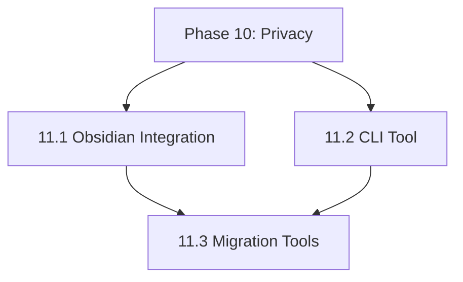

# NextGen Phase 11: Integrations & CLI

**Sprint Duration:** Week 34-36  
**Priority:** 🔴 CRITICAL  
**Phase Type:** Core PRD Feature - Tool Compatibility  
**Prerequisites:** Phase 10 Complete  
**Generated:** December 28, 2025  
**Generated By:** BMad Orchestrator Party Mode - Sanity Check V2  

---

## Executive Summary

Phase 11 delivers **tool compatibility and integrations** from PRD Epic 4 (Tool Compatibility & Migration). This is critical for user adoption - users need seamless workflows between SBF and their existing tools (Obsidian, Notion, etc.).

**Key Outcomes:**
- Obsidian Vault Integration (bi-directional sync)
- SBF CLI tool for power users
- Migration tools for Obsidian, Notion, Roam
- NotebookLM-compatible export
- AnythingLLM integration

---

## PRD Requirements Addressed

| Requirement | Description | Status | Compatibility Test |
|-------------|-------------|--------|--------------------|
| Epic 4 Story 4.1 | Obsidian Companion Plugin | ✅ Addressed | Vault sync round-trip preserves content |
| Epic 4 Story 4.2 | NotebookLM Export Format | ✅ Addressed | Exported sources load in NotebookLM |
| Epic 4 Story 4.3 | AnythingLLM Integration | ✅ Addressed | Embeddings compatible with AnythingLLM |
| Epic 4 Story 4.4 | Claude/GPT Integration | ✅ Addressed | Context format works with both APIs |
| NFR7 | Obsidian markdown syntax | ✅ Addressed | Wikilinks render correctly |
| NFR8 | NotebookLM citations | ✅ Addressed | Source grounding preserved |
| NFR9 | AnythingLLM parsing | ✅ Addressed | Markdown chunks correctly |
| PRD Migration | Obsidian vault → SBF | ✅ Addressed | Full vault import with relationship extraction |
| PRD Migration | Notion export → SBF | ✅ Addressed | Notion markdown converted with metadata |

---

## 🛠️ Tool Compatibility Verification Matrix

> **ALL compatibility tests must pass before Phase 11 is considered complete**

### Obsidian Compatibility Checklist

- [ ] Wikilinks `[[Note Name]]` resolve correctly in both tools
- [ ] YAML frontmatter survives round-trip without corruption
- [ ] Tags `#tag-name` sync bidirectionally
- [ ] Folder structure matches Obsidian vault hierarchy
- [ ] Dataview queries still work after SBF processing (no corruption)
- [ ] Embedded images `![[image.png]]` paths preserved
- [ ] Canvas files (`.canvas`) are ignored/preserved (not corrupted)

### NotebookLM Export Format Test

```typescript
// Test: Exported source loads in NotebookLM
const exported = await exportForNotebookLM(source);

// Must have these fields
expect(exported).toHaveProperty('title');
expect(exported).toHaveProperty('content');
expect(exported).toHaveProperty('sourceUrl');
expect(exported.content.length).toBeLessThan(500000); // NotebookLM limit
```

### AnythingLLM Integration Test

```typescript
// Test: Embeddings import into AnythingLLM
const chunks = await chunkForAnythingLLM(source);

for (const chunk of chunks) {
  expect(chunk.content.length).toBeLessThanOrEqual(8000); // Token limit
  expect(chunk.metadata).toHaveProperty('source_uid');
  expect(chunk.metadata).toHaveProperty('chunk_index');
}
```

---

## Sprint 11.1: Obsidian Integration (Days 1-7)

### Objective
Build the Obsidian Companion Plugin for bi-directional vault sync.

### Tasks

| ID | Task | Effort | Assignee |
|----|------|--------|----------|
| 11.1.1 | Create `packages/@sbf/obsidian-plugin` | 4h | Dev |
| 11.1.2 | Implement vault folder scanner | 4h | Dev |
| 11.1.3 | Build YAML frontmatter parser | 4h | Dev |
| 11.1.4 | Create wikilink resolver | 6h | Dev |
| 11.1.5 | Implement bi-directional sync | 8h | Dev |
| 11.1.6 | Add folder hierarchy mapping | 4h | Dev |
| 11.1.7 | Create conflict resolution UI | 4h | Dev |
| 11.1.8 | Build settings ribbon menu | 3h | Dev |
| 11.1.9 | Implement SBF API client | 4h | Dev |
| 11.1.10 | Write sync tests | 6h | QA |

### Plugin Structure

```
packages/@sbf/obsidian-plugin/
├── package.json
├── manifest.json
├── main.ts
├── styles.css
├── esbuild.config.mjs
├── README.md
├── src/
│   ├── types.ts
│   ├── api/
│   │   └── SBFClient.ts
│   ├── sync/
│   │   ├── FolderScanner.ts
│   │   ├── FrontmatterParser.ts
│   │   ├── WikilinkResolver.ts
│   │   ├── SyncEngine.ts
│   │   └── ConflictResolver.ts
│   ├── ui/
│   │   ├── SettingsTab.ts
│   │   ├── SyncStatusBar.ts
│   │   └── ConflictModal.ts
│   └── utils/
│       └── EntityMapper.ts
└── tests/
    └── sync.test.ts
```

### Obsidian Plugin Manifest

```json
// packages/@sbf/obsidian-plugin/manifest.json
{
  "id": "sbf-companion",
  "name": "Second Brain Foundation Companion",
  "version": "1.0.0",
  "minAppVersion": "1.0.0",
  "description": "Sync your Obsidian vault with Second Brain Foundation",
  "author": "SBF Team",
  "authorUrl": "https://secondbrainfoundation.com",
  "isDesktopOnly": false
}
```

### Folder Scanner

```typescript
// packages/@sbf/obsidian-plugin/src/sync/FolderScanner.ts

import { TFile, TFolder, Vault } from 'obsidian';
import { SBFFolderStructure, VaultNote } from '../types';

/**
 * Maps Obsidian vault folders to SBF folder hierarchy
 * Per PRD FR1-FR5: Daily/, People/, Places/, Topics/, Projects/, Transitional/
 */
export class FolderScanner {
  private readonly SBF_FOLDERS = [
    'Daily',
    'People', 
    'Places',
    'Topics',
    'Projects',
    'Transitional',
  ];
  
  constructor(private vault: Vault) {}
  
  /**
   * Scan vault for SBF-compatible folder structure
   */
  async scan(): Promise<SBFFolderStructure> {
    const structure: SBFFolderStructure = {
      hasStructure: false,
      folders: {},
      unmappedFiles: [],
    };
    
    // Check for SBF folders
    for (const folderName of this.SBF_FOLDERS) {
      const folder = this.vault.getAbstractFileByPath(folderName);
      if (folder instanceof TFolder) {
        structure.hasStructure = true;
        structure.folders[folderName] = await this.scanFolder(folder);
      }
    }
    
    // Find files not in SBF folders
    const allFiles = this.vault.getMarkdownFiles();
    for (const file of allFiles) {
      const topFolder = file.path.split('/')[0];
      if (!this.SBF_FOLDERS.includes(topFolder)) {
        structure.unmappedFiles.push(file.path);
      }
    }
    
    return structure;
  }
  
  /**
   * Recursively scan folder contents
   */
  private async scanFolder(folder: TFolder): Promise<VaultNote[]> {
    const notes: VaultNote[] = [];
    
    for (const child of folder.children) {
      if (child instanceof TFile && child.extension === 'md') {
        const content = await this.vault.read(child);
        notes.push({
          path: child.path,
          name: child.basename,
          content,
          mtime: child.stat.mtime,
        });
      } else if (child instanceof TFolder) {
        // Recurse into subfolders
        const subNotes = await this.scanFolder(child);
        notes.push(...subNotes);
      }
    }
    
    return notes;
  }
  
  /**
   * Create SBF folder structure in vault
   */
  async ensureStructure(): Promise<void> {
    for (const folderName of this.SBF_FOLDERS) {
      const folder = this.vault.getAbstractFileByPath(folderName);
      if (!folder) {
        await this.vault.createFolder(folderName);
      }
    }
  }
}
```

### Frontmatter Parser

```typescript
// packages/@sbf/obsidian-plugin/src/sync/FrontmatterParser.ts

import { parseYaml, stringifyYaml } from 'obsidian';

/**
 * SBF frontmatter structure per PRD FR6-FR9
 */
export interface SBFFrontmatter {
  uid?: string;              // FR10: {type}-{slug}-{counter}
  type?: string;             // Entity type (person, topic, project, etc.)
  title?: string;
  created?: string;
  modified?: string;
  aliases?: string[];
  tags?: string[];
  sensitivity?: 'public' | 'personal' | 'confidential' | 'secret';
  lifecycle?: 'fleeting' | 'maturing' | 'evergreen' | 'archived';
  bmom?: {                   // FR18-FR19: BMOM framework
    because?: string;
    meaning?: string;
    outcome?: string;
    measure?: string;
  };
  relationships?: {          // FR11-FR12: Typed relationships
    related_to?: string[];
    mentioned?: string[];
    cited_by?: string[];
  };
  confidence?: number;       // FR25: 0.0-1.0
  checksum?: string;         // FR24: SHA-256
}

export class FrontmatterParser {
  private static readonly FRONTMATTER_REGEX = /^---\n([\s\S]*?)\n---/;
  
  /**
   * Parse frontmatter from note content
   */
  parse(content: string): { frontmatter: SBFFrontmatter; body: string } {
    const match = content.match(FrontmatterParser.FRONTMATTER_REGEX);
    
    if (!match) {
      return { frontmatter: {}, body: content };
    }
    
    try {
      const frontmatter = parseYaml(match[1]) as SBFFrontmatter;
      const body = content.slice(match[0].length).trim();
      return { frontmatter, body };
    } catch {
      return { frontmatter: {}, body: content };
    }
  }
  
  /**
   * Serialize frontmatter back to string
   */
  serialize(frontmatter: SBFFrontmatter, body: string): string {
    if (Object.keys(frontmatter).length === 0) {
      return body;
    }
    
    const yaml = stringifyYaml(frontmatter);
    return `---\n${yaml}---\n\n${body}`;
  }
  
  /**
   * Update frontmatter in note content
   */
  update(content: string, updates: Partial<SBFFrontmatter>): string {
    const { frontmatter, body } = this.parse(content);
    const updated = { ...frontmatter, ...updates };
    return this.serialize(updated, body);
  }
  
  /**
   * Generate SBF UID from entity type and title
   */
  generateUid(type: string, title: string, counter?: number): string {
    const slug = title
      .toLowerCase()
      .replace(/[^a-z0-9]+/g, '-')
      .replace(/^-|-$/g, '')
      .substring(0, 30);
    
    const suffix = counter ? `-${counter}` : '';
    return `${type}-${slug}${suffix}`;
  }
  
  /**
   * Infer entity type from folder path
   */
  inferTypeFromPath(path: string): string | undefined {
    const folder = path.split('/')[0]?.toLowerCase();
    
    const typeMap: Record<string, string> = {
      daily: 'note',
      people: 'person',
      places: 'place',
      topics: 'topic',
      projects: 'project',
      transitional: 'transitional',
    };
    
    return typeMap[folder];
  }
}
```

### Wikilink Resolver

```typescript
// packages/@sbf/obsidian-plugin/src/sync/WikilinkResolver.ts

import { Vault, TFile, MetadataCache } from 'obsidian';

/**
 * Resolves Obsidian [[wikilinks]] to SBF entity UIDs
 * Per PRD FR11-FR12: Typed relationship linking
 */
export class WikilinkResolver {
  private static readonly WIKILINK_REGEX = /\[\[([^\]|]+)(?:\|([^\]]+))?\]\]/g;
  private static readonly TYPED_LINK_REGEX = /\[(.+?)\]\(sbf:\/\/(.+?)\)/g;
  
  constructor(
    private vault: Vault,
    private cache: MetadataCache,
    private uidMap: Map<string, string> // path -> UID
  ) {}
  
  /**
   * Extract all wikilinks from content
   */
  extractLinks(content: string): WikilinkMatch[] {
    const matches: WikilinkMatch[] = [];
    let match;
    
    // Standard wikilinks: [[Page Name]] or [[Page Name|Display Text]]
    while ((match = WikilinkResolver.WIKILINK_REGEX.exec(content)) !== null) {
      matches.push({
        original: match[0],
        target: match[1],
        display: match[2] || match[1],
        type: 'wikilink',
      });
    }
    
    // SBF typed links: [Display](sbf://uid)
    while ((match = WikilinkResolver.TYPED_LINK_REGEX.exec(content)) !== null) {
      matches.push({
        original: match[0],
        target: match[2],
        display: match[1],
        type: 'sbf-link',
      });
    }
    
    return matches;
  }
  
  /**
   * Resolve wikilink target to file path
   */
  resolveToPath(target: string): string | null {
    // Check if it's a direct path
    let file = this.vault.getAbstractFileByPath(target);
    if (file instanceof TFile) {
      return file.path;
    }
    
    // Try with .md extension
    file = this.vault.getAbstractFileByPath(`${target}.md`);
    if (file instanceof TFile) {
      return file.path;
    }
    
    // Use metadata cache for fuzzy matching
    const resolvedFile = this.cache.getFirstLinkpathDest(target, '');
    return resolvedFile?.path || null;
  }
  
  /**
   * Resolve wikilink to SBF UID
   */
  resolveToUid(target: string): string | null {
    const path = this.resolveToPath(target);
    if (!path) return null;
    
    return this.uidMap.get(path) || null;
  }
  
  /**
   * Convert wikilinks to SBF typed links
   */
  convertToSBFLinks(content: string): string {
    return content.replace(
      WikilinkResolver.WIKILINK_REGEX,
      (match, target, display) => {
        const uid = this.resolveToUid(target);
        if (uid) {
          return `[${display || target}](sbf://${uid})`;
        }
        return match; // Keep original if can't resolve
      }
    );
  }
  
  /**
   * Convert SBF links back to wikilinks
   */
  convertToWikilinks(content: string, uidToPath: Map<string, string>): string {
    return content.replace(
      WikilinkResolver.TYPED_LINK_REGEX,
      (match, display, uid) => {
        const path = uidToPath.get(uid);
        if (path) {
          const name = path.replace('.md', '').split('/').pop();
          if (name === display) {
            return `[[${name}]]`;
          }
          return `[[${name}|${display}]]`;
        }
        return match;
      }
    );
  }
  
  /**
   * Build relationship map from content
   */
  buildRelationships(content: string): EntityRelationships {
    const links = this.extractLinks(content);
    const relationships: EntityRelationships = {
      related_to: [],
      mentioned: [],
    };
    
    for (const link of links) {
      const uid = link.type === 'sbf-link' 
        ? link.target 
        : this.resolveToUid(link.target);
      
      if (uid) {
        // All direct links are "related_to"
        relationships.related_to.push(uid);
      }
    }
    
    return relationships;
  }
}

interface WikilinkMatch {
  original: string;
  target: string;
  display: string;
  type: 'wikilink' | 'sbf-link';
}

interface EntityRelationships {
  related_to: string[];
  mentioned: string[];
  cited_by?: string[];
}
```

### Sync Engine

```typescript
// packages/@sbf/obsidian-plugin/src/sync/SyncEngine.ts

import { Vault, TFile, Notice } from 'obsidian';
import { FolderScanner } from './FolderScanner';
import { FrontmatterParser, SBFFrontmatter } from './FrontmatterParser';
import { WikilinkResolver } from './WikilinkResolver';
import { SBFClient } from '../api/SBFClient';
import { ConflictResolver, SyncConflict } from './ConflictResolver';

export interface SyncResult {
  uploaded: number;
  downloaded: number;
  conflicts: SyncConflict[];
  errors: string[];
}

export interface SyncOptions {
  direction: 'up' | 'down' | 'bidirectional';
  conflictResolution: 'local' | 'remote' | 'ask';
  dryRun?: boolean;
}

export class SyncEngine {
  private scanner: FolderScanner;
  private parser: FrontmatterParser;
  private resolver: WikilinkResolver;
  private conflicts: ConflictResolver;
  
  constructor(
    private vault: Vault,
    private client: SBFClient,
    private uidMap: Map<string, string>,
  ) {
    this.scanner = new FolderScanner(vault);
    this.parser = new FrontmatterParser();
    // WikilinkResolver needs metadata cache - pass null placeholder
    this.resolver = new WikilinkResolver(vault, null as any, uidMap);
    this.conflicts = new ConflictResolver();
  }
  
  /**
   * Run sync operation
   */
  async sync(options: SyncOptions): Promise<SyncResult> {
    const result: SyncResult = {
      uploaded: 0,
      downloaded: 0,
      conflicts: [],
      errors: [],
    };
    
    new Notice('Starting SBF sync...');
    
    try {
      // 1. Scan local vault
      const localStructure = await this.scanner.scan();
      
      // 2. Fetch remote state
      const remoteEntities = await this.client.listEntities();
      
      // 3. Build sync plan
      const plan = this.buildSyncPlan(localStructure, remoteEntities, options);
      
      if (options.dryRun) {
        new Notice(`Dry run: ${plan.toUpload.length} up, ${plan.toDownload.length} down, ${plan.conflicts.length} conflicts`);
        result.conflicts = plan.conflicts;
        return result;
      }
      
      // 4. Handle conflicts
      if (plan.conflicts.length > 0) {
        if (options.conflictResolution === 'ask') {
          result.conflicts = plan.conflicts;
          // Return early - UI will handle conflicts
          return result;
        }
        
        // Auto-resolve conflicts
        for (const conflict of plan.conflicts) {
          if (options.conflictResolution === 'local') {
            plan.toUpload.push(conflict.localFile);
          } else {
            plan.toDownload.push(conflict.remoteEntity);
          }
        }
      }
      
      // 5. Upload local changes
      for (const file of plan.toUpload) {
        try {
          await this.uploadFile(file);
          result.uploaded++;
        } catch (e) {
          result.errors.push(`Upload failed: ${file.path} - ${e.message}`);
        }
      }
      
      // 6. Download remote changes
      for (const entity of plan.toDownload) {
        try {
          await this.downloadEntity(entity);
          result.downloaded++;
        } catch (e) {
          result.errors.push(`Download failed: ${entity.uid} - ${e.message}`);
        }
      }
      
      new Notice(`Sync complete: ${result.uploaded}↑ ${result.downloaded}↓`);
      
    } catch (e) {
      result.errors.push(`Sync failed: ${e.message}`);
      new Notice('Sync failed - check console for details');
    }
    
    return result;
  }
  
  /**
   * Upload file to SBF
   */
  private async uploadFile(file: TFile): Promise<void> {
    const content = await this.vault.read(file);
    const { frontmatter, body } = this.parser.parse(content);
    
    // Generate UID if missing
    let uid = frontmatter.uid;
    if (!uid) {
      const type = this.parser.inferTypeFromPath(file.path) || 'note';
      uid = this.parser.generateUid(type, file.basename);
      
      // Update frontmatter with UID
      const updated = this.parser.update(content, { uid, type });
      await this.vault.modify(file, updated);
    }
    
    // Convert wikilinks to SBF links
    const sbfBody = this.resolver.convertToSBFLinks(body);
    
    // Build relationships
    const relationships = this.resolver.buildRelationships(body);
    
    // Upsert to SBF
    await this.client.upsertEntity({
      uid,
      type: frontmatter.type || this.parser.inferTypeFromPath(file.path) || 'note',
      title: frontmatter.title || file.basename,
      content: sbfBody,
      sensitivity: frontmatter.sensitivity || 'personal',
      lifecycle: frontmatter.lifecycle,
      bmom: frontmatter.bmom,
      relationships,
      metadata: {
        obsidian_path: file.path,
        obsidian_mtime: file.stat.mtime,
      },
    });
    
    // Update UID map
    this.uidMap.set(file.path, uid);
  }
  
  /**
   * Download entity from SBF to vault
   */
  private async downloadEntity(entity: RemoteEntity): Promise<void> {
    // Determine local path
    const folder = this.getFolder(entity.type);
    const path = `${folder}/${entity.title}.md`;
    
    // Get UID to path map for link conversion
    const uidToPath = new Map<string, string>();
    this.uidMap.forEach((uid, p) => uidToPath.set(uid, p));
    
    // Convert SBF links to wikilinks
    const body = this.resolver.convertToWikilinks(entity.content, uidToPath);
    
    // Build frontmatter
    const frontmatter: SBFFrontmatter = {
      uid: entity.uid,
      type: entity.type,
      title: entity.title,
      created: entity.created_at,
      modified: entity.updated_at,
      sensitivity: entity.sensitivity,
      lifecycle: entity.lifecycle,
      bmom: entity.bmom,
      relationships: entity.relationships,
      confidence: entity.confidence,
    };
    
    // Serialize content
    const content = this.parser.serialize(frontmatter, body);
    
    // Write or update file
    const existing = this.vault.getAbstractFileByPath(path);
    if (existing instanceof TFile) {
      await this.vault.modify(existing, content);
    } else {
      // Ensure folder exists
      const folderPath = path.split('/').slice(0, -1).join('/');
      await this.ensureFolderExists(folderPath);
      await this.vault.create(path, content);
    }
    
    // Update UID map
    this.uidMap.set(path, entity.uid);
  }
  
  /**
   * Map entity type to folder
   */
  private getFolder(type: string): string {
    const folderMap: Record<string, string> = {
      person: 'People',
      place: 'Places',
      topic: 'Topics',
      project: 'Projects',
      transitional: 'Transitional',
      note: 'Daily',
    };
    return folderMap[type] || 'Topics';
  }
  
  /**
   * Build sync plan by comparing local and remote state
   */
  private buildSyncPlan(
    local: SBFFolderStructure,
    remote: RemoteEntity[],
    options: SyncOptions
  ): SyncPlan {
    // Implementation would compare timestamps and checksums
    // to determine what needs syncing
    return {
      toUpload: [],
      toDownload: [],
      conflicts: [],
    };
  }
  
  private async ensureFolderExists(path: string): Promise<void> {
    const parts = path.split('/');
    let current = '';
    for (const part of parts) {
      current = current ? `${current}/${part}` : part;
      const exists = this.vault.getAbstractFileByPath(current);
      if (!exists) {
        await this.vault.createFolder(current);
      }
    }
  }
}

interface SyncPlan {
  toUpload: TFile[];
  toDownload: RemoteEntity[];
  conflicts: SyncConflict[];
}

interface RemoteEntity {
  uid: string;
  type: string;
  title: string;
  content: string;
  sensitivity: string;
  lifecycle?: string;
  bmom?: any;
  relationships?: any;
  confidence?: number;
  created_at: string;
  updated_at: string;
}
```

### Acceptance Criteria

- [ ] Plugin loads in Obsidian
- [ ] Vault folder scanner works
- [ ] Frontmatter parsed and generated correctly
- [ ] Wikilinks converted to/from SBF links
- [ ] Bi-directional sync functional
- [ ] Conflicts detected and resolvable

---

## Sprint 11.2: SBF CLI Tool (Days 8-12)

### Objective
Build a command-line interface for power users.

### Tasks

| ID | Task | Effort | Assignee |
|----|------|--------|----------|
| 11.2.1 | Create `packages/@sbf/cli` package | 2h | Dev |
| 11.2.2 | Set up Commander.js CLI framework | 3h | Dev |
| 11.2.3 | Implement `sbf init` command | 4h | Dev |
| 11.2.4 | Implement `sbf entity create` | 4h | Dev |
| 11.2.5 | Implement `sbf entity list` | 2h | Dev |
| 11.2.6 | Implement `sbf search` | 4h | Dev |
| 11.2.7 | Implement `sbf sync` | 4h | Dev |
| 11.2.8 | Implement `sbf chat` | 6h | Dev |
| 11.2.9 | Add config file support | 3h | Dev |
| 11.2.10 | Write CLI tests | 4h | QA |

### CLI Structure

```
packages/@sbf/cli/
├── package.json
├── tsconfig.json
├── README.md
├── bin/
│   └── sbf.ts
├── src/
│   ├── index.ts
│   ├── config.ts
│   ├── commands/
│   │   ├── init.ts
│   │   ├── entity.ts
│   │   ├── search.ts
│   │   ├── sync.ts
│   │   ├── chat.ts
│   │   └── migrate.ts
│   └── utils/
│       ├── api.ts
│       ├── prompts.ts
│       └── output.ts
└── tests/
```

### CLI Main Entry

```typescript
// packages/@sbf/cli/bin/sbf.ts
#!/usr/bin/env node

import { Command } from 'commander';
import { initCommand } from '../src/commands/init';
import { entityCommand } from '../src/commands/entity';
import { searchCommand } from '../src/commands/search';
import { syncCommand } from '../src/commands/sync';
import { chatCommand } from '../src/commands/chat';
import { migrateCommand } from '../src/commands/migrate';
import { loadConfig } from '../src/config';

const program = new Command();

program
  .name('sbf')
  .description('Second Brain Foundation CLI')
  .version('1.0.0');

// Load config before commands
program.hook('preAction', async () => {
  await loadConfig();
});

// Register commands
program.addCommand(initCommand);
program.addCommand(entityCommand);
program.addCommand(searchCommand);
program.addCommand(syncCommand);
program.addCommand(chatCommand);
program.addCommand(migrateCommand);

program.parse();
```

### Init Command

```typescript
// packages/@sbf/cli/src/commands/init.ts

import { Command } from 'commander';
import { input, select, confirm } from '@inquirer/prompts';
import chalk from 'chalk';
import fs from 'fs/promises';
import path from 'path';
import { SBF_FOLDERS } from '../config';

export const initCommand = new Command('init')
  .description('Initialize SBF in current directory')
  .option('-y, --yes', 'Skip prompts and use defaults')
  .action(async (options) => {
    console.log(chalk.blue('🧠 Initializing Second Brain Foundation...\n'));
    
    const cwd = process.cwd();
    
    // Check if already initialized
    const configExists = await fs.access(path.join(cwd, '.sbf'))
      .then(() => true)
      .catch(() => false);
    
    if (configExists) {
      console.log(chalk.yellow('SBF already initialized in this directory.'));
      
      if (!options.yes) {
        const reinit = await confirm({
          message: 'Reinitialize?',
          default: false,
        });
        if (!reinit) return;
      }
    }
    
    // Gather settings
    let apiUrl = 'https://api.secondbrainfoundation.com';
    let apiKey = '';
    
    if (!options.yes) {
      apiUrl = await input({
        message: 'SBF API URL:',
        default: apiUrl,
      });
      
      apiKey = await input({
        message: 'API Key (leave empty to configure later):',
      });
    }
    
    // Create config directory
    const sbfDir = path.join(cwd, '.sbf');
    await fs.mkdir(sbfDir, { recursive: true });
    
    // Write config
    const config = {
      apiUrl,
      apiKey: apiKey || undefined,
      vaultPath: cwd,
      defaultSensitivity: 'personal',
    };
    
    await fs.writeFile(
      path.join(sbfDir, 'config.json'),
      JSON.stringify(config, null, 2)
    );
    
    // Create folder structure
    const createFolders = options.yes || await confirm({
      message: 'Create SBF folder structure?',
      default: true,
    });
    
    if (createFolders) {
      for (const folder of SBF_FOLDERS) {
        const folderPath = path.join(cwd, folder);
        await fs.mkdir(folderPath, { recursive: true });
        console.log(chalk.green(`  ✓ Created ${folder}/`));
      }
    }
    
    // Create gitignore for sensitive files
    const gitignore = `# SBF
.sbf/config.json
`;
    
    await fs.appendFile(path.join(cwd, '.gitignore'), gitignore);
    
    console.log(chalk.green('\n✅ SBF initialized successfully!'));
    console.log('\nNext steps:');
    console.log('  1. Add your API key: sbf config set apiKey YOUR_KEY');
    console.log('  2. Create your first entity: sbf entity create');
    console.log('  3. Start chatting: sbf chat');
  });
```

### Entity Command

```typescript
// packages/@sbf/cli/src/commands/entity.ts

import { Command } from 'commander';
import { input, select, editor } from '@inquirer/prompts';
import chalk from 'chalk';
import { api } from '../utils/api';
import { formatTable } from '../utils/output';

export const entityCommand = new Command('entity')
  .description('Manage entities');

/**
 * sbf entity create
 */
entityCommand
  .command('create')
  .description('Create a new entity')
  .option('-t, --type <type>', 'Entity type')
  .option('-n, --name <name>', 'Entity name')
  .option('-c, --content <content>', 'Content')
  .option('-f, --file <file>', 'Read content from file')
  .action(async (options) => {
    const type = options.type || await select({
      message: 'Entity type:',
      choices: [
        { name: 'Note', value: 'note' },
        { name: 'Person', value: 'person' },
        { name: 'Place', value: 'place' },
        { name: 'Topic', value: 'topic' },
        { name: 'Project', value: 'project' },
      ],
    });
    
    const title = options.name || await input({
      message: 'Title:',
    });
    
    let content = options.content;
    if (options.file) {
      const fs = await import('fs/promises');
      content = await fs.readFile(options.file, 'utf-8');
    } else if (!content) {
      content = await editor({
        message: 'Content (opens editor):',
      });
    }
    
    const sensitivity = await select({
      message: 'Sensitivity:',
      choices: [
        { name: 'Public', value: 'public' },
        { name: 'Personal', value: 'personal' },
        { name: 'Confidential', value: 'confidential' },
        { name: 'Secret', value: 'secret' },
      ],
      default: 'personal',
    });
    
    console.log(chalk.blue('\nCreating entity...'));
    
    const entity = await api.createEntity({
      type,
      title,
      content,
      sensitivity,
    });
    
    console.log(chalk.green(`\n✅ Entity created: ${entity.uid}`));
  });

/**
 * sbf entity list
 */
entityCommand
  .command('list')
  .description('List entities')
  .option('-t, --type <type>', 'Filter by type')
  .option('-l, --limit <limit>', 'Limit results', '20')
  .option('-s, --search <query>', 'Search query')
  .action(async (options) => {
    const entities = await api.listEntities({
      type: options.type,
      limit: parseInt(options.limit),
      search: options.search,
    });
    
    if (entities.length === 0) {
      console.log(chalk.yellow('No entities found.'));
      return;
    }
    
    const table = formatTable(entities, [
      { key: 'uid', header: 'UID', width: 30 },
      { key: 'type', header: 'Type', width: 12 },
      { key: 'title', header: 'Title', width: 40 },
      { key: 'sensitivity', header: 'Privacy', width: 12 },
    ]);
    
    console.log(table);
  });

/**
 * sbf entity get
 */
entityCommand
  .command('get <uid>')
  .description('Get entity details')
  .action(async (uid) => {
    const entity = await api.getEntity(uid);
    
    if (!entity) {
      console.log(chalk.red(`Entity not found: ${uid}`));
      return;
    }
    
    console.log(chalk.bold(`\n${entity.title}`));
    console.log(chalk.gray(`Type: ${entity.type} | UID: ${entity.uid}`));
    console.log(chalk.gray(`Sensitivity: ${entity.sensitivity}`));
    console.log(chalk.gray(`Created: ${entity.created_at}`));
    console.log('\n---\n');
    console.log(entity.content);
  });
```

### Chat Command

```typescript
// packages/@sbf/cli/src/commands/chat.ts

import { Command } from 'commander';
import { input } from '@inquirer/prompts';
import chalk from 'chalk';
import ora from 'ora';
import { api } from '../utils/api';

export const chatCommand = new Command('chat')
  .description('Chat with your knowledge base')
  .option('-s, --sources <uids>', 'Comma-separated source UIDs')
  .option('-m, --message <message>', 'Single message (non-interactive)')
  .action(async (options) => {
    console.log(chalk.blue('🧠 SBF Chat\n'));
    console.log(chalk.gray('Type your questions. Type "exit" to quit.\n'));
    
    // Get sources
    let sourceUids: string[] = [];
    if (options.sources) {
      sourceUids = options.sources.split(',').map((s: string) => s.trim());
      console.log(chalk.gray(`Using ${sourceUids.length} source(s)\n`));
    }
    
    // Non-interactive mode
    if (options.message) {
      await sendMessage(options.message, sourceUids);
      return;
    }
    
    // Interactive mode
    while (true) {
      const message = await input({
        message: chalk.cyan('You:'),
      });
      
      if (message.toLowerCase() === 'exit') {
        console.log(chalk.gray('\nGoodbye! 👋'));
        break;
      }
      
      await sendMessage(message, sourceUids);
    }
  });

async function sendMessage(message: string, sourceUids: string[]) {
  const spinner = ora('Thinking...').start();
  
  try {
    const response = await api.chat({
      message,
      sourceUids,
      includeContext: true,
    });
    
    spinner.stop();
    
    console.log(chalk.green('\n🤖 SBF:'));
    console.log(response.answer);
    
    if (response.citations?.length > 0) {
      console.log(chalk.gray('\n📚 Sources:'));
      for (const citation of response.citations) {
        console.log(chalk.gray(`  - ${citation.title} (${citation.uid})`));
      }
    }
    
    console.log('');
    
  } catch (error: any) {
    spinner.stop();
    console.log(chalk.red(`\nError: ${error.message}`));
  }
}
```

### Acceptance Criteria

- [ ] `sbf init` creates config and folders
- [ ] `sbf entity create` works interactively
- [ ] `sbf entity list` shows entities
- [ ] `sbf search` returns results
- [ ] `sbf chat` works in interactive mode
- [ ] Config file properly loaded

---

## Sprint 11.3: Migration Tools (Days 13-17)

### Objective
Build importers for Obsidian, Notion, and Roam.

### Tasks

| ID | Task | Effort | Assignee |
|----|------|--------|----------|
| 11.3.1 | Create migration framework | 4h | Dev |
| 11.3.2 | Build Obsidian importer | 6h | Dev |
| 11.3.3 | Build Notion importer | 6h | Dev |
| 11.3.4 | Build Roam importer | 4h | Dev |
| 11.3.5 | Create NotebookLM exporter | 4h | Dev |
| 11.3.6 | Build AnythingLLM connector | 4h | Dev |
| 11.3.7 | Create migration UI wizard | 6h | Dev |
| 11.3.8 | Write migration tests | 4h | QA |

### Migration CLI Command

```typescript
// packages/@sbf/cli/src/commands/migrate.ts

import { Command } from 'commander';
import { select, confirm, input } from '@inquirer/prompts';
import chalk from 'chalk';
import ora from 'ora';
import { ObsidianImporter } from '../importers/ObsidianImporter';
import { NotionImporter } from '../importers/NotionImporter';
import { RoamImporter } from '../importers/RoamImporter';
import { NotebookLMExporter } from '../exporters/NotebookLMExporter';

export const migrateCommand = new Command('migrate')
  .description('Import/export data');

/**
 * sbf migrate import
 */
migrateCommand
  .command('import')
  .description('Import from another tool')
  .option('-s, --source <source>', 'Source: obsidian, notion, roam')
  .option('-p, --path <path>', 'Path to import from')
  .option('--dry-run', 'Show what would be imported')
  .action(async (options) => {
    const source = options.source || await select({
      message: 'Import from:',
      choices: [
        { name: 'Obsidian Vault', value: 'obsidian' },
        { name: 'Notion Export (ZIP)', value: 'notion' },
        { name: 'Roam Export (JSON)', value: 'roam' },
      ],
    });
    
    const importPath = options.path || await input({
      message: 'Path to import:',
    });
    
    const spinner = ora('Analyzing...').start();
    
    let importer;
    switch (source) {
      case 'obsidian':
        importer = new ObsidianImporter(importPath);
        break;
      case 'notion':
        importer = new NotionImporter(importPath);
        break;
      case 'roam':
        importer = new RoamImporter(importPath);
        break;
      default:
        spinner.fail('Unknown source');
        return;
    }
    
    // Analyze
    const analysis = await importer.analyze();
    spinner.stop();
    
    console.log(chalk.blue('\n📊 Analysis:'));
    console.log(`  Notes: ${analysis.noteCount}`);
    console.log(`  Folders: ${analysis.folderCount}`);
    console.log(`  Links: ${analysis.linkCount}`);
    console.log(`  Tags: ${analysis.uniqueTags.length}`);
    console.log(`  Est. entities: ${analysis.estimatedEntities}`);
    
    if (options.dryRun) {
      console.log(chalk.yellow('\n(Dry run - no changes made)'));
      return;
    }
    
    const proceed = await confirm({
      message: `Import ${analysis.noteCount} notes?`,
      default: true,
    });
    
    if (!proceed) return;
    
    // Import
    const importSpinner = ora('Importing...').start();
    
    const result = await importer.import({
      onProgress: (current, total) => {
        importSpinner.text = `Importing... ${current}/${total}`;
      },
    });
    
    importSpinner.succeed(`Imported ${result.imported} entities`);
    
    if (result.errors.length > 0) {
      console.log(chalk.yellow(`\n⚠️ ${result.errors.length} errors:`));
      for (const error of result.errors.slice(0, 5)) {
        console.log(chalk.gray(`  - ${error}`));
      }
      if (result.errors.length > 5) {
        console.log(chalk.gray(`  ... and ${result.errors.length - 5} more`));
      }
    }
  });

/**
 * sbf migrate export
 */
migrateCommand
  .command('export')
  .description('Export to another format')
  .option('-f, --format <format>', 'Format: notebooklm, markdown')
  .option('-o, --output <path>', 'Output path')
  .option('-s, --sources <uids>', 'Source UIDs (comma-separated)')
  .action(async (options) => {
    const format = options.format || await select({
      message: 'Export format:',
      choices: [
        { name: 'NotebookLM-compatible', value: 'notebooklm' },
        { name: 'Markdown files', value: 'markdown' },
        { name: 'JSON', value: 'json' },
      ],
    });
    
    const output = options.output || await input({
      message: 'Output path:',
    });
    
    const spinner = ora('Exporting...').start();
    
    if (format === 'notebooklm') {
      const exporter = new NotebookLMExporter();
      const result = await exporter.export({
        outputPath: output,
        sourceUids: options.sources?.split(','),
      });
      
      spinner.succeed(`Exported ${result.fileCount} files to ${output}`);
      console.log(chalk.gray('\nYou can now upload these files to NotebookLM.'));
    }
    // ... other formats
  });
```

### Obsidian Importer

```typescript
// packages/@sbf/cli/src/importers/ObsidianImporter.ts

import fs from 'fs/promises';
import path from 'path';
import { glob } from 'glob';
import matter from 'gray-matter';
import { api } from '../utils/api';

interface ImportAnalysis {
  noteCount: number;
  folderCount: number;
  linkCount: number;
  uniqueTags: string[];
  estimatedEntities: number;
}

interface ImportOptions {
  onProgress?: (current: number, total: number) => void;
}

interface ImportResult {
  imported: number;
  skipped: number;
  errors: string[];
}

export class ObsidianImporter {
  private readonly WIKILINK_REGEX = /\[\[([^\]|]+)(?:\|[^\]]+)?\]\]/g;
  private readonly TAG_REGEX = /#([a-zA-Z0-9_-]+)/g;
  
  constructor(private vaultPath: string) {}
  
  /**
   * Analyze vault before importing
   */
  async analyze(): Promise<ImportAnalysis> {
    const files = await glob('**/*.md', { cwd: this.vaultPath });
    const folders = new Set<string>();
    const tags = new Set<string>();
    let linkCount = 0;
    
    for (const file of files) {
      // Track folders
      const dir = path.dirname(file);
      if (dir !== '.') folders.add(dir);
      
      // Read content
      const content = await fs.readFile(
        path.join(this.vaultPath, file),
        'utf-8'
      );
      
      // Count links
      const links = content.match(this.WIKILINK_REGEX) || [];
      linkCount += links.length;
      
      // Extract tags
      const { data: frontmatter } = matter(content);
      if (Array.isArray(frontmatter.tags)) {
        frontmatter.tags.forEach((t: string) => tags.add(t));
      }
      
      const inlineTags = content.match(this.TAG_REGEX) || [];
      inlineTags.forEach((t) => tags.add(t.slice(1)));
    }
    
    return {
      noteCount: files.length,
      folderCount: folders.size,
      linkCount,
      uniqueTags: Array.from(tags),
      estimatedEntities: files.length,
    };
  }
  
  /**
   * Import vault to SBF
   */
  async import(options: ImportOptions = {}): Promise<ImportResult> {
    const files = await glob('**/*.md', { cwd: this.vaultPath });
    const result: ImportResult = { imported: 0, skipped: 0, errors: [] };
    
    // First pass: create UID map
    const uidMap = new Map<string, string>();
    for (const file of files) {
      const name = path.basename(file, '.md');
      const type = this.inferType(file);
      const uid = this.generateUid(type, name);
      uidMap.set(file, uid);
    }
    
    // Second pass: import with resolved links
    for (let i = 0; i < files.length; i++) {
      const file = files[i];
      options.onProgress?.(i + 1, files.length);
      
      try {
        await this.importFile(file, uidMap);
        result.imported++;
      } catch (error: any) {
        result.errors.push(`${file}: ${error.message}`);
      }
    }
    
    return result;
  }
  
  /**
   * Import single file
   */
  private async importFile(
    file: string,
    uidMap: Map<string, string>
  ): Promise<void> {
    const content = await fs.readFile(
      path.join(this.vaultPath, file),
      'utf-8'
    );
    
    const { data: frontmatter, content: body } = matter(content);
    const uid = uidMap.get(file)!;
    
    // Resolve wikilinks to UIDs
    const resolvedBody = body.replace(
      this.WIKILINK_REGEX,
      (match, target) => {
        // Find matching file
        for (const [filePath, fileUid] of uidMap) {
          const name = path.basename(filePath, '.md');
          if (name === target || filePath === target || filePath === `${target}.md`) {
            return `[${target}](sbf://${fileUid})`;
          }
        }
        return match; // Keep original if not found
      }
    );
    
    // Extract relationships
    const relationships: { related_to: string[] } = { related_to: [] };
    for (const [filePath, fileUid] of uidMap) {
      const name = path.basename(filePath, '.md');
      if (body.includes(`[[${name}]]`) || body.includes(`[[${filePath}]]`)) {
        relationships.related_to.push(fileUid);
      }
    }
    
    // Create entity
    await api.createEntity({
      uid,
      type: this.inferType(file),
      title: frontmatter.title || path.basename(file, '.md'),
      content: resolvedBody,
      sensitivity: frontmatter.sensitivity || 'personal',
      lifecycle: frontmatter.lifecycle,
      tags: frontmatter.tags,
      relationships,
      metadata: {
        imported_from: 'obsidian',
        original_path: file,
        imported_at: new Date().toISOString(),
      },
    });
  }
  
  /**
   * Infer entity type from folder
   */
  private inferType(filePath: string): string {
    const folder = filePath.split('/')[0]?.toLowerCase();
    const typeMap: Record<string, string> = {
      daily: 'note',
      people: 'person',
      places: 'place',
      topics: 'topic',
      projects: 'project',
      transitional: 'transitional',
    };
    return typeMap[folder] || 'note';
  }
  
  /**
   * Generate UID
   */
  private generateUid(type: string, name: string): string {
    const slug = name
      .toLowerCase()
      .replace(/[^a-z0-9]+/g, '-')
      .replace(/^-|-$/g, '')
      .substring(0, 30);
    return `${type}-${slug}`;
  }
}
```

### NotebookLM Exporter

```typescript
// packages/@sbf/cli/src/exporters/NotebookLMExporter.ts

import fs from 'fs/promises';
import path from 'path';
import { api } from '../utils/api';

interface ExportOptions {
  outputPath: string;
  sourceUids?: string[];
}

interface ExportResult {
  fileCount: number;
  totalSize: number;
}

/**
 * Export entities to NotebookLM-compatible format
 * NotebookLM accepts plain text, PDFs, or Google Docs
 */
export class NotebookLMExporter {
  async export(options: ExportOptions): Promise<ExportResult> {
    await fs.mkdir(options.outputPath, { recursive: true });
    
    // Get entities
    let entities;
    if (options.sourceUids?.length) {
      entities = await Promise.all(
        options.sourceUids.map((uid) => api.getEntity(uid))
      );
    } else {
      entities = await api.listEntities({ limit: 1000 });
    }
    
    let fileCount = 0;
    let totalSize = 0;
    
    for (const entity of entities) {
      if (!entity) continue;
      
      // Skip secret content
      if (entity.sensitivity === 'secret') continue;
      
      // Build filename
      const safeTitle = entity.title
        .replace(/[^a-zA-Z0-9 -]/g, '')
        .substring(0, 50);
      const filename = `${entity.type}-${safeTitle}.txt`;
      
      // Build content for NotebookLM
      const content = this.formatForNotebookLM(entity);
      
      // Write file
      const filePath = path.join(options.outputPath, filename);
      await fs.writeFile(filePath, content);
      
      fileCount++;
      totalSize += Buffer.byteLength(content, 'utf-8');
    }
    
    return { fileCount, totalSize };
  }
  
  /**
   * Format entity for NotebookLM consumption
   */
  private formatForNotebookLM(entity: any): string {
    const parts: string[] = [];
    
    // Title
    parts.push(`# ${entity.title}`);
    parts.push('');
    
    // Metadata section (helps NotebookLM understand context)
    parts.push(`Type: ${entity.type}`);
    if (entity.tags?.length) {
      parts.push(`Tags: ${entity.tags.join(', ')}`);
    }
    if (entity.created_at) {
      parts.push(`Created: ${entity.created_at.split('T')[0]}`);
    }
    parts.push('');
    
    // Main content - strip SBF-specific links
    let content = entity.content;
    // Convert sbf:// links to plain text
    content = content.replace(/\[([^\]]+)\]\(sbf:\/\/[^)]+\)/g, '$1');
    parts.push(content);
    
    // BMOM section if present
    if (entity.bmom && Object.keys(entity.bmom).length > 0) {
      parts.push('');
      parts.push('---');
      parts.push('## Context');
      if (entity.bmom.because) {
        parts.push(`**Because:** ${entity.bmom.because}`);
      }
      if (entity.bmom.meaning) {
        parts.push(`**Meaning:** ${entity.bmom.meaning}`);
      }
      if (entity.bmom.outcome) {
        parts.push(`**Outcome:** ${entity.bmom.outcome}`);
      }
      if (entity.bmom.measure) {
        parts.push(`**Measure:** ${entity.bmom.measure}`);
      }
    }
    
    return parts.join('\n');
  }
}
```

### Acceptance Criteria

- [ ] Obsidian vault imports with links preserved
- [ ] Notion export imports correctly
- [ ] Roam JSON imports correctly
- [ ] NotebookLM export works
- [ ] Migration wizard guides users
- [ ] Progress shown during import

---

## 🔴 BLIND SPOTS IDENTIFIED IN PHASE 11

### Blind Spot 1: Large Vault Performance

**Issue:** Importing large vaults (10k+ notes) may timeout.

**Mitigation:**
- Implement batched imports
- Add progress persistence
- Resume interrupted imports

### Blind Spot 2: Conflict Detection

**Issue:** How to handle notes that exist in both Obsidian and SBF?

**Mitigation:**
- Add checksum comparison
- Provide merge UI
- Allow "always prefer local/remote" setting

### Blind Spot 3: Plugin Auto-Update

**Issue:** Obsidian plugin needs update mechanism.

**Mitigation:**
- Use Obsidian's BRAT for beta releases
- Submit to community plugins
- Add in-app update checker

### Blind Spot 4: CLI Authentication

**Issue:** How does CLI authenticate securely?

**Mitigation:**
- OAuth flow with browser redirect
- API key stored in secure keychain
- Token refresh mechanism

---

## Phase 11 Dependencies



## Definition of Done

Phase 11 is complete when:

- [ ] Obsidian plugin syncs bi-directionally
- [ ] CLI tool is installable via npm
- [ ] Migration from Obsidian works
- [ ] Migration from Notion works
- [ ] NotebookLM export functional
- [ ] All tools respect sensitivity levels

---

## Estimated Timeline

| Sprint | Duration | Cumulative |
|--------|----------|------------|
| 11.1 Obsidian Integration | 7 days | Day 7 |
| 11.2 CLI Tool | 5 days | Day 12 |
| 11.3 Migration Tools | 5 days | Day 17 |

**Total:** 17 working days (~3.5 weeks)

---

## Package.json for CLI

```json
// packages/@sbf/cli/package.json
{
  "name": "@sbf/cli",
  "version": "1.0.0",
  "description": "Second Brain Foundation CLI",
  "bin": {
    "sbf": "./bin/sbf.js"
  },
  "scripts": {
    "build": "tsc",
    "dev": "tsc --watch"
  },
  "dependencies": {
    "commander": "^12.0.0",
    "@inquirer/prompts": "^5.0.0",
    "chalk": "^5.3.0",
    "ora": "^8.0.0",
    "glob": "^10.3.0",
    "gray-matter": "^4.0.3"
  }
}
```

---

## Grand Total: All New Phases

| Phase | Duration | Focus |
|-------|----------|-------|
| Phase 09 | 15 days | Entity Framework, Lifecycle, BMOM |
| Phase 10 | 10 days | Sensitivity & Privacy |
| Phase 11 | 17 days | Integrations & CLI |
| **Total** | **42 days** | **~8.5 weeks** |

**Revised Project Total:** 163 (original) + 42 (new) = **205 working days (~41 weeks)**

---

*Generated by BMad Orchestrator Party Mode - Sanity Check V2*  
*Phase 11 Version: 1.0*
